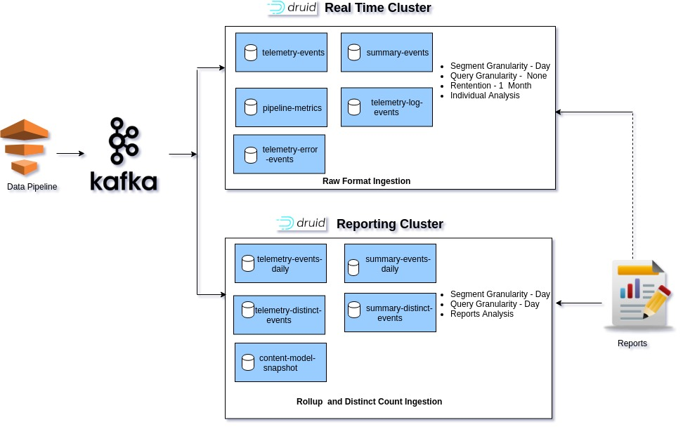

 **Introduction:** This document explains

* Issues with current druid cluster in terms of query performance and resource utilisation.
* Introduction to ingestion time rollup of metrics against a pre-defined set of dimensions which will be used for reporting.

 **Key Problem(s):** In the current druid set up, data is being ingested with exhaustive set of dimensions from telemetry for various data sources such as raw telemetry and summary. The data also includes dimensions with high cardinality. We have observed the following issues or challenges in the current druid set up:

* The query latency is generally high in spite of caching the segments that are frequently queried upon. 
* High error percentage for the distinct counts.
* Infra Issues
    * The data ingestion results in too many segments being created.
    * Increased usage of virtual memory and also increase in java heap usage to query and merge the query results. This results in segments being unavailable for queries and erroneous query outputs for reporting data.
    * Compaction of segments requires more memory as the number of segments and data size are generally high.
    * Restarting of the historical nodes incurs more time to load all segments available for querying.
    * Increase in infra costs as the disk usage increases with the amount of data stored at a finer granularity.

    

 **Roll-ups:** 
* First-level aggregation operation over a selected set of dimensions that reduces the size and number of rows in the stored segments.

* The aggregation of data during ingestion time results in reduction in query latencies due to fewer segments and data to query from.

 **Rollup spike reports:** 
* A small experiment was performed to identify the effect of the ingestion time rollups on the query performance.
* 120 million events were ingested into two data sources, one with ingestion time rollup and one with raw data.
* We have observed substantial reduction in data size and substantial reduction in the query latencies.

The results of the spike on rollups are listed below.

 **Data Performance :** 

| # | Parameter | Raw Ingestion | Rollup Ingestion | 
|  --- |  --- |  --- |  --- | 
| 1 | Rows Ingested | 120575390 | 120575390 | 
| 2 | # of rows after ingestion | 120575390 |  19939988 | 
| 3 | # of  segments | 3262 | 745 | 
| 4 | DataSize in MB | 1024   | 311  | 

 **Query Throughput:** 

|  | groupBy eid,  sum(edata_duration) | groupBy eid,  context_channel,  sum(edata_duration) | groupBy pdata_id,  count(qr_scans) | topN object_id, average_rating granularity: year | topN object_id, average_rating granularity: month | topN object_id, average_rating granularity: day | 
|  --- |  --- |  --- |  --- |  --- |  --- |  --- | 
| Raw data | 2.4 s | 6.25 s | 453 ms | 4.87 s | 3.66 s | 2.18 s | 
| Rollup data | 683 ms | 2.1 s | 128 ms | 1.92 s | 806 ms | 724 ms | 
| Percentage reduction in time | 71.54% | 63.85% | 71.74% | 60.57% | 78.14% | 66.79% | 

 **Distinct Count:** 

| Data Rows : 120575390 | spark | HLL Sketch Merge | Cardinality aggregator | % diff spark-hll-sketch | % diff spark-cardinality | 
|  --- |  --- |  --- |  --- |  --- |  --- | 
| Week (11-Nov to 15-Nov) | 688668 | 690711 | 720894 | -0.30% | -4.68% | 
| Day (Nov 11) | 157535 | 153750 | 161002 | 2.40% | -2.20% | 
| Day (Nov 12) | 151673 | 153551 | 151881 | -1.24% | -0.14% | 
| Day (Nov 13) | 161839 | 159595 | 158805 | 1.39% | 1.87% | 
| Day (Nov 14) | 157876 | 160556 | 152616 | -1.70% | 3.33% | 
| Day (Nov 15) | 157115 | 156557 | 151881 | 0.36% | 3.33% | 

 **Proposed Design:** 
* Ingesting data with rollup of various metrics against a pre-defined set of dimensions with DAY, WEEK & MONTH granularity.
* All the reports will be generated from the rolled up data instead of the raw data.
* The rolled up data sources can have longer data retention as the disk usage and data size are comparatively far lesser.
* The data sources with raw data will have a lower data retention and will be only used for near real-time data analysis.

  

 **Challenges** Rollups have challenges with cardinal data fields. Following are the cardinal data fields, that can explode as there is no governance of the values that can come in.

1. cdata.id
1. cdata.type
1. edata.type
1. edata.id
1. edata.subtype
1. edata.pageid

If we include the above fields as dimensions then the rollups data size and segments will be very much close to raw telemetry. Therefore we are in the opinion to whitelist only specific values of the above fields and flatten them in the telemetry and include them in the dimensions. For ex: If the user selected board, medium and language is passed as cdata, then we would flatten the cdata in the pipeline as named keys like cdata_board, cdata_medium & cdata_language.

 **Data Model for Rollups:** 

*  **Rollup Druid Data Model - Raw Telemetry** 
* 

 **Data Model for DistinctCounts:** 

* 
* 

*****

[[category.storage-team]] 
[[category.confluence]] 
