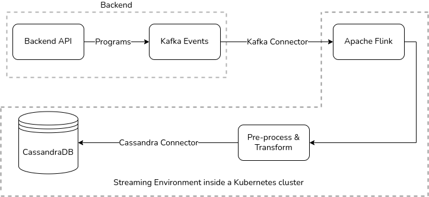

 **Github Discussion link:** 

[https://github.com/Sunbird-Lern/Community/discussions/58#discussioncomment-4817602](https://github.com/Sunbird-Lern/Community/discussions/58#discussioncomment-4817602)This would contain the flow, structure and the pseduo code for the Flink Job that would be deployed within the Kubernetes cluster. 



 **Schema of the Kafka Topic:** 

 **Kafka Topic Name** : {{envName}}.ml.programUsers.raw

 **Structure :-** 


```
{
      programId: {
        type : "ObjectId",
        required : true,
        index: true
      },
      programName: String,
      programExternalId: String,
      noOfResourcesStarted: {
        type:Number,
        index: true
        }
      userId: {
        type: String,
        index: true
      },
      requestForPIIConsent:true/false
      userProfile: Object,
      userRoleInformation: Object,
      appInformation: Object,
      createdAt: Date,
      updatedAt: Date,
      deleted:Boolean
}
```
 **Sample JSON Data :-** 


```json
{
    "_id" : "63bfa8f173f6368ebde21bbe",
    "deleted" : false,
    "programId" : "5f362b78af0a4decfa9a106f",
    "programName": "$prorgramName",
    "programExternalId": "$programExternalId",
    "requestForPIIConsent":true,
    "userRoleInformation" : {
        "role" : "HM,DEO",
        "state" : "db331a8c-b9e2-45f8-b3c0-7ec1e826b6df",
        "district" : "1dcbc362-ec4c-4559-9081-e0c2864c2931",
        "school" : "c5726207-4f9f-4f45-91f1-3e9e8e84d824"
    },
    "userId" : "ba9aa220-ff1b-4717-b6ea-ace55f04fc16",
    "appInformation" : {
        "appName" : "Diksha",
        "appVersion" : "5.2"
    },
    "userProfile": {
    "userLocations" :[
     {
        "code" : "2822",
        "name" : "ANANTAPUR",
        "id" : "2f76dcf5-e43b-4f71-a3f2-c8f19e1fce03",
        "type" : "district",
        "parentId" : "bc75cc99-9205-463e-a722-5326857838f8"
     },
     {
        "code" : "282262",
        "name" : "AGALI",
        "id" : "966c3be4-c125-467d-aaff-1eb1cd525923",
        "type" : "block",
        "parentId" : "2f76dcf5-e43b-4f71-a3f2-c8f19e1fce03"
     },
     {
        "code" : "28",
        "name" : "Andhra Pradesh",
        "id" : "bc75cc99-9205-463e-a722-5326857838f8",
        "type" : "state",
        "parentId" : null
     },
     {
        "code" : "2822620004",
        "name" : "ZPHS AGALI",
        "id" : "beb0bcf4-d7cd-4a72-8f35-be8e5b03c0d1",
        "type" : "cluster",
        "parentId" : "966c3be4-c125-467d-aaff-1eb1cd525923"
     },
     {
        "code" : "28226200816",
        "name" : "SMT PRAMEELAMMA AND SRI KGA GUPTA EM UP SCHOOL",
        "id" : "01337588247832985613211",
        "type" : "school",
        "parentId" : ""
     }
    ],
    "profileUserTypes": [
     {
        "subType" : "deo",
        "type" : "administrator"
     }
    ],
    "organisations": [
     {
        "organisationId" : "0126796199493140480",
        "orgName" : "Pre-prod Custodian Organization",
        "isSchool" : false,
        ...
     },
     {
        "organisationId" : "01337588247832985613211",
        "orgName" : "SMT PRAMEELAMMA AND SRI KGA GUPTA EM UP SCHOOL",
        "isSchool" : true,
        .....
     }
    ],
    "framework" : {
      "board" : [ 
        "CBSE"
      ],
      ...
    },
    ...
  },
    "noOfResourcesStarted": 3,
    "updatedAt" : "2023-01-12T06:30:56.829Z",
    "createdAt" : "2023-01-12T06:30:09.476Z",
    "__v" : 0
}
```
noteOnly the New programs rolled out after the Join program feature is enabled on the production, those data will flow into the kafka events, old program before the roll out will not be pushed into the events.

Only the New programs rolled out after the Join program feature is enabled on the production, those data will flow into the kafka events, old program before the roll out will not be pushed into the events.


## ML Data-pipeline Real-time Streaming :-  Logic -

1. Consume the events from the Kafka topic using **Apache Flink** to perform the real-time streaming. This would be done using the  **PyFlink**  library.


```py
pip install apache-flink
```

1. The [ **Datastream API** ](https://nightlies.apache.org/flink/flink-docs-master/api/python/reference/pyflink.datastream/connectors.html#kafka) would be used to capture the streaing data from the Kafka Producer. This would require a Stream Environment to be created.


```py
from pyflink.datastream import StreamExecutionEnvironment
env = StreamExecutionEnvironment.get_execution_environment()
```
Once done, we have to define the column names, kafka topic name and the datatype using the FlinkKafkaConsumer class. [ _Reference docs_ ](https://nightlies.apache.org/flink/flink-docs-release-1.15/api/python/reference/pyflink.datastream/api/pyflink.datastream.connectors.FlinkKafkaConsumer.html#pyflink.datastream.connectors.FlinkKafkaConsumer).


1. Post that we would Pre-Process/Transform/Manipulate the data which to assign column names, data types and values prior to storing the data in the Cassandra Table.

     **_Logical Execution_** :


    1. After the stream environment is created - connect to the Kafka topic mentioned above with the Kafka connector. 


    1. Initiate the Datastream API with the data type and if required any pre-conceived aggregrate function- here are aren’t using an aggregation. 


    1. Once done, the following key-value pairs needs to be extracted ( _shown with their data-type_ ):


```
program_id text,
program_externalId text,
program_name text,
pii_consent_required boolean,
user_id text,
state_code text,
state_id text,
state_name text,
district_code text,
district_id text,
district_name text,
block_code text,
block_id text,
block_name text,
cluster_code text,
cluster_id text,
cluster_name text,
school_code text,
school_id text,
school_name text,
organisation_id text,
organisation_name text,
user_sub_type text,
user_type text,
created_at Date,
updated_at Date
```


    
1. Once the value is extracted for the respective event - we would need to connect to the Cassandra table using the [ **Cassandra Connector in Apache Flink** ](https://nightlies.apache.org/flink/flink-docs-master/api/python/reference/pyflink.datastream/api/pyflink.datastream.connectors.cassandra.CassandraSink.html?highlight=cassandrasink#pyflink.datastream.connectors.cassandra.CassandraSink) and push the data using the add_sink method from the class CassandraSink. 


1. Finally, this entire setup needs to be setup as a job to be run in a Kubernetes cluster. For which, [ **Apache Flink provides with a CLI interface** ](https://nightlies.apache.org/flink/flink-docs-release-1.16/docs/deployment/cli/#submitting-pyflink-jobs) that can be created with to run a PyFlink job. 


### ER diagram :-
.drawio%20(1).drawio%20(1).png)


### Cassandra DB Schema :-

* 
```
CREATE KEYSPACE IF NOT EXISTS sunbird_programs WITH replication = {
    'class': 'SimpleStrategy',
    'replication_factor': '1'
 };
```

*  **User Program Table Schema**  :-


```
CREATE TABLE IF NOT EXISTS sunbird_programs.program_enrollment (
    program_id text,
    program_externalId text,
    program_name text,
    pii_consent_required boolean,
    user_id text,
    state_code text,
    state_id text,
    state_name text,
    district_code text,
    district_id text,
    district_name text,
    block_code text,
    block_id text,
    block_name text,
    cluster_code text,
    cluster_id text,
    cluster_name text,
    school_code text,
    school_id text,
    school_name text,
    organisation_id text,
    organisation_name text,
    user_sub_type text,
    user_type text,
    created_at timestamp,
    updated_at timestamp,
    PRIMARY KEY (program_id,user_id)
) WITH bloom_filter_fp_chance = 0.01
    AND caching = {'keys': 'ALL', 'rows_per_partition': 'NONE'}
    AND comment = ''
    AND compaction = {'class': 'org.apache.cassandra.db.compaction.SizeTieredCompactionStrategy', 'max_threshold': '32', 'min_threshold': '4'}
    AND compression = {'chunk_length_in_kb': '64', 'class': 'org.apache.cassandra.io.compress.LZ4Compressor'}
    AND crc_check_chance = 1.0
    AND dclocal_read_repair_chance = 0.1
    AND default_time_to_live = 0
    AND gc_grace_seconds = 864000
    AND max_index_interval = 2048
    AND memtable_flush_period_in_ms = 0
    AND min_index_interval = 128
    AND read_repair_chance = 0.0
    AND speculative_retry = '99PERCENTILE';
```


Each steps starting from connecting to the Stream Service to Uploading the file in CassandraDB will be logged. Additionally, Apache Flink allows storing of information about completed checkpoints within a separate table in a cassandra database using the CassandraCommitter class.

 **_Exception Handling_** :


* Exceptions related to Kafka events → userProfile key missing


* Exceptions related to Cassandra DB → if pushing to DB fails


 **_Structure and Repository Understanding:_** 


* Initially, a new module named ml-jobs needs to be created on this [Github Repository](https://github.com/Sunbird-Lern/data-pipeline/tree/release-5.1.0) with the help of the [PyBuilder](https://pybuilder.io/) library that will create the structure - containing the main and the test folder. 


* The containing folder will contain a local config.ini file - that can be accessed and run by other developers. 


* The environment specific variables & values would be kept in [this folder.](https://github.com/Sunbird-Lern/data-pipeline/blob/release-5.1.0/kubernetes/helm_charts/datapipeline_jobs/values.j2) Structured as shown in the link.


* To wrap the flink job inside a Kubernetes cluster for deployment the job needs to be in this path: kubernetes/helm_charts/datapipeline_jobs - this would be in the YAML language. 


 **Coding Flow:** 


* After completing the flow from the  **_Logical Execution_**  part we can move to the local testing.


* For local testing - Kafka producer needs to be set-up in the localhost. Allowing to stream one single event at a time. 


* Post the setup of Kafka - to execute the Flink run using PyFlink we would need to setup Flink job run locally following this [documention for development](https://nightlies.apache.org/flink/flink-docs-release-1.16/docs/flinkdev/building/#build-pyflink).


* Once done, we can execute the code run using the point state above on how to run Apache Flink using a CLI interface.


```text
./bin/flink run --python path/of/the/file/python_file.py
```

* Once the testing is done ( **_note this is for the main section_** ) - we would need to write the possible test cases ( **_note this is for the unittest section_** ) using the PyTest library which would cover 80% of the code run - which means that it would be capable of handling unique scenarios and their expected outcome based on the written test cases. 


* Post completing both the -  **main**  and  **unittest** , this needs to re-tested as Flink job locally to confirm the  job runs fine along with various different Kafka event types/ 


* Once the tests for the above sections are completed - the code needs to be customised to run in a develpment environment with possible provate variables and other configuration inputs. 


# Deployment in Kubernetes 

## Local Setup
To run the code in a Kubernetes cluster in your local environment. You’ll need to download [Minikube](https://minikube.sigs.k8s.io/docs/start/) which allows you to initate a K8s cluster locally. 

As you execute the code it will create a .jar file. In you r terminal, you will need to push the .jar file after initiating the Minikube instance with:


```bash
./bin/flink run \
    --target kubernetes-session \
    -Dkubernetes.cluster-id=my-first-flink-cluster \
    ./examples/streaming/PII_program_data.jar
```
You can read more about this in the official documentation: [https://nightlies.apache.org/flink/flink-docs-release-1.16/docs/deployment/resource-providers/native_kubernetes/](https://nightlies.apache.org/flink/flink-docs-release-1.16/docs/deployment/resource-providers/native_kubernetes/)


## Server Setup

### The Folder Structure of Scala

```none
ml-jobs
	|____ pii-program-data
		|____ src
			|____ main
				|____ resources
					|____ pii-program-data.conf
				|____ scala/org/sunbird/job/pii
        |____ test
    |____ README.md
    |____ pom.xml
```

### pii-program-data.conf
This above configuration file will contain the configuration of the Sunbird Dev-environment. Below is a configuration where a kafka topic is producing and consuming data. The conf file would look something like this:


```none
include "base-config.conf"

kafka {
 input.topic = "sunbirddev.coursebatch.job.request"
 output.audit.topic = "sunbirddev.telemetry.raw"
 output.failed.topic = "sunbirddev.activity.agg.failed"
 output.certissue.topic = "sunbirddev.issue.certificate.request"
 groupId = "sunbirddev-activity-aggregate-updater-group"
}

task {
 window.shards = 1
 consumer.parallelism = 1
 dedup.parallelism = 1
 activity.agg.parallelism = 1
 enrolment.complete.parallelism = 1
}

lms-cassandra {
 keyspace = "sunbird_courses"
 consumption.table = "user_content_consumption"
 user_activity_agg.table = "user_activity_agg"
 user_enrolments.table = "user_enrolments"
}
```
Sunbird has a pre-created base-config.conf which can be pulled as a base configuration and on top of that the required stacks can be added provided with the necessary and required information

Once these changes are updated in the Scala code. We will navigate the Kubernetes folder. 


### values.j2: helm_charts/datapipeline_jobs
The above configuration values when moved through the environment are done using the values.j2 file. We will need to add the pii-program job in the values.j2 file - similar to this:


```
activity-aggregate-updater:
 activity-aggregate-updater: |+
   include file("/data/flink/conf/base-config.conf")
   
   kafka {
     input.topic = {{ kafka_topic_course_batch_job_request }}
     output.audit.topic = {{ kafka_topic_telemetry_raw }}
     output.failed.topic = {{ kafka_topic_activity_agg_failed }}
     output.certissue.topic = {{ kafka_topic_certificate_request }}
     groupId = {{ kafka_group_activity_agg }}
   }

   task {
     window.shards = {{ activity_agg_window_shards }}
     checkpointing.interval = {{ activity_agg_checkpointing_interval }}
     checkpointing.pause.between.seconds = {{ activity_agg_pause_interval }}
     restart-strategy.attempts = {{ restart_attempts }}  
     consumer.parallelism = {{ activity_agg_consumer_parallelism }}
     dedup.parallelism = {{ activity_agg_dedup_parallelism }}
     activity.agg.parallelism = {{ activity_agg_parallelism }}
     enrolment.complete.parallelism = {{ enrolment_complete_parallelism }}
   }

   lms-cassandra {
     keyspace = "{{ middleware_course_keyspace }}"
     consumption.table = "{{ middleware_consumption_table }}"
     user_activity_agg.table = "{{ middleware_user_activity_agg_table }}"
     user_enrolments.table = "user_enrolments"
   }
```

### main.yml: ansible/flink-jobs-deploy
Now to add separate configuration values in the main.yml depending on the variable values we will add additional key-value pairs in the main.yml file. 


```
activity_agg_consumer_parallelism: 1
activity_agg_dedup_parallelism: 1
activity_agg_parallelism: 1
enrolment_complete_parallelism: 1
middleware_consumption_table: "user_content_consumption"
middleware_user_activity_agg_table: "user_activity_agg"
activity_agg_checkpointing_interval: 300000
activity_agg_checkpointing_pause_interval: 90000
activity_agg_batch_interval: 60
activity_agg_batch_read_size: 1
activity_agg_batch_write_size: 10
activity_agg_window_shards: 1000
activity_agg_dedup_index: 13
activity_agg_dedup_expiry: 604800
activity_module_aggs_enabled: true
activity_input_dedup_enabled: true
activity_agg_enrolment_filter_processe_enabled: true
activity_agg_collection_status_cache_expiry_time: 3600
```
These variables reference a few hidden values from the values.j2 file.

Sunbird uses these details to create an image prior to deployment which contains in the kubernetes/pipeline path - this information on how this is done is yet to be relayed to us.


*****

[[category.storage-team]] 
[[category.confluence]] 
