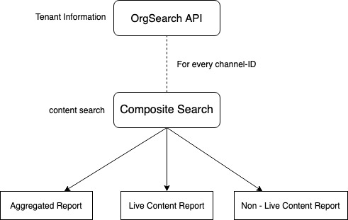
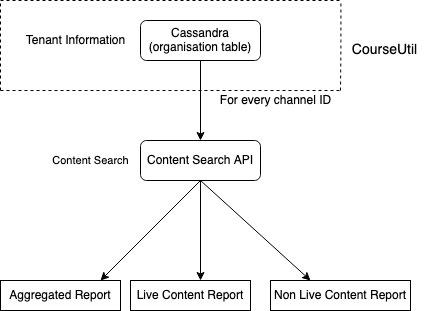
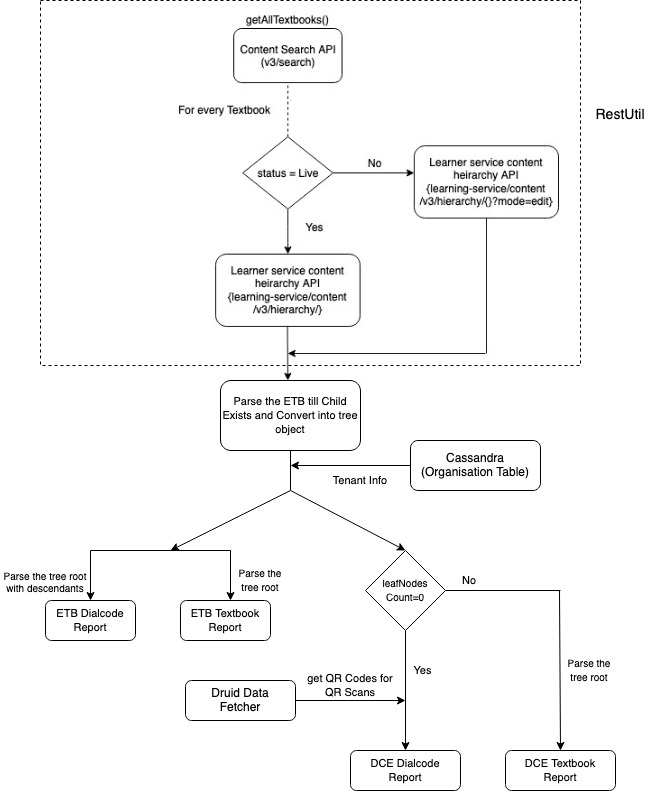

 **INTRODUCTION:** The ETB reports are for the states to track there data for necessary actions to be taken upon it. The reports will include the ETB creation and content progress reports. ETB creation report is for the energized textbooks summary and detailed level report and the content progress reports are to check the progress of the content for all the status (Live, Draft, Review, Unlisted). 

Jira Link: [SB-17654 System JIRA](https:///browse/SB-17654)

 **CONTENT PROGRESS REPORT: ** The content progress report is to check to the progress of the content created by the tenant org of the search. There are three reports to be generated to check the progress:


1. Content Aggregated Progress Report: The report will have one row for combination of Board, Medium, Grade, Subject and content Type. Each record will show distribution of content by its status and format. Some content may have no value for Board, Medium, Grade, Subject or Content Type. All such content are grouped together in one row where the value is 'Other'. This report is sorted by Board, Medium, Grade, Subject and Content Type.
1. Unpublished Content Progress Report: The report will have one record for each content which is in 'Review' or 'Limited Sharing' or 'Draft' status. Since this report contains unpublished content, some of the fields such as Board, Medium, Grade, Subject, may be missing. The report is sorted by Board, Medium, Grade, Subject, Content Type and Status.

    
1. Published Content Progress Report: The report will have one record for each content in 'Live' status. Some of the fields such as Board, Medium, Grade, Subject or Created By may be missing. The report is sorted by Board, Medium, Grade, Subject, Content Type and Status.

 **Current Implementation: ** The current implementation for the content progress report pull the data from org search API for tenant information and then fetches the data from composite search for each tenant id.


Jira Link: [SB-17658 System JIRA](https:///browse/SB-17658)

 **Frequency** : Weekly



 **Output CSV:** 

The output for the current report is:


* Content Aggregated Progress Report:


| State | Board | Medium | Grade | Subject | Content Type | Total Content | Live | Review | Limited Sharing | Draft | Created on Diksha | YouTube Content | Uploaded Videos | Text Content | Uploaded Interactive Content | 
|  --- |  --- |  --- |  --- |  --- |  --- |  --- |  --- |  --- |  --- |  --- |  --- |  --- |  --- |  --- |  --- | 
| State (Andhra Pradesh) | State (Andhra Pradesh) | English | Class 1 | English | Read | 70 | 68 | 0 | 0 | 2 | 0 | 57 | 2 | 11 | 0 | 
| State (Andhra Pradesh) | State (Andhra Pradesh) | English | Class 1 | Evs | Practice | 1 | 0 | 0 | 0 | 1 | 1 | 0 | 0 | 0 | 0 | 
| State (Andhra Pradesh) | State (Andhra Pradesh) | English | Class 1 | Evs | Read | 28 | 28 | 0 | 0 | 0 | 0 | 12 | 0 | 16 | 0 | 


* Published Content Progress Report:


| State | Board | Medium | Grade | Subject | Content ID | Content Type | Creation Date | Number of times Published | Created By | Latest Publish Date | 
|  --- |  --- |  --- |  --- |  --- |  --- |  --- |  --- |  --- |  --- |  --- | 
| State (Andhra Pradesh) | State (Andhra Pradesh) | English | Class 1 | English | do_31261945309777920022028 | Read | 2018-10-25 | 1 |  | 2018-10-25 | 
| State (Andhra Pradesh) | State (Andhra Pradesh) | English | Class 1 | English | do_31261945289333964811903 | Read | 2018-10-25 | 1 |  | 2018-10-25 | 
| State (Andhra Pradesh) | State (Andhra Pradesh) | English | Class 1 | English | do_31261945318467993622035 | Read | 2018-10-25 | 1 |  | 2018-10-25 | 


* Unpublished Content Progress Report:


| State | Board | Medium | Grade | Subject | Content ID | Content Type | Status | Pending in current status since | Creation Date | Created By | 
|  --- |  --- |  --- |  --- |  --- |  --- |  --- |  --- |  --- |  --- |  --- | 
| State (Andhra Pradesh) | State (Andhra Pradesh) | English | Class 1 | English | do_31261950395286323222090 | Read | Draft |  |  | KIRIMANJESWARA MANJULA | 
| State (Andhra Pradesh) | State (Andhra Pradesh) | English | Class 1 | English | do_31261945299538739211910 | Read | Draft | 2018-10-25 | 2018-10-25 |  | 


 **Proposed Design: ** ContentProgressModel:A new data product will be implemented to generate all the content progress reports. There will be one ReportUtils from where we will be getting the tenant information and composite search result for the tenant org id for a state. 





Queries:


```
{
  "request": {
    "filters": {
      "status": [
        "Live",
        "Draft",
        "Review",
        "Unlisted"
      ],
      "contentType": [
        "Resource"
      ],
      "createdFor": $tenantID
    },
    "fields": [
      "channel",
      "identifier",
      "board",
      "gradeLevel",
      "medium",
      "subject",
      "status",
      "createdBy",
      "creator",
      "lastUpdatedBy",
      "lastUpdatedOn",
      "lastSubmittedOn",
      "lastPublishedBy",
      "lastPublishedOn",
      "createdFor",
      "createdOn",
      "pkgVersion",
      "versionKey",
      "contentType",
      "mimeType",
      "prevState",
      "resourceType",
      "attributions"
    ],
    "limit": 10000,
    "facets": [
      "status"
    ]
  }
}
```


 **ETB CREATION METRICS REPORT: ** The ETB report consists of DialCode Exception report and ETB creation status report. The DCE report let us know the number of QR codes which do not have any content linked to them. The ETB creation status report tracks the creation status for all the textbooks, identify the textbooks which are incomplete and take actions to complete the process.

 **Current Implementation** The current implemetation is divided in for two parts: DCE reports and ETB creation reports

Jira Link: [SB-17659 System JIRA](https:///browse/SB-17659)

 **Frequency** : Weekly

 **ETB_creation_metrics** :


* Get Tenant Information from the the org search API
* Get all the Textbooks from the content search API
    * For each textbook query the learning-service content heirarchy API
    * List all the leaf nodes from the heirarchy (Collection)

    

    


On the output of above steps we generate different reports such as detailed and summary reports for DCE and ETB.


.jpg)

 **Proposed Design:** 

A new data product for producing the ETB reports has to be implemented with the defined data product framework. We can use the existing RestUtil method for querying the org search API for fetching the tenant information , content search API for getting all the textbooks and learner service content hierarchy API.




1. For getting all the textbooks from the druid we will use DruidDataFetcher
1. For tenant information we will use Cassandra: Organization Table


```
{
  "queryType": "topN",
  "dataSource": "content-model-snapshot",
  "aggregations": [
    {
      "type": "count",
      "name": "count"
    
}
  ],
  "granularity": "all",
  "postAggregations": [],
  "intervals": "2020-02-21T00:00:00+00:00/2020-02-28T00:00:00+00:00",
  "filter": {
    "type": "and",
    "fields": [
      {
        "type": "or",
        "fields": [
          {
            "type": "selector",
            "dimension": "status",
            "value": "Draft"
          },
          {
            "type": "selector",
            "dimension": "status",
            "value": "Live"
          },
          {
            "type": "selector",
            "dimension": "status",
            "value": "Review"
          }
        ]
      },
      {
        "type": "selector",
        "dimension": "contentType",
        "value": "TextBook"
      }
    ]
  },
  "threshold": 10000,
  "metric": "count",
  "dimension": "status"
}
```


 **Output CSV:** 


* ETB dialcode data:


|  **Textbook ID**  |  **Medium**  |  **Grade**  |  **Subject**  |  **Textbook Name**  |  **Textbook Status**  |  **Created On**  |  **Last Updated On**  |  **Total content linked**  |  **Total QR codes linked to content**  |  **Total number of QR codes with no linked content**  |  **Total number of leaf nodes**  |  **Number of leaf nodes with no content**  | 
|  --- |  --- |  --- |  --- |  --- |  --- |  --- |  --- |  --- |  --- |  --- |  --- |  --- | 
|  **do_312951445678908761303**  | English | Class 1 | English | English-01 | Draft | 06/02/2020 | 06/02/2020 | 0 | 0 | 0 | 23 | 23 | 
|  **do_31263704531999948812766**  | English | Class 1 | English | Know-how - Teacher Hand Book | Live | 19/11/2018 | 08/05/2019 | 76 | 76 | 1 | 77 | 1 | 
|  **do_31263704528929587212737**  | English | Class 1 | Evs | Know-how - Teacher Hand Book | Live | 19/11/2018 | 08/05/2019 | 28 | 28 | 0 | 28 | 0 | 


* DCE textbook data:


|  **Textbook ID**  |  **Medium**  |  **Grade**  |  **Subject**  |  **Textbook Name**  |  **Level 1 Name**  |  **Level 2 Name**  |  **Level 3 Name**  |  **Level 4 Name**  |  **Level 5 Name**  |  **QR Code**  |  **Total Scans**  |  **Term**  | 
|  --- |  --- |  --- |  --- |  --- |  --- |  --- |  --- |  --- |  --- |  --- |  --- |  --- | 
|  **do_312634543234432343434**  | English | Class 1 | English | Teacher Hand Book | My Stories & Rhymes - 5 |  |  |  |  | UPOL5H | 138 | T2 | 
|  **do_3127795234090883814107**  | English | Class 6 | English | Our World through English - VI | AN ADVENTURE | AN ADVENTURE- Content |  |  |  | XQWAHG | 2131 | T2 | 
|  **do_3127455267999878314107**  | English | Class 6 | English | Our World through English - VI | PLANT A TREE | PLANT A TREE- Assessment |  |  |  | XTERDK | 410 | T1 | 


*****

[[category.storage-team]] 
[[category.confluence]] 
