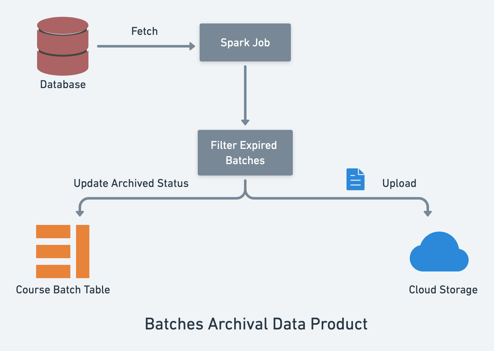
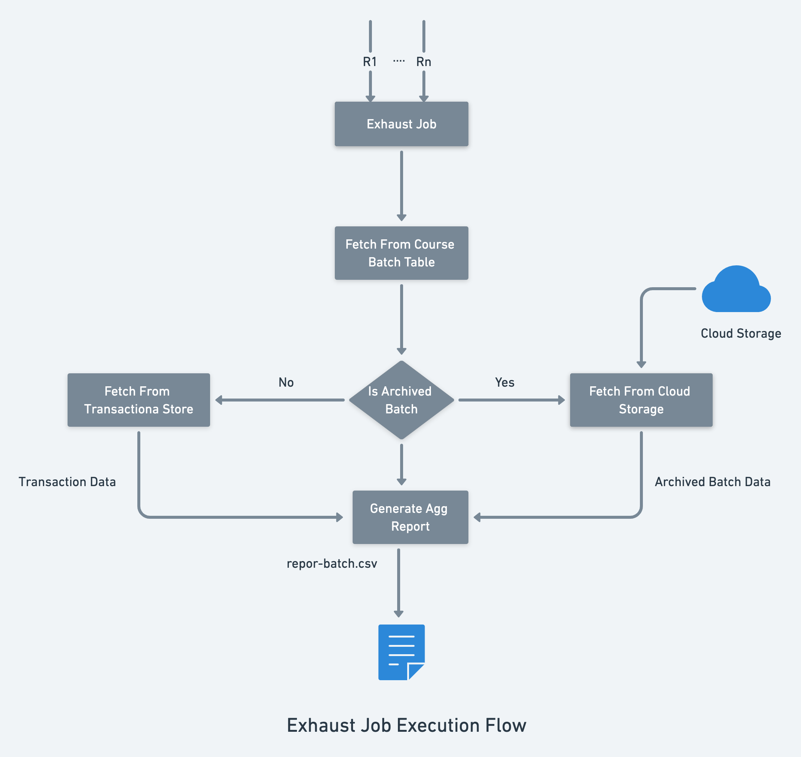
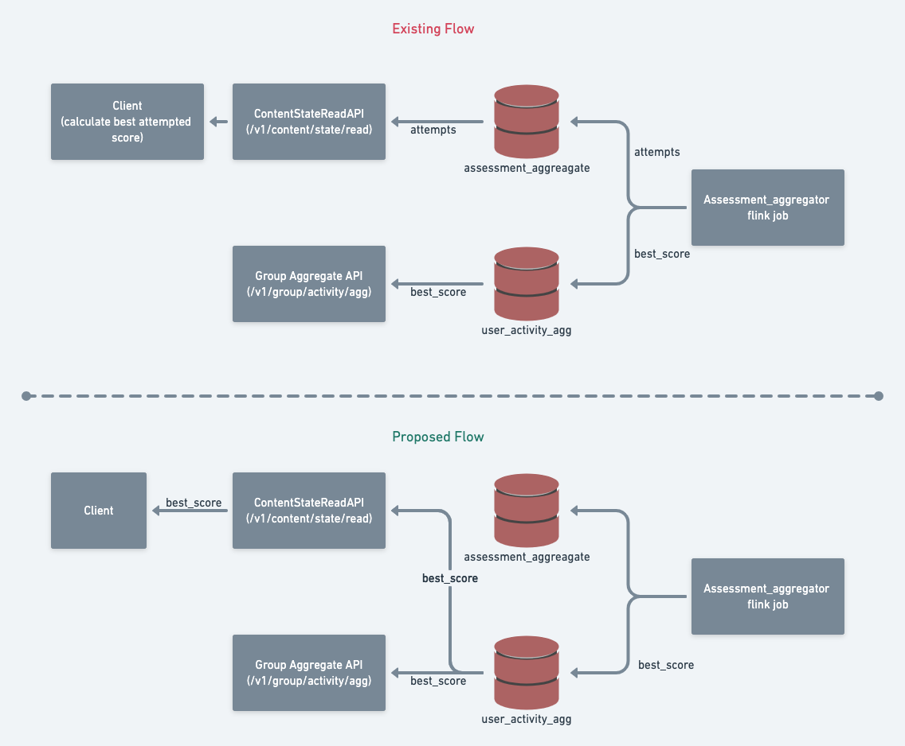

### Introduction
The trackable collections with assessment content creating huge raw data for each attempt. This document outlines the design of archiving assessment aggregation data.


### Problem Statement
We are using Cassandra to store each attempt assessment aggregate data. This data is growing very fast and creating challenges to maintain the Cassandra cluster. So, we should archive this data once the batch expires.

But, after archival also, we should be able to generate the reports and APIs should return the required metrics for given request. Below are the key design problems.


1. Define archival store, schema and format.


1. Define process to generate archival data and cleanup transactional data.


1. Supporting reporting/exhaust jobs for archived batch.


1. Handling APIs.


## Design:
 **Assessment Data Archival:** There are two stages in archival process for a given batch.


1.  **Archive:** Read and created the archival objects/files in defined format and save it to archival store.


1.  **Cleanup:** Delete the archived data from transactional store.


 **APIs should always use the computed metrics**  so that, we can archive and cleanup the raw data from transactional store.


### Archival Process:

* We use  **Cloud Storage**  as a standard for saving the archived data. So, for Assessment Aggregates of an expired batch also we use the same. Below is the structure using which we will store the data.


```scheme
$container/archived-batches/assessment/$batchid.<file-extension>.gz
```

* We will add a new column in course_batch table to identify whether the batch data archived or not.


    * New column - archived - true/false.


    * If the batch already archived, we can’t extend the end date of the batch.


    
* All the reporting/exhaust jobs will use the archived column to identify from where it should access the data and create the initial data frame.


    * If archived true, uses cloud storage.


    * If archived false, uses transactional storage (Cassandra).


    

The scheduled spark job detect the available expired batches which are not archived to generate archival data and store it in cloud storage. Also, it will update the archival status in course_batch table.




### Reporting/Exhaust Jobs - Process For Expired/Ongoing Batches


The reporting/exhaust job will validates the archived status of the batch before processing the request.

 **Query** 
*  What type of archiving data format type should use, JSON or CSV type?  


*  How frequently the archival data product should execute? 


### API changes
 **ContentStateRead API** 


* With current implementation, for each assessment, upto 25 attempts are being read from sunbird_courses.assessment_aggregator and returned. Clients are calculating the best attempted score from the response.


* Since sunbird_courses.user_activity_agg table already has the best attempted score for each assessment in a course. The same can be used instead of reading from sunbird_courses.assessment_aggregator .


 **GroupAggregate API** 


* Scores aggregates are read from  sunbird_courses.user_activity_agg only.





### Conclusion


*****

[[category.storage-team]] 
[[category.confluence]] 
