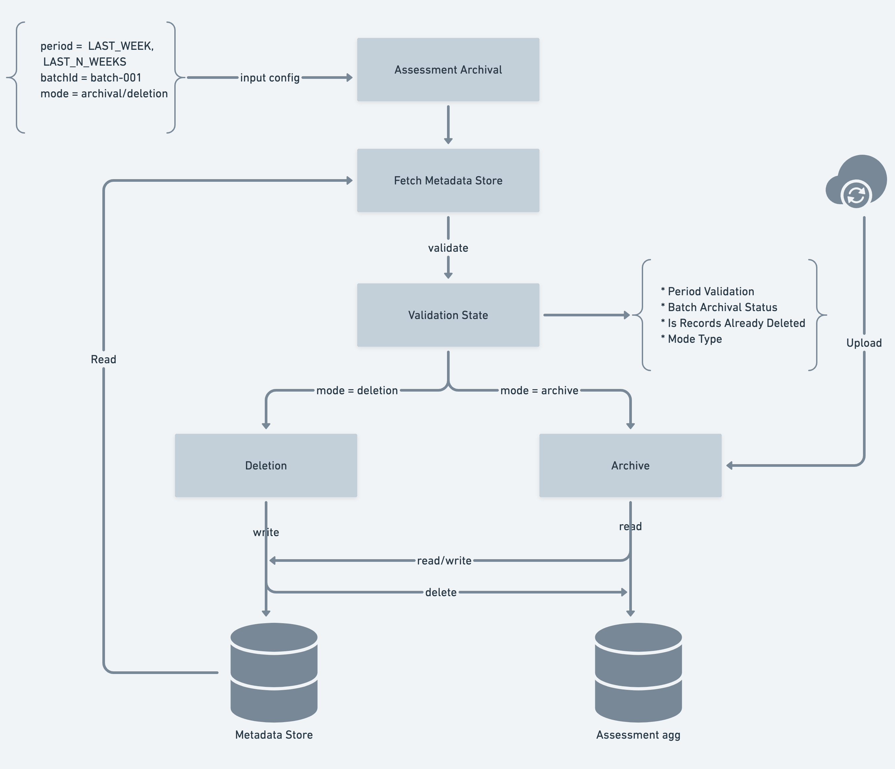
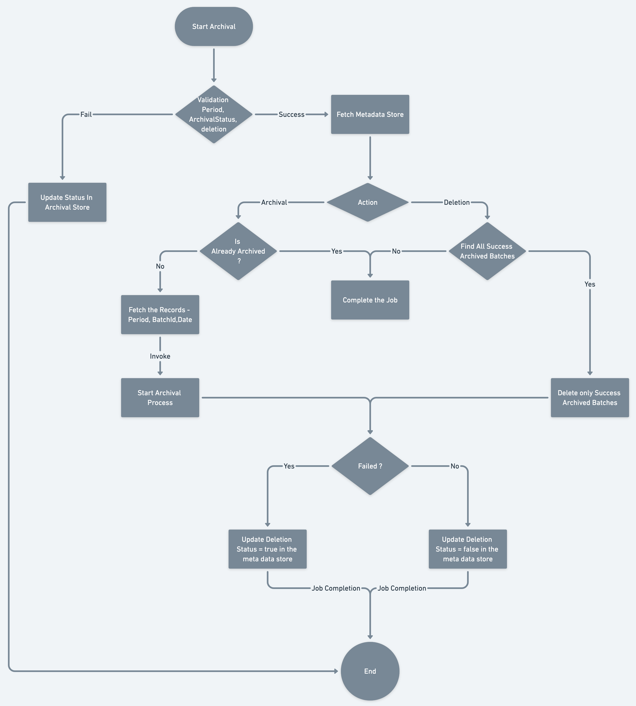

## Introduction
This document describes the error handling possibilities and potential solutions for the current implementation of the assessment/progress archival task.


## Problem Statement
Currently, the archival task is archiving and removing assessment data, but it is not generic enough to archive any other data.

The archiving job archives and deletes archived data by retrieving it from blob storage only for the last week, a certain batch identifier, or a specific date. 

However, the job fails to deal with the few failure possibilities.

Below are the key design problems


* Configuration of the job


* Schema for storing metadata


* Managing Job Failure Cases


## Design 
 **Archival Job** 

The archival task is a generic job that may be extended and implemented by any other job in order to archive and delete records from a specified table.



 **Job configuration** 


* If the user wants to archive records for a certain time period, the job should be able to do so for a week - for example, (LAST WEEK, LAST N WEEK).


* If the user wants to archive records for a specified date, the user should provide archive - date - 2021-12-01 compatibility.


* If the user wants to archive records for a specified batchId, the job should be capable to archive for a specific batchId as well.


* Specific period (LAST WEEK, LAST N WEEK): The user should not be able to archive the data during the middle of the week.


 **Metadata Store** 


* All the archived metadata should be stored in the table.


```
CREATE TABLE archival_metadata (
    UUID text,
    batchid text,
    collectionid text,
    period text, // year-weeknum of the request_data.period
    type text, // progress-archival, assessment-archival
    archival_date timestamp,
    completion_date timestamp,
    archival_status text, // SUCCESS/FAILED
    deletion_status text, // SUCCESS/FAILED
    iteration int,
    request_data json, // {"period": "LAST_WEEK/LAST_N_WEEKS/ALL", "batchId":string "date": "2021-10-27", "action": "archive/deletion"} 
    blob_url text,
    err_message text
)
```
 **Failure Cases** 


* If the job throws an exception when archiving the batches, the job should mark the archival state as failed and pick up the next batch to archive.


* If the job fails in b/w while running for a particular period, we should be able to resume from the specific batch ID if we rerun the process (Job should not archive the already archived batch again and if the blob has already existed in the blob store the job should capable to replace the older archived file)


* If the user requests that archived data be deleted, the job should delete only archived data by searching the archived metadata store and deleting only archived entries.


* If an exception occurs during the deletion, the job should mark the batch as deleted and restart the procedure in the following batch.


* If the force archival option is enabled for a certain period, the job should re-archive the previously archived batch and destroy the batch's older archived records.


 **Flow Chart** 



 **To Discuss:** 


1. Usecase of forceArchival flag?


1. Should we provide the capability to run the job for specific batches?


1. What should be the default config of the job? Is the period should be ALL to archive all the batches?


## Conclusion 


*****

[[category.storage-team]] 
[[category.confluence]] 
