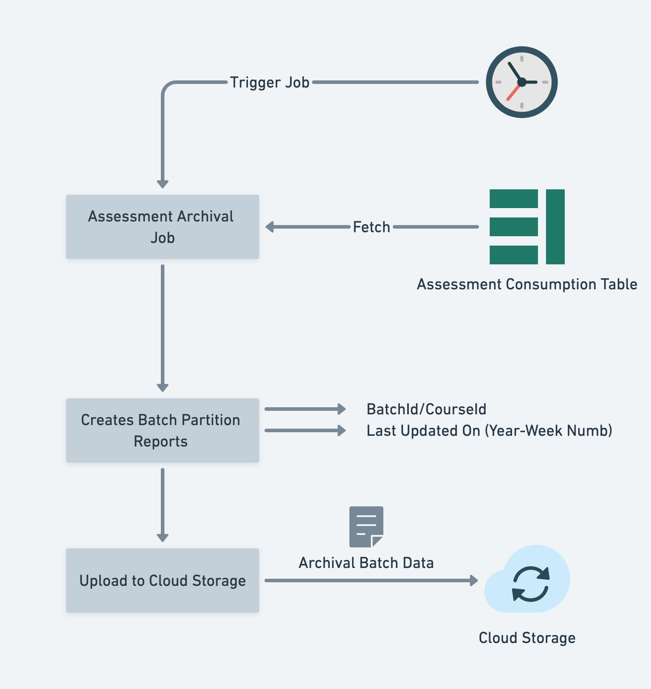
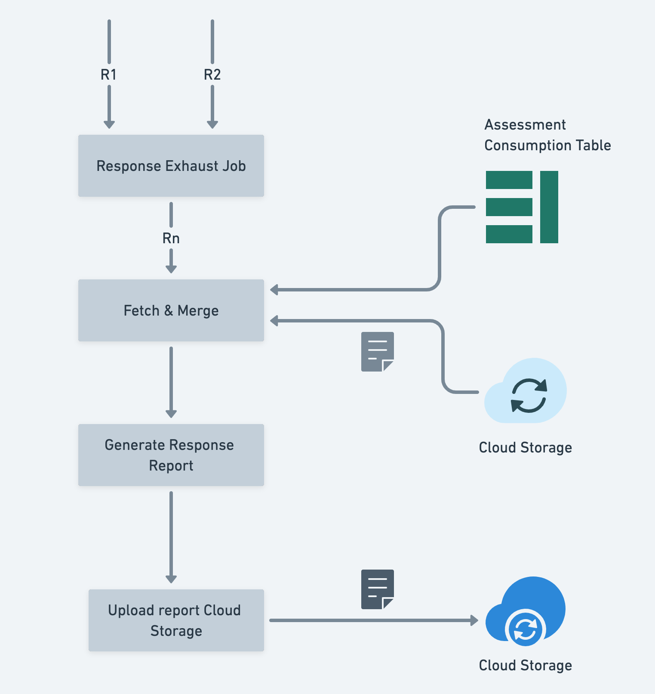

## Introduction 
The trackable collections with assessment content creating huge raw data. This document outlines the design of managing the metrics to handle reports, APIs and archiving assessment consumption data.


## Problem Statement
We are using Cassandra to store each attempt assessment aggregate data. This data is growing very fast and creating challenges to maintain the Cassandra cluster. So, we should archive this data.

But, after archival also, we should be able to generate the reports and APIs should return the required metrics for a given request. Below are the key design problems.


1. Define archival store, schema, and format.


1. Define a process to generate archival data and cleanup transactional data.


1. Supporting reporting/exhaust jobs for archived batch.


1. Handling APIs.


## Design
 **API Changes - Viewing Service Assess Update API** 

Both viewing services assess update API and content state update API will push the ASSESS telemetry

events to Kafka service. The assessment aggregator Flink job reads from Kafka which computes the best attempt score and updates into the user_activity_aggregator table, assessment consumption data into assessment_aggregator table and the best_score, max_score & last_attempted_score, etc like (min_score & average_score) will update into the assessment_aggregator_v2 table.

Slowly over a period of time, the content state update API will be deprecated.


### Table Schema

```bash
CREATE TABLE sunbird_courses.assessment_aggregator_v2 (
    user_id text,
    course_id text,
    batch_id text,
    assessment_id text,
    last_attempted_score double,
    total_max_score double,
    best_score double,
    updated_on timestamp,
    PRIMARY KEY (user_id, assessment_id, course_id, batch_id,)
) WITH CLUSTERING ORDER BY (batch_id ASC, assessment_id ASC)

```
 **Viewing Service Assess Read API** 

The viewing service assesses read API which reads the aggregated assessment data from the assessment_aggregator_v2 table based on the user_id, assessment_id, etc.


 **API** POST /v2/view/assess/read

 **Body** 


```js
{
    "request": {
        "userId": "c4cc494f-04c3-49f3-b3d5-7b1a1984abad",
        "assessmentId": "do_034678677743554443",
        "batchId": "0130086167967989764", // Optional
        "courseId": "do_113008612577402880164" // Optional
    }
}
```


 **Response** 


```js
{
  "id": "api.view.assessment.read",
  "ver": "1.0",
  "ts": "2021-07-08T11:42:18.677Z",
  "params": {
    "resmsgid": "8cbd1650-dfe1-11eb-a942-cb4a9f22280d",
    "msgid": "8cbb4190-dfe1-11eb-b597-03b53bd7228b",
    "status": "successful",
    "err": null,
    "errmsg": null
  },
  "responseCode": "OK",
  "result": {
    "userId": "c4cc494f-04c3-49f3-b3d5-7b1a1984abad",
    "batchId": "0130086167967989764",
    "courseId": "do_113008612577402880164",
    "assessmentId": "do_034678677743554443",
    "bestScore": 10,
    "totalMaxScore": 20,
    "lastAttemptedScore": 5,
    "updated_on": 234884723948
  }
}
```


 **Assessment Data Archival:**  **Archival Data Product** 

The assessment archival data product runs once a week, fetches assessment consumption data from the assessment aggregator tables, and creates the partition batch report based on the batch identifier, Year & Week number from the last updated column.

Once the partition reports are generated, it will upload those partition files into cloud storage below format and the data in the table will be cleared.

$container/archived-batches/assessment/$batchid-$year-$week-num-<timestamp>.<file-extension>


 **Response Exhaust Job** 

The Response Exhaust Job for a particular batch identifier will fetches and merge both archived data from cloud storage which is being uploaded by archival data product and assessment _aggregate tables.

On the success of merge, it will generate the response exhaust report and uploads it into cloud storage.

 **Conclusion** <TODO>


*****

[[category.storage-team]] 
[[category.confluence]] 
