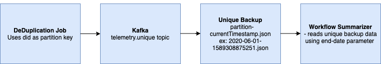
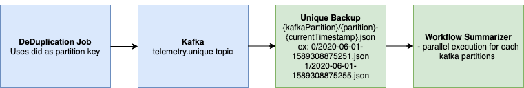

## Introduction:
This document describes the design for productionizing the parallel execution of WFS by partitions as we have seen improvement in execution time.

|  **Input Events**  |  **Execution Time Before**  |  **Execution Time After**  | 
|  --- |  --- |  --- | 
| 750 M | 1hr 42 mins | 51 mins | 
| 1B | 6 hrs | 1hr 13 mins | 
| 2B | - | 2hrs 20 mins | 

## Current Design:
Deduplication Samza job:
* It pushes events to unique kafka topic using did as partition key.

Unique backup secor process:
* Output file pattern used - output_file_pattern: "{partition}-{currentTimestamp}.json"

## Enhancements required:

### 1. Secor backup file pattern:
 **1.1** {kafkaPartition}/{partition}-{currentTimestamp}.json

 **Pros** :

    Minimal framework changes to include kafkaPartition along with prefix

 **Cons** :

    Data Replay breaks as this is major change in blob file pattern

    Effects adhoc reporting and random count queries on backup data

 **1.2** {partition}-{kafkaPartition}-{currentTimestamp}.json

 **Pros** :

    Backward compatibility - Data replay works fine without any changes

    Doesn't effect on adhoc reporting and random queries which are based on partition

 **Cons** :

    Adding the partition specific information to the WFS data fetcher filter

 **1.3**  {partition}/{kafkaPartition}-{currentTimestamp}.json

 **Pros** :

    Data replay works fine without any changes

 **Cons** :

    Adding the partition specific information to the WFS data fetcher filter

    Adhoc reporting queries and random queries on backup data need to handle the changes

 **1.4**  {partition}/{kafkaPartition}/{currentTimestamp}.json

 **Pros** :

    Data replay works fine without any changes

 **Cons** :

    Adding the partition specific information to the WFS data fetcher filter

    Adhoc reporting queries and random queries on backup data need to handle the changes

 **Recommendation** :

    Approach 1.2 is recommended as it works fine for users without any changes and has backward compatibility to work with current design. Also would recommend to use same pattern for denorm backup as well.

### 2. WFS execution:
.png) **Submit script:** 

* Can be used to execute data product in any mode

* model - Takes job code wfs, ds etc

* Based on type it triggers data product in respective mode of execution

* If type = via-partition, it submits data product either to spark local or cluster based on sparkMaster parameter using partitions and parallelisation

* If type = run-mode, it submits data product either to spark local or cluster based on sparkMaster parameter for all partitions together which is same as current design

* If type = job-manager, it submits multiple job config with partition number to a kafka topic which is consumed by job-manager

* sparkMaster have local[\*] by default and to run in cluster spark URL can be provided at run time

* partitions parameter is partitions of unique topic. Based on this script triggers multiple jobs. If partitions is not specified, it will take from kafka topic metadata

* parallelisation parameter defines number of jobs to trigger based on partitions

### 3. Framework/Script changes:

* Azure Fetcher Framework changes to take partitions parameter

* Enhancing fetcher framework to apply filter by partitions

* Backward compatibility - Without partition parameter, it should work as per previous design

* Kafka dispatcher changes to include partition key like did, mid to handle data replay

* Python replay script changes to include key with kafka push

*****

[[category.storage-team]] 
[[category.confluence]] 
