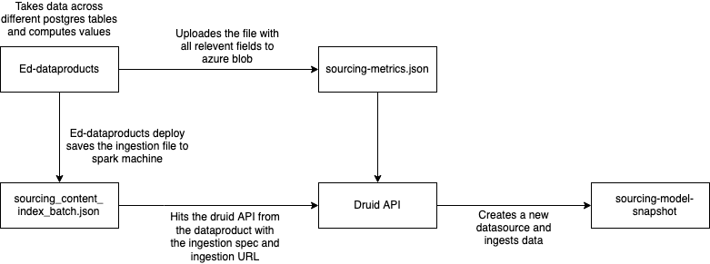
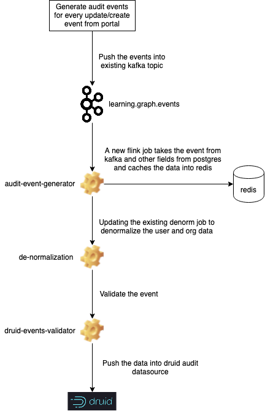

### Introduction:
Currently, the sourcing solution has a set of reports that are generated through custom data product/script. 

They have to be modified so that they can be generated through hawkeye infra using druid. There are also a new set of reports that also need to be generated using hawkeye infra. 


### Implementation Approach:
A new data product combines the data across different postgres tables creating a file with all the necessary fields and uploades it to the azure blob - sourcing-snapshot.csv. ETLJobs then can be used in a similar way as for content model snapshot for indexing the sourcing metrics into druid. A new script will index the metrics into a new druid datasource which can be used for creating hawk eye based reports. 





* Frequency of the Data Product - Daily


* Druid Snapshot Schema:

    


```
{
    "type":"index",
    "spec":{
    "dataSchema":{
        "dataSource":"sourcing-model-snapshot",
        "parser":{
        "type":"string",
        "parseSpec":{
            "format":"json",
            "flattenSpec": {
            "useFieldDiscovery": false,
            "fields": [
                {
                    "type": "path",
                    "name": "nominationStatus",
                    "expr": "$.data.nominationStatus"
                },
                {
                    "type": "path",
                    "name": "channel",
                    "expr": "$.data.channel"
                },
                {
                    "type": "path",
                    "name": "contentType",
                    "expr": "$.data.contentType"
                },
                {
                    "type": "path",
                    "name": "createdBy",
                    "expr": "$.data.createdBy"
                },
                {
                    "type": "path",
                    "name": "createdOn",
                    "expr": "$.data.createdOn"
                },
                {
                    "type": "path",
                    "name": "board",
                    "expr": "$.data.board"
                },
                {
                    "type": "path",
                    "name": "gradeLevel",
                    "expr": "$.data.gradeLevel"
                },
                {
                    "type": "path",
                    "name": "medium",
                    "expr": "$.data.medium"
                },
                {
                    "type": "path",
                    "name": "subject",
                    "expr": "$.data.subject"
                },
                {
                    "type": "path",
                    "name": "identifier",
                    "expr": "$.data.identifier"
                },
                {
                    "type": "path",
                    "name": "mimeType",
                    "expr": "$.data.mimeType"
                },
                {
                    "type": "path",
                    "name": "programId",
                    "expr": "$.data.programId"
                },
                {
                    "type": "path",
                    "name": "programName",
                    "expr": "$.data.programName"
                },
                {
                    "type": "path",
                    "name": "objectType",
                    "expr": "$.data.objectType"
                },
                {
                    "type": "path",
                    "name": "status",
                    "expr": "$.data.status"
                },
                {
                    "type": "path",
                    "name": "userId",
                    "expr": "$.data.userId"
                },
                {
                    "type": "path",
                    "name": "user_name",
                    "expr": "$.data.user[*].name"
                },
                {
                    "type": "path",
                    "name": "user_org",
                    "expr": "$.data.user[*].org"
                },
                {
                    "type": "path",
                    "name": "enrolledDate",
                    "expr": "$.data.enrolledDate"
                },
                {
                    "type": "path",
                    "name": "totalContributions",
                    "expr": "$.data.totalContributions"
                },
                {
                    "type": "path",
                    "name": "rootOrgId",
                    "expr": "$.data.rootOrgId"
                },
                {
                    "type": "path",
                    "name": "contributorType",
                    "expr": "$.data.contributorType"
                }
            ]
            },
            "dimensionsSpec":{
                "dimensions": [
                {
                    "type": "string",
                    "name": "nominationStatus"
                },
                {
                    "type": "string",
                    "name": "channel"
                },
                {
                    "type": "string",
                    "name": "contentType"
                },
                {
                    "type": "string",
                    "name": "createdBy"
                },
                {
                    "type": "string",
                    "name": "createdOn"
                },
                {
                    "type": "string",
                    "name": "board"
                },
                {
                    "type": "string",
                    "name": "gradeLevel"
                },
                {
                    "type": "string",
                    "name": "medium"
                },
                {
                    "type": "string",
                    "name": "subject"
                },
                {
                    "type": "string",
                    "name": "identifier"
                },
                {
                    "type": "string",
                    "name": "mimeType"
                },
                {
                    "type": "string",
                    "name": "programId"
                },
                {
                    "type": "string",
                    "name": "programName"
                },
                {
                    "type": "string",
                    "name": "objectType"
                },
                {
                    "type": "string",
                    "name": "status"
                },
                {
                    "type": "string",
                    "name": "userId"
                },
                {
                    "name": "user_name"
                },
                {
                    "name": "user_org"
                },
                {
                    "type": "string",
                    "name": "enrolledDate"
                },
                {
                    "type": "string",
                    "name": "totalContributions"
                },
                {
                    "type": "string",
                    "name": "rootOrgId"
                },
                {
                    "type": "string",
                    "name": "contributorType"
                }
                ],
            "dimensionsExclusions": []
            },
            "timestampSpec":{
            "column":"timestamp",
            "format":"auto"
            }
        }
        },
        "metricsSpec":[],
        "granularitySpec":{
        "type":"uniform",
        "segmentGranularity":"day",
        "queryGranularity":"none",
        "rollup": true
        }
    },
    "ioConfig":{
        "type":"index",
        "firehose" : {
        "type" : "static-azure-blobstore",
        "blobs": [
            {
            "container": "reports",
            "path": "/sourcing-snapshot-metrics/sourcing-metrics.json"
            }
        ],
        "fetchTimeout": 3000000
        }
    },
    "tuningConfig":{
        "type":"index",
        "targetPartitionSize":5000000,
        "maxRowsInMemory":25000,
        "forceExtendableShardSpecs":false,
        "logParseExceptions": true
    }
    }
}
```


* Source Postgres tables:


|  **Database**  |  **Table**  | 
|  --- |  --- | 
| opensaberdb | V_Org | 
| opensaberdb | V_User | 
| sunbird_programs | program | 
| sunbird_programs | nomination | 


* Fields required:

a. Number users enrolled as contributors - Total, split by organization vs. individual

    b. Number of contributors nominated at least to one project - Total, split by organization vs. individual, split by each sourcing org

    c. Number of contributions - Total, split by total contribs by orgs and total contribs by individuals, split by contributions for each sourcing org, split by approved, rejected, pending, split by content categories

    d. Number of projects - Total, split by each sourcing org

    e. Number of nominations - Total, split by each sourcing org, split by accepted, rejected, pending

    

    


### Audit Event Generation:
The portal will generate audit events based on every create/update event, which will be pushed to learning.graph.events Kafka topic. A new flink job takes input from the Kafka topic and caches the data, along with the Postgres data into Redis. The existing denorm flink job denormalizes the user and org data, after which it is validated by the druid event validator job. The data is then pushed into a new druid audit data source.




* Sample input event for Audit Event Generation:

    


```
{
  "ets": 1614933849545,
  "channel": "b00bc992ef25f1a9a8d63291e20efc8d",
  "transactionData": {
    "properties": {
      "lastUpdatedOn": {
        "ov": "2021-03-05T08:44:09.034+0000",
        "nv": "2021-03-05T08:44:09.434+0000"
      },
      "name": {
        "ov": null,
        "nv": "Test program"
      },
      "channel": {
        "ov": null,
        "nv": "b00bc992ef25f1a9a8d63291e20efc8d"
      }
    }
  },
  "mid": "a950e6ee-782c-40ec-be6e-52943f915f81",
  "label": "Test",
  "userId": "ANONYMOUS",
  "createdOn": "2021-03-05T08:44:09.545+0000",
  "objectType": "Program",
  "nodeUniqueId": "b966e6gg-782d-40ab-be6h-52943f915f91",
  "requestId": null,
  "operationType": "UPDATE"
}
```


* Sample output event:

    


```
{
  "eid": "AUDIT",
  "ets": 1617110351684,
  "ver": "3.0",
  "mid": "SP.1617110351684.3396c5a8-9a2d-4df0-a77a-06f00d7fc530",
  "actor": {
    "id": "874ed8a5-782e-4f6c-8f36-e0288455901e",
    "type": "User"
  },
  "context": {
    "channel": "channel-1",
    "pdata": {
      "id": "sunbirddock.sunbird.portal",
      "pid": "audit-event-generator",
      "ver": "1.0"
    },
    "env": "Program"
  },
  "object": {
    "id": "b966e6gg-782d-40ab-be6h-52943f915f91",
    "type": "Program"
  },
  "edata": {
    "state": "Draft",
    "props": [
      "programId",
      "identifier",
      "author",
      "board",
      "mimeType",
      "lastStatusChangedOn",
      "collectionId",
      "primaryCategory",
      "acceptedContents",
      "rejectedContents",
      "dialcodeRequired",
      "contentType",
      "chapterCount",
      "sampleContentCount",
      "unitIdentifiers",
      "channel",
      "originData",
      "compatibilityLevel",
      "createdFor",
      "createdOn",
      "idealScreenDensity",
      "creator",
      "framework",
      "createdBy",
      "gradeLevel",
      "subject",
      "name",
      "status",
      "prevStatus"
    ]
  },
  "syncts": 1617110351684
}
```


*****

[[category.storage-team]] 
[[category.confluence]] 
