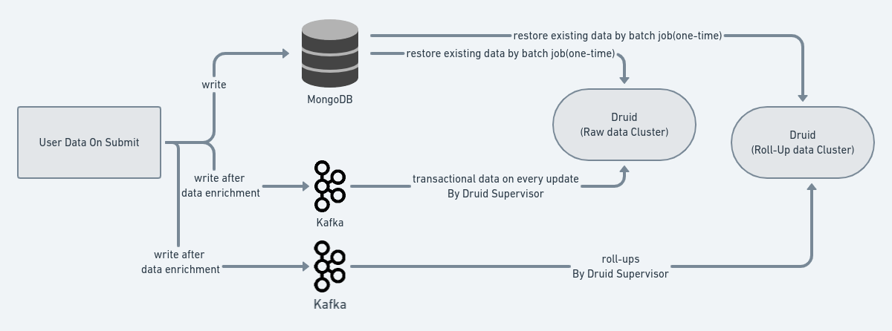

 **INTRODUCTION:** 

The data related to projects and observations consumed by users are ingested into druid from a permanent data source( MongoDB ) using a batch processing cron job. Both these are non-transactional.

 **BACKGROUND:** 

Upon each transaction, the data is written to MongoDB and Kafka. But in MongoDB, only the data with the latest status is made available. The same is ingested in druid also.

The data ingestion to druid is done using a job, which deletes the indices, re-creates them, and then ingests the entire data until the time of execution. As data is growing exponentially on day-to-day transactions, re-writing the entire data is not a feasible approach.

To avoid complete data restoration every day, the following design is proposed.

 **DESIGN:** 


* On each transaction, ingest raw data into ingestion druid cluster and rollups into reporting cluster reading data from Kafka.


* Since raw data is ingested separately, this can be used for further analysis.


* Existing transactions are ingested from MongoDB as a one time execution.




 **Project Dimensions :** 


|  **Dimensions in Druid**  |  **Datatype**  |  **Field in Kafka Message**  |  **Description**  | 
|  --- |  --- |  --- |  --- | 
|  project_title             |  String  | solutionInformation.name | Name of the Project | 
|  project_goal              |  String  | metaInformation.goal | Goal of the Project created or mapped | 
|  project_created_date      |  Date    | createdAt | Date of creation of the project | 
|  project_last_sync         |  String  | syncedAt | Last sync date of the project | 
|  area_of_improvement       |  String  | categories\[].name | Category of the project created or assigned or imported | 
|  status_of_project         |  String  | status | Status of the Project created or mapped | 
|  tasks                     |  String  | tasks\[].name | Name of the Task attached to Project | 
|  tasks_date                |  Date    | tasks\[].syncedAt | Last sync date of the task | 
|  tasks_status              |  String  | tasks\[].status | Status of the Task attached to project | 
|  sub_task                  |  String  | task\[].children\[].name | Name of Sub task attached to the task | 
|  sub_task_status           |  String  | task\[].children\[].status | Status of Sub task attached to the task | 
|  sub_task_date             |  String  | task\[].children\[].syncedAt | Last sync date of the sub task | 
|  task_start_date           |  String  | tasks\[].startDate | Start date of Task attached to Project | 
|  task_end_date             |  String  | tasks\[].endDate | End date of Task attached to Project | 
|  sub_task_start_date       |  Date    | task\[].children\[].startDate | Start date of Sub task attached to task | 
|  sub_task_end_date         |  Date    | task\[].children\[].endDate | End date of Sub task attached to task | 
| designation |  String  | userRoleInformation.role | Sub role of the user | 
|  project_deleted_flag      |  String  | isDeleted | Indicates True or False which tells whether the projects is deleted by the user from the app | 
|  task_evidence             |  String  | tasks\[].attachments\[].sourcePath | Link of the attachment uploaded at the task level in a project | 
|  task_evidence_status      |  String  | tasks\[].attachments\[].sourcePath   (Computation Required) | Indicates true or false of evidence attached or not at the task level | 
|  project_id                |  String  | _id | Unique identifier of the Project created or mapped | 
|  task_id                   |  String  | tasks\[]._id | Unique identifier of Task attached to the Project | 
|  sub_task_id               |  String  | task\[].children\[]._id | Unique identifier of Sub task attached to the task | 
|  project_created_type      |  String  | projectTemplateId  (Computation is required) | Type of the project either Imported from library (or) created by the user | 
|  task_assigned_to          |  String  | tasks\[].assignee | Provides the username or email to which user the task is assigned to | 
|  channel                   |  String  | userProfile.rootOrgId | Root organisation of user | 
|  parent_channel            |  String  | Fill with this value “SHIKSHALOKAM“ | Column with constant value | 
|  program_id                |  String  | programId | Unique identifier of the program to which the project is mapped to | 
|  program_name              |  String  | programInformation.name | Name of the program to which the project is mapped to | 
|  project_updated_date      |  Date    | updatedAt | Project last updated date | 
|  createdBy                 |  String  | userId | User keycloak id on the sunbrid platform | 
|  project_title_editable    |  String  | title | Edited name of the Project | 
|  project_duration          |  String  | metaInformation.duration | Duration of the project taken to complete | 
|  program_externalId        |  String  | programExternalId | Unique identifier of the program to which the project is mapped to | 
|  private_program           |  String  | isAPrivateProgram | boolean value that defines program type | 
|  task_deleted_flag         |  Boolean  | tasks\[].isDeleted (Computation Required) | Indicates True or False which tells whether the task is deleted by the user from the app | 
|  sub_task_deleted_flag         |  Boolean  | task\[].children\[].isDeleted | Indicates True or False which tells whether the sub-task is deleted by the user from the app | 
|  project_terms_and_condition   |  String  | hasAcceptedTAndC (Computation required) | boolean value that defines terms and condition | 
|  task_remarks                  |  String  | tasks\[].remarks | Remarks of the task | 
|  organisation_name             |  String  | userProfile.organisations.orgName | Organisation Name of the user belongs to | 
|  project_description           |  String  | description | Summary of the project | 
|  project_completed_date        |  String  | updatedAt//when status is submitted | Date of completion of the project | 
|  solution_id                   |  String  | solutionInformation._id | Unique identifier of the Solution in an Project generated by system | 
|  state_externalId              |  String  | userRoleInformation.state | Unique identifier of the State  | 
|  block_externalId              |  String  | userRoleInformation.block | Unique identifier of the Block  | 
|  district_externalId           |  String  | userRoleInformation.district | Unique identifier of the District mapped to the user | 
|  cluster_externalId            |  String  | userRoleInformation.cluster | Unique identifier of the Cluster mapped to the user | 
|  school_externalId             |  String  | userRoleInformation.school | Unique identifier of the School mapped to the user | 
|  state_name                    |  String  | userProfile.userLocations.name//userProfile.userLocations.type is state | Name of the State mapped to the user | 
|  block_name                    |  String  | userProfile.userLocations.name//userProfile.userLocations.type is block | Name of the Block mapped to the user | 
|  district_name                 |  String  | userProfile.userLocations.name//userProfile.userLocations.type is district | Name of the District mapped to the user | 
|  cluster_name                  |  String  | userProfile.userLocations.name//userProfile.userLocations.type is cluster | Name of the Cluster mapped to the user | 
|  school_name                   |  String  | userProfile.userLocations.name//userProfile.userLocations.type is school | Name of the School declared by the User | 
|  board_name                    |  String  | userProfile.framework.board | Name of the board mapped to the user | 


 **Project Rollup Dimensions :** 


|  **Dimensions in Druid**  |  **Datatype**  |  **Field in Kafka Message**  |  **Description**  | 
|  --- |  --- |  --- |  --- | 
|  project_title             |  String  | solutionInformation.name | Name of the Project | 
|  status_of_project         |  String  | status | Status of the Project created or mapped | 
|  tasks                     |  String  | tasks\[].name | Name of the Task attached to Project | 
|  tasks_status              |  String  | tasks\[].status | Status of the Task attached to project | 
|  designation               |  String  | userRoleInformation.role | Sub role of the user | 
|  project_id  |  String  | _id | Unique identifier of the Project created or mapped | 
|  task_id                   |  String  | tasks\[]._id | Unique identifier of Task attached to the Project | 
|  parent_channel            |  String  | Fill with this value “SHIKSHALOKAM“ | Column with constant value | 
|  program_id                |  String  | programId | Unique identifier of the program to which the project is mapped to | 
|  program_name              |  String  | programInformation.name | Name of the program to which the project is mapped to | 
|  project_updated_date      |  Date    | updatedAt | Project last updated date | 
|  createdBy                 |  String  | userId | User keycloak id on the sunbrid platform | 
|  program_externalId        |  String  | programExternalId | Unique identifier of the program to which the project is mapped to | 
|  private_program           |  String  | isAPrivateProgram | boolean value that defines program type | 
|  project_terms_and_condition   |  String  | hasAcceptedTAndC (Computation required) | boolean value that defines terms and condition | 
| organisation_id | String | userProfile.organisations.organisationId | Unique Identifier for the organisation | 
|  organisation_name             |  String  | userProfile.organisations.orgName | Organisation Name of the user belongs to | 
|  solution_id                   |  String  | solutionInformation._id | Unique identifier of the Solution in an Project generated by system | 
|  state_externalId              |  String  | userRoleInformation.state | Unique identifier of the State  | 
|  block_externalId              |  String  | userRoleInformation.block | Unique identifier of the Block mapped to the user | 
|  district_externalId           |  String  | userRoleInformation.district | Unique identifier of the District mapped to the user | 
|  cluster_externalId            |  String  | userRoleInformation.cluster | Unique identifier of the Cluster mapped to the user | 
|  school_externalId             |  String  | userRoleInformation.school | Unique identifier of the School  | 
|  state_name                    |  String  | userProfile.userLocations.name//userProfile.userLocations.type is state | Name of the State mapped to the user | 
|  block_name                    |  String  | userProfile.userLocations.name//userProfile.userLocations.type is block | Name of the Block mapped to the user | 
|  district_name                 |  String  | userProfile.userLocations.name//userProfile.userLocations.type is district | Name of the District mapped to the user | 
|  cluster_name                  |  String  | userProfile.userLocations.name//userProfile.userLocations.type is cluster | Name of the Cluster mapped to the user | 
|  school_name                   |  String  | userProfile.userLocations.name//userProfile.userLocations.type is school | Name of the School declared by the User | 
| project_created_type |   String | projectTemplateId  (Computation is required) | Type of the project either Imported from library (or) created by the user | 
| board_name | String | userProfile.framework.board | Name of the board mapped to the user | 
|  task_evidence_status      |  String  | tasks\[].attachments\[].sourcePath   (Computation Required) | Indicates true or false of evidence attached or not at the task level | 
| area_of_improvement |  String  | categories\[].name | Category of the project created or assigned or imported | 


 **Project Metrics** :


| Dimensions in Druid | DataType  | 
|  --- |  --- | 
| COUNT_DISTINCT(solution_id)         | String | 
| COUNT_DISTINCT( project_id )         | String | 
| COUNT_DISTINCT(createdBy)  | String | 


 **Observation Status Dimensions** :


|  **Dimensions in Druid**  |  **Datatype**  |  **Field in Kafka Message**  |  **Description**  | 
|  --- |  --- |  --- |  --- | 
|  entity_externalId         |  String  | entityExternalId | Unique identifier of the entity added by the user during observation submission | 
|  entity_id                 |  String  | entityId | System generated unique identifier of the entity added by the user during observation submission | 
|  entity_type               |  String  | entityType | Type of entity for the observation submission | 
|  solution_id               |  String  | solutionId | Unique identifier of the Solution in an observation generated by system | 
|  solution_externalId       |  String  | solutionExternalId | Unique identifier of the Solution in an observation | 
|  submission_id             |  String  | _id | Unique system generated identifier for each observation submissions | 
|  entity_name               |  String  | entityInformation.name | Name of the entity added by the user during observation submission | 
|  solution_name             |  String  | solutionInfo.name | Name of the solution to which the observation is submitted | 
|  role_title                |  String  | userRoleInformation.role | User sub type | 
|  school_name               |  String  | userProfile.userLocations.name//userProfile.userLocations.type is school | Name of the School mapped to the user | 
|  school_externalId         |  String  | userRoleInformation.school | Unique identifier of the school  | 
|  state_name                |  String  | userProfile.userLocations.name//userProfile.userLocations.type is state | Name of the State mapped to the user | 
|  district_name             |  String  | userProfile.userLocations.name//userProfile.userLocations.type is district | Name of the District mapped to the user  | 
|  block_name                |  String  | /Fetch from Api | Name of the Block mapped to the user | 
|  cluster_name              |  String  | userProfile.userLocations.name//userProfile.userLocations.type is cluster | Name of the Cluster mapped to the user | 
|  completedDate             |  Date  | completedDate | Observation submission completion date | 
|  channel                   |  String  | userProfile.rootOrgId | Root organisation of the user | 
|  parent_channel            |  String  | Fill with this value “SHIKSHALOKAM“ | Column with constant value | 
|  program_id                |  String  | programId | Unique identifier generated by the system for the observation submitted | 
|  program_externalId        |  String  | programExternalId | Unique identifier of the observation submitted | 
|  program_name              |  String  | programInfo.name | Name of the program to which the observation is submitted | 
|  app_name                  |  String  | appInformation.appName | application name either app or portal unique identifier | 
|  user_id                   |  String  | createdBy | User keycloak id on the sunbrid platform | 
|  private_program           |  String  | isAPrivateProgram | Boolean value that defines program type | 
|  solution_type             |  String  | isRubricDriven  &  criteriaLevelReport (computation required) | Defines the type of Solution | 
|  organisation_name         |  String  | userProfile.organisations.orgName | Organisation Name of the user belongs to | 
|  ecm_marked_na             |  String  | ecm_marked_na | Domains marked as not applicable by the user | 
|  board_name                |  String  | userProfile.framework.board | Name of the board  | 
|  updatedAt                 |  Date  | updatedAt | Datetime of last updated of the observation submission | 
| status | String | status | Status of the submission observation submission | 


 **Observation Status Rollup Dimensions** :


|  **Dimensions in Druid**  |  **Datatype**  |  **Field in Kafka Message**  |  **Description**  | 
|  --- |  --- |  --- |  --- | 
|  solution_id               |  String  | solutionId | Unique identifier of the Solution in an observation generated by system | 
|  submission_id             |  String  | _id | Unique identifier generated by system for each submission | 
|  entity_name               |  String  | entity_name | Name of the entity added by the user during observation submission | 
|  solution_name             |  String  | solutionInfo.name | Name of the solution to which the observation is submitted | 
|  role_title                |  String  | role_title | User sub type | 
|  school_name               |  String  | userProfile.userLocations.name//userProfile.userLocations.type is school | Name of the School mapped to the user | 
|  school_externalId         |  String  | userRoleInformation.school | Unique identifier of the school  | 
| state_externalId | String | userRoleInformation.state | Unique identifier of the state | 
|  state_name                |  String  | userProfile.userLocations.name//userProfile.userLocations.type is state | Name of the State mapped to the user | 
| district_externalId | String | userRoleInformation.district | Unique identifier of the district | 
|  district_name             |  String  | userProfile.userLocations.name//userProfile.userLocations.type is district | Name of the District mapped to the user | 
| block_externalId | String | userRoleInformation.block | Unique identifier of the block | 
|  block_name                |  String  | userProfile.userLocations.name//userProfile.userLocations.type is block | Name of the Block mapped to the user | 
| cluster_externalId | String | userRoleInformation.cluster | Unique identifier of the cluster | 
|  cluster_name              |  String  | userProfile.userLocations.name//userProfile.userLocations.type is cluster | Name of the Cluster mapped to the user | 
|  completedDate             |  Date  | completedDate | Date of completion of the observation submission | 
|  channel                   |  String  | userProfile.rootOrgId | Root organisation of the user | 
|  parent_channel            |  String  | Fill with this value “SHIKSHALOKAM“ | Column with constant value | 
|  program_id                |  String  | programId | Unique identifier generated by the system for the observation submitted | 
|  program_name              |  String  | programInfo.name | Name of the program to which the observation is submitted | 
|  user_id                   |  String  | createdBy | User keycloak id on the sunbrid platform | 
|  private_program           |  String  | isAPrivateProgram | Boolean value that defines program type | 
|  solution_type             |  String  | isRubricDriven  &  criteriaLevelReport (computation required) | Defines the type of Solution | 
|  organisation_id | String | userProfile.organisations.organisationId | Uniquer Identifier for the organisations | 
|  organisation_name         |  String  | userProfile.organisations.orgName | Organisation Name of the user belongs to | 
|  updatedAt                 |  Date  | updatedAt | Datetime of last updated of the observation submission | 
| status | String | status | Status of the observation submission | 
| board_name | String | userProfile.framework.board | Name of the board  | 

 **Observation Metrics** :


| Dimensions in Druid | DataType  | 
|  --- |  --- | 
| COUNT_DISTINCT(solution_id)         | String | 
| COUNT_DISTINCT( submission_id )         | String | 
| COUNT_DISTINCT(user_id)  | String | 

 **References** : 

Sample Kafka Message  : Projects
```json
[
    {
        "userId": "ccfafc59-8df0-4029-ab1f-4f9a2eea4f40",
        "userRole": "",
        "status": "notStarted",
        "isDeleted": false,
        "categories": [
            {
                "_id": "5fcfa9a2457d6055e33843f3",
                "externalId": "educationLeader",
                "name": "Education Leader"
            },
            {
                "_id": "5fcfa9a2457d6055e33843ef",
                "externalId": "teachers",
                "name": "Teachers"
            }
        ],
        "createdBy": "ccfafc59-8df0-4029-ab1f-4f9a2eea4f40",
        "tasks": [
            {
                "_id": "b1cb8694-b43c-4e92-920d-8f408848992e",
                "createdBy": "ec8deeb2-4ded-4fa2-ac48-023ad8298d92",
                "updatedBy": "ec8deeb2-4ded-4fa2-ac48-023ad8298d92",
                "isDeleted": false,
                "isDeletable": false,
                "taskSequence": [],
                "children": [],
                "visibleIf": [],
                "hasSubTasks": false,
                "learningResources": [],
                "deleted": false,
                "type": "simple",
                "projectTemplateId": "6183a5de501c2f0008a37395",
                "projectTemplateExternalId": "IMP-124_IMPORTED",
                "name": "Task",
                "externalId": "IMP-124-TASK1-1636017630299",
                "description": "",
                "updatedAt": "2022-01-21T09:01:00.852Z",
                "createdAt": "2021-11-04T09:16:20.382Z",
                "__v": 0,
                "status": "notStarted",
                "isImportedFromLibrary": false,
                "syncedAt": "2022-01-21T09:01:00.852Z"
            },
            {
                "_id": "c671a09f-b2b6-45a5-9077-ad0f4873142a",
                "createdBy": "ec8deeb2-4ded-4fa2-ac48-023ad8298d92",
                "updatedBy": "ec8deeb2-4ded-4fa2-ac48-023ad8298d92",
                "isDeleted": false,
                "isDeletable": false,
                "taskSequence": [],
                "children": [],
                "visibleIf": [],
                "hasSubTasks": false,
                "learningResources": [],
                "deleted": false,
                "type": "observation",
                "solutionDetails": {
                    "_id": "617b9edf46acf400076602b2",
                    "isReusable": false,
                    "externalId": "3175d608-3886-11ec-964d-e982d5ff1084-OBSERVATION-TEMPLATE_CHILD",
                    "name": "Simple Observation – FD 114",
                    "programId": "6172a6e58cf7b10007eefd21",
                    "type": "observation",
                    "subType": "school",
                    "allowMultipleAssessemts": false,
                    "isRubricDriven": false,
                    "minNoOfSubmissionsRequired": 1
                },
                "projectTemplateId": "6183a5de501c2f0008a37395",
                "projectTemplateExternalId": "IMP-124_IMPORTED",
                "name": "Simple Observation",
                "externalId": "IMP-124-TASK2-1636017630303",
                "description": "",
                "updatedAt": "2022-01-21T09:01:00.852Z",
                "createdAt": "2021-11-04T09:16:20.390Z",
                "__v": 0,
                "status": "notStarted",
                "isImportedFromLibrary": false,
                "syncedAt": "2022-01-21T09:01:00.852Z"
            }
        ],
        "updatedBy": "ccfafc59-8df0-4029-ab1f-4f9a2eea4f40",
        "learningResources": [],
        "hasAcceptedTAndC": false,
        "taskSequence": [],
        "_id": "61ea764c2cdc3700077219a6",
        "deleted": false,
        "description": "Project -FD-124",
        "title": "Project -FD-124",
        "metaInformation": {
            "rationale": "",
            "primaryAudience": "",
            "goal": "HT will take a walk around the school to observe that proper safety measures are implemented.",
            "duration": "15 Days",
            "successIndicators": "",
            "risks": "",
            "approaches": ""
        },
        "updatedAt": "2022-01-21T09:01:00.885Z",
        "createdAt": "2021-11-04T09:12:38.931Z",
        "solutionId": "61ea764c73de09000895c628",
        "solutionExternalId": "IMP-124-solution-1642755660859",
        "programId": "61ea764c73de09000895c625",
        "programExternalId": "PGM_FD_98_TEST_4.4-1642755660859",
        "taskReport": {
            "total": 2,
            "notStarted": 2
        },
        "solutionInformation": {
            "name": "Project -FD-124",
            "externalId": "IMP-124-solution-1642755660859",
            "description": "Project -FD-124",
            "_id": "61ea764c73de09000895c628"
        },
        "programInformation": {
            "_id": "61ea764c73de09000895c625",
            "name": "Testing 4.4",
            "externalId": "PGM_FD_98_TEST_4.4-1642755660859",
            "description": "Testing 4.4",
            "isAPrivateProgram": true
        },
        "isAPrivateProgram": true,
        "link": "b28818b1abb304ef3100604f41df595e",
        "referenceFrom": "link",
        "lastDownloadedAt": "2022-01-21T09:01:00.883Z",
        "projectTemplateId": "6183a5de501c2f0008a37395",
        "projectTemplateExternalId": "IMP-124_IMPORTED",
        "__v": 0
    },
    {
        "userId": "fa21c831-145b-4af7-98a2-bb1a1bef6a1b",
        "userRole": "DEO",
        "status": "completed",
        "isDeleted": false,
        "categories": [
            {
                "_id": "5fcfa9a2457d6055e33843f3",
                "name": "Education Leader",
                "externalId": "educationLeader"
            },
            {
                "_id": "5fcfa9a2457d6055e33843ef",
                "name": "Teachers",
                "externalId": "teachers"
            }
        ],
        "createdBy": "fa21c831-145b-4af7-98a2-bb1a1bef6a1b",
        "tasks": [
            {
                "_id": "7e70b98d-d62e-407e-bcf0-1bd3ecf25c24",
                "createdBy": "9bb884fc-8a56-4727-9522-25a7d5b8ea06",
                "updatedBy": "fa21c831-145b-4af7-98a2-bb1a1bef6a1b",
                "isDeleted": false,
                "isDeletable": false,
                "taskSequence": [],
                "children": [],
                "visibleIf": [],
                "hasSubTasks": false,
                "learningResources": [],
                "deleted": false,
                "type": "simple",
                "name": "Task 1",
                "externalId": "IMP-IMP-a-FD221-TASK1",
                "description": "",
                "updatedAt": "2022-01-21T11:17:08.850Z",
                "createdAt": "2022-01-17T06:35:37.091Z",
                "status": "completed",
                "isImportedFromLibrary": false,
                "syncedAt": "2022-01-21T11:17:08.850Z"
            },
            {
                "_id": "3620cbaa-e59e-48d3-924d-51ced9d0cebc",
                "createdBy": "9bb884fc-8a56-4727-9522-25a7d5b8ea06",
                "updatedBy": "fa21c831-145b-4af7-98a2-bb1a1bef6a1b",
                "isDeleted": false,
                "isDeletable": false,
                "taskSequence": [],
                "children": [],
                "visibleIf": [],
                "hasSubTasks": false,
                "learningResources": [],
                "deleted": false,
                "type": "simple",
                "name": "Task 2",
                "externalId": "IMP-IMP-a-FD221-TASK2",
                "description": "",
                "updatedAt": "2022-01-21T11:17:08.850Z",
                "createdAt": "2022-01-17T06:35:37.096Z",
                "status": "completed",
                "isImportedFromLibrary": false,
                "syncedAt": "2022-01-21T11:17:08.850Z",
                "attachments": [
                    {
                        "name": "1642763819332.jpg",
                        "type": "image/jpeg",
                        "url": "",
                        "sourcePath": "survey/61e6ba712cdc3700077214c0/fa21c831-145b-4af7-98a2-bb1a1bef6a1b/0bb855bb-2e55-41d7-a8b9-e77adca0a405/1642763819332.jpg"
                    }
                ]
            }
        ],
        "updatedBy": "fa21c831-145b-4af7-98a2-bb1a1bef6a1b",
        "learningResources": [],
        "hasAcceptedTAndC": false,
        "taskSequence": [
            "IMP-IMP-a-FD221-TASK1",
            "IMP-IMP-a-FD221-TASK2"
        ],
        "deleted": false,
        "_id": "61e6ba712cdc3700077214c0",
        "description": "Mentor will be able to conduct SLDP workshop in their districts",
        "title": "Support required for testing 4.6 in staging environment Project -- 224",
        "metaInformation": {
            "rationale": "",
            "primaryAudience": "",
            "goal": "",
            "duration": "2 weeks",
            "successIndicators": "",
            "risks": "",
            "approaches": ""
        },
        "updatedAt": "2022-01-21T11:17:08.851Z",
        "createdAt": "2022-01-18T13:02:41.217Z",
        "__v": 0,
        "solutionId": "61e50f2773de09000895ae6f",
        "solutionExternalId": "IMP-a-FD216-solution",
        "programId": "61dd77a459e49a00074aecae",
        "programExternalId": "PGM-testing-program-4.6-FD-216",
        "projectTemplateId": "61e50fc22cdc370007720e73",
        "projectTemplateExternalId": "IMP-a-FD224-solution_IMPORTED",
        "taskReport": {
            "total": 2,
            "completed": 2
        },
        "isAPrivateProgram": false,
        "programInformation": {
            "_id": "61dd77a459e49a00074aecae",
            "externalId": "PGM-testing-program-4.6-FD-216",
            "description": "Testing program 4.6",
            "name": "Testing program 4.6"
        },
        "solutionInformation": {
            "_id": "61e50f2773de09000895ae6f",
            "externalId": "IMP-a-FD216-solution",
            "description": "Mentor will be able to conduct SLDP workshop in their districts",
            "name": "Support required for testing 4.6 in staging environment Project -- 224"
        },
        "appInformation": {
            "appName": "DIKSHA",
            "appVersion": "4.6.161staging"
        },
        "entityInformation": {
            "externalId": "AP",
            "name": "Andhra Pradesh",
            "capital": "Amaravati",
            "_id": "5fd0987e1b70ff5a40d92345",
            "entityType": "state",
            "entityTypeId": "5f32d8228e0dc8312404056e",
            "registryDetails": {
                "locationId": "bc75cc99-9205-463e-a722-5326857838f8",
                "lastUpdatedAt": "2021-08-09T08:22:54.082Z",
                "code": "bc75cc99-9205-463e-a722-5326857838f8"
            }
        },
        "entityId": "5fd0987e1b70ff5a40d92345",
        "lastDownloadedAt": "2022-01-18T13:02:41.239Z",
        "userRoleInformation": {
            "district": "b5c35cfc-6c1e-4266-94ef-a425c43c7f4e",
            "state": "bc75cc99-9205-463e-a722-5326857838f8",
            "block": "d8a34179-d925-4bca-a320-3d8c7cbcffa4",
            "school": "28231601302",
            "role": "DEO"
        },
        "syncedAt": "2022-01-21T11:17:08.835Z"
    }
]] ]></ac:plain-text-body></ac:structured-macro><p /></ac:rich-text-body></ac:structured-macro><ac:structured-macro ac:name="expand" ac:schema-version="1" ac:macro-id="4e399584-bd39-4c39-a8d1-c0ebdfcc5681"><ac:parameter ac:name="title">Sample Kafka Message  : Observations </ac:parameter><ac:rich-text-body><ac:structured-macro ac:name="code" ac:schema-version="1" ac:macro-id="b2792c75-4cb8-4f27-a4dd-ca375b57faa7"><ac:plain-text-body><![CDATA[{
    "_id": "61ea966ffe0015000743f46d",
    "evidencesStatus": [
        {
            "externalId": "D1_1634904093354",
            "tip": null,
            "name": "HP DomSample Kafka Message  : Observations ain",
            "description": null,
            "modeOfCollection": "onfield",
            "canBeNotApplicable": false,
            "notApplicable": null,
            "canBeNotAllowed": false,
            "remarks": null,
            "startTime": 1642763888664,
            "endTime": 1642763935095,
            "isSubmitted": true,
            "submissions": [
                {
                    "externalId": "D1_1634904093354",
                    "startTime": 1642763888664,
                    "endTime": 1642763935095,
                    "gpsLocation": null,
                    "submittedBy": "fa21c831-145b-4af7-98a2-bb1a1bef6a1b",
                    "submittedByName": "undefined undefined",
                    "submittedByEmail": null,
                    "submissionDate": "2022-01-21T11:18:56.849Z",
                    "isValid": true
                }
            ],
            "hasConflicts": false
        }
    ],
    "criteria": [
        {
            "_id": "61ea63e6fe0015000743f29b",
            "__v": 0,
            "createdAt": "2022-01-21T07:42:30.443Z",
            "criteriaType": "auto",
            "description": "Planning & Execution",
            "externalId": "D1C1_1634904093354-1642750950375",
            "flag": "",
            "frameworkCriteriaId": "6172a81fc06efe0007c766c2",
            "name": "Planning & Execution",
            "owner": "ec8deeb2-4ded-4fa2-ac48-023ad8298d92",
            "remarks": "",
            "rubric": {
                "name": "Planning & Execution",
                "description": "Planning & Execution",
                "type": "manual",
                "expressionVariables": {
                    "SCORE": "61ea63e6fe0015000743f29b.scoreOfAllQuestionInCriteria()"
                },
                "levels": {
                    "L1": {
                        "level": "L1",
                        "label": "Level 1",
                        "description": "",
                        "expression": "75<=SCORE<=150"
                    },
                    "L2": {
                        "level": "L2",
                        "label": "Level 2",
                        "description": "",
                        "expression": "151<=SCORE<=220"
                    },
                    "L3": {
                        "level": "L3",
                        "label": "Level 3",
                        "description": "",
                        "expression": "221<=SCORE<=290"
                    }
                }
            },
            "score": "L1",
            "showRemarks": null,
            "timesUsed": 12,
            "updatedAt": "2022-01-21T07:42:30.443Z",
            "weightage": 1,
            "scoreAchieved": 325,
            "maxScore": 400,
            "percentageScore": 81.25,
            "pointsBasedScoreOfAllChildren": 81.25
        },
        {
            "_id": "61ea63e6fe0015000743f29c",
            "__v": 0,
            "createdAt": "2022-01-21T07:42:30.448Z",
            "criteriaType": "auto",
            "description": "Data based Governance",
            "externalId": "D1C2_1634904093354-1642750950376",
            "flag": "",
            "frameworkCriteriaId": "6172a81fc06efe0007c766c3",
            "name": "Data based Governance",
            "owner": "ec8deeb2-4ded-4fa2-ac48-023ad8298d92",
            "remarks": "",
            "rubric": {
                "name": "Data based Governance",
                "description": "Data based Governance",
                "type": "manual",
                "expressionVariables": {
                    "SCORE": "61ea63e6fe0015000743f29c.scoreOfAllQuestionInCriteria()"
                },
                "levels": {
                    "L1": {
                        "level": "L1",
                        "label": "Level 1",
                        "description": "",
                        "expression": "75<=SCORE<=135"
                    },
                    "L2": {
                        "level": "L2",
                        "label": "Level 2",
                        "description": "",
                        "expression": "136<=SCORE<=190"
                    },
                    "L3": {
                        "level": "L3",
                        "label": "Level 3",
                        "description": "",
                        "expression": "191<=SCORE<=245"
                    }
                }
            },
            "score": "No Level Matched",
            "showRemarks": null,
            "timesUsed": 12,
            "updatedAt": "2022-01-21T07:42:30.448Z",
            "weightage": 1,
            "scoreAchieved": 150,
            "maxScore": 300,
            "percentageScore": 50,
            "pointsBasedScoreOfAllChildren": 50
        },
        {
            "_id": "61ea63e6fe0015000743f29d",
            "__v": 0,
            "createdAt": "2022-01-21T07:42:30.438Z",
            "criteriaType": "auto",
            "description": "Communication",
            "externalId": "D1C3_1634904093354-1642750950377",
            "flag": "",
            "frameworkCriteriaId": "6172a81fc06efe0007c766c4",
            "name": "Communication",
            "owner": "ec8deeb2-4ded-4fa2-ac48-023ad8298d92",
            "remarks": "",
            "rubric": {
                "name": "Communication",
                "description": "Communication",
                "type": "manual",
                "expressionVariables": {
                    "SCORE": "61ea63e6fe0015000743f29d.scoreOfAllQuestionInCriteria()"
                },
                "levels": {
                    "L1": {
                        "level": "L1",
                        "label": "Level 1",
                        "description": "",
                        "expression": "75<=SCORE<=135"
                    },
                    "L2": {
                        "level": "L2",
                        "label": "Level 2",
                        "description": "",
                        "expression": "136<=SCORE<=190"
                    },
                    "L3": {
                        "level": "L3",
                        "label": "Level 3",
                        "description": "",
                        "expression": "191<=SCORE<=245"
                    }
                }
            },
            "score": "No Level Matched",
            "showRemarks": null,
            "timesUsed": 12,
            "updatedAt": "2022-01-21T07:42:30.438Z",
            "weightage": 1,
            "scoreAchieved": 150,
            "maxScore": 300,
            "percentageScore": 50,
            "pointsBasedScoreOfAllChildren": 50
        },
        {
            "_id": "61ea63e6fe0015000743f29e",
            "__v": 0,
            "createdAt": "2022-01-21T07:42:30.404Z",
            "criteriaType": "auto",
            "description": "Influence",
            "externalId": "D1C4_1634904093354-1642750950377",
            "flag": "",
            "frameworkCriteriaId": "6172a81fc06efe0007c766c5",
            "name": "Influence",
            "owner": "ec8deeb2-4ded-4fa2-ac48-023ad8298d92",
            "remarks": "",
            "rubric": {
                "name": "Influence",
                "description": "Influence",
                "type": "manual",
                "expressionVariables": {
                    "SCORE": "61ea63e6fe0015000743f29e.scoreOfAllQuestionInCriteria()"
                },
                "levels": {
                    "L1": {
                        "level": "L1",
                        "label": "Level 1",
                        "description": "",
                        "expression": "75<=SCORE<=135"
                    },
                    "L2": {
                        "level": "L2",
                        "label": "Level 2",
                        "description": "",
                        "expression": "136<=SCORE<=190"
                    },
                    "L3": {
                        "level": "L3",
                        "label": "Level 3",
                        "description": "",
                        "expression": "191<=SCORE<=245"
                    }
                }
            },
            "score": "No Level Matched",
            "showRemarks": null,
            "timesUsed": 12,
            "updatedAt": "2022-01-21T07:42:30.404Z",
            "weightage": 1,
            "scoreAchieved": 175,
            "maxScore": 300,
            "percentageScore": 58.333333333333336,
            "pointsBasedScoreOfAllChildren": 58.333333333333336
        },
        {
            "_id": "61ea63e6fe0015000743f29f",
            "__v": 0,
            "createdAt": "2022-01-21T07:42:30.411Z",
            "criteriaType": "auto",
            "description": "Collaboration",
            "externalId": "D1C5_1634904093354-1642750950378",
            "flag": "",
            "frameworkCriteriaId": "6172a81fc06efe0007c766c6",
            "name": "Collaboration",
            "owner": "ec8deeb2-4ded-4fa2-ac48-023ad8298d92",
            "remarks": "",
            "rubric": {
                "name": "Collaboration",
                "description": "Collaboration",
                "type": "manual",
                "expressionVariables": {
                    "SCORE": "61ea63e6fe0015000743f29f.scoreOfAllQuestionInCriteria()"
                },
                "levels": {
                    "L1": {
                        "level": "L1",
                        "label": "Level 1",
                        "description": "",
                        "expression": "75<=SCORE<=135"
                    },
                    "L2": {
                        "level": "L2",
                        "label": "Level 2",
                        "description": "",
                        "expression": "136<=SCORE<=190"
                    },
                    "L3": {
                        "level": "L3",
                        "label": "Level 3",
                        "description": "",
                        "expression": "191<=SCORE<=245"
                    }
                }
            },
            "score": "L1",
            "showRemarks": null,
            "timesUsed": 12,
            "updatedAt": "2022-01-21T07:42:30.411Z",
            "weightage": 1,
            "scoreAchieved": 300,
            "maxScore": 300,
            "percentageScore": 100,
            "pointsBasedScoreOfAllChildren": 100
        },
        {
            "_id": "61ea63e6fe0015000743f2a0",
            "__v": 0,
            "createdAt": "2022-01-21T07:42:30.453Z",
            "criteriaType": "auto",
            "description": "Conflict Management",
            "externalId": "D1C6_1634904093354-1642750950379",
            "flag": "",
            "frameworkCriteriaId": "6172a81fc06efe0007c766c7",
            "name": "Conflict Management",
            "owner": "ec8deeb2-4ded-4fa2-ac48-023ad8298d92",
            "remarks": "",
            "rubric": {
                "name": "Conflict Management",
                "description": "Conflict Management",
                "type": "manual",
                "expressionVariables": {
                    "SCORE": "61ea63e6fe0015000743f2a0.scoreOfAllQuestionInCriteria()"
                },
                "levels": {
                    "L1": {
                        "level": "L1",
                        "label": "Level 1",
                        "description": "",
                        "expression": "75<=SCORE<=135"
                    },
                    "L2": {
                        "level": "L2",
                        "label": "Level 2",
                        "description": "",
                        "expression": "136<=SCORE<=190"
                    },
                    "L3": {
                        "level": "L3",
                        "label": "Level 3",
                        "description": "",
                        "expression": "191<=SCORE<=245"
                    }
                }
            },
            "score": "L1",
            "showRemarks": null,
            "timesUsed": 12,
            "updatedAt": "2022-01-21T07:42:30.453Z",
            "weightage": 1,
            "scoreAchieved": 225,
            "maxScore": 300,
            "percentageScore": 75,
            "pointsBasedScoreOfAllChildren": 75
        },
        {
            "_id": "61ea63e6fe0015000743f2a1",
            "__v": 0,
            "createdAt": "2022-01-21T07:42:30.415Z",
            "criteriaType": "auto",
            "description": "Coaching & mentoring",
            "externalId": "D1C7_1634904093354-1642750950379",
            "flag": "",
            "frameworkCriteriaId": "6172a81fc06efe0007c766c8",
            "name": "Coaching & mentoring",
            "owner": "ec8deeb2-4ded-4fa2-ac48-023ad8298d92",
            "remarks": "",
            "rubric": {
                "name": "Coaching & mentoring",
                "description": "Coaching & mentoring",
                "type": "manual",
                "expressionVariables": {
                    "SCORE": "61ea63e6fe0015000743f2a1.scoreOfAllQuestionInCriteria()"
                },
                "levels": {
                    "L1": {
                        "level": "L1",
                        "label": "Level 1",
                        "description": "",
                        "expression": "75<=SCORE<=150"
                    },
                    "L2": {
                        "level": "L2",
                        "label": "Level 2",
                        "description": "",
                        "expression": "151<=SCORE<=220"
                    },
                    "L3": {
                        "level": "L3",
                        "label": "Level 3",
                        "description": "",
                        "expression": "221<=SCORE<=290"
                    }
                }
            },
            "score": "No Level Matched",
            "showRemarks": null,
            "timesUsed": 12,
            "updatedAt": "2022-01-21T07:42:30.415Z",
            "weightage": 1,
            "scoreAchieved": 275,
            "maxScore": 400,
            "percentageScore": 68.75,
            "pointsBasedScoreOfAllChildren": 68.75
        },
        {
            "_id": "61ea63e6fe0015000743f2a2",
            "__v": 0,
            "createdAt": "2022-01-21T07:42:30.458Z",
            "criteriaType": "auto",
            "description": "Giving Feedback",
            "externalId": "D1C8_1634904093354-1642750950380",
            "flag": "",
            "frameworkCriteriaId": "6172a81fc06efe0007c766c9",
            "name": "Giving Feedback",
            "owner": "ec8deeb2-4ded-4fa2-ac48-023ad8298d92",
            "remarks": "",
            "rubric": {
                "name": "Giving Feedback",
                "description": "Giving Feedback",
                "type": "manual",
                "expressionVariables": {
                    "SCORE": "61ea63e6fe0015000743f2a2.scoreOfAllQuestionInCriteria()"
                },
                "levels": {
                    "L1": {
                        "level": "L1",
                        "label": "Level 1",
                        "description": "",
                        "expression": "75<=SCORE<=150"
                    },
                    "L2": {
                        "level": "L2",
                        "label": "Level 2",
                        "description": "",
                        "expression": "151<=SCORE<=220"
                    },
                    "L3": {
                        "level": "L3",
                        "label": "Level 3",
                        "description": "",
                        "expression": "221<=SCORE<=290"
                    }
                }
            },
            "score": "No Level Matched",
            "showRemarks": null,
            "timesUsed": 12,
            "updatedAt": "2022-01-21T07:42:30.458Z",
            "weightage": 1,
            "scoreAchieved": 225,
            "maxScore": 400,
            "percentageScore": 56.25,
            "pointsBasedScoreOfAllChildren": 56.25
        },
        {
            "_id": "61ea63e6fe0015000743f2a3",
            "__v": 0,
            "createdAt": "2022-01-21T07:42:30.468Z",
            "criteriaType": "auto",
            "description": "Self awareness",
            "externalId": "D1C9_1634904093354-1642750950381",
            "flag": "",
            "frameworkCriteriaId": "6172a81fc06efe0007c766ca",
            "name": "Self awareness",
            "owner": "ec8deeb2-4ded-4fa2-ac48-023ad8298d92",
            "remarks": "",
            "rubric": {
                "name": "Self awareness",
                "description": "Self awareness",
                "type": "manual",
                "expressionVariables": {
                    "SCORE": "61ea63e6fe0015000743f2a3.scoreOfAllQuestionInCriteria()"
                },
                "levels": {
                    "L1": {
                        "level": "L1",
                        "label": "Level 1",
                        "description": "",
                        "expression": "75<=SCORE<=135"
                    },
                    "L2": {
                        "level": "L2",
                        "label": "Level 2",
                        "description": "",
                        "expression": "136<=SCORE<=190"
                    },
                    "L3": {
                        "level": "L3",
                        "label": "Level 3",
                        "description": "",
                        "expression": "191<=SCORE<=245"
                    }
                }
            },
            "score": "No Level Matched",
            "showRemarks": null,
            "timesUsed": 12,
            "updatedAt": "2022-01-21T07:42:30.468Z",
            "weightage": 1,
            "scoreAchieved": 150,
            "maxScore": 300,
            "percentageScore": 50,
            "pointsBasedScoreOfAllChildren": 50
        },
        {
            "_id": "61ea63e6fe0015000743f2a4",
            "__v": 0,
            "createdAt": "2022-01-21T07:42:30.463Z",
            "criteriaType": "auto",
            "description": "Self management",
            "externalId": "D1C10_1634904093354-1642750950381",
            "flag": "",
            "frameworkCriteriaId": "6172a81fc06efe0007c766cb",
            "name": "Self management",
            "owner": "ec8deeb2-4ded-4fa2-ac48-023ad8298d92",
            "remarks": "",
            "rubric": {
                "name": "Self management",
                "description": "Self management",
                "type": "manual",
                "expressionVariables": {
                    "SCORE": "61ea63e6fe0015000743f2a4.scoreOfAllQuestionInCriteria()"
                },
                "levels": {
                    "L1": {
                        "level": "L1",
                        "label": "Level 1",
                        "description": "",
                        "expression": "75<=SCORE<=150"
                    },
                    "L2": {
                        "level": "L2",
                        "label": "Level 2",
                        "description": "",
                        "expression": "151<=SCORE<=220"
                    },
                    "L3": {
                        "level": "L3",
                        "label": "Level 3",
                        "description": "",
                        "expression": "221<=SCORE<=290"
                    }
                }
            },
            "score": "L1",
            "showRemarks": null,
            "timesUsed": 12,
            "updatedAt": "2022-01-21T07:42:30.463Z",
            "weightage": 1,
            "scoreAchieved": 325,
            "maxScore": 400,
            "percentageScore": 81.25,
            "pointsBasedScoreOfAllChildren": 81.25
        }
    ],
    "themes": [
        {
            "name": "HP Domain",
            "type": "theme",
            "label": "theme",
            "externalId": "D1",
            "weightage": 1,
            "criteria": [
                {
                    "criteriaId": "6172a820c06efe0007c766e0",
                    "weightage": 1
                },
                {
                    "criteriaId": "6172a820c06efe0007c766e1",
                    "weightage": 1
                },
                {
                    "criteriaId": "6172a820c06efe0007c766e2",
                    "weightage": 1
                },
                {
                    "criteriaId": "6172a820c06efe0007c766e3",
                    "weightage": 1
                },
                {
                    "criteriaId": "6172a820c06efe0007c766e4",
                    "weightage": 1
                },
                {
                    "criteriaId": "6172a820c06efe0007c766e5",
                    "weightage": 1
                },
                {
                    "criteriaId": "6172a820c06efe0007c766e6",
                    "weightage": 1
                },
                {
                    "criteriaId": "6172a820c06efe0007c766e7",
                    "weightage": 1
                },
                {
                    "criteriaId": "6172a820c06efe0007c766e8",
                    "weightage": 1
                },
                {
                    "criteriaId": "6172a820c06efe0007c766e9",
                    "weightage": 1
                }
            ],
            "rubric": {
                "expressionVariables": {
                    "SCORE": "D1.sumOfPointsOfAllChildren()"
                },
                "levels": {
                    "L1": {
                        "expression": "(850<=SCORE<=1480)"
                    },
                    "L2": {
                        "expression": "(1481<=SCORE<=2110)"
                    },
                    "L3": {
                        "expression": "(2111<=SCORE<=2750)"
                    }
                }
            },
            "hierarchyLevel": 0,
            "hierarchyTrack": [],
            "criteriaLevelCount": {},
            "pointsBasedScore": 0,
            "maxScore": 0,
            "scoreAchieved": 0,
            "percentageScore": 0,
            "pointsBasedLevel": "No Level Matched",
            "pointsBasedScoreOfAllChildren": 0
        }
    ],
    "feedback": [],
    "submissionsUpdatedHistory": [],
    "pointsBasedMaxScore": 3400,
    "pointsBasedScoreAchieved": 2300,
    "pointsBasedPercentageScore": 67.64705882352942,
    "isAPrivateProgram": false,
    "isRubricDriven": true,
    "deleted": false,
    "entityId": "5fd0987e1b70ff5a40d92345",
    "entityExternalId": "AP",
    "entityInformation": {
        "externalId": "AP",
        "name": "Andhra Pradesh",
        "capital": "Amaravati",
        "registryDetails": {
            "locationId": "bc75cc99-9205-463e-a722-5326857838f8",
            "lastUpdatedAt": "2021-08-09T08:22:54.082Z",
            "code": "bc75cc99-9205-463e-a722-5326857838f8"
        }
    },
    "solutionId": "61ea63e6fe0015000743f2cd",
    "solutionExternalId": "ce643538-332f-11ec-988d-cf2eb532a059-OBSERVATION-TEMPLATE_QA_CHILD_FD_231",
    "programId": "61dd77a459e49a00074aecae",
    "programExternalId": "PGM-testing-program-4.6-FD-216",
    "entityTypeId": "5f32d8228e0dc8312404056e",
    "entityType": "state",
    "scoringSystem": "pointsBasedScoring",
    "observationId": "61ea966efe0015000743f460",
    "observationInformation": {
        "isAPrivateProgram": false,
        "name": "Observation with rubrics - Single submission - FD 231",
        "description": "Observation with rubrics - Single submission - FD 231",
        "entityTypeId": "5f32d8228e0dc8312404056e",
        "entityType": "state",
        "programId": "61dd77a459e49a00074aecae",
        "programExternalId": "PGM-testing-program-4.6-FD-216",
        "link": "237605d7438957d256206c51149a3fe6",
        "startDate": "2022-01-21T11:18:06.094Z",
        "endDate": "2023-01-21T11:18:06.094Z",
        "status": "published",
        "solutionId": "61ea63e6fe0015000743f2cd",
        "solutionExternalId": "ce643538-332f-11ec-988d-cf2eb532a059-OBSERVATION-TEMPLATE_QA_CHILD_FD_231",
        "frameworkId": "6172a820c06efe0007c766d8",
        "frameworkExternalId": "ce643538-332f-11ec-988d-cf2eb532a059",
        "createdBy": "fa21c831-145b-4af7-98a2-bb1a1bef6a1b",
        "updatedAt": "2022-01-21T11:18:06.100Z",
        "createdAt": "2022-01-21T11:18:06.100Z"
    },
    "createdBy": "fa21c831-145b-4af7-98a2-bb1a1bef6a1b",
    "status": "completed",
    "criteriaLevelReport": true,
    "userRoleInformation": {
        "district": "b5c35cfc-6c1e-4266-94ef-a425c43c7f4e",
        "state": "bc75cc99-9205-463e-a722-5326857838f8",
        "block": "d8a34179-d925-4bca-a320-3d8c7cbcffa4",
        "school": "28231601302",
        "role": "DEO"
    },
    "evidences": {
        "D1_1634904093354": {
            "externalId": "D1_1634904093354",
            "tip": null,
            "name": "HP Domain",
            "description": null,
            "modeOfCollection": "onfield",
            "canBeNotApplicable": false,
            "notApplicable": null,
            "canBeNotAllowed": false,
            "remarks": null,
            "startTime": 1642763888664,
            "endTime": 1642763935095,
            "isSubmitted": true,
            "submissions": [
                {
                    "externalId": "D1_1634904093354",
                    "answers": {
                        "61ea63e6fe0015000743f257": {
                            "qid": "61ea63e6fe0015000743f257",
                            "value": "R2",
                            "remarks": "",
                            "fileName": [],
                            "gpsLocation": "",
                            "payload": {
                                "question": [
                                    "Ms. Reeta is the education officer and has thought of working on the health of the community members through students' engagement. How should she ensure success?",
                                    ""
                                ],
                                "labels": [
                                    "Consult parents, community members, and school officials in designing project plan and implementing it"
                                ],
                                "responseType": "radio",
                                "filesNotUploaded": []
                            },
                            "startTime": 1642763889778,
                            "endTime": 1642763890705,
                            "criteriaId": "61ea63e6fe0015000743f29b",
                            "responseType": "radio",
                            "evidenceMethod": "D1_1634904093354",
                            "rubricLevel": ""
                        },
                        "61ea63e6fe0015000743f258": {
                            "qid": "61ea63e6fe0015000743f258",
                            "value": "R3",
                            "remarks": "",
                            "fileName": [],
                            "gpsLocation": "",
                            "payload": {
                                "question": [
                                    "One of the important goals set by Ms. Rekha is to improve the performance of the school teachers by sending them for various training workshops. How should she ensure that all teachers get trained uniformly across the district?",
                                    ""
                                ],
                                "labels": [
                                    "Consult data of all training programs attended by teachers and identify gaps in line with the objectives of teacher development."
                                ],
                                "responseType": "radio",
                                "filesNotUploaded": []
                            },
                            "startTime": 1642763889802,
                            "endTime": 1642763891969,
                            "criteriaId": "61ea63e6fe0015000743f29c",
                            "responseType": "radio",
                            "evidenceMethod": "D1_1634904093354",
                            "rubricLevel": ""
                        },
                        "61ea63e6fe0015000743f259": {
                            "qid": "61ea63e6fe0015000743f259",
                            "value": "R4",
                            "remarks": "",
                            "fileName": [],
                            "gpsLocation": "",
                            "payload": {
                                "question": [
                                    "There have been few changes in the syllabus. Some of the principals and teachers are anxious as they feel that the syllabus has become difficult. How do you think Mr. Babu should as the education officer handle the situation?",
                                    ""
                                ],
                                "labels": [
                                    "Listen to the concerns of a selected group of principals through meetings."
                                ],
                                "responseType": "radio",
                                "filesNotUploaded": []
                            },
                            "startTime": 1642763889820,
                            "endTime": 1642763892944,
                            "criteriaId": "61ea63e6fe0015000743f29d",
                            "responseType": "radio",
                            "evidenceMethod": "D1_1634904093354",
                            "rubricLevel": ""
                        },
                        "61ea63e6fe0015000743f25a": {
                            "qid": "61ea63e6fe0015000743f25a",
                            "value": "R2",
                            "remarks": "",
                            "fileName": [],
                            "gpsLocation": "",
                            "payload": {
                                "question": [
                                    "Your senior has informed you that you are required to make a few changes in the current Health plan of students. You have also been briefed with what changes have to be implemented. When and how would you involve school principals to implement these changes across all schools of your district?",
                                    ""
                                ],
                                "labels": [
                                    "Involve the principals throughout the project right from planning to implementation ensuring their involvement leads to commitment"
                                ],
                                "responseType": "radio",
                                "filesNotUploaded": []
                            },
                            "startTime": 1642763889838,
                            "endTime": 1642763893859,
                            "criteriaId": "61ea63e6fe0015000743f29e",
                            "responseType": "radio",
                            "evidenceMethod": "D1_1634904093354",
                            "rubricLevel": ""
                        },
                        "61ea63e6fe0015000743f25b": {
                            "qid": "61ea63e6fe0015000743f25b",
                            "value": "R3",
                            "remarks": "",
                            "fileName": [],
                            "gpsLocation": "",
                            "payload": {
                                "question": [
                                    "The new initiatives by the education department want district education officers to implement ICDS. How would you ensure that the initiatives are implemented across the district?",
                                    ""
                                ],
                                "labels": [
                                    "Involve principals, other district officials, and community members with specific roles towards the implementation of the project."
                                ],
                                "responseType": "radio",
                                "filesNotUploaded": []
                            },
                            "startTime": 1642763889857,
                            "endTime": 1642763894918,
                            "criteriaId": "61ea63e6fe0015000743f29f",
                            "responseType": "radio",
                            "evidenceMethod": "D1_1634904093354",
                            "rubricLevel": ""
                        },
                        "61ea63e6fe0015000743f25c": {
                            "qid": "61ea63e6fe0015000743f25c",
                            "value": "R1",
                            "remarks": "",
                            "fileName": [],
                            "gpsLocation": "",
                            "payload": {
                                "question": [
                                    "As the education officer, Ms. Sudha has realised that BaLa is not getting implemented to the level required in schools. There seems to be some difference of opinion among the team members. How do you think she should resolve this issue?",
                                    ""
                                ],
                                "labels": [
                                    "Anticipate issues before they take the form of a major conflict and address them objectively."
                                ],
                                "responseType": "radio",
                                "filesNotUploaded": []
                            },
                            "startTime": 1642763895828,
                            "endTime": 1642763896702,
                            "criteriaId": "61ea63e6fe0015000743f2a0",
                            "responseType": "radio",
                            "evidenceMethod": "D1_1634904093354",
                            "rubricLevel": ""
                        },
                        "61ea63e6fe0015000743f25d": {
                            "qid": "61ea63e6fe0015000743f25d",
                            "value": "R2",
                            "remarks": "",
                            "fileName": [],
                            "gpsLocation": "",
                            "payload": {
                                "question": [
                                    "You are planning to organise an inter-school sports tournament where you require student of your district/block to actively participate. The principals and teachers are not showing any active interest in the tournament. The teachers are not being very open. How would you ensure that the event is a successful one?",
                                    ""
                                ],
                                "labels": [
                                    "Understand the challenges that the school principals are facing through meetings."
                                ],
                                "responseType": "radio",
                                "filesNotUploaded": []
                            },
                            "startTime": 1642763895836,
                            "endTime": 1642763897798,
                            "criteriaId": "61ea63e6fe0015000743f2a1",
                            "responseType": "radio",
                            "evidenceMethod": "D1_1634904093354",
                            "rubricLevel": ""
                        },
                        "61ea63e6fe0015000743f25e": {
                            "qid": "61ea63e6fe0015000743f25e",
                            "value": "R4",
                            "remarks": "",
                            "fileName": [],
                            "gpsLocation": "",
                            "payload": {
                                "question": [
                                    "Mr. Mahesh, as the education officer would like to run sessions with the principals and parents to increase student enrolment in the district. How should he ensure that the session is a successful one leading to increase in enrolment?",
                                    ""
                                ],
                                "labels": [
                                    "Conduct open forums to discuss the dreams on the future of children of the district and the expectations from the school to help the students achieve their goals."
                                ],
                                "responseType": "radio",
                                "filesNotUploaded": []
                            },
                            "startTime": 1642763895845,
                            "endTime": 1642763898801,
                            "criteriaId": "61ea63e6fe0015000743f2a2",
                            "responseType": "radio",
                            "evidenceMethod": "D1_1634904093354",
                            "rubricLevel": ""
                        },
                        "61ea63e6fe0015000743f25f": {
                            "qid": "61ea63e6fe0015000743f25f",
                            "value": "R3",
                            "remarks": "",
                            "fileName": [],
                            "gpsLocation": "",
                            "payload": {
                                "question": [
                                    "Mr. Raju has problems in controlling his anger. Due to this some of his colleagues are extra careful about how they convey their issues with him. How should he ensure that this does not affect his relationships with others at work?",
                                    ""
                                ],
                                "labels": [
                                    "Understand situations when he gets very angry."
                                ],
                                "responseType": "radio",
                                "filesNotUploaded": []
                            },
                            "startTime": 1642763895853,
                            "endTime": 1642763900422,
                            "criteriaId": "61ea63e6fe0015000743f2a3",
                            "responseType": "radio",
                            "evidenceMethod": "D1_1634904093354",
                            "rubricLevel": ""
                        },
                        "61ea63e6fe0015000743f260": {
                            "qid": "61ea63e6fe0015000743f260",
                            "value": "R3",
                            "remarks": "",
                            "fileName": [],
                            "gpsLocation": "",
                            "payload": {
                                "question": [
                                    "Mr. Sharma as the block official wants to improve the digital literacy of the teachers of the schools in the district. Many of the senior principals and teachers are hesitant and unsure of the change. How should he ensure that the development happens across the district?",
                                    ""
                                ],
                                "labels": [
                                    "Develop a system of receiving feedback and suggestions from principals and teachers for the success of the project"
                                ],
                                "responseType": "radio",
                                "filesNotUploaded": []
                            },
                            "startTime": 1642763895862,
                            "endTime": 1642763901454,
                            "criteriaId": "61ea63e6fe0015000743f2a4",
                            "responseType": "radio",
                            "evidenceMethod": "D1_1634904093354",
                            "rubricLevel": ""
                        },
                        "61ea63e6fe0015000743f261": {
                            "qid": "61ea63e6fe0015000743f261",
                            "value": "R2",
                            "remarks": "",
                            "fileName": [],
                            "gpsLocation": "",
                            "payload": {
                                "question": [
                                    "Mr. Ramesh would like to develop his district to be a model district where schools are well developed and perform very well. What steps should he take to ensure that he achieves success?",
                                    ""
                                ],
                                "labels": [
                                    "Identify team members on the basis of their experience to support in achieving the target of becoming a model district."
                                ],
                                "responseType": "radio",
                                "filesNotUploaded": []
                            },
                            "startTime": 1642763902356,
                            "endTime": 1642763903206,
                            "criteriaId": "61ea63e6fe0015000743f29b",
                            "responseType": "radio",
                            "evidenceMethod": "D1_1634904093354",
                            "rubricLevel": ""
                        },
                        "61ea63e6fe0015000743f262": {
                            "qid": "61ea63e6fe0015000743f262",
                            "value": "R2",
                            "remarks": "",
                            "fileName": [],
                            "gpsLocation": "",
                            "payload": {
                                "question": [
                                    "Mr. Srinivas has just completed the school visits of all the schools. After collecting the data, he realises that most schools have libraries but are not fully functional. How should he utilise the data to ensure the libraries get functional?",
                                    ""
                                ],
                                "labels": [
                                    "Analyse whether the library has sufficient number of books for each grade."
                                ],
                                "responseType": "radio",
                                "filesNotUploaded": []
                            },
                            "startTime": 1642763902366,
                            "endTime": 1642763904393,
                            "criteriaId": "61ea63e6fe0015000743f29c",
                            "responseType": "radio",
                            "evidenceMethod": "D1_1634904093354",
                            "rubricLevel": ""
                        },
                        "61ea63e6fe0015000743f263": {
                            "qid": "61ea63e6fe0015000743f263",
                            "value": "R2",
                            "remarks": "",
                            "fileName": [],
                            "gpsLocation": "",
                            "payload": {
                                "question": [
                                    "As an education officer, you have taken up the initiative of implementing new assessment techniques in all schools. How would you ensure that the schools implement new techniques?",
                                    ""
                                ],
                                "labels": [
                                    "Quickly provide them with advice and solutions about the new assessment techniques"
                                ],
                                "responseType": "radio",
                                "filesNotUploaded": []
                            },
                            "startTime": 1642763902376,
                            "endTime": 1642763905490,
                            "criteriaId": "61ea63e6fe0015000743f29d",
                            "responseType": "radio",
                            "evidenceMethod": "D1_1634904093354",
                            "rubricLevel": ""
                        },
                        "61ea63e6fe0015000743f264": {
                            "qid": "61ea63e6fe0015000743f264",
                            "value": "R3",
                            "remarks": "",
                            "fileName": [],
                            "gpsLocation": "",
                            "payload": {
                                "question": [
                                    "Mr. Raju has realised that there is an increasing issue of high drop out among girls in your district. How would you handle the situation?",
                                    ""
                                ],
                                "labels": [
                                    "Send them notices and charge them with penalty if they fail to improve the sanitation facilities."
                                ],
                                "responseType": "radio",
                                "filesNotUploaded": []
                            },
                            "startTime": 1642763902385,
                            "endTime": 1642763906564,
                            "criteriaId": "61ea63e6fe0015000743f29e",
                            "responseType": "radio",
                            "evidenceMethod": "D1_1634904093354",
                            "rubricLevel": ""
                        },
                        "61ea63e6fe0015000743f265": {
                            "qid": "61ea63e6fe0015000743f265",
                            "value": "R3",
                            "remarks": "",
                            "fileName": [],
                            "gpsLocation": "",
                            "payload": {
                                "question": [
                                    "As the education officer, you are required to create awareness for Women and Child Welfare in the district. How would you ensure awareness is brought across the district?",
                                    ""
                                ],
                                "labels": [
                                    "Include other officials, politicians and influential community members to help you in developing the goals and plan for the project."
                                ],
                                "responseType": "radio",
                                "filesNotUploaded": []
                            },
                            "startTime": 1642763902394,
                            "endTime": 1642763907628,
                            "criteriaId": "61ea63e6fe0015000743f29f",
                            "responseType": "radio",
                            "evidenceMethod": "D1_1634904093354",
                            "rubricLevel": ""
                        },
                        "61ea63e6fe0015000743f266": {
                            "qid": "61ea63e6fe0015000743f266",
                            "value": "R1",
                            "remarks": "",
                            "fileName": [],
                            "gpsLocation": "",
                            "payload": {
                                "question": [
                                    "Mr. Kamlesh would like to work on the implementation of ICDS in your district. There is an unnecessary delay in the completion of the project as some of the school principals have conflicting opinions on the goals set. He would like to initiate the project at the earliest. What do you think he should do?",
                                    ""
                                ],
                                "labels": [
                                    "Understand the issues underlying the conflict and propose solutions with objectivity"
                                ],
                                "responseType": "radio",
                                "filesNotUploaded": []
                            },
                            "startTime": 1642763908365,
                            "endTime": 1642763909195,
                            "criteriaId": "61ea63e6fe0015000743f2a0",
                            "responseType": "radio",
                            "evidenceMethod": "D1_1634904093354",
                            "rubricLevel": ""
                        },
                        "61ea63e6fe0015000743f267": {
                            "qid": "61ea63e6fe0015000743f267",
                            "value": "R2",
                            "remarks": "",
                            "fileName": [],
                            "gpsLocation": "",
                            "payload": {
                                "question": [
                                    "You have to conduct regular review meetings with school principals of your district. How would you ensure that the review meeting is conducted well?",
                                    ""
                                ],
                                "labels": [
                                    "Encourage school teams to do a self-assessment of strengths and _ofareas of development regarding various objectives"
                                ],
                                "responseType": "radio",
                                "filesNotUploaded": []
                            },
                            "startTime": 1642763908373,
                            "endTime": 1642763910306,
                            "criteriaId": "61ea63e6fe0015000743f2a1",
                            "responseType": "radio",
                            "evidenceMethod": "D1_1634904093354",
                            "rubricLevel": ""
                        },
                        "61ea63e6fe0015000743f268": {
                            "qid": "61ea63e6fe0015000743f268",
                            "value": "R3",
                            "remarks": "",
                            "fileName": [],
                            "gpsLocation": "",
                            "payload": {
                                "question": [
                                    "Mr. Girish wanted to promote science and technology in his district. Towards this goal, he organised a science fair in the district. He would like to share feedback with low-performing schools to guide them towards better performance. What do you think he should do?",
                                    ""
                                ],
                                "labels": [
                                    "Share feedback based on his observation on the performance of low performing schools during the science fair"
                                ],
                                "responseType": "radio",
                                "filesNotUploaded": []
                            },
                            "startTime": 1642763908382,
                            "endTime": 1642763911353,
                            "criteriaId": "61ea63e6fe0015000743f2a2",
                            "responseType": "radio",
                            "evidenceMethod": "D1_1634904093354",
                            "rubricLevel": ""
                        },
                        "61ea63e6fe0015000743f269": {
                            "qid": "61ea63e6fe0015000743f269",
                            "value": "R3",
                            "remarks": "",
                            "fileName": [],
                            "gpsLocation": "",
                            "payload": {
                                "question": [
                                    "Ms. Shalini as the education officer has tried to make a number of changes for the new academic term, however, majority of the school principals are not convinced with her suggestions. Somehow, she can feel that she is not able to connect well with the school principals. How should she ensure that her relationship with others gets better?",
                                    ""
                                ],
                                "labels": [
                                    "Try to figure out why the members are not convinced and try to work on her relationships with them"
                                ],
                                "responseType": "radio",
                                "filesNotUploaded": []
                            },
                            "startTime": 1642763908391,
                            "endTime": 1642763912472,
                            "criteriaId": "61ea63e6fe0015000743f2a3",
                            "responseType": "radio",
                            "evidenceMethod": "D1_1634904093354",
                            "rubricLevel": ""
                        },
                        "61ea63e6fe0015000743f26a": {
                            "qid": "61ea63e6fe0015000743f26a",
                            "value": "R2",
                            "remarks": "",
                            "fileName": [],
                            "gpsLocation": "",
                            "payload": {
                                "question": [
                                    "The New education policy requires the assessment system to be more continuous and holistic. These changes are capable of bringing in a positive change with respect to overall student development. How would you ensure the changes and new project plans are implemented?",
                                    ""
                                ],
                                "labels": [
                                    "Make plans with prioritisation of tasks in line with goals. Keep buffer for unexpected events"
                                ],
                                "responseType": "radio",
                                "filesNotUploaded": []
                            },
                            "startTime": 1642763908400,
                            "endTime": 1642763913562,
                            "criteriaId": "61ea63e6fe0015000743f2a4",
                            "responseType": "radio",
                            "evidenceMethod": "D1_1634904093354",
                            "rubricLevel": ""
                        },
                        "61ea63e6fe0015000743f26b": {
                            "qid": "61ea63e6fe0015000743f26b",
                            "value": "R1",
                            "remarks": "",
                            "fileName": [],
                            "gpsLocation": "",
                            "payload": {
                                "question": [
                                    "As the district official, one of Mr. Sanjay's objectives is to increase the enrolment of new students every year. He has to ensure that there is equal focus on genders, CwSN, and students from minority status. How should he ensure that the project running is as per the goals set?",
                                    ""
                                ],
                                "labels": [
                                    "Achieve the required enrolment with equal focus towards all sections by involving parents and influential community members in reviewing progress and addressing gaps."
                                ],
                                "responseType": "radio",
                                "filesNotUploaded": []
                            },
                            "startTime": 1642763914905,
                            "endTime": 1642763915701,
                            "criteriaId": "61ea63e6fe0015000743f29b",
                            "responseType": "radio",
                            "evidenceMethod": "D1_1634904093354",
                            "rubricLevel": ""
                        },
                        "61ea63e6fe0015000743f26c": {
                            "qid": "61ea63e6fe0015000743f26c",
                            "value": "R2",
                            "remarks": "",
                            "fileName": [],
                            "gpsLocation": "",
                            "payload": {
                                "question": [
                                    "Mr. Ramesh is the education officer. He has to decide which projects he would like to initiate this year. How do you suggest he should decide?",
                                    ""
                                ],
                                "labels": [
                                    "Collect data through surveys during school visits to understand the needs of various schools and their priority."
                                ],
                                "responseType": "radio",
                                "filesNotUploaded": []
                            },
                            "startTime": 1642763914915,
                            "endTime": 1642763916843,
                            "criteriaId": "61ea63e6fe0015000743f29c",
                            "responseType": "radio",
                            "evidenceMethod": "D1_1634904093354",
                            "rubricLevel": ""
                        },
                        "61ea63e6fe0015000743f26d": {
                            "qid": "61ea63e6fe0015000743f26d",
                            "value": "R4",
                            "remarks": "",
                            "fileName": [],
                            "gpsLocation": "",
                            "payload": {
                                "question": [
                                    "Due to the pandemic, the progress on various initiatives has been slow. Some of the school principals are not in favour because they feel the burden is already enough due to virtual classes. How would you communicate with them to implement the initiatives?",
                                    ""
                                ],
                                "labels": [
                                    "Share data about the current status of projects."
                                ],
                                "responseType": "radio",
                                "filesNotUploaded": []
                            },
                            "startTime": 1642763914925,
                            "endTime": 1642763919060,
                            "criteriaId": "61ea63e6fe0015000743f29d",
                            "responseType": "radio",
                            "evidenceMethod": "D1_1634904093354",
                            "rubricLevel": ""
                        },
                        "61ea63e6fe0015000743f26e": {
                            "qid": "61ea63e6fe0015000743f26e",
                            "value": "R1",
                            "remarks": "",
                            "fileName": [],
                            "gpsLocation": "",
                            "payload": {
                                "question": [
                                    "You are working on improving the enrolment of new students in the schools of your district. You need to establish goals for the plan. What will you do?",
                                    ""
                                ],
                                "labels": [
                                    "Establish a system to involve parents and community members along with principals towards various initiatives of school and community development"
                                ],
                                "responseType": "radio",
                                "filesNotUploaded": []
                            },
                            "startTime": 1642763914934,
                            "endTime": 1642763919405,
                            "criteriaId": "61ea63e6fe0015000743f29e",
                            "responseType": "radio",
                            "evidenceMethod": "D1_1634904093354",
                            "rubricLevel": ""
                        },
                        "61ea63e6fe0015000743f26f": {
                            "qid": "61ea63e6fe0015000743f26f",
                            "value": "R2",
                            "remarks": "",
                            "fileName": [],
                            "gpsLocation": "",
                            "payload": {
                                "question": [
                                    "You would like to work on implementing BaLa in the schools of your district. How would you ensure that the project is a success?",
                                    ""
                                ],
                                "labels": [
                                    "Collaborate with parents and community members for support for CwSN and seek suggestions for implementation of BaLa"
                                ],
                                "responseType": "radio",
                                "filesNotUploaded": []
                            },
                            "startTime": 1642763914943,
                            "endTime": 1642763920357,
                            "criteriaId": "61ea63e6fe0015000743f29f",
                            "responseType": "radio",
                            "evidenceMethod": "D1_1634904093354",
                            "rubricLevel": ""
                        },
                        "61ea63e6fe0015000743f270": {
                            "qid": "61ea63e6fe0015000743f270",
                            "value": "R1",
                            "remarks": "",
                            "fileName": [],
                            "gpsLocation": "",
                            "payload": {
                                "question": [
                                    "Some of the schools have been facing low enrolment of girls. As the education officer, Mr. Suraj has realised that the community members have cultural issues with regards to education given to girls. The school principals have tried enough but this has led to a situation of conflict with the community members.",
                                    ""
                                ],
                                "labels": [
                                    "Establish a system for principals, teachers, parents, and community to share their suggestions and grievances regularly with respect to girl child education and other issues."
                                ],
                                "responseType": "radio",
                                "filesNotUploaded": []
                            },
                            "startTime": 1642763921618,
                            "endTime": 1642763922393,
                            "criteriaId": "61ea63e6fe0015000743f2a0",
                            "responseType": "radio",
                            "evidenceMethod": "D1_1634904093354",
                            "rubricLevel": ""
                        },
                        "61ea63e6fe0015000743f271": {
                            "qid": "61ea63e6fe0015000743f271",
                            "value": "R4",
                            "remarks": "",
                            "fileName": [],
                            "gpsLocation": "",
                            "payload": {
                                "question": [
                                    "Students from your district are performing well at academics. However, they are not able to put their best foot forward when it comes to extra-curricular activities. How will you maintain the balance?",
                                    ""
                                ],
                                "labels": [
                                    "Create a system for all school principals to regularly share their challenges and best practices in various extra-curricular activities."
                                ],
                                "responseType": "radio",
                                "filesNotUploaded": []
                            },
                            "startTime": 1642763921629,
                            "endTime": 1642763924274,
                            "criteriaId": "61ea63e6fe0015000743f2a1",
                            "responseType": "radio",
                            "evidenceMethod": "D1_1634904093354",
                            "rubricLevel": ""
                        },
                        "61ea63e6fe0015000743f272": {
                            "qid": "61ea63e6fe0015000743f272",
                            "value": "R3",
                            "remarks": "",
                            "fileName": [],
                            "gpsLocation": "",
                            "payload": {
                                "question": [
                                    "Ms. Shalini has realised that many schools of the district are not well maintained despite enough funds. Though the school is performing well with regards to results. How should she ensure that the performance of school principals towards focus on overall school development is improved?",
                                    ""
                                ],
                                "labels": [
                                    "Ask school principals to take a survey to identify the areas of school development and ask them to plan towards the same."
                                ],
                                "responseType": "radio",
                                "filesNotUploaded": []
                            },
                            "startTime": 1642763921640,
                            "endTime": 1642763925317,
                            "criteriaId": "61ea63e6fe0015000743f2a2",
                            "responseType": "radio",
                            "evidenceMethod": "D1_1634904093354",
                            "rubricLevel": ""
                        },
                        "61ea63e6fe0015000743f273": {
                            "qid": "61ea63e6fe0015000743f273",
                            "value": "R3",
                            "remarks": "",
                            "fileName": [],
                            "gpsLocation": "",
                            "payload": {
                                "question": [
                                    "You have been asked to ensure that BaLa is implemented across schools in your district. You have been provided with adequate resources. How would you ensure that the project is executed well?",
                                    ""
                                ],
                                "labels": [
                                    "Learn from other model schools to increase your knowledge. Share your learning with school principals for them to participate actively."
                                ],
                                "responseType": "radio",
                                "filesNotUploaded": []
                            },
                            "startTime": 1642763921649,
                            "endTime": 1642763926341,
                            "criteriaId": "61ea63e6fe0015000743f2a3",
                            "responseType": "radio",
                            "evidenceMethod": "D1_1634904093354",
                            "rubricLevel": ""
                        },
                        "61ea63e6fe0015000743f274": {
                            "qid": "61ea63e6fe0015000743f274",
                            "value": "R2",
                            "remarks": "",
                            "fileName": [],
                            "gpsLocation": "",
                            "payload": {
                                "question": [
                                    "Ms. Sushma is the education officer and her work on the new project in implementing BaLa across all schools received both appreciation but criticism by some of the seniors. In her opinion she did a good job. How should she handle the situation?",
                                    ""
                                ],
                                "labels": [
                                    "Be thankful for the appreciation she received and positively understand the criticism in order to ensure complete success."
                                ],
                                "responseType": "radio",
                                "filesNotUploaded": []
                            },
                            "startTime": 1642763921657,
                            "endTime": 1642763927281,
                            "criteriaId": "61ea63e6fe0015000743f2a4",
                            "responseType": "radio",
                            "evidenceMethod": "D1_1634904093354",
                            "rubricLevel": ""
                        },
                        "61ea63e6fe0015000743f275": {
                            "qid": "61ea63e6fe0015000743f275",
                            "value": "R2",
                            "remarks": "",
                            "fileName": [],
                            "gpsLocation": "",
                            "payload": {
                                "question": [
                                    "Mr. Hira as the education officer as part of his duties has to channelize and monitor funds. He has realised that the schools do not share their expenses regularly. He may not receive further funds in case he fails to share the project progress and submit the expenses. What do you think he should do?",
                                    ""
                                ],
                                "labels": [
                                    "Establish a system of receiving updates much before the deadlines."
                                ],
                                "responseType": "radio",
                                "filesNotUploaded": []
                            },
                            "startTime": 1642763928507,
                            "endTime": 1642763929265,
                            "criteriaId": "61ea63e6fe0015000743f29b",
                            "responseType": "radio",
                            "evidenceMethod": "D1_1634904093354",
                            "rubricLevel": ""
                        },
                        "61ea63e6fe0015000743f276": {
                            "qid": "61ea63e6fe0015000743f276",
                            "value": "R2",
                            "remarks": "",
                            "fileName": [],
                            "gpsLocation": "",
                            "payload": {
                                "question": [
                                    "Ms. Shruthi has realised that while the overall performance of the district is good, but some schools are still lagging behind. How should she handle the situation?",
                                    ""
                                ],
                                "labels": [
                                    "Visit each school and understand their needs and areas of developments"
                                ],
                                "responseType": "radio",
                                "filesNotUploaded": []
                            },
                            "startTime": 1642763928517,
                            "endTime": 1642763930380,
                            "criteriaId": "61ea63e6fe0015000743f2a1",
                            "responseType": "radio",
                            "evidenceMethod": "D1_1634904093354",
                            "rubricLevel": ""
                        },
                        "61ea63e6fe0015000743f277": {
                            "qid": "61ea63e6fe0015000743f277",
                            "value": "R2",
                            "remarks": "",
                            "fileName": [],
                            "gpsLocation": "",
                            "payload": {
                                "question": [
                                    "The teachers in your state are well qualified but the new online learning methods have reduced their efficiency. Some of the principals have shared their concerns. How would you ensure that they learn the new methods?",
                                    ""
                                ],
                                "labels": [
                                    "Share with the principals that online teaching is important and can't be avoided."
                                ],
                                "responseType": "radio",
                                "filesNotUploaded": []
                            },
                            "startTime": 1642763928528,
                            "endTime": 1642763931483,
                            "criteriaId": "61ea63e6fe0015000743f2a2",
                            "responseType": "radio",
                            "evidenceMethod": "D1_1634904093354",
                            "rubricLevel": ""
                        },
                        "61ea63e6fe0015000743f278": {
                            "qid": "61ea63e6fe0015000743f278",
                            "value": "R1",
                            "remarks": "",
                            "fileName": [],
                            "gpsLocation": "",
                            "payload": {
                                "question": [
                                    "As the education officer, you are required to support schools for their efforts in enrolment of new students. The school principals need your support in their campaigns. You realise there is a lack of sufficient funds. How will you manage the situation?",
                                    ""
                                ],
                                "labels": [
                                    "Identify various challenges with respect to funds and resources in completing the project and ask for support from district officials."
                                ],
                                "responseType": "radio",
                                "filesNotUploaded": []
                            },
                            "startTime": 1642763928539,
                            "endTime": 1642763932457,
                            "criteriaId": "61ea63e6fe0015000743f2a4",
                            "responseType": "radio",
                            "evidenceMethod": "D1_1634904093354",
                            "rubricLevel": ""
                        }
                    },
                    "startTime": 1642763888664,
                    "endTime": 1642763935095,
                    "gpsLocation": null,
                    "submittedBy": "fa21c831-145b-4af7-98a2-bb1a1bef6a1b",
                    "submittedByName": "undefined undefined",
                    "submittedByEmail": null,
                    "submissionDate": "2022-01-21T11:18:56.849Z",
                    "isValid": true
                }
            ],
            "hasConflicts": false
        }
    },
    "submissionNumber": 1,
    "appInformation": {
        "appName": "DIKSHA",
        "appVersion": "4.6.162staging-debug"
    },
    "title": "Observation 1",
    "updatedAt": "2022-01-21T11:18:56.891Z",
    "createdAt": "2022-01-21T11:18:07.311Z",
    "__v": 0,
    "answers": {
        "61ea63e6fe0015000743f257": {
            "qid": "61ea63e6fe0015000743f257",
            "value": "R2",
            "remarks": "",
            "fileName": [],
            "gpsLocation": "",
            "payload": {
                "question": [
                    "Ms. Reeta is the education officer and has thought of working on the health of the community members through students' engagement. How should she ensure success?",
                    ""
                ],
                "labels": [
                    "Consult parents, community members, and school officials in designing project plan and implementing it"
                ],
                "responseType": "radio",
                "filesNotUploaded": []
            },
            "startTime": 1642763889778,
            "endTime": 1642763890705,
            "criteriaId": "61ea63e6fe0015000743f29b",
            "responseType": "radio",
            "evidenceMethod": "D1_1634904093354",
            "rubricLevel": "",
            "maxScore": 100,
            "percentageScore": 100,
            "pointsBasedScoreInParent": 25,
            "scoreAchieved": 100,
            "weightage": 1
        },
        "61ea63e6fe0015000743f258": {
            "qid": "61ea63e6fe0015000743f258",
            "value": "R3",
            "remarks": "",
            "fileName": [],
            "gpsLocation": "",
            "payload": {
                "question": [
                    "One of the important goals set by Ms. Rekha is to improve the performance of the school teachers by sending them for various training workshops. How should she ensure that all teachers get trained uniformly across the district?",
                    ""
                ],
                "labels": [
                    "Consult data of all training programs attended by teachers and identify gaps in line with the objectives of teacher development."
                ],
                "responseType": "radio",
                "filesNotUploaded": []
            },
            "startTime": 1642763889802,
            "endTime": 1642763891969,
            "criteriaId": "61ea63e6fe0015000743f29c",
            "responseType": "radio",
            "evidenceMethod": "D1_1634904093354",
            "rubricLevel": "",
            "maxScore": 100,
            "percentageScore": 50,
            "pointsBasedScoreInParent": 16.666666666666668,
            "scoreAchieved": 50,
            "weightage": 1
        },
        "61ea63e6fe0015000743f259": {
            "qid": "61ea63e6fe0015000743f259",
            "value": "R4",
            "remarks": "",
            "fileName": [],
            "gpsLocation": "",
            "payload": {
                "question": [
                    "There have been few changes in the syllabus. Some of the principals and teachers are anxious as they feel that the syllabus has become difficult. How do you think Mr. Babu should as the education officer handle the situation?",
                    ""
                ],
                "labels": [
                    "Listen to the concerns of a selected group of principals through meetings."
                ],
                "responseType": "radio",
                "filesNotUploaded": []
            },
            "startTime": 1642763889820,
            "endTime": 1642763892944,
            "criteriaId": "61ea63e6fe0015000743f29d",
            "responseType": "radio",
            "evidenceMethod": "D1_1634904093354",
            "rubricLevel": "",
            "maxScore": 100,
            "percentageScore": 50,
            "pointsBasedScoreInParent": 16.666666666666668,
            "scoreAchieved": 50,
            "weightage": 1
        },
        "61ea63e6fe0015000743f25a": {
            "qid": "61ea63e6fe0015000743f25a",
            "value": "R2",
            "remarks": "",
            "fileName": [],
            "gpsLocation": "",
            "payload": {
                "question": [
                    "Your senior has informed you that you are required to make a few changes in the current Health plan of students. You have also been briefed with what changes have to be implemented. When and how would you involve school principals to implement these changes across all schools of your district?",
                    ""
                ],
                "labels": [
                    "Involve the principals throughout the project right from planning to implementation ensuring their involvement leads to commitment"
                ],
                "responseType": "radio",
                "filesNotUploaded": []
            },
            "startTime": 1642763889838,
            "endTime": 1642763893859,
            "criteriaId": "61ea63e6fe0015000743f29e",
            "responseType": "radio",
            "evidenceMethod": "D1_1634904093354",
            "rubricLevel": "",
            "maxScore": 100,
            "percentageScore": 75,
            "pointsBasedScoreInParent": 25,
            "scoreAchieved": 75,
            "weightage": 1
        },
        "61ea63e6fe0015000743f25b": {
            "qid": "61ea63e6fe0015000743f25b",
            "value": "R3",
            "remarks": "",
            "fileName": [],
            "gpsLocation": "",
            "payload": {
                "question": [
                    "The new initiatives by the education department want district education officers to implement ICDS. How would you ensure that the initiatives are implemented across the district?",
                    ""
                ],
                "labels": [
                    "Involve principals, other district officials, and community members with specific roles towards the implementation of the project."
                ],
                "responseType": "radio",
                "filesNotUploaded": []
            },
            "startTime": 1642763889857,
            "endTime": 1642763894918,
            "criteriaId": "61ea63e6fe0015000743f29f",
            "responseType": "radio",
            "evidenceMethod": "D1_1634904093354",
            "rubricLevel": "",
            "maxScore": 100,
            "percentageScore": 100,
            "pointsBasedScoreInParent": 33.333333333333336,
            "scoreAchieved": 100,
            "weightage": 1
        },
        "61ea63e6fe0015000743f25c": {
            "qid": "61ea63e6fe0015000743f25c",
            "value": "R1",
            "remarks": "",
            "fileName": [],
            "gpsLocation": "",
            "payload": {
                "question": [
                    "As the education officer, Ms. Sudha has realised that BaLa is not getting implemented to the level required in schools. There seems to be some difference of opinion among the team members. How do you think she should resolve this issue?",
                    ""
                ],
                "labels": [
                    "Anticipate issues before they take the form of a major conflict and address them objectively."
                ],
                "responseType": "radio",
                "filesNotUploaded": []
            },
            "startTime": 1642763895828,
            "endTime": 1642763896702,
            "criteriaId": "61ea63e6fe0015000743f2a0",
            "responseType": "radio",
            "evidenceMethod": "D1_1634904093354",
            "rubricLevel": "",
            "maxScore": 100,
            "percentageScore": 100,
            "pointsBasedScoreInParent": 33.333333333333336,
            "scoreAchieved": 100,
            "weightage": 1
        },
        "61ea63e6fe0015000743f25d": {
            "qid": "61ea63e6fe0015000743f25d",
            "value": "R2",
            "remarks": "",
            "fileName": [],
            "gpsLocation": "",
            "payload": {
                "question": [
                    "You are planning to organise an inter-school sports tournament where you require student of your district/block to actively participate. The principals and teachers are not showing any active interest in the tournament. The teachers are not being very open. How would you ensure that the event is a successful one?",
                    ""
                ],
                "labels": [
                    "Understand the challenges that the school principals are facing through meetings."
                ],
                "responseType": "radio",
                "filesNotUploaded": []
            },
            "startTime": 1642763895836,
            "endTime": 1642763897798,
            "criteriaId": "61ea63e6fe0015000743f2a1",
            "responseType": "radio",
            "evidenceMethod": "D1_1634904093354",
            "rubricLevel": "",
            "maxScore": 100,
            "percentageScore": 50,
            "pointsBasedScoreInParent": 12.5,
            "scoreAchieved": 50,
            "weightage": 1
        },
        "61ea63e6fe0015000743f25e": {
            "qid": "61ea63e6fe0015000743f25e",
            "value": "R4",
            "remarks": "",
            "fileName": [],
            "gpsLocation": "",
            "payload": {
                "question": [
                    "Mr. Mahesh, as the education officer would like to run sessions with the principals and parents to increase student enrolment in the district. How should he ensure that the session is a successful one leading to increase in enrolment?",
                    ""
                ],
                "labels": [
                    "Conduct open forums to discuss the dreams on the future of children of the district and the expectations from the school to help the students achieve their goals."
                ],
                "responseType": "radio",
                "filesNotUploaded": []
            },
            "startTime": 1642763895845,
            "endTime": 1642763898801,
            "criteriaId": "61ea63e6fe0015000743f2a2",
            "responseType": "radio",
            "evidenceMethod": "D1_1634904093354",
            "rubricLevel": "",
            "maxScore": 100,
            "percentageScore": 75,
            "pointsBasedScoreInParent": 18.75,
            "scoreAchieved": 75,
            "weightage": 1
        },
        "61ea63e6fe0015000743f25f": {
            "qid": "61ea63e6fe0015000743f25f",
            "value": "R3",
            "remarks": "",
            "fileName": [],
            "gpsLocation": "",
            "payload": {
                "question": [
                    "Mr. Raju has problems in controlling his anger. Due to this some of his colleagues are extra careful about how they convey their issues with him. How should he ensure that this does not affect his relationships with others at work?",
                    ""
                ],
                "labels": [
                    "Understand situations when he gets very angry."
                ],
                "responseType": "radio",
                "filesNotUploaded": []
            },
            "startTime": 1642763895853,
            "endTime": 1642763900422,
            "criteriaId": "61ea63e6fe0015000743f2a3",
            "responseType": "radio",
            "evidenceMethod": "D1_1634904093354",
            "rubricLevel": "",
            "maxScore": 100,
            "percentageScore": 50,
            "pointsBasedScoreInParent": 16.666666666666668,
            "scoreAchieved": 50,
            "weightage": 1
        },
        "61ea63e6fe0015000743f260": {
            "qid": "61ea63e6fe0015000743f260",
            "value": "R3",
            "remarks": "",
            "fileName": [],
            "gpsLocation": "",
            "payload": {
                "question": [
                    "Mr. Sharma as the block official wants to improve the digital literacy of the teachers of the schools in the district. Many of the senior principals and teachers are hesitant and unsure of the change. How should he ensure that the development happens across the district?",
                    ""
                ],
                "labels": [
                    "Develop a system of receiving feedback and suggestions from principals and teachers for the success of the project"
                ],
                "responseType": "radio",
                "filesNotUploaded": []
            },
            "startTime": 1642763895862,
            "endTime": 1642763901454,
            "criteriaId": "61ea63e6fe0015000743f2a4",
            "responseType": "radio",
            "evidenceMethod": "D1_1634904093354",
            "rubricLevel": "",
            "maxScore": 100,
            "percentageScore": 100,
            "pointsBasedScoreInParent": 25,
            "scoreAchieved": 100,
            "weightage": 1
        },
        "61ea63e6fe0015000743f261": {
            "qid": "61ea63e6fe0015000743f261",
            "value": "R2",
            "remarks": "",
            "fileName": [],
            "gpsLocation": "",
            "payload": {
                "question": [
                    "Mr. Ramesh would like to develop his district to be a model district where schools are well developed and perform very well. What steps should he take to ensure that he achieves success?",
                    ""
                ],
                "labels": [
                    "Identify team members on the basis of their experience to support in achieving the target of becoming a model district."
                ],
                "responseType": "radio",
                "filesNotUploaded": []
            },
            "startTime": 1642763902356,
            "endTime": 1642763903206,
            "criteriaId": "61ea63e6fe0015000743f29b",
            "responseType": "radio",
            "evidenceMethod": "D1_1634904093354",
            "rubricLevel": "",
            "maxScore": 100,
            "percentageScore": 50,
            "pointsBasedScoreInParent": 12.5,
            "scoreAchieved": 50,
            "weightage": 1
        },
        "61ea63e6fe0015000743f262": {
            "qid": "61ea63e6fe0015000743f262",
            "value": "R2",
            "remarks": "",
            "fileName": [],
            "gpsLocation": "",
            "payload": {
                "question": [
                    "Mr. Srinivas has just completed the school visits of all the schools. After collecting the data, he realises that most schools have libraries but are not fully functional. How should he utilise the data to ensure the libraries get functional?",
                    ""
                ],
                "labels": [
                    "Analyse whether the library has sufficient number of books for each grade."
                ],
                "responseType": "radio",
                "filesNotUploaded": []
            },
            "startTime": 1642763902366,
            "endTime": 1642763904393,
            "criteriaId": "61ea63e6fe0015000743f29c",
            "responseType": "radio",
            "evidenceMethod": "D1_1634904093354",
            "rubricLevel": "",
            "maxScore": 100,
            "percentageScore": 50,
            "pointsBasedScoreInParent": 16.666666666666668,
            "scoreAchieved": 50,
            "weightage": 1
        },
        "61ea63e6fe0015000743f263": {
            "qid": "61ea63e6fe0015000743f263",
            "value": "R2",
            "remarks": "",
            "fileName": [],
            "gpsLocation": "",
            "payload": {
                "question": [
                    "As an education officer, you have taken up the initiative of implementing new assessment techniques in all schools. How would you ensure that the schools implement new techniques?",
                    ""
                ],
                "labels": [
                    "Quickly provide them with advice and solutions about the new assessment techniques"
                ],
                "responseType": "radio",
                "filesNotUploaded": []
            },
            "startTime": 1642763902376,
            "endTime": 1642763905490,
            "criteriaId": "61ea63e6fe0015000743f29d",
            "responseType": "radio",
            "evidenceMethod": "D1_1634904093354",
            "rubricLevel": "",
            "maxScore": 100,
            "percentageScore": 50,
            "pointsBasedScoreInParent": 16.666666666666668,
            "scoreAchieved": 50,
            "weightage": 1
        },
        "61ea63e6fe0015000743f264": {
            "qid": "61ea63e6fe0015000743f264",
            "value": "R3",
            "remarks": "",
            "fileName": [],
            "gpsLocation": "",
            "payload": {
                "question": [
                    "Mr. Raju has realised that there is an increasing issue of high drop out among girls in your district. How would you handle the situation?",
                    ""
                ],
                "labels": [
                    "Send them notices and charge them with penalty if they fail to improve the sanitation facilities."
                ],
                "responseType": "radio",
                "filesNotUploaded": []
            },
            "startTime": 1642763902385,
            "endTime": 1642763906564,
            "criteriaId": "61ea63e6fe0015000743f29e",
            "responseType": "radio",
            "evidenceMethod": "D1_1634904093354",
            "rubricLevel": "",
            "maxScore": 100,
            "percentageScore": 25,
            "pointsBasedScoreInParent": 8.333333333333334,
            "scoreAchieved": 25,
            "weightage": 1
        },
        "61ea63e6fe0015000743f265": {
            "qid": "61ea63e6fe0015000743f265",
            "value": "R3",
            "remarks": "",
            "fileName": [],
            "gpsLocation": "",
            "payload": {
                "question": [
                    "As the education officer, you are required to create awareness for Women and Child Welfare in the district. How would you ensure awareness is brought across the district?",
                    ""
                ],
                "labels": [
                    "Include other officials, politicians and influential community members to help you in developing the goals and plan for the project."
                ],
                "responseType": "radio",
                "filesNotUploaded": []
            },
            "startTime": 1642763902394,
            "endTime": 1642763907628,
            "criteriaId": "61ea63e6fe0015000743f29f",
            "responseType": "radio",
            "evidenceMethod": "D1_1634904093354",
            "rubricLevel": "",
            "maxScore": 100,
            "percentageScore": 100,
            "pointsBasedScoreInParent": 33.333333333333336,
            "scoreAchieved": 100,
            "weightage": 1
        },
        "61ea63e6fe0015000743f266": {
            "qid": "61ea63e6fe0015000743f266",
            "value": "R1",
            "remarks": "",
            "fileName": [],
            "gpsLocation": "",
            "payload": {
                "question": [
                    "Mr. Kamlesh would like to work on the implementation of ICDS in your district. There is an unnecessary delay in the completion of the project as some of the school principals have conflicting opinions on the goals set. He would like to initiate the project at the earliest. What do you think he should do?",
                    ""
                ],
                "labels": [
                    "Understand the issues underlying the conflict and propose solutions with objectivity"
                ],
                "responseType": "radio",
                "filesNotUploaded": []
            },
            "startTime": 1642763908365,
            "endTime": 1642763909195,
            "criteriaId": "61ea63e6fe0015000743f2a0",
            "responseType": "radio",
            "evidenceMethod": "D1_1634904093354",
            "rubricLevel": "",
            "maxScore": 100,
            "percentageScore": 50,
            "pointsBasedScoreInParent": 16.666666666666668,
            "scoreAchieved": 50,
            "weightage": 1
        },
        "61ea63e6fe0015000743f267": {
            "qid": "61ea63e6fe0015000743f267",
            "value": "R2",
            "remarks": "",
            "fileName": [],
            "gpsLocation": "",
            "payload": {
                "question": [
                    "You have to conduct regular review meetings with school principals of your district. How would you ensure that the review meeting is conducted well?",
                    ""
                ],
                "labels": [
                    "Encourage school teams to do a self-assessment of strengths and areas of development regarding various objectives"
                ],
                "responseType": "radio",
                "filesNotUploaded": []
            },
            "startTime": 1642763908373,
            "endTime": 1642763910306,
            "criteriaId": "61ea63e6fe0015000743f2a1",
            "responseType": "radio",
            "evidenceMethod": "D1_1634904093354",
            "rubricLevel": "",
            "maxScore": 100,
            "percentageScore": 100,
            "pointsBasedScoreInParent": 25,
            "scoreAchieved": 100,
            "weightage": 1
        },
        "61ea63e6fe0015000743f268": {
            "qid": "61ea63e6fe0015000743f268",
            "value": "R3",
            "remarks": "",
            "fileName": [],
            "gpsLocation": "",
            "payload": {
                "question": [
                    "Mr. Girish wanted to promote science and technology in his district. Towards this goal, he organised a science fair in the district. He would like to share feedback with low-performing schools to guide them towards better performance. What do you think he should do?",
                    ""
                ],
                "labels": [
                    "Share feedback based on his observation on the performance of low performing schools during the science fair"
                ],
                "responseType": "radio",
                "filesNotUploaded": []
            },
            "startTime": 1642763908382,
            "endTime": 1642763911353,
            "criteriaId": "61ea63e6fe0015000743f2a2",
            "responseType": "radio",
            "evidenceMethod": "D1_1634904093354",
            "rubricLevel": "",
            "maxScore": 100,
            "percentageScore": 25,
            "pointsBasedScoreInParent": 6.25,
            "scoreAchieved": 25,
            "weightage": 1
        },
        "61ea63e6fe0015000743f269": {
            "qid": "61ea63e6fe0015000743f269",
            "value": "R3",
            "remarks": "",
            "fileName": [],
            "gpsLocation": "",
            "payload": {
                "question": [
                    "Ms. Shalini as the education officer has tried to make a number of changes for the new academic term, however, majority of the school principals are not convinced with her suggestions. Somehow, she can feel that she is not able to connect well with the school principals. How should she ensure that her relationship with others gets better?",
                    ""
                ],
                "labels": [
                    "Try to figure out why the members are not convinced and try to work on her relationships with them"
                ],
                "responseType": "radio",
                "filesNotUploaded": []
            },
            "startTime": 1642763908391,
            "endTime": 1642763912472,
            "criteriaId": "61ea63e6fe0015000743f2a3",
            "responseType": "radio",
            "evidenceMethod": "D1_1634904093354",
            "rubricLevel": "",
            "maxScore": 100,
            "percentageScore": 50,
            "pointsBasedScoreInParent": 16.666666666666668,
            "scoreAchieved": 50,
            "weightage": 1
        },
        "61ea63e6fe0015000743f26a": {
            "qid": "61ea63e6fe0015000743f26a",
            "value": "R2",
            "remarks": "",
            "fileName": [],
            "gpsLocation": "",
            "payload": {
                "question": [
                    "The New education policy requires the assessment system to be more continuous and holistic. These changes are capable of bringing in a positive change with respect to overall student development. How would you ensure the changes and new project plans are implemented?",
                    ""
                ],
                "labels": [
                    "Make plans with prioritisation of tasks in line with goals. Keep buffer for unexpected events"
                ],
                "responseType": "radio",
                "filesNotUploaded": []
            },
            "startTime": 1642763908400,
            "endTime": 1642763913562,
            "criteriaId": "61ea63e6fe0015000743f2a4",
            "responseType": "radio",
            "evidenceMethod": "D1_1634904093354",
            "rubricLevel": "",
            "maxScore": 100,
            "percentageScore": 75,
            "pointsBasedScoreInParent": 18.75,
            "scoreAchieved": 75,
            "weightage": 1
        },
        "61ea63e6fe0015000743f26b": {
            "qid": "61ea63e6fe0015000743f26b",
            "value": "R1",
            "remarks": "",
            "fileName": [],
            "gpsLocation": "",
            "payload": {
                "question": [
                    "As the district official, one of Mr. Sanjay's objectives is to increase the enrolment of new students every year. He has to ensure that there is equal focus on genders, CwSN, and students from minority status. How should he ensure that the project running is as per the goals set?",
                    ""
                ],
                "labels": [
                    "Achieve the required enrolment with equal focus towards all sections by involving parents and influential community members in reviewing progress and addressing gaps."
                ],
                "responseType": "radio",
                "filesNotUploaded": []
            },
            "startTime": 1642763914905,
            "endTime": 1642763915701,
            "criteriaId": "61ea63e6fe0015000743f29b",
            "responseType": "radio",
            "evidenceMethod": "D1_1634904093354",
            "rubricLevel": "",
            "maxScore": 100,
            "percentageScore": 100,
            "pointsBasedScoreInParent": 25,
            "scoreAchieved": 100,
            "weightage": 1
        },
        "61ea63e6fe0015000743f26c": {
            "qid": "61ea63e6fe0015000743f26c",
            "value": "R2",
            "remarks": "",
            "fileName": [],
            "gpsLocation": "",
            "payload": {
                "question": [
                    "Mr. Ramesh is the education officer. He has to decide which projects he would like to initiate this year. How do you suggest he should decide?",
                    ""
                ],
                "labels": [
                    "Collect data through surveys during school visits to understand the needs of various schools and their priority."
                ],
                "responseType": "radio",
                "filesNotUploaded": []
            },
            "startTime": 1642763914915,
            "endTime": 1642763916843,
            "criteriaId": "61ea63e6fe0015000743f29c",
            "responseType": "radio",
            "evidenceMethod": "D1_1634904093354",
            "rubricLevel": "",
            "maxScore": 100,
            "percentageScore": 50,
            "pointsBasedScoreInParent": 16.666666666666668,
            "scoreAchieved": 50,
            "weightage": 1
        },
        "61ea63e6fe0015000743f26d": {
            "qid": "61ea63e6fe0015000743f26d",
            "value": "R4",
            "remarks": "",
            "fileName": [],
            "gpsLocation": "",
            "payload": {
                "question": [
                    "Due to the pandemic, the progress on various initiatives has been slow. Some of the school principals are not in favour because they feel the burden is already enough due to virtual classes. How would you communicate with them to implement the initiatives?",
                    ""
                ],
                "labels": [
                    "Share data about the current status of projects."
                ],
                "responseType": "radio",
                "filesNotUploaded": []
            },
            "startTime": 1642763914925,
            "endTime": 1642763919060,
            "criteriaId": "61ea63e6fe0015000743f29d",
            "responseType": "radio",
            "evidenceMethod": "D1_1634904093354",
            "rubricLevel": "",
            "maxScore": 100,
            "percentageScore": 50,
            "pointsBasedScoreInParent": 16.666666666666668,
            "scoreAchieved": 50,
            "weightage": 1
        },
        "61ea63e6fe0015000743f26e": {
            "qid": "61ea63e6fe0015000743f26e",
            "value": "R1",
            "remarks": "",
            "fileName": [],
            "gpsLocation": "",
            "payload": {
                "question": [
                    "You are working on improving the enrolment of new students in the schools of your district. You need to establish goals for the plan. What will you do?",
                    ""
                ],
                "labels": [
                    "Establish a system to involve parents and community members along with principals towards various initiatives of school and community development"
                ],
                "responseType": "radio",
                "filesNotUploaded": []
            },
            "startTime": 1642763914934,
            "endTime": 1642763919405,
            "criteriaId": "61ea63e6fe0015000743f29e",
            "responseType": "radio",
            "evidenceMethod": "D1_1634904093354",
            "rubricLevel": "",
            "maxScore": 100,
            "percentageScore": 75,
            "pointsBasedScoreInParent": 25,
            "scoreAchieved": 75,
            "weightage": 1
        },
        "61ea63e6fe0015000743f26f": {
            "qid": "61ea63e6fe0015000743f26f",
            "value": "R2",
            "remarks": "",
            "fileName": [],
            "gpsLocation": "",
            "payload": {
                "question": [
                    "You would like to work on implementing BaLa in the schools of your district. How would you ensure that the project is a success?",
                    ""
                ],
                "labels": [
                    "Collaborate with parents and community members for support for CwSN and seek suggestions for implementation of BaLa"
                ],
                "responseType": "radio",
                "filesNotUploaded": []
            },
            "startTime": 1642763914943,
            "endTime": 1642763920357,
            "criteriaId": "61ea63e6fe0015000743f29f",
            "responseType": "radio",
            "evidenceMethod": "D1_1634904093354",
            "rubricLevel": "",
            "maxScore": 100,
            "percentageScore": 100,
            "pointsBasedScoreInParent": 33.333333333333336,
            "scoreAchieved": 100,
            "weightage": 1
        },
        "61ea63e6fe0015000743f270": {
            "qid": "61ea63e6fe0015000743f270",
            "value": "R1",
            "remarks": "",
            "fileName": [],
            "gpsLocation": "",
            "payload": {
                "question": [
                    "Some of the schools have been facing low enrolment of girls. As the education officer, Mr. Suraj has realised that the community members have cultural issues with regards to education given to girls. The school principals have tried enough but this has led to a situation of conflict with the community members.",
                    ""
                ],
                "labels": [
                    "Establish a system for principals, teachers, parents, and community to share their suggestions and grievances regularly with respect to girl child education and other issues."
                ],
                "responseType": "radio",
                "filesNotUploaded": []
            },
            "startTime": 1642763921618,
            "endTime": 1642763922393,
            "criteriaId": "61ea63e6fe0015000743f2a0",
            "responseType": "radio",
            "evidenceMethod": "D1_1634904093354",
            "rubricLevel": "",
            "maxScore": 100,
            "percentageScore": 75,
            "pointsBasedScoreInParent": 25,
            "scoreAchieved": 75,
            "weightage": 1
        },
        "61ea63e6fe0015000743f271": {
            "qid": "61ea63e6fe0015000743f271",
            "value": "R4",
            "remarks": "",
            "fileName": [],
            "gpsLocation": "",
            "payload": {
                "question": [
                    "Students from your district are performing well at academics. However, they are not able to put their best foot forward when it comes to extra-curricular activities. How will you maintain the balance?",
                    ""
                ],
                "labels": [
                    "Create a system for all school principals to regularly share their challenges and best practices in various extra-curricular activities."
                ],
                "responseType": "radio",
                "filesNotUploaded": []
            },
            "startTime": 1642763921629,
            "endTime": 1642763924274,
            "criteriaId": "61ea63e6fe0015000743f2a1",
            "responseType": "radio",
            "evidenceMethod": "D1_1634904093354",
            "rubricLevel": "",
            "maxScore": 100,
            "percentageScore": 75,
            "pointsBasedScoreInParent": 18.75,
            "scoreAchieved": 75,
            "weightage": 1
        },
        "61ea63e6fe0015000743f272": {
            "qid": "61ea63e6fe0015000743f272",
            "value": "R3",
            "remarks": "",
            "fileName": [],
            "gpsLocation": "",
            "payload": {
                "question": [
                    "Ms. Shalini has realised that many schools of the district are not well maintained despite enough funds. Though the school is performing well with regards to results. How should she ensure that the performance of school principals towards focus on overall school development is improved?",
                    ""
                ],
                "labels": [
                    "Ask school principals to take a survey to identify the areas of school development and ask them to plan towards the same."
                ],
                "responseType": "radio",
                "filesNotUploaded": []
            },
            "startTime": 1642763921640,
            "endTime": 1642763925317,
            "criteriaId": "61ea63e6fe0015000743f2a2",
            "responseType": "radio",
            "evidenceMethod": "D1_1634904093354",
            "rubricLevel": "",
            "maxScore": 100,
            "percentageScore": 100,
            "pointsBasedScoreInParent": 25,
            "scoreAchieved": 100,
            "weightage": 1
        },
        "61ea63e6fe0015000743f273": {
            "qid": "61ea63e6fe0015000743f273",
            "value": "R3",
            "remarks": "",
            "fileName": [],
            "gpsLocation": "",
            "payload": {
                "question": [
                    "You have been asked to ensure that BaLa is implemented across schools in your district. You have been provided with adequate resources. How would you ensure that the project is executed well?",
                    ""
                ],
                "labels": [
                    "Learn from other model schools to increase your knowledge. Share your learning with school principals for them to participate actively."
                ],
                "responseType": "radio",
                "filesNotUploaded": []
            },
            "startTime": 1642763921649,
            "endTime": 1642763926341,
            "criteriaId": "61ea63e6fe0015000743f2a3",
            "responseType": "radio",
            "evidenceMethod": "D1_1634904093354",
            "rubricLevel": "",
            "maxScore": 100,
            "percentageScore": 50,
            "pointsBasedScoreInParent": 16.666666666666668,
            "scoreAchieved": 50,
            "weightage": 1
        },
        "61ea63e6fe0015000743f274": {
            "qid": "61ea63e6fe0015000743f274",
            "value": "R2",
            "remarks": "",
            "fileName": [],
            "gpsLocation": "",
            "payload": {
                "question": [
                    "Ms. Sushma is the education officer and her work on the new project in implementing BaLa across all schools received both appreciation but criticism by some of the seniors. In her opinion she did a good job. How should she handle the situation?",
                    ""
                ],
                "labels": [
                    "Be thankful for the appreciation she received and positively understand the criticism in order to ensure complete success."
                ],
                "responseType": "radio",
                "filesNotUploaded": []
            },
            "startTime": 1642763921657,
            "endTime": 1642763927281,
            "criteriaId": "61ea63e6fe0015000743f2a4",
            "responseType": "radio",
            "evidenceMethod": "D1_1634904093354",
            "rubricLevel": "",
            "maxScore": 100,
            "percentageScore": 100,
            "pointsBasedScoreInParent": 25,
            "scoreAchieved": 100,
            "weightage": 1
        },
        "61ea63e6fe0015000743f275": {
            "qid": "61ea63e6fe0015000743f275",
            "value": "R2",
            "remarks": "",
            "fileName": [],
            "gpsLocation": "",
            "payload": {
                "question": [
                    "Mr. Hira as the education officer as part of his duties has to channelize and monitor funds. He has realised that the schools do not share their expenses regularly. He may not receive further funds in case he fails to share the project progress and submit the expenses. What do you think he should do?",
                    ""
                ],
                "labels": [
                    "Establish a system of receiving updates much before the deadlines."
                ],
                "responseType": "radio",
                "filesNotUploaded": []
            },
            "startTime": 1642763928507,
            "endTime": 1642763929265,
            "criteriaId": "61ea63e6fe0015000743f29b",
            "responseType": "radio",
            "evidenceMethod": "D1_1634904093354",
            "rubricLevel": "",
            "maxScore": 100,
            "percentageScore": 75,
            "pointsBasedScoreInParent": 18.75,
            "scoreAchieved": 75,
            "weightage": 1
        },
        "61ea63e6fe0015000743f276": {
            "qid": "61ea63e6fe0015000743f276",
            "value": "R2",
            "remarks": "",
            "fileName": [],
            "gpsLocation": "",
            "payload": {
                "question": [
                    "Ms. Shruthi has realised that while the overall performance of the district is good, but some schools are still lagging behind. How should she handle the situation?",
                    ""
                ],
                "labels": [
                    "Visit each school and understand their needs and areas of developments"
                ],
                "responseType": "radio",
                "filesNotUploaded": []
            },
            "startTime": 1642763928517,
            "endTime": 1642763930380,
            "criteriaId": "61ea63e6fe0015000743f2a1",
            "responseType": "radio",
            "evidenceMethod": "D1_1634904093354",
            "rubricLevel": "",
            "maxScore": 100,
            "percentageScore": 50,
            "pointsBasedScoreInParent": 12.5,
            "scoreAchieved": 50,
            "weightage": 1
        },
        "61ea63e6fe0015000743f277": {
            "qid": "61ea63e6fe0015000743f277",
            "value": "R2",
            "remarks": "",
            "fileName": [],
            "gpsLocation": "",
            "payload": {
                "question": [
                    "The teachers in your state are well qualified but the new online learning methods have reduced their efficiency. Some of the principals have shared their concerns. How would you ensure that they learn the new methods?",
                    ""
                ],
                "labels": [
                    "Share with the principals that online teaching is important and can't be avoided."
                ],
                "responseType": "radio",
                "filesNotUploaded": []
            },
            "startTime": 1642763928528,
            "endTime": 1642763931483,
            "criteriaId": "61ea63e6fe0015000743f2a2",
            "responseType": "radio",
            "evidenceMethod": "D1_1634904093354",
            "rubricLevel": "",
            "maxScore": 100,
            "percentageScore": 25,
            "pointsBasedScoreInParent": 6.25,
            "scoreAchieved": 25,
            "weightage": 1
        },
        "61ea63e6fe0015000743f278": {
            "qid": "61ea63e6fe0015000743f278",
            "value": "R1",
            "remarks": "",
            "fileName": [],
            "gpsLocation": "",
            "payload": {
                "question": [
                    "As the education officer, you are required to support schools for their efforts in enrolment of new students. The school principals need your support in their campaigns. You realise there is a lack of sufficient funds. How will you manage the situation?",
                    ""
                ],
                "labels": [
                    "Identify various challenges with respect to funds and resources in completing the project and ask for support from district officials."
                ],
                "responseType": "radio",
                "filesNotUploaded": []
            },
            "startTime": 1642763928539,
            "endTime": 1642763932457,
            "criteriaId": "61ea63e6fe0015000743f2a4",
            "responseType": "radio",
            "evidenceMethod": "D1_1634904093354",
            "rubricLevel": "",
            "maxScore": 100,
            "percentageScore": 50,
            "pointsBasedScoreInParent": 12.5,
            "scoreAchieved": 50,
            "weightage": 1
        }
    },
    "ratingCompletedAt": "2022-01-21T11:18:56.888Z",
    "completedDate": "2022-01-21T11:18:56.899Z",
    "solutionInfo": {
        "_id": "61ea63e6fe0015000743f2cd",
        "name": "Observation with rubrics - Single submission - FD 231",
        "description": "Observation with rubrics - Single submission - FD 231",
        "scoringSystem": "pointsBasedScoring",
        "questionSequenceByEcm": {
            "D1_1634904093354": {
                "SEC1": [
                    "Q1_1634904093354-1642750950285",
                    "Q2_1634904093354-1642750950290",
                    "Q3_1634904093354-1642750950292",
                    "Q4_1634904093354-1642750950292",
                    "Q5_1634904093354-1642750950293",
                    "Q6_1634904093354-1642750950294",
                    "Q7_1634904093354-1642750950296",
                    "Q8_1634904093354-1642750950297",
                    "Q9_1634904093354-1642750950298",
                    "Q10_1634904093354-1642750950299",
                    "Q11_1634904093354-1642750950300",
                    "Q12_1634904093354-1642750950301",
                    "Q13_1634904093354-1642750950302",
                    "Q14_1634904093354-1642750950303",
                    "Q15_1634904093354-1642750950304",
                    "Q16_1634904093354-1642750950305",
                    "Q17_1634904093354-1642750950306",
                    "Q18_1634904093354-1642750950306",
                    "Q19_1634904093354-1642750950307",
                    "Q20_1634904093354-1642750950309",
                    "Q21_1634904093354-1642750950310",
                    "Q22_1634904093354-1642750950312",
                    "Q23_1634904093354-1642750950313",
                    "Q24_1634904093354-1642750950314",
                    "Q25_1634904093354-1642750950315",
                    "Q26_1634904093354-1642750950316",
                    "Q27_1634904093354-1642750950320",
                    "Q28_1634904093354-1642750950321",
                    "Q29_1634904093354-1642750950321",
                    "Q30_1634904093354-1642750950322",
                    "Q31_1634904093354-1642750950323",
                    "Q32_1634904093354-1642750950324",
                    "Q33_1634904093354-1642750950325",
                    "Q34_1634904093354-1642750950326"
                ]
            }
        }
    },
    "programInfo": {
        "_id": "61dd77a459e49a00074aecae",
        "name": "Testing program 4.6",
        "description": "Testing program 4.6"
    }
}
```


Druid Ingestion Specs : Projects
```
{
  "search": {
    "type": "none"
  },
  "model": "org.sunbird.analytics.exhaust.MLDruidExhaustJob",
  "modelParams": {
    "reportConfig": {
      "id": "ml-task-detail-exhaust",
      "queryType": "scan",
      "dateRange": {
        "staticInterval": "1901-01-01T00:00+00:00/2101-01-01T00:00:00+00:00",
        "granularity": "all"
      },
      "metrics": [
        {
          "metric": "total_content_plays_on_portal",
          "label": "total_content_plays_on_portal",
          "druidQuery": {
            "queryType": "scan",
            "dataSource": "dev-ml-project",
            "intervals": "1901-01-01T00:00+00:00/2101-01-01T00:00:00+00:00",
            "columns": [
              "createdBy",
              "designation",
              "state_name",
              "district_name",
              "block_name",
              "school_name",
              "school_externalId",
              "organisation_name",
              "program_name",
              "program_externalId",
              "project_id",
              "project_title_editable",
              "project_description",
              "area_of_improvement",
              "project_duration",
              "tasks",
              "sub_task",
              "task_evidence",
              "task_remarks"
            ],
            "filters": [
              {
                "type": "equals",
                "dimension": "private_program",
                "value": "false"
              },
              {
                "type": "equals",
                "dimension": "sub_task_deleted_flag",
                "value": "false"
              },
              {
                "type": "equals",
                "dimension": "task_deleted_flag",
                "value": "false"
              },
              {
                "type": "equals",
                "dimension": "project_deleted_flag",
                "value": "false"
              }
            ]
          }
        }
      ],
      "labels": {
        "createdBy": "UUID",
        "designation": "Role",
        "state_name": "Declared State",
        "district_name": "District",
        "block_name": "Block",
        "school_name": "School Name",
        "school_externalId": "School ID",
        "organisation_name": "Organisation Name",
        "program_name": "Program Name",
        "program_id": "Program ID",
        "project_id": "Project ID",
        "project_title_editable": "Project Title",
        "project_description": "Project Objective",
        "area_of_improvement": "Category",
        "project_duration": "Project Duration",
        "tasks": "Tasks",
        "sub_task": "Sub-Tasks",
        "task_evidence": "Evidence",
        "task_remarks": "Remarks"
      },
      "output": [
        {
          "type": "csv",
          "metrics": [
            "total_content_plays_on_portal"
          ],
          "dims": [],
          "fileParameters": []
        }
      ]
    },
    "store": "azure",
    "container": "'$bucket'",
    "key": "druid-ml-data-exhaust/"
  },
  "output": [
    {
      "to": "file",
      "params": {
        "file": "src/test/resources/ml-druid-data-detail"
      }
    }
  ],
  "parallelization": 8,
  "appName": "ML Druid Data Model"
}
```


Druid Ingestion Specs : Observations
```json
{
    "type": "index",
    "spec": {
        "ioConfig": {
            "type": "index",
            "inputSource": {
                "type": "azure",
                "uris": [
                    "azure://{{container_name}}/observation/status/sl_observation_status.json"
                ]
            },
            "inputFormat": {
                "type": "json"
            }
        },
        "tuningConfig": {
            "type": "index",
            "partitionsSpec": {
                "type": "dynamic"
            }
        },
        "dataSchema": {
            "dataSource": "sl-observation-status",
            "granularitySpec": {
                "type": "uniform",
                "queryGranularity": "DAY",
                "rollup": false,
                "segmentGranularity": "DAY"
            },
            "timestampSpec": {
                "column": "completedDate",
                "format": "auto"
            },
            "dimensionsSpec": {
                "dimensions": [
                    "status",
                    "entity_externalId",
                    "entity_id",
                    "entity_type",
                    "solution_id",
                    "solution_externalId",
                    "submission_id",
                    "entity_name",
                    "solution_name",
                    "role_title",
                    "school_name",
                    "school_externalId",
                    "state_name",
                    "district_name",
                    "block_name",
                    "cluster_name",
                    "completedDate",
                    "channel",
                    "parent_channel",
                    "program_id",
                    "program_externalId",
                    "program_name",
                    "app_name",
                    "user_id",
                    "private_program",
                    "solution_type",
                    "organisation_name",
                    "ecm_marked_na",
                    "board_name",
                    "updatedAt"
                ]
            },
            "metricsSpec": []
        }
    }
}
```


*****

[[category.storage-team]] 
[[category.confluence]] 
