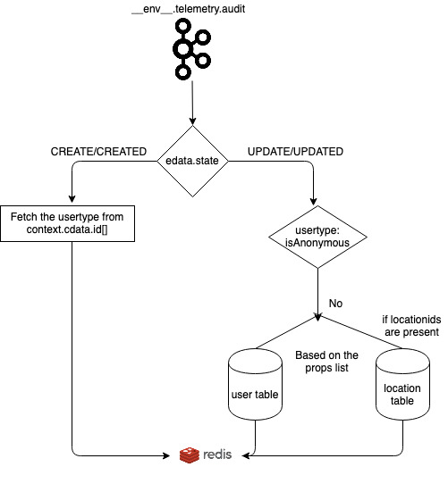
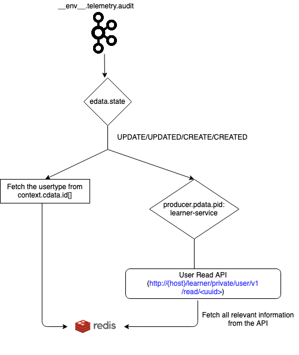

The three exhaust reports depends on the user-metadata information which are generated from user-cache-updater flink job by fetching informations from different core cassandra tables and are stored into the redis cache. From Release-3.7.0 the design for the flink job has been changed and now the information will be fetched from the User Read API. 

JIRA Link: [https://project-sunbird.atlassian.net/browse/SB-21691](https://project-sunbird.atlassian.net/browse/SB-21691)

Reference Wiki Links:


1. User Table Changes: [[SC-2184 : Data model changes to user schema to store location, persona, subpersona in generic way|SC-2184---Data-model-changes-to-user-schema-to-store-location,-persona,-subpersona-in-generic-way]]


1. Org Table Changes: [[SC-2190 : Data model changes to organisation schema to store schools as organisations|SC-2190---Data-model-changes-to-organisation-schema-to-store-schools-as-organisations]]


Current Design Implementation: 

 **Proposed Designed:** 



User Read API Requestcurl --location --request GET 'http://{Private LB}/learner/private/user/v1/read/:uuid?fields=locations'

User Read API Response
```
{
  "id": ".private.user.v1.read.123456",
  "ver": "private",
  "ts": "2021-03-09 11:33:42:061+0530",
  "params": {
    "resmsgid": null,
    "msgid": "06ff91d6-043e-4714-b002-6f8b90a04723",
    "err": null,
    "status": "success",
    "errmsg": null
  },
  "responseCode": "OK",
  "result": {
    "response": {
      "webPages": [],
      "maskedPhone": null,
      "subject": [],
      "channel": "root2",
      "language": [],
      "updatedDate": null,
      "password": null,
      "managedBy": null,
      "flagsValue": 2,
      "id": "a962a4ff-b5b5-46ad-a9fa-f54edf1bcccb",
      "recoveryEmail": "",
      "identifier": "a962a4ff-b5b5-46ad-a9fa-f54edf1bcccb",
      "thumbnail": null,
      "updatedBy": null,
      "accesscode": null,
      "locationIds": [
        "8db3345c-1bfc-4276-aef1-7ea0f3183211",
        "d087424e-18cb-49b0-865c-98f265c73ed3",
        "13087424e-18cb-49b0-865c-98f265c73ed3",
        "43087424e-18cb-49b0-865c-98f265c73ed3"
      ],
      "externalIds": [
        {
          "idType": "root2",
          "provider": "root2",
          "id": "123456"
        }
      ],
      "registryId": null,
      "rootOrgId": "0127738024883077121",
      "prevUsedEmail": "",
      "firstName": "Creator",
      "tncAcceptedOn": null,
      "allTncAccepted": {},
      "phone": "",
      "dob": null,
      "grade": [],
      "currentLoginTime": null,
      "userType": null,
      "status": 1,
      "lastName": "test",
      "tncLatestVersion": "v1",
      "gender": null,
      "roles": [
        "PUBLIC"
      ],
      "prevUsedPhone": "",
      "stateValidated": false,
      "isDeleted": false,
      "organisations": [
        {
          "organisationId": "0127738024883077121",
          "updatedBy": null,
          "addedByName": null,
          "addedBy": null,
          "roles": [
            "PUBLIC"
          ],
          "approvedBy": null,
          "updatedDate": null,
          "userId": "a962a4ff-b5b5-46ad-a9fa-f54edf1bcccb",
          "approvaldate": null,
          "isDeleted": false,
          "hashTagId": "0127738024883077121",
          "isRejected": null,
          "id": "0132322953313320960",
          "position": null,
          "isApproved": null,
          "orgjoindate": "2021-03-09 11:31:31:930+0530",
          "orgLeftDate": null
        }
      ],
      "profileUserType": {
        "usertype": "administrator",
        "usersubtype": "deo"
      },
      "userLocations": [
        {
          "code": "21",
          "name": "Odisha",
          "id": "8db3345c-1bfc-4276-aef1-7ea0f3183211",
          "type": "state",
          "parentId": null
        },
        {
          "code": "2112",
          "name": "CUTTACK",
          "id": "d087424e-18cb-49b0-865c-98f265c73ed3",
          "type": "district",
          "parentId": "8db3345c-1bfc-4276-aef1-7ea0f3183211"
        },
        {
          "code": "211",
          "name": "BLOCK1",
          "id": "13087424e-18cb-49b0-865c-98f265c73ed3",
          "type": "block",
          "parentId": "8db3345c-1bfc-4276-aef1-7ea0f3183211"
        },
        {
          "code": "211",
          "name": "CLUSTER1",
          "id": "43087424e-18cb-49b0-865c-98f265c73ed3",
          "type": "cluster",
          "parentId": "8db3345c-1bfc-4276-aef1-7ea0f3183211"
        },
        {
          "name": "DPS, MATHURA",
          "id": "63087424e-18cb-49b0-865c-98f265c73ed3",
          "type": "school",
          "externalid": "3183211"
        }
      ],
      "countryCode": null,
      "tncLatestVersionUrl": "https://dev-sunbird-temp.azureedge.net/portal/terms-and-conditions-v1.html",
      "maskedEmail": "am******@yopmail.com",
      "tempPassword": null,
      "email": "am******@yopmail.com",
      "rootOrg": {
        "dateTime": null,
        "preferredLanguage": "English",
        "keys": {},
        "approvedBy": null,
        "channel": "root2",
        "description": "Root Org2",
        "updatedDate": null,
        "addressId": null,
        "orgType": null,
        "provider": null,
        "locationId": null,
        "orgCode": null,
        "theme": null,
        "id": "0127738024883077121",
        "communityId": null,
        "isApproved": null,
        "email": null,
        "slug": "root2",
        "isSSOEnabled": null,
        "thumbnail": null,
        "orgName": "Root Org2",
        "updatedBy": null,
        "locationIds": [],
        "externalId": null,
        "isRootOrg": true,
        "rootOrgId": "0127738024883077121",
        "approvedDate": null,
        "imgUrl": null,
        "homeUrl": null,
        "orgTypeId": null,
        "isDefault": null,
        "createdDate": "2019-05-31 16:41:29:485+0530",
        "createdBy": null,
        "parentOrgId": null,
        "hashTagId": "0127738024883077121",
        "noOfMembers": null,
        "status": 1
      },
      "phoneVerified": false,
      "profileSummary": null,
      "recoveryPhone": "",
      "avatar": null,
      "userName": "creatortest_72yz",
      "userId": "a962a4ff-b5b5-46ad-a9fa-f54edf1bcccb",
      "userSubType": null,
      "promptTnC": true,
      "emailVerified": true,
      "lastLoginTime": null,
      "createdDate": "2021-03-09 11:31:23:189+0530",
      "framework": {
        "board": [
          "IGOT-Health"
        ],
        "gradeLevel": [
          "Volunteers"
        ],
        "id": [
          "igot_health"
        ],
        "medium": [
          "English"
        ],
        "subject": [
          "IRCS"
        ]
      },
      "createdBy": null,
      "location": null,
      "tncAcceptedVersion": null
    }
  }
}
```


 **Design for the fields to be fetched:** 


|  |  **Field Name**  |  **Type**  |  **Logic to fetch**  |  **Description**  | 
|  --- |  --- |  --- |  --- |  --- | 
| 1 |  **User-ID**  | String | userId | It indicates user unique Identifier | 
| 2 |  **Mobile Number**  | String | encPhone | User phone number in an encrypted format | 
| 3 |  **Email ID**  | String | encEmail | User mail id in an encrypted format | 
| 4 | First Name | String | firstName | User first name | 
| 5 | Last Name | String | lastName | User Last Name | 
| 6 | Rootorgid | String | rootOrgId | User root org id (can be used to differentiate between custodian and state user) | 
| 7 | Board | String | framework.board | User’s board Assumption: It is single valued | 
| 8 | Medium | List\[String] | framework.medium | User medium | 
| 9 | Subject | List\[String] | framework.subject | User subjects | 
| 10 | Language | List\[String] | language | User Language | 
| 11 | Grade | List\[String] | framework.gradeLevel | User grades | 
| 12 | framework | String | framework.id | User’s framework id Assumption: It is single valued | 
| 13 |  **UserType**  | String | profileUserType.type | User Type | 
| 14 |  **UserSubType**  | String | profileUserType.subType | User’s Sub Type | 
| 15 |  **Orgname**  | String | rootOrg.orgName | User’s Org Name It is fetched from rootOrg Map. | 
| 16 |  **School Name**  | String | Fetch {name} where userLocation[\*].type = 'school' | User’s School Name. It is fetched from the userLocation Map | 
| 17 |  **School UDISE Code**  | String | Fetch {code} where userLocation[\*].type = 'school' | User’s School UDISE Code. It is fetched from the userLocation Map | 
| 18 |  **State Name**  | String | Fetch {name} where userLocation[\*].type = 'state' | User’s State Name. It is fetched from the userLocation Map | 
| 19 |  **District Name**  | String | Fetch {name} where userLocation[\*].type = 'district' | User’s District Name. It is fetched from the userLocation Map | 
| 20 |  **Block Name**  | String | Fetch {name} where userLocation[\*].type = 'block' | User’s Block Name. It is fetched from the userLocation Map | 
| 21 |  **Cluster Name**  | String | Fetch {name} where userLocation[\*].type = 'cluster' | User’s Cluster Name. It is fetched from the userLocation Map | 


Queries:


1. Should we fetch extra information eg webpage, createdBy, createdFor etc? Fetch only if required for denorm job


1. Should we fetch externalid from now or not? Fetch only if required for denorm job


1. Should we directly fetch username or have a logic of firstname+lastname? firstname+lastname should be the username for reports


*****

[[category.storage-team]] 
[[category.confluence]] 
