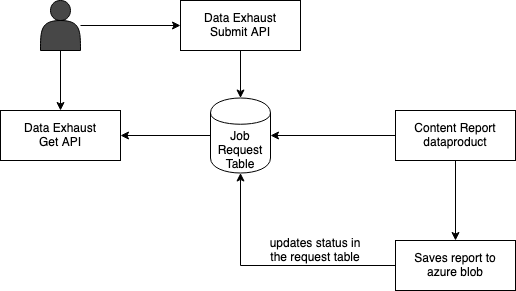

Jira ID:

[https://project-sunbird.atlassian.net/browse/SB-22512](https://project-sunbird.atlassian.net/browse/SB-22512)

 **Overview:** Currently there is no way for a contributor to view assets that are contributed by him/her across sourcing projects in a single place. Due to this, the contributor doesn't have visibility of how many assets contributed are used, how much they are used.

"My Contents" page provides the above details for a contributor (individual or organization).


* all the assets contributed by the contributor


* the status of the assets - whether they are published for consumption


* Usage details of the assets published for consumption


This level visibility will encourage contributors to contribute more and better assets.


 **Proposed Design:** Following are the two proposed approaches that can be used to implement the Content Report.


*  **Approach 1: Hawk-eye based report generation for all contributors** 


 **Frequency:**  Daily

The report can be set up in the hawk eye infra to query from the vdn-content-model-snapshot datasource.


 **Challenge** : 

 - Running the report everyday for all contributors will be time consuming and will put a load on druid servers since the data is large.


 **_Query:_** 

Druid Request


```
{
  "queryType": "groupBy",
  "dataSource": "vdn-content-model-snapshot",
  "dimensions": [
    "identifier",
    "name",
    "primaryCategory",
    "mimeType",
    "createdOn",
    "createdBy",
    "lastPublishedOn",
    "originData",
    "board",
    "medium",
    "gradeLevel",
    "subject"
  ],
  "aggregations": [
    {
      "type": "count",
      "name": "count"
    }
  ],
  "granularity": "all",
  "postAggregations": [],
  "intervals": "1901-01-01T00:00:00+00:00/2101-01-01T00:00:00+00:00",
  "filter": {
    "type": "selector",
    "dimension": "objectType",
    "value": "Content"
  },
  "limitSpec": {
    "type": "default",
    "limit": 10000,
    "columns": [
      {
        "dimension": "count",
        "direction": "descending"
      }
    ]
  }
}
```


*  **Approach 2: Generating report on demand only for requested contributors** 

    

    A custom data product can be implemented which generates reports only for the contributors who have requested by submitting to the existing data exhaust API.

    

    




The final csv will have the following columns:


|  **Content ID**  |  **Content Name**  |  **Content Category**  |  **Content Mimetype**  |  **Created On**  |  **Created By**  |  **Last Published Date**  |  **Publisher Organization**  |  **Board**  |  **Medium**  |  **Class**  |  **Subject**  | 
|  --- |  --- |  --- |  --- |  --- |  --- |  --- |  --- |  --- |  --- |  --- |  --- | 
| do_11298544706693529615 | Verbs | Practice Question Set | application/vnd.ekstep.ecml-archive | 2020-03-25T11:59:41.416+0000 | f9958550-442c-4927-aaa2-c354c942cea6 | 2021-02-27T11:59:41.416+0000 | 012983850117177344161 | NCERT | English | Grade 1 | English | 
| do_11298544706693529615 | Multiplication | Practice Question Set | application/vnd.ekstep.ecml-archive | 2020-03-25T11:59:41.416+0000 | f9958550-442c-4927-aaa2-c354c942cea6 | 2021-03-14T11:59:41.416+0000 | 012983850117177344161 | NCERT | English | Grade 2 | Maths | 

 **Conclusion:**  **<TODO>** 


*****

[[category.storage-team]] 
[[category.confluence]] 
