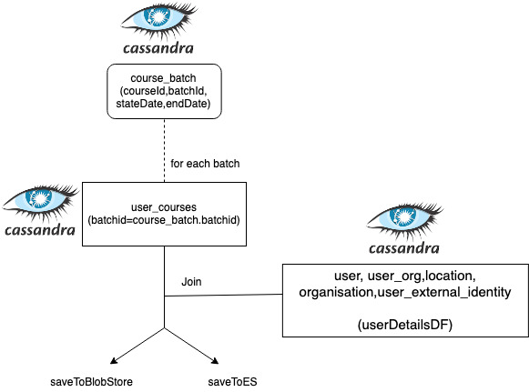

### We currently are generating the course progress report for each course. There is an ask to enhance the reports for few fields.
JIRA Link: [https://project-sunbird.atlassian.net/browse/SH-13](https://project-sunbird.atlassian.net/browse/SH-13)

 **Table information:** These are the defined tables from where we are fetching the user specific information.

User TableCREATE TABLE sunbird.user (

id text PRIMARY KEY,

accesscode text,

avatar text,

channel text,

countrycode text,

createdby text,

createddate text,

currentlogintime text,

dob text,

email text,

emailverified boolean,

firstname text,

flagsvalue int,

framework map<text, frozen<list<text>>>,

gender text,

grade list<text>,

isdeleted boolean,

language list<text>,

lastlogintime text,

lastname text,

location text,

locationids list<text>,

loginid text,

managedby text,

maskedemail text,

maskedphone text,

password text,

phone text,

phoneverified boolean,

prevusedemail text,

prevusedphone text,

profilesummary text,

profilevisibility map<text, text>,

provider text,

recoveryemail text,

recoveryphone text,

registryid text,

roles list<text>,

rootorgid text,

status int,

subject list<text>,

tcstatus text,

tcupdateddate text,

temppassword text,

thumbnail text,

tncacceptedon timestamp,

tncacceptedversion text,

updatedby text,

updateddate text,

userid text,

username text,

usertype text,

webpages list<frozen<map<text, text>>>

)

Organisation TableCREATE TABLE sunbird.organisation (

id text PRIMARY KEY,

addressid text,

approvedby text,

approveddate text,

channel text,

communityid text,

contactdetail text,

createdby text,

createddate text,

datetime timestamp,

description text,

email text,

externalid text,

hashtagid text,

homeurl text,

imgurl text,

isapproved boolean,

isdefault boolean,

isrootorg boolean,

isssoenabled boolean,

keys map<text, frozen<list<text>>>,

locationid text,

locationids list<text>,

noofmembers int,

orgcode text,

orgname text,

orgtype text,

orgtypeid text,

parentorgid text,

preferredlanguage text,

provider text,

rootorgid text,

slug text,

status int,

theme text,

thumbnail text,

updatedby text,

updateddate text

)

user_external_identity tableCREATE TABLE sunbird.user_external_identity (

id text PRIMARY KEY,

createdby text,

createdon timestamp,

externalid text,

externalidvalue text,

idtype text,

lastupdatedby text,

lastupdatedon timestamp,

provider text,

userid text

)

Location tableCREATE TABLE sunbird.location (

id text PRIMARY KEY,

code text,

name text,

parentid text,

type text

)

User_org tableCREATE TABLE sunbird.user_org (

id text PRIMARY KEY,

addedby text,

addedbyname text,

approvaldate text,

approvedby text,

hashtagid text,

isapproved boolean,

isdeleted boolean,

isrejected boolean,

organisationid text,

orgjoindate text,

orgleftdate text,

position text,

roles list<text>,

updatedby text,

updateddate text,

userid text

)

Current Report Being Generated:

|  **External ID**  |  **User ID**  |  **User Name**  |  **Email ID**  |  **Mobile Number**  |  **Organisation Name**  |  **District Name**  |  **School Name**  |  **Block Name**  |  **Enrolment Date**  |  **Course Progress**  |  **Completion Date**  |  **Certificate Status**  | 
|  | 9179a161-8f32-4120-81f9-78dbb3898675 | Kamesh Sharma | [ka\*\*\*\*\*\*\*\*\*\*\*\*\*\*@gmail.com](mailto:ka**************@gmail.com) |  | DIKSHA Custodian Org | Uttarkashi | DIKSHA Custodian Org |  | 2020-02-13 11:29:18:641+0000 | 100% | 2020-02-13T11:29:50.240Z |  | 
|  **1105563**  | a1f80c01-0e96-49ef-a2e2-3108c9b4b389 | B.DWARAKANATH | [dk\*\*\*\*\*\*\*\*\*\*\*\*\*\*\*\*@gmail.com](mailto:dk****************@gmail.com) | <ul><li>\*\*\*\*4725

</li></ul> | APEKX | Chittoor | ZPHS CHITHAPARA | GUDIPALA | 2020-02-05 11:27:25:411+0000 | 100% | 2020-02-05T11:28:29.655Z |  | 

New Report to be generated: (Assumption: The course was created by AP)

|  **External ID**  |  **User ID**  |  **User Name**  |  **Email ID**  |  **Mobile Number**  |  **Organisation Name**  |  **State Name**  |  **District Name**  |  **School UDISE Code**  |  **School Name**  |  **Block Name**  |  **Enrolment Date**  |  **Course Progress**  |  **Completion Date**  |  **Certificate Status**  | 
|  | 9179a161-8f32-4120-81f9-78dbb3898675 | Kamesh Sharma | [ka\*\*\*\*\*\*\*\*\*\*\*\*\*\*@gmail.com](mailto:ka**************@gmail.com) |  | DIKSHA Custodian Org | UK | Uttarkashi |  |  |  | 2020-02-13 11:29:18:641+0000 | 100% | 2020-02-13T11:29:50.240Z |  | 
|  **1105563**  | a1f80c01-0e96-49ef-a2e2-3108c9b4b389 | B.DWARAKANATH | [dk\*\*\*\*\*\*\*\*\*\*\*\*\*\*\*\*@gmail.com](mailto:dk****************@gmail.com) | <ul><li>\*\*\*\*\*4725

</li></ul> | APEKX | AP | Chittoor | 1324353 | ZPHS CHITHAPARA | GUDIPALA | 2020-02-05 11:27:25:411+0000 | 100% | 2020-02-05T11:28:29.655Z |  | 
|  **234632**  | 5112c380-7bef-4c76-8329-13d4f0ac0fe3 | kundan kumar | [ku\*\*\*\*\*\*\*\*\*\*\*\*\*\*@gmail.com](mailto:ku**************@gmail.com) |  | DIKSHA Custodian Org | AP | Latehar | 12343 | DIKSHA Custodian Org |  | 2020-02-11 16:11:07:146+0000 | 100% | 2020-02-11T16:12:10.581Z |  | 

### New Requirements:
There are few requirements to add new fields with the current fields being generated in the reports. All the above current fields remains the same. I have mentioned the new fields to be added with the defined table name and the column name to be fetched from:

1. External ID: We will create two dataframes from (i) and (ii) and union them after fetching the specific information

    1. If the user is a  **self signed up user in the custodian org**  then the user’s self declared Teacher ID will be the value to the field.

    1.  Filter the USR_EXTERNAL_ID.idtype='declared-ext-id'

    1. Join with ORG table with condition USR_EXTERNAL_ID.provider=ORG.channel and fetch USR_EXTERNAL_ID.userid , USR_EXTERNAL_ID.externalID

    
    1. If the user is a  **state user**  then the state provided External ID will be the value to the field.

    1. Join USER and USR_EXTERNAL_ID table with USR_EXTERNAL_ID.idType =USER.channel and USR_EXTERNAL_ID.provider=USER.channel and fetch USR_EXTERNAL_ID.userid , USR_EXTERNAL_ID.externalID

    

    

2. State Value: (to be added before district column)

1.  If the user is  **Self Signed Up (custodian) user**  then user’s self declared state will be the value to the field

    1. USER.locationids=LOCATION.id and LOCATION.type='state' and fetch the name as LOCATION.state_name ,USER.userid

    
1.   If the user is  **state user**  then state value passed by the state system or derived from the teacher’s school ID will be the value to the field

    1. Join ORGANISATION and location table having condition: 

    ORG.locationids=Location.id && Location.type='state' and fetch the Location.name, ORG.id

    1. Join the Dataframe given in (i) and user table with condition:

    ORG.id = USER.rootorgid && ORG.isrootorg=true and get the USER.userid, Location.name

    

    
1. School UDISE Code: (to be added before the school name column)

    1.  If the user is  **Self Signed Up (custodian) user**  then user’s self declared School Udise code will be the value to the field.

    1. USR_EXTERNAL_ID.externalID as School-UDISE Code and userid

     where USR_EXTERNAL_ID.provider = USER.channel and USR_EXTERNAL_ID.idType = 'declared-school-udise-code'

    1. Currently in the report the school name is being generated only for the state users:

    From the point (i) take the school-udise-code and map it to ORG.orgcode and fetch the ORG.name as school_name

    
    1. If the user is  **state user**  then state provided School Udise code will be the value to the field.

    1. Join on USER.userId = USER_ORG.userId and then on get USER_ORG.orgId and then join with ORGANISATION.id where isRootOrg = false and fetch the ORGANISATION.orgcode and ORG.orgname as school_name

    

    

The current implementation of the Course Job consists all the above required tables from where the value of the new fields requires to be fetched. The new enhancements will require to fetch the new column names with the mentioned filters with each field on the basis whether the user is the self signed up user or a state user. 

4. There is an additional requirement that the following fields need to be populated only when the user’s self declared state matches with the course creator’s tenant If not leave them blank. The fields are:

* ExternalID

* School UDISE Code

* Block Name

* School Name

We already get the user’s self declared state as state_name (point: 2.1) and from the course_batch table we will get the coursecreator information. If both are equal we will show the above mentioned four fields otherwisw we will leave them blank.

 **Current Implementation:** 

 **Configuration:** 

Course Job Configuration {

    "search": {

          "type": "none"

     },

    "model": "org.sunbird.analytics.job.report.CourseMetricsJob",

    "modelParams": {

         "druidConfig": {

             "queryType": "groupBy",

             "dataSource": "content-model-snapshot",

            "intervals": "LastDay",

           "aggregations": \[

              {

                  "name": "total_count",

                  "type": "count",

                 "fieldName": ""

              }

           ],

         "dimensions": \[

         {

             "fieldName": "identifier",

            "aliasName": "identifier"

         },

         {

           "fieldName": "channel",

          "aliasName": "channel"

         }

       ],

      "filters": \[

       {

          "type": "equals",

         "dimension": "contentType",

         "value": "Course"

      }

     ],

    "descending": "false"

  },

"fromDate": "$(date --date yesterday '+%Y-%m-%d')",

"toDate": "$(date --date yesterday '+%Y-%m-%d')",

"sparkCassandraConnectionHost": "'$sunbirdPlatformCassandraHost'",

"sparkElasticsearchConnectionHost": "'$sunbirdPlatformElasticsearchHost'"

},

"output": \[

{

"to": "console",

"params": {

"printEvent": false

}

}

],

"parallelization": 8,

"appName": "Course Dashboard Metrics",

"deviceMapping": false

}

*****

[[category.storage-team]] 
[[category.confluence]] 
