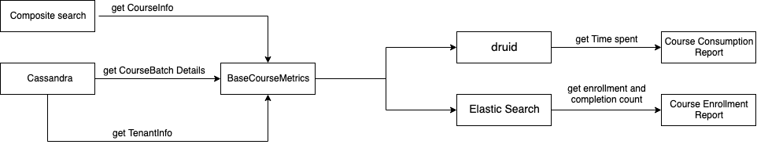

 **Introduction:** The TPD reports are used to monitor the teacher program courses going on in various regions which includes course enrollment and course consumption reports for tenants. The course enrollments lists the Course name, Batch name, Batch status, Enrollments and Completions. The course consumption lists Course name, Batch name, Batch status and the total Time Spent (in mins).

JIRA LINK: [SB-16574 System JIRA](https:///browse/SB-16574)


 **Current Implementation:** The current reports are generated based on the scripts which pull data from druid, org search API as well as elastic search.

 **Frequency:** Daily.  **Reports:** 


* Course Enrollment:

         - Get Live Courses: List of all live courses (source - druid).

         - Get Course Batch: (source - elastic search).

         - Join.

         - Get Tenant Information: List of all channel id (source - org search API).

         - GroupBy channel.

     **Output csv:** 


|  **Course Name**  | Batch Name | Batch Status | Enrollment Count | Completion Count | 
|  --- |  --- |  --- |  --- |  --- | 
|  **Primary Teachers: NAS and SLAS results Dissemination**  | Batch 2 | Expired | 0 | 0 | 
|  **Primary Teachers: NAS and SLAS results Dissemination**  | Batch 1 | Expired | 5364 | 584 | 
|  **computer**  | EndDateTest | Expired | 1 | 0 | 
|  **High School Non-Language Teachers: NAS and SLAS results Dissemination**  | Batch 2 | Expired | 97 | 8 | 
|  **Andhra Pradesh: Dissemination of NAS and SLAS Results**  | Test batch | Ongoing | 1 | 0 | 


* Course Consumption:

         - Get Play Time for courses (druid - summary-events).

         - Get Course Batch: (source - elastic search).

         - Join.

         - Get Tenant Information.

         - Get Live Courses.

     **Output csv:** 


|  **Date**  |  **Course Name**  |  **Batch Name**  |  **Batch Status**  |  **Total Timespent (in mins)**  | 
|  --- |  --- |  --- |  --- |  --- | 
|  **2019-10-22**  | Primary Teachers: NAS and SLAS results Dissemination | Batch 1 | Expired | 39.8 | 
|  **2019-10-21**  | Primary Teachers: NAS and SLAS results Dissemination | Batch 1 |  | 14.14 | 
|  **2019-10-21**  | High School Non-Language Teachers: NAS and SLAS results Dissemination | Batch 1 | Expired | 1.59 | 
|  **2019-10-19**  | Primary Teachers: NAS and SLAS results Dissemination | Batch 1 | Expired | 34.87 | 


 **Proposed Design:** A new data product for producing the tpd reports can be implemented. There will be a BaseCourseMetrics which will contain data for course information, course batch and tenant information. The BaseCourseMetrics will be common for both the TPD reports. The output for BaseCourseMetrics will list fields such as Course Name, Batch Name, Batch Status, slug value, courseId and batchId.


*  **Course Enrollment:** 

    The course enrollment job will take the courseId and batchId from the BaseCourseMetrics along with other metrics to query elastic search and get result for enrollment and completion count and generate the output csv grouping by slug.
*  **Course Consumption:** 

    The course consumption job will take the metrics from BaseCourseMetrics and query druid to get the total Timespent per course(in mins) and generate output csv grouping by slug.





 **Queries:** 


```
{
 "request": {
        "filters":{
            "objectType": ["Content"],
            "contentType": ["Course"],
            "identifiers": [],
            "status": ["Live"]
        },
        "limit": 10000
    }
}
```


```
{
	"metric": "totalCoursePlays",
	"label": "Total Course Plays (in mins)",
	"druidQuery": {
		"queryType": "groupBy",
		"dataSource": "summary-events",
		"intervals": "2019-09-08/2019-09-09",
		"aggregations": [{
			"name": "sum__edata_time_spent",
			"type": "doubleSum",
			"fieldName": "edata_time_spent"
		}],
		"dimensions": [{
				"fieldName": "object_rollup_l1",
				"aliasName": "courseId"
			},
			{
				"fieldName": "uid",
				"aliasName": "userId"
			},
			{
				"fieldName": "context_cdata_id",
				"aliasName": "batchId"
			}
		],
		"filters": [{
				"type": "equals",
				"dimension": "eid",
				"value": "ME_WORKFLOW_SUMMARY"
			},
			{
				"type": "in",
				"dimension": "dimensions_pdata_id",
				"values": [
					"dev.sunbird.app",
					"dev.sunbird.portal"
				]
			},
			{
				"type": "equals",
				"dimension": "dimensions_type",
				"value": "content"
			},
			{
				"type": "equals",
				"dimension": "dimensions_mode",
				"value": "play"
			},
			{
				"type": "equals",
				"dimension": "context_cdata_type",
				"value": "batch"
			}
		],
		"postAggregation": [{
			"type": "arithmetic",
			"name": "timespent",
			"fields": {
				"leftField": "sum__edata_time_spent",
				"rightField": 60,
				"rightFieldType": "constant"
			},
			"fn": "/"
		}],
		"descending": "false"
	}
}
```


```
{
  "query": {
    "bool": {
      "filter": [
        {
          "terms": {
            "id.raw": ["0128448115803914244","05ffe180caa164f56ac193964c5816d4"]
          }
        }
      ]
    }
  }
}
```


*****

[[category.storage-team]] 
[[category.confluence]] 
