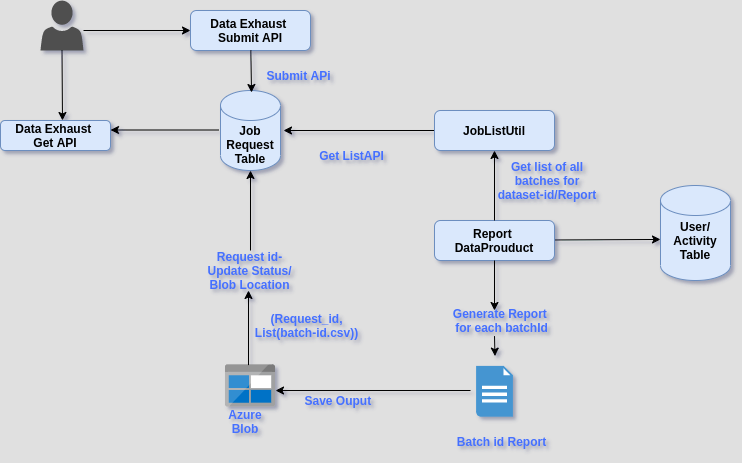

# Purpose:

* Currently report jobs - course and assessment reports runs everyday for all batches by consuming lot of time and resources


* This wiki details on  end to end flow of running report jobs on demand based on client request


## On Demand Data Exhuast APIS:

* Client should be able to request the report for particular batch or course by submitting the API


 **Submit API:**  POST:  / **job/request/submit** 

 **Request:** 
```json
{
    "id": "ekstep.analytics.job.request.submit",
    "ver": "1.0",
    "ts": "2016-12-07T12:40:40+05:30",
    "params": {
        "msgid": "4f04da60-1e24-4d31-aa7b-1daf91c46341" // unique request message id, UUID
    },
    "request": {
    "tag": String, // client key
    "jobId" :String, // either assessment-report or course-report 
    "jobConfig" {
        // config map
    }
}
```


Sample Request :Sample Request


```json
{
  "id": "ekstep.analytics.job.request.submit",
  "ver": "1.0",
  "ts": "2016-12-07T12:40:40+05:30",
  "params": {
    "msgid": "4f04da60-1e24-4d31-aa7b-1daf91c46341"
  },
  "request": {
    "tag": "client-1",
    "jobId": "assessment-score-report",
    "jobConfig": {
       "batchFilters": [
        "TPD",
        "NCFCOPY"
     ],
    "contentFilters": {
      "request": {
        "filters": {
          "identifier": [
            "do_11305960936384921612216",
            "do_1130934466492252161819"
          ],
          "prevState": "Draft"
        },
        "sort_by": {
          "createdOn": "desc"
        },
        "limit": 10000,
        "fields": [
          "framework",
          "identifier",
          "name",
          "channel",
          "prevState"
        ]
      }
    },
    "reportPath": "course-progress-v2/"
      },
      "output_format": "csv"
    }
  }
}
```
 **Get API:** 
* Get the  details for particual request-id


 **URL : GET : job/request/read/{tag}/{request-id}** tag:  unique key for a client **request-id : Unique Id in the submit request Response** 

Response:


```json
{
    "id": "ekstep.analytics.job.request.info",
    "ver": "1.0",
    "ts": "2016-12-07T12:43:23.890+00:00",
    "params": {
        "resmsgid": "4f04da60-1e24-4d31-aa7b-1daf91c46341",
        "status": "successful"
    },
    "responseCode": "OK",
    "result": JobStatusResponse
}
```
Sample Response:

/data/v3/job/request/read/dev-portal/6a54bfa283de43a89086e69e2efdc9eb6750493d
```
{
    "id": "ekstep.analytics.job.request.info",
    "ver": "1.0",
    "ts": "2016-12-07T12:43:23.890+00:00",
    "params": {
        "resmsgid": "4f04da60-1e24-4d31-aa7b-1daf91c46341",
        "status": "successful"
    },
    "responseCode": "OK",
    "result": {
        "request_id": "6a54bfa283de43a89086e69e2efdc9eb6750493d", // Request Id generated by Data out API
        "tag": "client-1",
        "status": "COMPLETED",
        "last_updated": 1479890492, // Date Time in epoch format
        "request": {
           "jobId": "assessment-score-report",
           "batchFilters": {
            "ids": [
            "019243943994839",
            "2329392039232"
            ],
            "channels": [
              "TPD",
              "NTPCOPY"
              ]
          },
          "output_format": "csv"
         }
        "job_stats": { // Job specific stats
            "dt_job_submitted": 1479886892
        },
        "downloadURLs": [
          "https://dev.blob.core.windows.net/reports/6a54bfa283de43a89086e69e2efdc9eb6750493d/reports-019243943994839.csv?sv=2017-04-17&se=2071-04-26T08%3A30%3A30Z&sr=b&sp=r&sig=61LYReUgK/v/vewwec/LhoV64r7SvHbYGnGzE9FiGbY%3D",
          "https://dev.blob.core.windows.net/reports/6a54bfa283de43a89086e69e2efdc9eb6750493d/reports-2329392039232.csv?sv=2017-04-17&se=2071-04-26T08%3A30%3A30Z&sr=b&sp=r&sig=61LYReUgK/v/vewwec/LhoV64r7SvHbYGnGzE9FiGbY%3D"
        ],
        "expiresAt": 1598632215685,
        "attempts": 0
    }
}
```


 **Get LIST API:** 
* Get the  details for particular tag


 **URL : GET : job/request/list/{tag}** tag:  unique key for a clientResponse:


```json
{
    "id": "ekstep.analytics.job.request.list",
    "ver": "1.0",
    "ts": "2016-12-07T12:43:23.890+00:00",
    "params": {
        "resmsgid": "4f04da60-1e24-4d31-aa7b-1daf91c46341",
        "status": "successful"
    },
    "responseCode": "OK",
    "result": {
        "count": Int,
        "jobs": Array[JobStatusResponse]
    }
}
```


## Report Data Products Flow: 

### Design DataProduct:

* All the reports job to run on-demand will be extending the  ReportOnDemandModel Template


### ReportOnDemandModel Template:

* Template would be having the below methods


### Job Request Table schema:

```
CREATE TABLE IF NOT EXISTS job_request (
    tag VARCHAR(50),
    request_id VARCHAR(50),
    job_id VARCHAR(50),
    status VARCHAR(50),
    request_data json,
    requested_by VARCHAR(50),
    requested_channel VARCHAR(50),
    download_urls text[],
    dt_file_created TIMESTAMP,
    dt_job_submitted TIMESTAMP,
    dt_job_completed TIMESTAMP,
    execution_time INTEGER,
    err_message VARCHAR(100),
    PRIMARY KEY (tag, request_id)
);
```


*****

[[category.storage-team]] 
[[category.confluence]] 
