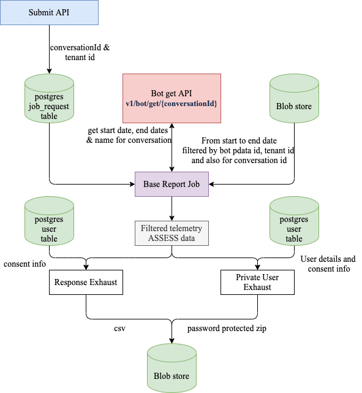

## Introduction:

* This wiki gives the details about On demand UCI data exhaust job implementation design.


* The client should be able to request the report for a particular conversation by submitting the API.


## On-demand Submit API details:

###  Submit API
 POST:   **/dataset/v1/request/submit** 

 **Request Parameters** 


* request headers


    * X-Channel-ID - channel id / org id for request


    * X-Authenticated-Userid - requested user id


    

 **Request:** 
```json
{
  "id": "ekstep.analytics.job.request.submit",
  "ver": "1.0",
  "ts": "2016-12-07T12:40:40+05:30",
  "params": {
    "msgid": "4f04da60-1e24-4d31-aa7b-1daf91c46341" // unique request message id, UUID
  },
  "request": {
    "tag": String, // Unique identifier to identify request submitted.Ex: BatchId
    "encryptionKey": String, // Encryption Key
    "requestedBy": String, // requester id for submitted request
    "dataset" :String, // either uci-response-exhaust or uci-private-exhaust 
    "datasetConfig" {
      // config map
      "conversationId": String
    }
  }
}
```
Sample Request :Sample Request


```json
{
  "id": "ekstep.analytics.job.request.submit",
  "ver": "1.0",
  "ts": "2016-12-07T12:40:40+05:30",
  "params": {
    "msgid": "4f04da60-1e24-4d31-aa7b-1daf91c46341"
  },
  "request": {
    "tag": "client-1",
    "encryptionKey": "xxxx",
    "requestedBy": "user-1",
    "dataset": "uci-response-exhaust",
    "datasetConfig": {
        "conversationId": "test-conversation"
    }
  }  
}
```

## UCI Data Products design:

### Response Exhaust

### Inputs

* Requests from postgres  **job_request**  table


* Conversation data from API for specific tenant -  **v1/bot/get/{conversationId}** 


*  **Raw Telemetry:**  - ASSESS Events filtered by UCI pdata:  **{env}.UCI.Diksha** 


*  **user**  postgres tables - consent details


### Outputs

* Generates CSV output file and update the details back to postgres  **job_request**  table


### Algorithm

* Based on user consent, provide question response data if consent is true else send empty value in output csv.


### Private Exhaust

### Inputs

* Requests from postgres  **job_request**  table


* Conversation data from API for specific tenant -  **v1/bot/get/{conversationId}** 


*  **Raw Telemetry:**  - ASSESS Events filtered by UCI pdata:  **{env}.UCI.Diksha** 


*  **user**  postgres tables - user mobile number and consent details


### Outputs

* Generates password protected zip file and update the details back to Postgres  **job_request**  table


### Algorithm

* Get user data (mobile number) from  **user**  Postgres table for actor ids from telemetry.


* Based on consent(user. data column), unmask the mobile number using decryption if consent is true else provide a masked phone number in the output file.


* Create password protected zip file using an encryption key from the job_request table (conversation id, conversation name, device id, and phone number)


###  **Queries** 

1. If consent is TRUE,  Do we need to decrypt on the device_id column to get the mobile number or not?


1. Are we storing the tenant name in the job_request channel column?


*****

[[category.storage-team]] 
[[category.confluence]] 
