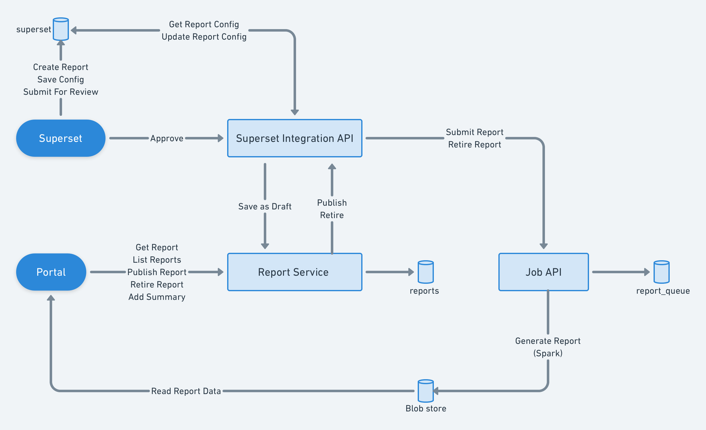

# Introduction
This wiki details the design of the self serviceable reporting framework by integrating the following components:


1. Superset 


1. Data Products Framework


1. Portal Dashboard Framework


 **Superset** - is used as an IDE or editor to create the reports in a visual way. Superset is enhanced with the following functionalities:


1. Add roles for creator and reviewer.


1. Create a report and add charts to it


1. Provide the report configuration required by the data products framework and portal dashboard framework. Save the config locally


1. Submit the report for review. 


1. As a reviewer approve the report. On approve the report is submitted to both the data products API and report service.


 **Data Products Framework**  is used to execute the jobs on the spark cluster and save the files in blob store.

 **Portal Dashboard Framework**  is used to display the reports and manage the lifecycle of reports post creation.


# Integration Workflow

# Report Service
Report service handles the lifecycle API of a report once it is published to portal. 


### DB Schema

```sql
create table report(
    reportid varchar(40) NOT NULL PRIMARY KEY, 
    title text NOT NULL, 
    description text NOT NULL, 
    authorizedroles jsonb NOT NULL,
    status varchar(8) NOT NULL CHECK (status IN ('live', 'draft', 'retired')) DEFAULT 'draft', 
    type varchar(8) NOT NULL CHECK (type in ('public', 'private')) DEFAULT 'private',
    reportaccessurl text NOT NULL UNIQUE, 
    createdon timestamptz NOT NULL DEFAULT now(), 
    updatedon timestamptz NOT NULL DEFAULT now(),
    createdby varchar(50) NOT NULL, 
    reportconfig jsonb NOT NULL, 
    templateurl text, 
    slug varchar(10) NOT NULL, 
    reportgenerateddate timestamptz NOT NULL DEFAULT now(),
    reportduration jsonb NOT NULL DEFAULT jsonb_build_object('startDate', now():: timestamptz, 'endDate', now()::timestamptz),
    tags jsonb NOT NULL,
    updatefrequency text NOT NULL
);
```

### API Specification
[https://app.swaggerhub.com/apis/hawkeye7/hawkeyeNew/1.0.0#/trial](https://app.swaggerhub.com/apis/hawkeye7/hawkeyeNew/1.0.0#/trial)


# Data Product Job APIs

### DB Schema


|  |  **Field**  |  **Type**  |  **Description**  | 
|  --- |  --- |  --- |  --- | 
| 1 | reportId | String | Unique id for report | 
| 2 | reportDescription | String | short description of the report | 
| 3 | createdBy | String | Name of the user who requested the report | 
| 4 | reportSchedule | String | Type of report (ONCE/DAILY/WEEKLY/MONTHLY) | 
| 5 | reportConfig | String | config of the report | 
| 6 | createdOn | Date | created date of the report | 
| 7 | updatedOn | Date | last updated date of the report | 
| 8 | submittedOn | Date | date of the report submitted for active | 
| 9 | status | String | status of the report(SUBMITTED/ACTIVE/INACTIVE/FAILED) | 
| 10 | status_msg | String | short description of the report status | 


### API Specification


Report Submit API note **POST /reports/job/submit** 

 **POST /reports/job/submit** 

 **Request** 


```json
{
  "request": {
    "reportId": String, // Unique id of the report
    "requestedBy": String, // ID of the user who requested the report
    "description": String,  // Short Description about the report
    "reportSchedule": String, // Type of report (ONCE/DAILY/WEEKLY/MONTHLY)
    "config": {  // Config of the report
        "id": String, // Unique id of the report
        "queryType": String, // Query type of the report - groupBy, topN
        "dateRange": {
          "staticInterval": String, // One of LastDay, LastMonth, Last7Days, Last30Days, LastWeek, YTD, AcademicYear
          "granularity": String // Granularity of the report - DAY, WEEK, MONTH, ALL
        },
        "metrics": [
          {
            "metric": String, // Unique metric ID
            "label": String, // Metric Label
            "druidQuery": DruidQuery // Actual druid query
          }
        ],
        "labels": { // Label mapping of dimensions and metrics
          "<key1>": String,
          "<key2>": String,
          ...
        },
        "output": [
          {
            "type": String, // Output type - csv, json
            "metrics": [String], // Metrics to be output. Defaults to *
            "dims": [String], // Dimensions to be used to split the data into smaller files
            "fileParameters": [String] // Dimensions to be used in the file name. Defaults to [report_id, date]
          }
        ]
      },
      "store" : String, // Output store location. One of local, azure, s3
      "container": String, // Output container.
      "key": String // File prefix if any
    }
  }
}
```
 **Response** 


```
{
  "params": {
    "status": "Success",
    "statusMsg": "Job submitted successfully"
  },
  "responseCode": "OK"
  "result": {}
}
```
 **Sample Request** 


```json
"request": {
  "reportId": "district_monthly",                  
  "requestedBy": "User1",              
  "description": "Unique Device district wise monthly",
  "reportSchedule" :"MONTHLY",
  "config": {
        "id": "district_monthly",
        "queryType": "groupBy",
        "dateRange": {
          "staticInterval": "LastMonth",
          "granularity": "all"
        },
        "metrics": [
          {
            "metric": "totalUniqueDevices",
            "label": "Total Unique Devices",
            "druidQuery": {
              "queryType": "groupBy",
              "dataSource": "telemetry-events",
              "intervals": "LastMonth",
              "aggregations": [
                {
                  "name": "total_unique_devices",
                  "type": "cardinality",
                  "fieldName": "context_did"
                }
              ],
              "dimensions": [
                {
                  "fieldName": "derived_loc_state",
                  "aliasName": "state"
                },
                {
                  "fieldName": "derived_loc_district",
                  "aliasName": "district"
                }
              ],
              "filters": [
                {
                  "type": "in",
                  "dimension": "context_pdata_id",
                  "values": [
                    "sunbirdddev.diksha.portal",
                    "sunbirddev.diksha.app"
                  ]
                },
                {
                  "type": "isnotnull",
                  "dimension": "derived_loc_state"
                },
                {
                  "type": "isnotnull",
                  "dimension": "derived_loc_district"
                }
              ],
              "descending": "false"
            }
          }
        ],
        "labels": {
          "state": "State",
          "district": "District",
          "total_unique_devices": "Number of Unique Devices"
        },
        "output": [
          {
            "type": "csv",
            "metrics": [
              "total_unique_devices"
            ],
            "dims": [
              "state"
            ],
            "fileParameters": [
              "id",
              "dims"
            ]
          }
        ]
      },
      "store" : "__store__"
      "container": "__container__",
      "key": "/etb"
    }
}
```
Update Report APInote
### POST  /reports/job/update

### POST  /reports/job/update
 **Request** 


```json
{
  "request": {
    "reportId": String, // Unique id of the report
    "requestedBy": String, // ID of the user who requested the report
    "description": String,  // Short Description about the report
    "reportSchedule": String,  // Type of report (ONCE/DAILY/WEEKLY/MONTHLY)
    "config": {  // Config of the report
        "id": String, // Unique id of the report
        "queryType": String, // Query type of the report - groupBy, topN
        "dateRange": {
          "staticInterval": String, // One of LastDay, LastMonth, Last7Days, Last30Days, LastWeek, YTD, AcademicYear
          "granularity": String // Granularity of the report - DAY, WEEK, MONTH, ALL
        },
        "metrics": [{ // Metrics to be fetched
          "metric": String, // Unique metric ID
          "label": String, // Metric Label
          "druidQuery": DruidQuery // Actual druid query
        }],
        "labels": { // Label mapping of dimensions and metrics
          "<key1>": String,
          "<key2>": String,
          ...
        },
        "output": [{ // Output configuration
            "type": String, // Output type - csv, json
            "metrics": [String], // Metrics to be output. Defaults to *
            "dims": [String], // Dimensions to be used to split the data into smaller files
            "fileParameters": [String] // Dimensions to be used in the file name. Defaults to [report_id, date]
        }],
        "store" : String, // Output store location. One of local, azure, s3
        "container": String, // Output container.
        "key": String // File prefix if any
    },
  }
}
```
 **Response** 


```json
{
  "params": {
    "status": "Success",
    "statusMsg": "Job Updated successfully"
  },
  "responseCode": "OK"
  "result": {}
}
```
 **Sample Request** 


```json
"request": {
  "reportId": "district_monthly",                  // Unique id of the report
  "requestedBy": "User1",              // Name of the user who requested the report
  "description": "UniqueDevice district wise monthly",  // Short Description about the report
  "reportSchedule" : "Monthly"  // Type of report (ONCE/DAILY/WEEKLY/MONTHLY)
  "config": {              // Config of the report
        "id": "district_monthly",
        "queryType": "groupBy",
        "dateRange": {
          "staticInterval": "LastMonth",
          "granularity": "all"
        },
        "metrics": [
          {
            "metric": "totalUniqueDevices",
            "label": "Total Unique Devices",
            "druidQuery": {
              "queryType": "groupBy",
              "dataSource": "telemetry-events",
              "intervals": "LastMonth",
              "aggregations": [
                {
                  "name": "total_unique_devices",
                  "type": "cardinality",
                  "fieldName": "context_did"
                }
              ],
              "dimensions": [
                {
                  "fieldName": "derived_loc_state",
                  "aliasName": "state"
                },
                {
                  "fieldName": "derived_loc_district",
                  "aliasName": "district"
                }
              ],
              "filters": [
                {
                  "type": "in",
                  "dimension": "context_pdata_id",
                  "values": [
                    "sunbirdddev.diksha.portal",
                    "sunbirddev.diksha.app"
                  ]
                },
                {
                  "type": "isnotnull",
                  "dimension": "derived_loc_state"
                },
                {
                  "type": "isnotnull",
                  "dimension": "derived_loc_district"
                }
              ],
              "descending": "false"
            }
          }
        ],
        "labels": {
          "state": "State",
          "district": "District",
          "total_unique_devices": "Number of Unique Devices"
        },
        "output": [
          {
            "type": "csv",
            "metrics": [
              "total_unique_devices"
            ],
            "dims": [
              "state"
            ],
            "fileParameters": [
              "id",
              "dims"
            ]
          }
        ]
      },
      "store": "__store__",
      "container" : "__container__"
      "key": "druid-reports/"
    }
}
```


Deactivate Report APInote
### GET   /reports/job/deactivate/:id

### GET   /reports/job/deactivate/:id
 **Response** 


```json
{
  "params": {
    "status": "successful",
  },
  "responseCode": "OK",
  "result": {}
}
```
 **Sample Request** 


```
 /reports/job/deactivate/district_montly
```
 **Sample Response** 


```json
{
  "id": "ekstep.analytics.report.delete",
  "ver": "1.0",
  "ts": "2020-04-17T04:24:48.194+00:00",
  "params": {
    "resmsgid": "07de0834-6ff5-4055-857a-e9f53b084dcd",
    "status": "successful"
  },
  "responseCode": "OK",
  "result": {
    "result": "Successfully DeActivated the Report"
  }
}
```
Get Report APInote
### GET  /reports/job/:id

### GET  /reports/job/:id
 **Response** 


```json
{
  "params": {
    "status": "successful"
  },
  "responseCode": "OK",
  "result": Report
}
```
 **Sample Request** 


```
/reports/job/district_weekly
```
 **Sample Response** 


```
{
    "id": "ekstep.analytics.report.get",
    "ver": "1.0",
    "ts": "2020-04-17T04:29:38.573+00:00",
    "params": {
        "status": "successful
    },
    "responseCode": "OK",
    "result": {
        "createdOn": 1587037835014,
        "updatedOn": 1587037835014,
        "reportId": "district_weekly",
        "config": {
            "reportConfig": {
                "id": "district_weekly",
                "mergeConfig": {
                    "rollupRange": 1,
                    "rollupAge": "ACADEMIC_YEAR",
                    "basePath": "/mount/data/analytics/tmp/",
                    "reportPath": "district_weekly.csv",
                    "rollupCol": "Date",
                    "frequency": "WEEK",
                    "rollup": 1
                },
                "labels": {
                    "total_scans_on_app": "Total QR Scans on App",
                    "state": "State",
                    "total_unique_devices": "Total Unique Devices",
                    "total_content_plays_on_app": "Total Content Plays on App",
                    "total_scans_on_portal": "Total QR Scans on Portal",
                    "total_unique_devices_on_portal": "Total Unique Devices on Portal",
                    "total_scans": "Total QR Scans",
                    "total_content_plays_on_portal": "Total Content Plays on Portal",
                    "total_unique_devices_on_app": "Total Unique Devices on App",
                    "district": "District",
                    "total_content_plays": "Total Content Plays"
                },
                "dateRange": {
                    "interval": {
                        "startDate": "2020-04-06",
                        "endDate": "2020-04-13"
                    },
                    "granularity": "all"
                },
                "metrics": [
                    {
                        "metric": "totalUniqueDevices",
                        "label": "Total Unique Devices",
                        "druidQuery": {
                            "intervals": "LastWeek",
                            "dataSource": "telemetry-events",
                            "descending": "false",
                            "filters": [
                                {
                                    "type": "in",
                                    "dimension": "context_pdata_id",
                                    "values": [
                                        "prod.diksha.portal",
                                        "prod.diksha.app"
                                    ]
                                },
                                {
                                    "type": "isnotnull",
                                    "dimension": "derived_loc_state"
                                },
                                {
                                    "type": "isnotnull",
                                    "dimension": "derived_loc_district"
                                }
                            ],
                            "dimensions": [
                                {
                                    "fieldName": "derived_loc_state",
                                    "aliasName": "state"
                                },
                                {
                                    "fieldName": "derived_loc_district",
                                    "aliasName": "district"
                                }
                            ],
                            "aggregations": [
                                {
                                    "name": "total_unique_devices",
                                    "type": "cardinality",
                                    "fieldName": "context_did"
                                }
                            ],
                            "queryType": "groupBy"
                        }
                    },
                    {
                        "metric": "totalUniqueDevicesOnPortal",
                        "label": "Total Unique Devices on Portal",
                        "druidQuery": {
                            "intervals": "LastWeek",
                            "dataSource": "telemetry-events",
                            "descending": "false",
                            "filters": [
                                {
                                    "type": "equals",
                                    "dimension": "context_pdata_id",
                                    "value": "prod.diksha.portal"
                                },
                                {
                                    "type": "isnotnull",
                                    "dimension": "derived_loc_state"
                                },
                                {
                                    "type": "isnotnull",
                                    "dimension": "derived_loc_district"
                                }
                            ],
                            "dimensions": [
                                {
                                    "fieldName": "derived_loc_state",
                                    "aliasName": "state"
                                },
                                {
                                    "fieldName": "derived_loc_district",
                                    "aliasName": "district"
                                }
                            ],
                            "aggregations": [
                                {
                                    "name": "total_unique_devices_on_portal",
                                    "type": "cardinality",
                                    "fieldName": "context_did"
                                }
                            ],
                            "queryType": "groupBy"
                        }
                    },
                    {
                        "metric": "totalUniqueDevicesOnApp",
                        "label": "Total Unique Devices on App",
                        "druidQuery": {
                            "intervals": "LastWeek",
                            "dataSource": "telemetry-events",
                            "descending": "false",
                            "filters": [
                                {
                                    "type": "equals",
                                    "dimension": "context_pdata_id",
                                    "value": "prod.diksha.app"
                                },
                                {
                                    "type": "isnotnull",
                                    "dimension": "derived_loc_state"
                                },
                                {
                                    "type": "isnotnull",
                                    "dimension": "derived_loc_district"
                                }
                            ],
                            "dimensions": [
                                {
                                    "fieldName": "derived_loc_state",
                                    "aliasName": "state"
                                },
                                {
                                    "fieldName": "derived_loc_district",
                                    "aliasName": "district"
                                }
                            ],
                            "aggregations": [
                                {
                                    "name": "total_unique_devices_on_app",
                                    "type": "cardinality",
                                    "fieldName": "context_did"
                                }
                            ],
                            "queryType": "groupBy"
                        }
                    },
                    {
                        "metric": "totalQRScans",
                        "label": "Total QR Scans",
                        "druidQuery": {
                            "intervals": "LastWeek",
                            "dataSource": "telemetry-events",
                            "descending": "false",
                            "filters": [
                                {
                                    "type": "in",
                                    "dimension": "context_pdata_id",
                                    "values": [
                                        "prod.diksha.portal",
                                        "prod.diksha.app"
                                    ]
                                },
                                {
                                    "type": "equals",
                                    "dimension": "eid",
                                    "value": "SEARCH"
                                },
                                {
                                    "type": "isnotnull",
                                    "dimension": "edata_filters_dialcodes"
                                },
                                {
                                    "type": "isnotnull",
                                    "dimension": "derived_loc_state"
                                },
                                {
                                    "type": "isnotnull",
                                    "dimension": "derived_loc_district"
                                }
                            ],
                            "dimensions": [
                                {
                                    "fieldName": "derived_loc_state",
                                    "aliasName": "state"
                                },
                                {
                                    "fieldName": "derived_loc_district",
                                    "aliasName": "district"
                                }
                            ],
                            "aggregations": [
                                {
                                    "name": "total_scans",
                                    "type": "count",
                                    "fieldName": ""
                                }
                            ],
                            "queryType": "groupBy"
                        }
                    },
                    {
                        "metric": "totalQRScansOnPortal",
                        "label": "Total QR Scans on Portal",
                        "druidQuery": {
                            "intervals": "LastWeek",
                            "dataSource": "telemetry-events",
                            "descending": "false",
                            "filters": [
                                {
                                    "type": "equals",
                                    "dimension": "context_pdata_id",
                                    "value": "prod.diksha.portal"
                                },
                                {
                                    "type": "equals",
                                    "dimension": "eid",
                                    "value": "SEARCH"
                                },
                                {
                                    "type": "isnotnull",
                                    "dimension": "edata_filters_dialcodes"
                                },
                                {
                                    "type": "isnotnull",
                                    "dimension": "derived_loc_state"
                                },
                                {
                                    "type": "isnotnull",
                                    "dimension": "derived_loc_district"
                                }
                            ],
                            "dimensions": [
                                {
                                    "fieldName": "derived_loc_state",
                                    "aliasName": "state"
                                },
                                {
                                    "fieldName": "derived_loc_district",
                                    "aliasName": "district"
                                }
                            ],
                            "aggregations": [
                                {
                                    "name": "total_scans_on_portal",
                                    "type": "count",
                                    "fieldName": ""
                                }
                            ],
                            "queryType": "groupBy"
                        }
                    },
                    {
                        "metric": "totalQRScansOnApp",
                        "label": "Total QR Scans on App",
                        "druidQuery": {
                            "intervals": "LastWeek",
                            "dataSource": "telemetry-events",
                            "descending": "false",
                            "filters": [
                                {
                                    "type": "equals",
                                    "dimension": "context_pdata_id",
                                    "value": "prod.diksha.app"
                                },
                                {
                                    "type": "equals",
                                    "dimension": "eid",
                                    "value": "SEARCH"
                                },
                                {
                                    "type": "isnotnull",
                                    "dimension": "edata_filters_dialcodes"
                                },
                                {
                                    "type": "isnotnull",
                                    "dimension": "derived_loc_state"
                                },
                                {
                                    "type": "isnotnull",
                                    "dimension": "derived_loc_district"
                                }
                            ],
                            "dimensions": [
                                {
                                    "fieldName": "derived_loc_state",
                                    "aliasName": "state"
                                },
                                {
                                    "fieldName": "derived_loc_district",
                                    "aliasName": "district"
                                }
                            ],
                            "aggregations": [
                                {
                                    "name": "total_scans_on_app",
                                    "type": "count",
                                    "fieldName": ""
                                }
                            ],
                            "queryType": "groupBy"
                        }
                    },
                    {
                        "metric": "totalContentPlays",
                        "label": "Total Content Plays",
                        "druidQuery": {
                            "intervals": "LastWeek",
                            "dataSource": "summary-events",
                            "descending": "false",
                            "filters": [
                                {
                                    "type": "in",
                                    "dimension": "dimensions_pdata_id",
                                    "values": [
                                        "prod.diksha.portal",
                                        "prod.diksha.app"
                                    ]
                                },
                                {
                                    "type": "equals",
                                    "dimension": "dimensions_type",
                                    "value": "content"
                                },
                                {
                                    "type": "equals",
                                    "dimension": "dimensions_mode",
                                    "value": "play"
                                },
                                {
                                    "type": "isnotnull",
                                    "dimension": "derived_loc_state"
                                },
                                {
                                    "type": "isnotnull",
                                    "dimension": "derived_loc_district"
                                }
                            ],
                            "dimensions": [
                                {
                                    "fieldName": "derived_loc_state",
                                    "aliasName": "state"
                                },
                                {
                                    "fieldName": "derived_loc_district",
                                    "aliasName": "district"
                                }
                            ],
                            "aggregations": [
                                {
                                    "name": "total_content_plays",
                                    "type": "count",
                                    "fieldName": ""
                                }
                            ],
                            "queryType": "groupBy"
                        }
                    },
                    {
                        "metric": "totalContentPlaysOnPortal",
                        "label": "Total Content Plays on Portal",
                        "druidQuery": {
                            "intervals": "LastWeek",
                            "dataSource": "summary-events",
                            "descending": "false",
                            "filters": [
                                {
                                    "type": "equals",
                                    "dimension": "dimensions_pdata_id",
                                    "value": "prod.diksha.portal"
                                },
                                {
                                    "type": "equals",
                                    "dimension": "dimensions_type",
                                    "value": "content"
                                },
                                {
                                    "type": "equals",
                                    "dimension": "dimensions_mode",
                                    "value": "play"
                                },
                                {
                                    "type": "isnotnull",
                                    "dimension": "derived_loc_state"
                                },
                                {
                                    "type": "isnotnull",
                                    "dimension": "derived_loc_district"
                                }
                            ],
                            "dimensions": [
                                {
                                    "fieldName": "derived_loc_state",
                                    "aliasName": "state"
                                },
                                {
                                    "fieldName": "derived_loc_district",
                                    "aliasName": "district"
                                }
                            ],
                            "aggregations": [
                                {
                                    "name": "total_content_plays_on_portal",
                                    "type": "count",
                                    "fieldName": ""
                                }
                            ],
                            "queryType": "groupBy"
                        }
                    },
                    {
                        "metric": "totalContentPlaysOnApp",
                        "label": "Total Content Plays on App",
                        "druidQuery": {
                            "intervals": "LastWeek",
                            "dataSource": "summary-events",
                            "descending": "false",
                            "filters": [
                                {
                                    "type": "equals",
                                    "dimension": "dimensions_pdata_id",
                                    "value": "prod.diksha.app"
                                },
                                {
                                    "type": "equals",
                                    "dimension": "dimensions_type",
                                    "value": "content"
                                },
                                {
                                    "type": "equals",
                                    "dimension": "dimensions_mode",
                                    "value": "play"
                                },
                                {
                                    "type": "isnotnull",
                                    "dimension": "derived_loc_state"
                                },
                                {
                                    "type": "isnotnull",
                                    "dimension": "derived_loc_district"
                                }
                            ],
                            "dimensions": [
                                {
                                    "fieldName": "derived_loc_state",
                                    "aliasName": "state"
                                },
                                {
                                    "fieldName": "derived_loc_district",
                                    "aliasName": "district"
                                }
                            ],
                            "aggregations": [
                                {
                                    "name": "total_content_plays_on_app",
                                    "type": "count",
                                    "fieldName": ""
                                }
                            ],
                            "queryType": "groupBy"
                        }
                    }
                ],
                "output": [
                    {
                        "type": "csv",
                        "metrics": [
                            "total_unique_devices",
                            "total_unique_devices_on_portal",
                            "total_unique_devices_on_app",
                            "total_scans",
                            "total_scans_on_portal",
                            "total_scans_on_app",
                            "total_content_plays",
                            "total_content_plays_on_portal",
                            "total_content_plays_on_app"
                        ],
                        "dims": [
                            "state"
                        ],
                        "fileParameters": [
                            "id",
                            "dims"
                        ]
                    }
                ],
                "queryType": "groupBy"
            },
            "store": "azure",
            "container": "dev-data-store",
            "key": "druid-reports/"
        },
        "requestedBy": "User2",
        "reportDescription": "Unique Device district wise weekly",
        "submittedOn": 1587037835014,
        "status": "ACTIVE",
        "status_msg": "REPORT SUCCESSFULLY ACTIVATED",
        "reportSchedule": "WEEKLY"
    }
}
```
List Reports APInote
### POST  /report/jobs

### POST  /report/jobs
 **Request** 


```json
{
  "request":{
    "filters":{
      "status":[String] // FILTER ON JOB STATUS(ACTIVE/INACTIVE/FAILED)
    }
  }
}
```
 **Response** 


```json
{
  "params": {
    "status": "successful"
  },
  "responseCode": "OK",
  "result": {
    "count": int ,
    "reports": []    // list of report configs
  }
}
```
 **Sample Request** 


```json
{
  "request":{
    "filters":{
      "status":["ACTIVE"]    // get all reports which are in active
    }
  }
}
```


*****

[[category.storage-team]] 
[[category.confluence]] 
