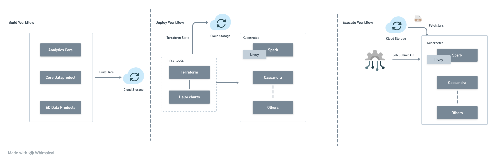

### Introduction
The objective of this document is to provide a comprehensive overview of the ease of installation process for Obsrv 2.0 batch jobs automation.


### Design
The design encompasses the execution of three distinct workflows: Build, Deploy, and Execute workflows.

Build WorkflowThe build workflow remains unchanged and will utilize the existing build system. All necessary JAR files will be uploaded to cloud storage. The system will initiate the building of specific components from the provided repository via a Jenkins job and subsequently upload all essential artefacts to the cloud storage platform.

Deploy WorkflowThroughout this procedure, the system will establish the necessary infrastructure components essential for batch job execution. This entails the creation of a Spark cluster, configuration of a Virtual Private Cloud (VPC), setup of subnets, establishment of network connections, and seamless integration of the Livy service within the Kubernetes cluster. Concurrently, it will ensure dependent systems provision as well.

Sunbird ED Artifacts


1. sunbird-analytics-framework-2.0.jar


1. sunbird-core-data-products-2.0.jar


1. sunbird-ed-data-products-2.0.jar


Object Store Path:  s3a://$bucket/artifacts/analytics-framework-2.0.jar

Resource Dependencies 


1. Apache Druid


1. Apache Cassandra  // Learn BB 


1. Redis


1. Postgresql


1. Object Store


1. Apache Kafka


1. Learn System APIs // Learn BB


Execution WorkflowIn this workflow, the system includes an [Apache Livy](https://livy.apache.org/) instance, a REST service specifically designed for [Apache Spark](https://spark.apache.org/), to enhance connectivity with Spark. Additionally, it offers a set of APIs that enable smooth communication with the Spark cluster.

These batch APIs, detailed below, enable users to submit jobs for execution within the Kubernetes Spark cluster. These APIs automatically retrieve the required JAR files from cloud storage and facilitate essential job-level configuration options during runtime.

Job Submit API
```powershell
curl --location 'localhost:8998/batches' --header 'Content-Type: application/json' --data '{
    "jars": [
        "s3a://obsrv-artifacts/analytics-framework-2.0.jar",
        "s3a://obsrv-artifacts/scruid_2.12-2.5.0.jar",
        "s3a://obsrv-artifacts/ed-dataproducts.jar"
    ],
    "file": "s3a://obsrv-spark-job-2/batch-models-2.0.jar",
    "className": "org.ekstep.analytics.job.JobExecutor",
    "proxyUser": "SYSTEM",
    "args": [
        "--model",
        "wfs",
        "--config",
        "{\"search\":{\"type\":\"s3\",\"queries\":[{\"folder\":\"true\", \"bucket\":\"sunbird-ed-telemetry\",\"prefix\":\"sunbird-staging-events/\",\"endDate\":\"2023-01-12\",\"delta\":0}]},\"model\":\"org.ekstep.analytics.model.WorkflowSummary\",\"modelParams\":{\"storageKeyConfig\":\"aws-storage-key\", \"storageSecretConfig\":\"aws-storage-secret\", \"apiVersion\":\"v2\", \"parallelization\":200},\"output\":[{\"to\":\"kafka\",\"params\":{\"brokerList\":\"kafka-headless.kafka.svc:9092\",\"topic\":\"workflow.summarizer\"} }],\"parallelization\":200,\"appName\":\"Workflow Summarizer\",\"deviceMapping\":true}"
    ],
    "executorCores": 5,
    "executorMemory": "5G",
    "numExecutors": 5,
    "conf": {
        "spark.driver.extraJavaOptions": "-Dconfig.file=//opt/bitnami/spark/conf/wfs.conf -Dlog4j.configuration=file:/opt/bitnami/spark/conf/log4j.properties",
        "spark.executor.extraJavaOptions": "-Dconfig.file=//opt/bitnami/spark/conf/wfs.conf -Dlog4j.configuration=file:/opt/bitnami/spark/conf/log4j.properties"
    }
}'
```


*****

[[category.storage-team]] 
[[category.confluence]] 
