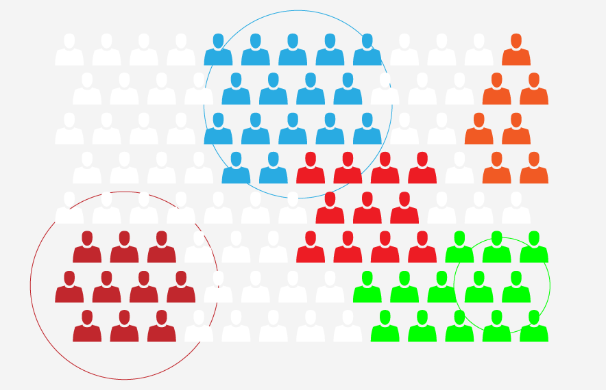

Overview :

Segmentation of a platform involves dividing users into separate groups based on similar trait.

Segmentation can be of following types:

a) Demographic (Mostly involves Gender , Age, Occupation etc) - Ignored coz it constitues PII

b) Geographic Segmentation - Districts, States

c) Technographic Segmentation - Mobile Devices, Software, OS, Technologies

d) Behavioral Segmentation - Consumption Habits, BMGS Preferences, Collections Enrolled.




### Existing System :
Existing System provides us the data to understand the segmentation. However, the system can be aided with actionable segments running a specific solution,ui, content or notification. This helps the core platform to enable/implement the features in more intelligent way. 


### Proposed System :
Intent is to have some server controlled configuration (called as  **Criteria Structure** ) to enable certain behavioural characteristics on the user’s device with appropriate Notification to user. 

There are two parts to Proposed System:

a)Criteria Structures : There are fundamentally three criteria structures defined:

                                             a) VERSION_COMMAND : Generally has specific version/list of versions targeted

                                             b) SEGMENT_COMMAND : Generally has segment of users targeted

                                             c) DEVICE_COMMAND   : Generally has device / list of devices targeted


b) Actions : Resultant Function to be executed on client. The Below Table explains different control functions we intend to define:


|  **Scenario**  |  **Action Type**  |  **ACTION_TYPE_ENUM**  |  **Execution Description**  | 
|  --- |  --- |  --- |  --- | 
| App Update | Command to  warn the users on app update if the current version is not the latest version |  **APP_UPDATE**  (Preferably used against version or deviceIds) | App Intimates the client on app update to be done and asks for consent. | 
| Clear Sync Data (Telemetry Data, Course Update Data) | Command to clear all the sync table entries. |  **SYNC_UPDATE**  (Preferably used against deviceIds) | Intent is to stop sync module to keep hitting servers with old requests | 
| Experimentation Track (A/B Test) | Command to take users to experimentation track on Mobile app |  **EXPERIMENT_TRACK**  (Preferably used against DEVICEIDS) | Intent is to leverage existing infrastructure to use Mobile App users to be part of A/B testing | 
| Local Notification Generation (Without Firebase) | Command to generate the local notification to the user |  **LOCAL_NOTIF**  (Used across all command functions) | Intent is to generate local notification to the user similar to 7 PM notification. | 
| Remote Enabling of Debuggability  (Telemetry Enabling to send only log level, Interact level, Impression level or any Custom Level Telemetry) | Switch the levels of Telemetry Logging Based on config passed from server |  **REMOTE_DEBUG**  (Used across all command functions) | Intent is to generate telemetry @ levels determined by server | 


Solution :


|  **Levels**  |  **Use cases**  |  **Illustration**  | 
|  --- |  --- |  --- | 
| 
###  App Version :  (NUKE)
 |  | VERSION_COMMAND | 
| “ **Command Control** “ can be enabled @ targeted app version. | a) FORCE UPGRADE all the users of particular app version using online(playstore) or offline(blob download) mechanism.b) Send a local notification to users of particular app version.c) A/B Test based on the version of the app  d) Enable Debuggability by selectively enabling log levels, Telemetry levels on a particular version | 
```json
{
  "commandId": "timeStampInLong",
  "expiresAfter": "timeStampInLong",
  "commandType": "VERSION_COMMAND",
  "targetVersion": ["2.10","3.0","3.1"],
  "targetDeviceIds": null,
  "tagFilters": null,
  "tagFilterUpto": null,
  "controlFunction": "APP_UPDATE"
}
```

```json
{
  "commandId": "timeStampInLong",
  "expiresAfter": "timeStampInLong",
  "commandType": "VERSION_COMMAND",
  "targetVersion": ["2.10","3.0","3.1"],
  "targetDeviceIds": null,
  "controlFunction": "LOCAL_NOTIF",
  "tagFilters": null,
  "tagFilterUpto": null,
  "controlFunctionPayload": {Notification Payload} 
}
```

```json
{
  "commandId": "timeStampInLong",
  "expiresAfter": "timeStampInLong",
  "commandType": "VERSION_COMMAND",
  "targetVersion": ["2.10","3.0","3.1"],
  "targetDeviceIds": null,
  "tagFilters": null,
  "tagFilterUpto": null,
  "controlFunction": "EXPERIMENT_TRACK",
  "controlFunctionPayload": {payload which has trackId} 
}
```

```json
{
  "commandId": "timeStampInLong",
  "expiresAfter": "timeStampInLong",
  "commandType": "VERSION_COMMAND",
  "targetVersion": ["2.10","3.0","3.1"],
  "targetDeviceIds": null,
  "tagFilters": null,
  "tagFilterUpto": null,
  "controlFunction": "DEBUGGABILITY",
  "controlFunctionPayload": {log or telemetry level payload} 
}
```
 | 
| “ **Command Control** “ once enabled targeted versions will execute the “ **Control Function”**  |  |  | 
| “ **Command Control** “ can be enabled @ segmented devices/ Group of devices by deviceId. | Enabling scenarios a) to e)  in above table by hand-coded deviceIds in response. | 
```json
{
  "commandId": "timeStampInLong",
  "expiresAfter": "timeStampInLong",
  "commandType": "DEVICE_COMMAND",
  "targetVersion": null,
  "targetDeviceIds": ["deviceId1"],
  "tagFilters": null,
  "tagFilterUpto": null,
  "controlFunction": "DEBUGGABILITY",
  "controlFunctionPayload": {log or telemetry level payload} 
}
```
 | 
| 
### Segmentation of Users  :
 |  | SEGMENT_COMMAND | 
| ” **Command Control** ” can be enabled @ framework category level. | Enabling scenarios a) to e)  in above table by creating multiple tags. Tags can effectively be handled as “AND“ function (or) “OR“ FUNCTION. Ex:  a) for “AND“ function all tags should be ''possessed by the user. b) for “OR“ function any tag can be possessed by the user. |  | 
| a) “Board“ : #CBSE | All CBSE users | 
```json
{
  "commandId": "timeStampInLong",
  "expiresAfter": "timeStampInLong",
  "commandType": "SEGMENT_COMMAND",
  "targetVersion": null,
  "targetDeviceIds": null,
  "tagFilters": ["UA_CBSE"],
  "tagCriteria": "AND",
  "tagFilterUpto": null,
  "controlFunction": "LOCAL_NOTIF",
  "controlFunctionPayload": {log or telemetry level payload} 
}
```
 | 
| b) “Board + Medium“ : #CBSE #ENGLISH | All CBSE English Medium Users | 
```json
{
  "commandId": "timeStampInLong",
  "expiresAfter": "timeStampInLong",
  "commandType": "SEGMENT_COMMAND",
  "targetVersion": null,
  "targetDeviceIds": null,
  "tagFilters": ["#UA_CBSE","UA_ENGLISH"],
  "tagCriteria": "AND",
  "tagFilterUpto": null,
  "controlFunction": "LOCAL_NOTIF",
  "controlFunctionPayload": {log or telemetry level payload} 
}
```
 | 
| c) “Board + Medium + Grade“: #CBSE #ENGLISH #CLASS7 | All CBSE English Medium Class 8 Users | 
```json
{
  "commandId": "timeStampInLong",
  "expiresAfter": "timeStampInLong",
  "commandType": "SEGMENT_COMMAND",
  "targetVersion": null,
  "targetDeviceIds": null,
  "tagFilters": ["#UA_CBSE","#UA_ENGLISH","#UA_CLASS8"],
  "tagCriteria": "AND",
  "tagFilterUpto": null,
  "controlFunction": "LOCAL_NOTIF",
  "controlFunctionPayload": {log or telemetry level payload} 
}
```
 | 
| d) “Board + Medium + Grade + Role“: #CBSE #ENGLISH #CLASS7 #TEACHER | All CBSE English Medium Class 8 Teachers | 
```json
{
  "commandId": "timeStampInLong",
  "expiresAfter": "timeStampInLong",
  "commandType": "SEGMENT_COMMAND",
  "targetVersion": null,
  "targetDeviceIds": null,
  "tagFilters": ["#UA_CBSE","#UA_ENGLISH","#UA_CLASS8","#UA_TEACHER"],
  "tagCriteria": "AND",
  "tagFilterUpto": null,
  "controlFunction": "LOCAL_NOTIF",
  "controlFunctionPayload": {log or telemetry level payload} 
}
```
 | 
| e) “Board + Medium  + Grade + Role + Location“: #CBSE #ENGLISH #CLASS7 #TEACHER #KARNATAKA #MYSURU | All CBSE English Medium Class 8 Teachers of Karnataka State and Mysuru District  Board Karnataka Medium Kannada || Location Karnataka | 
```json
{
  "commandId": "timeStampInLong",
  "expiresAfter": "timeStampInLong",
  "commandType": "SEGMENT_COMMAND",
  "targetVersion": null,
  "targetDeviceIds": null,
  "tagFilters": ["#UA_STATEKARNATAKA","#UA_KANNADA"],
  "tagCriteria": "AND",
  "exclusionFilters": ["#UA_KARNATAKA"],
  "tagFilterUpto": 5,
  "controlFunction": "LOCAL_NOTIF",
  "controlFunctionPayload": {log or telemetry level payload} 
}
```
 | 
| f) Consumers with failed QR code attempts  | All Failed QR Code Attempts | 
```json
{
  "commandId": "timeStampInLong",
  "expiresAfter": "timeStampInLong",
  "commandType": "SEGMENT_COMMAND",
  "targetVersion": null,
  "targetDeviceIds": null,
  "tagFilters": ["#QR_EAXPT2"],
  "tagCriteria": "OR",
  "exclusionFilters": ["#UA_KARNATAKA"],
  "tagFilterUpto": 5,
  "controlFunction": "LOCAL_NOTIF",
  "controlFunctionPayload": {log or telemetry level payload} 
}
```
 | 
| g) Consumers of Course | Do_ID to be part of filters | 
```json
{
  "commandId": "timeStampInLong",
  "expiresAfter": "timeStampInLong",
  "commandType": "SEGMENT_COMMAND",
  "targetVersion": null,
  "targetDeviceIds": null,
  "tagFilters": ["#CA_do_3130299686648299521293"],
  "tagCriteria": "OR",
  "exclusionFilters": ["#UA_KARNATAKA"],
  "tagFilterUpto": 5,
  "controlFunction": "LOCAL_NOTIF",
  "controlFunctionPayload": {log or telemetry level payload} 
}
```
 | 
| “ **Command Control** “ once enabled targeted users/ Group of devices will execute the “ **Control Function”**  |  |  | 


###       Role of Consumption Clients:

* Maintains a simple list of tags on following attributes:

    Currently the list can be capped to 250 tags.


* Implement an interface for control function to invoke


* Persist the commandId and use it for reference against further queries


|  **Attributes**  |  **PreFix**  |  **Example**  | 
|  --- |  --- |  --- | 
| <ul><li>Language (User Preference)

</li></ul> | UP_ | Ex:  UP_English | 
| <ul><li>Board (User Attribute)

</li></ul> | UA_ |  | 
| <ul><li>Medium (User Attribute)

</li></ul> | UA_ |  | 
| <ul><li>Subject (User Preference)

</li></ul> | UP_ |  | 
| <ul><li>Grade (User Attribute)

</li></ul> | UA_ |  | 
| <ul><li>Role (User Attribute)

</li></ul> | UA_ |  | 
| <ul><li>Location - State (User Attribute)

</li></ul> | UA_ |  | 
| <ul><li>Location - District (User Attribute)

</li></ul> | UA_ |  | 
| <ul><li>loginStatus (User Status)

</li></ul> | US_ |  | 
| <ul><li>QR Codes (QR)

</li></ul> | QR_ |  | 
| <ul><li>ContentIds (Content Attribute)

</li></ul> | CA_<do_id> |  | 


*****

[[category.storage-team]] 
[[category.confluence]] 
