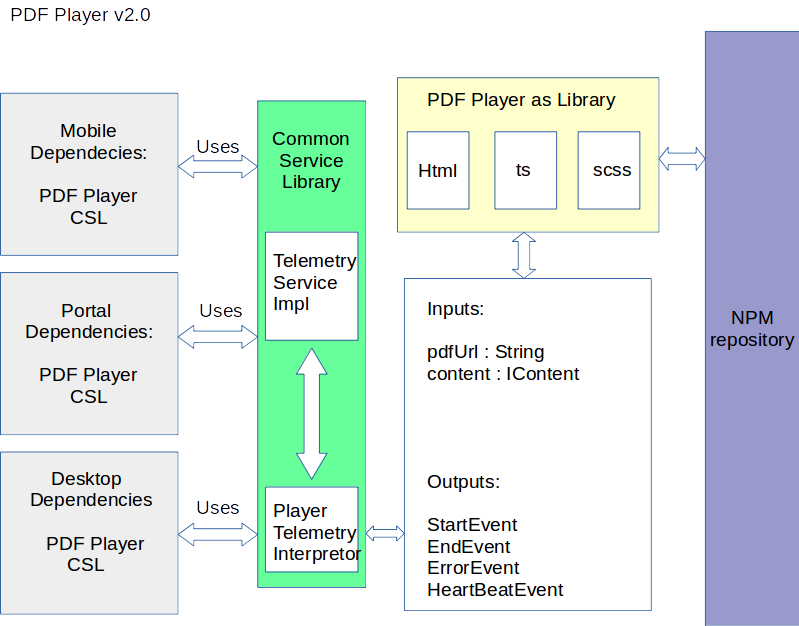

|  **Actors**  |  **Description**  |  **Role**  | 
|  --- |  --- |  --- | 
| PDF Player as Library | Responsible for playing PDFs and can pass on the player events to container. It can contain following: a) Navigation b) Start Page c) End Page d) toolbar e) Custom Page Navigator | <ul><li>Pure Player provides seamless Experience of accessing content.

</li><li>Can work as independent standalone player on a simple html page using web elements

</li><li>Externalised in terms of implementation

</li><li>No preconceived notions are carried about its potential usage.

</li></ul> | 
| Common Service Library | Common Library Shared between Mobile,Desktop and Portal Teams for all http services on consumption.  Default Implementation for player in generic way will always exist for every new player created.   **Customising Telemetry for more specific needs will be purely the need and decision of the consumer of the player.**  | <ul><li>Has the capability to interpret the player events. Following are the player events: a) Start Event b) End Event c) Error Event d) Heart Beat Event

</li><li>Note on Heart Beat: heartbeat events are generic way of expressing events for players. It is responsibility of CSL to interpret these events into meaningful telemetry events as per spec.  Ex: A Zoom Change gets raised as “HEARTBEAT“ event from player with id as “ZOOM_CHANGE”

</li></ul> | 

| Pros | a) Separation of Concern : With Separation of Concern we will have highly modular and maintainable code . Tight Coupling of Systems ends up constraining the player to put most part of the code which is non functional for itself. Ex: Telemetry event interpretation is one such concern which is refactored and moved into Externalised unit like Common Service Library.   b) Any Potential changes to telemetry shouldn’t ideally end up republishing the player. An update on CSL should be enough. Which kind of reduces the risk of regression to Telemetry Only. Ex: An Impression event getting validation failure shouldn’t end us up republishing the player of telemetry.  c) Modular Player : Since the entire player is a npm repo. It becomes easy to detach the existing player and move into new one without much hassles.  d)  It is quite practical to interpret telemetry spec in a very cutomised way for most of the adaptors of Sunbird. This telemetry behaviour should be allowed to override with minimal efforts. Infact, It can go to an extent of raising telemetry events and also events raised to external systems that adaptors might be using.  e) Any new players created in future, will be less context aware and more functional in nature. Ex: Unity Games, Animation Players, VR Contents etc. | 
| Cons | a) Any Player Created in future will have dependency on CSL for default telemetry implementation. Could potentially be source of friction. b) Creating Telemetry Interpreter can be a two step task.  | 

*****

[[category.storage-team]] 
[[category.confluence]] 
