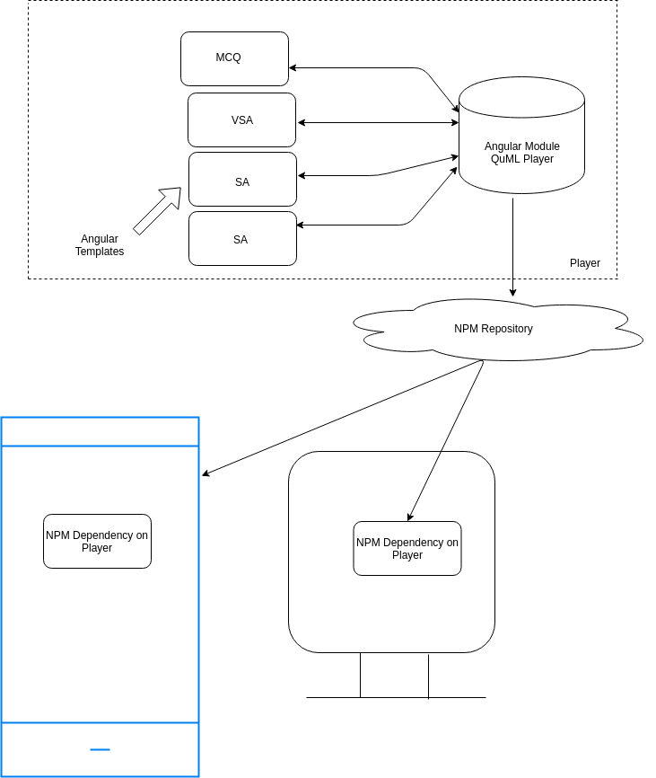
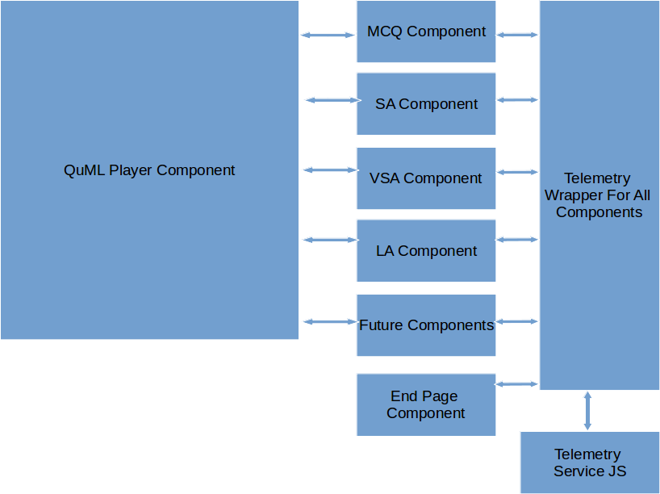

## Overview:
Need to design a module which is capable of managing practice-tests/exam-preps/online-exam based on request. Request can be of following types:

a) MCQ - Multiple Choice Question

b) SA     - Short Answer

c) VSA   - Very Short Answer

d) LA      - Long Answer


## Problem statement: 
Consumption Clients like Mobile,Desktop should have the capability to queue the questions as per user interaction. Since most of the times these clients are believed to be offline, It creates a need to have a question player utility available for the system. Absence of such a system would end up having prolonged user experience, inefficient usage of browser resources etc.


## Existing System: 
Currently we have content player which is used as Single standalone solution for most of the content types. Any Changes to be done for the player would mean entire player should go for release life cycle. 


## Proposed System:
Proposed System will breakdown the player module into multiple modules. As part of larger initiative, this is step towards creating standalone player like QuML Player.Pros :
* Usage of Templating frameworks will provide at-most capability for UX capabilities.
* Dom Manipulation driven by templates will be absolute minimum
* JSONs which today holds significant logic of rendering can be nullified.
* Better Interaction Capabilities.
* Ecars which carry significant chunk of libraries to be loaded can be scoped out. Just pass on JSON in the ecar along with assets.

    Ex: LateX library is worth 1.5MB today which gets carried across each ecar which has mathematical or scientific expressions.

Cons :
*  Risk of testing these templates against big question bank.
* Any Changes in the User Experience might be a challenge for the users to get accustomed to new experience.

 **QuMLDistribution Mechanism:** NPM **Components                   :** Angular 7 Components

 **Module                            : QuML Player Module as Angular LibraryPlayer Interface:** 


```js
@Input  : data: [Questions]
@Input  : endPageEnum :["CourseEndPage", "TextBookEndPage",              "AssessmentEndPage","None"]
@Input  : navigation: {next: Content,previous: Content}

Event emitted
@Output   :   startPlayerEvent
@Output   :   endPlayerEvent
@Output   :   progressEvent
@Output   :   stateChangeEvent
@Output   :   telemetryEvent<edata>
@Output   :   menuEvent 
Methods Supported
reload:function(do_id)
load: function(do_id)
next: function(do_id)
previous: function(do_id)
```
 **QuML Elements:** 


*  **QuML Player**  : Placeholder for all templates. Provides Intelligence in terms of:
    * Question Ordering
    * Animation
    * Theme
    * Time Keeping
    * Behaviour Metadata
    * Attempt Metadata

    
    * Score Board
    * Receiver of all Event Emitters of Hosted Templates
    * Loader

    
*  Template Components (MCQ,SA,VSA,LA or Any Future Components)
    * Layout rendering
    * Horizontal
    * Vertical
    * Grid
    * 2 -Column
    * 3 -Column

    
    * Event Emitters on all interactions

    
*  Telemetry wrapper for all emitted events
* Common Latex library which can process inline latex content

    

     **Hard Dependency** :

    Latex Library for rendering has to be hard dependency 

     **QuML Elementsa) MCQ/SCQ**  : Multiple Choice / Single Choice Questions


```js
{
  "id": "ekstep.learning.item.read",
  "ver": "1.0",
  "ts": "2019-11-21T04:03:58ZZ",
  "params": {
    "resmsgid": "4155fa76-ee73-4924-add3-868ea656d184",
    "msgid": null,
    "err": null,
    "status": "successful",
    "errmsg": null
  },
  "responseCode": "OK",
  "result": {
    "assessment_item": {
      "itemType": "UNIT",
      "code": "0ac5bc3e-67c7-c3ac-e526-6458e93000e8",
      "subject": "Mathematics",
      "qumlVersion": 0.5,
      "qlevel": "MEDIUM",
      "channel": "01241974041332940818",
      "organisation": [
        "DPS (Ghaziabad)"
      ],
      "responseDeclaration": {
        "responseValue": {
          "cardinality": "single",
          "type": "integer",
          "correct_response": {
            "value": "1"
          }
        }
      },
      "language": [
        "English"
      ],
      "program": "CBSE",
      "medium": "English",
      "templateId": "mcq-vertical",
      "type": "mcq",
      "editorState": null,
      "body": "<div class='mcq-vertical cheveron-helper'><div class='mcq-title'><p><div class=\"mathText\">The\\;number\\;obtained\\;on\\;rationalizing\\;the\\;denominator\\;of\\;\\;\\frac1{\\sqrt{7-2}}\\;\\;is</div></p></div><i class='chevron down icon'></i><div class='mcq-options'><div data-simple-choice-interaction data-response-variable='responseValue' value=0 class='mcq-option'><p><div class=\"mathText\">\\sqrt{\\frac{7-2}3}</div></p></div><div data-simple-choice-interaction data-response-variable='responseValue' value=1 class='mcq-option'><p><div class=\"mathText\">\\sqrt{\\frac{7+2}3}</div></p></div><div data-simple-choice-interaction data-response-variable='responseValue' value=2 class='mcq-option'><p><div class=\"mathText\">\\sqrt{\\frac{7+2}5}</div></p></div><div data-simple-choice-interaction data-response-variable='responseValue' value=3 class='mcq-option'><p><div class=\"mathText\">\\sqrt{\\frac{7+2}{45}}</div></p></div></div></div>",
      "createdOn": "2019-06-28T05:39:52.663+0000",
      "gradeLevel": [
        "Class 9"
      ],
      "appId": "prod.diksha.portal",
      "options": [
        {
          "answer": false,
          "value": {
            "type": "text",
            "body": "<p><math xmlns=\"http://www.w3.org/1998/Math/MathML\"><msqrt><mfrac><mrow><mn>7</mn><mo>-</mo><mn>2</mn></mrow><mn>3</mn></mfrac></msqrt></math></p>",
            "resvalue": 0,
            "resindex": 0
          }
        },
        {
          "answer": true,
          "value": {
            "type": "text",
            "body": "<p><math xmlns=\"http://www.w3.org/1998/Math/MathML\"><msqrt><mfrac><mrow><mn>7</mn><mo>+</mo><mn>2</mn></mrow><mn>3</mn></mfrac></msqrt></math></p>",
            "resvalue": 1,
            "resindex": 1
          }
        },
        {
          "answer": false,
          "value": {
            "type": "text",
            "body": "<p><math xmlns=\"http://www.w3.org/1998/Math/MathML\"><msqrt><mfrac><mrow><mn>7</mn><mo>+</mo><mn>2</mn></mrow><mn>5</mn></mfrac></msqrt></math></p>",
            "resvalue": 2,
            "resindex": 2
          }
        },
        {
          "answer": false,
          "value": {
            "type": "text",
            "body": "<p><math xmlns=\"http://www.w3.org/1998/Math/MathML\"><msqrt><mfrac><mrow><mn>7</mn><mo>+</mo><mn>2</mn></mrow><mn>45</mn></mfrac></msqrt></math></p>",
            "resvalue": 3,
            "resindex": 3
          }
        }
      ],
      "lastUpdatedOn": "2019-06-28T05:39:52.663+0000",
      "identifier": "do_31279344961669529616174",
      "lastStatusChangedOn": "2019-06-28T05:39:52.663+0000",
      "creator": "Content Creator",
      "question": "<p><math xmlns=\"http://www.w3.org/1998/Math/MathML\"><mi>T</mi><mi>h</mi><mi>e</mi><mo> </mo><mi>n</mi><mi>u</mi><mi>m</mi><mi>b</mi><mi>e</mi><mi>r</mi><mo> </mo><mi>o</mi><mi>b</mi><mi>t</mi><mi>a</mi><mi>i</mi><mi>n</mi><mi>e</mi><mi>d</mi><mo> </mo><mi>o</mi><mi>n</mi><mo> </mo><mi>r</mi><mi>a</mi><mi>t</mi><mi>i</mi><mi>o</mi><mi>n</mi><mi>a</mi><mi>l</mi><mi>i</mi><mi>z</mi><mi>i</mi><mi>n</mi><mi>g</mi><mo> </mo><mi>t</mi><mi>h</mi><mi>e</mi><mo> </mo><mi>d</mi><mi>e</mi><mi>n</mi><mi>o</mi><mi>m</mi><mi>i</mi><mi>n</mi><mi>a</mi><mi>t</mi><mi>o</mi><mi>r</mi><mo> </mo><mi>o</mi><mi>f</mi><mo> </mo><mo> </mo><mfrac><mn>1</mn><msqrt><mn>7</mn><mo>-</mo><mn>2</mn></msqrt></mfrac><mo> </mo><mo> </mo><mi>i</mi><mi>s</mi></math></p>",
      "consumerId": "89490534-126f-4f0b-82ac-3ff3e49f3468",
      "solutions": null,
      "learningOutcome": [
        "Natural numbers, whole numbers, integers, rational and irrational numbers."
      ],
      "maxScore": 1,
      "bloomsLevel": [
        "Comprehension (Understanding)"
      ],
      "version": 3,
      "versionKey": "1561700392663",
      "framework": "ekstep_ncert_k-12",
      "createdBy": "edce4f4f-6c82-458a-8b23-e3521859992f",
      "name": "mcq_ekstep_ncert_k-12",
      "topic": [
        "Number Systems"
      ],
      "category": "MCQ",
      "programId": "97691300-7e50-11e9-865c-ad8fa09451f7",
      "board": "CBSE",
      "status": "Live"
    }
  }
}
```


b)  **SA    :** Short Answer


```js
{
"id": "ekstep.learning.item.read",
"ver": "1.0",
"ts": "2019-11-21T04:17:08ZZ",
"params": {
"resmsgid": "86a28104-c3a7-4489-9a9c-e14aea005cf1",
"msgid": null,
"err": null,
"status": "successful",
"errmsg": null
},
"responseCode": "OK",
"result": {
"assessment_item": {
"itemType": "UNIT",
"code": "6e0a7e20-c46a-6a84-bd58-dc12e34a14ed",
"subject": "Mathematics",
"qumlVersion": 0.5,
"qlevel": "MEDIUM",
"channel": "01241974041332940818",
"organisation": [
"DPS (Ghaziabad)"
],
"language": [
"English"
],
"program": "CBSE",
"medium": "English",
"templateId": "NA",
"type": "reference",
"editorState": {
"solutions": [
"<p><math xmlns=\"http://www.w3.org/1998/Math/MathML\"><mroot><mrow><mn>8</mn><mo>×</mo><mn>2</mn></mrow><mn>3</mn></mroot><mo>+</mo><mroot><mrow><mn>27</mn><mo>×</mo><mn>2</mn></mrow><mn>3</mn></mroot><mo>+</mo><mroot><mrow><mn>64</mn><mo>×</mo><mn>3</mn></mrow><mn>3</mn></mroot><mo>-</mo><mroot><mrow><mn>125</mn><mo>×</mo><mn>3</mn></mrow><mn>3</mn></mroot><mspace linebreak=\"newline\"></mspace><mo>=</mo><mn>2</mn><mroot><mn>2</mn><mn>3</mn></mroot><mo>+</mo><mn>3</mn><mroot><mn>2</mn><mn>3</mn></mroot><mo>+</mo><mn>4</mn><mroot><mn>3</mn><mn>3</mn></mroot><mo>-</mo><msup><mn>5</mn><mn>3</mn></msup><msqrt><mn>3</mn></msqrt><mspace linebreak=\"newline\"></mspace><mo>=</mo><mn>5</mn><mroot><mn>2</mn><mn>3</mn></mroot><mo>-</mo><mroot><mn>3</mn><mn>3</mn></mroot></math></p>"
]
},
"body": "<p><div class=\"mathText\">Simplify:\\;\\sqrt[3]{16}+\\sqrt[3]{54}+\\sqrt[3]{192}-\\sqrt[3]{375}</div></p>",
"createdOn": "2019-06-28T06:37:24.642+0000",
"gradeLevel": [
"Class 9"
],
"appId": "prod.diksha.portal",
"lastUpdatedOn": "2019-06-28T06:37:24.642+0000",
"identifier": "do_31279347789531545616502",
"lastStatusChangedOn": "2019-06-28T06:37:24.642+0000",
"creator": "Content Creator",
"question": "<p><math xmlns=\"http://www.w3.org/1998/Math/MathML\"><mi>S</mi><mi>i</mi><mi>m</mi><mi>p</mi><mi>l</mi><mi>i</mi><mi>f</mi><mi>y</mi><mo>:</mo><mo> </mo><mroot><mn>16</mn><mn>3</mn></mroot><mo>+</mo><mroot><mn>54</mn><mn>3</mn></mroot><mo>+</mo><mroot><mn>192</mn><mn>3</mn></mroot><mo>-</mo><mroot><mn>375</mn><mn>3</mn></mroot></math></p>",
"solutions": [
"<p><div class=\"mathText\">\\begin{array}{l}\\sqrt[3]{8\\times2}+\\sqrt[3]{27\\times2}+\\sqrt[3]{64\\times3}-\\sqrt[3]{125\\times3}\\\\=2\\sqrt[3]2+3\\sqrt[3]2+4\\sqrt[3]3-5^3\\sqrt3\\\\=5\\sqrt[3]2-\\sqrt[3]3\\end{array}</div></p>"
],
"consumerId": "89490534-126f-4f0b-82ac-3ff3e49f3468",
"learningOutcome": [
"The laws of exponents"
],
"bloomsLevel": [
"Knowledge (Remembering)"
],
"version": 3,
"versionKey": "1561703844642",
"framework": "ekstep_ncert_k-12",
"createdBy": "edce4f4f-6c82-458a-8b23-e3521859992f",
"name": "sa_ekstep_ncert_k-12",
"topic": [
"Number Systems"
],
"category": "SA",
"programId": "97691300-7e50-11e9-865c-ad8fa09451f7",
"board": "CBSE",
"status": "Live"
}
}
}


```


c)  **VSA  :** Very Short Answer


```js
{
  "id": "ekstep.learning.item.read",
  "ver": "1.0",
  "ts": "2019-11-21T04:10:26ZZ",
  "params": {
    "resmsgid": "8d2c9634-eb93-4469-9e08-b72731bdc9f8",
    "msgid": null,
    "err": null,
    "status": "successful",
    "errmsg": null
  },
  "responseCode": "OK",
  "result": {
    "assessment_item": {
      "itemType": "UNIT",
      "code": "bf0c0da2-80fe-638e-814e-b7e0b3c4cf20",
      "subject": "Mathematics",
      "qumlVersion": 0.5,
      "qlevel": "MEDIUM",
      "channel": "01241974041332940818",
      "organisation": [
        "DPS (Ghaziabad)"
      ],
      "language": [
        "English"
      ],
      "program": "CBSE",
      "medium": "English",
      "templateId": "NA",
      "type": "reference",
      "editorState": {
        "solutions": [
          "<p>(a) 1.121221222</p><p>(b) 1.12212221222</p>"
        ]
      },
      "body": "<p>Find two irrational numbers between 1.12 and 1.13 </p>",
      "createdOn": "2019-06-28T06:03:56.672+0000",
      "gradeLevel": [
        "Class 9"
      ],
      "appId": "prod.diksha.portal",
      "lastUpdatedOn": "2019-06-28T06:03:56.672+0000",
      "identifier": "do_31279346144601702415513",
      "lastStatusChangedOn": "2019-06-28T06:03:56.672+0000",
      "creator": "Content Creator",
      "question": "<p>Find two irrational numbers between 1.12 and 1.13 </p>",
      "solutions": [
        "<p>(a) 1.121221222</p><p>(b) 1.12212221222</p>"
      ],
      "consumerId": "89490534-126f-4f0b-82ac-3ff3e49f3468",
      "learningOutcome": [
        "The method of plotting square root of natural and decimal numbers on the number line."
      ],
      "bloomsLevel": [
        "Knowledge (Remembering)"
      ],
      "version": 3,
      "versionKey": "1561701836672",
      "framework": "ekstep_ncert_k-12",
      "createdBy": "edce4f4f-6c82-458a-8b23-e3521859992f",
      "name": "vsa_ekstep_ncert_k-12",
      "topic": [
        "Number Systems"
      ],
      "category": "VSA",
      "programId": "97691300-7e50-11e9-865c-ad8fa09451f7",
      "board": "CBSE",
      "status": "Live"
    }
  }
}
```


d)  **LA     : ** Long Answer 


```js
{
  "id": "ekstep.learning.item.read",
  "ver": "1.0",
  "ts": "2019-11-21T04:19:51ZZ",
  "params": {
    "resmsgid": "2087b319-67f0-4407-bcb3-ef1689003488",
    "msgid": null,
    "err": null,
    "status": "successful",
    "errmsg": null
  },
  "responseCode": "OK",
  "result": {
    "assessment_item": {
      "itemType": "UNIT",
      "code": "7aa00add-7f78-e28b-ba29-ec3a8780972b",
      "subject": "Mathematics",
      "qumlVersion": 0.5,
      "qlevel": "MEDIUM",
      "channel": "01241974041332940818",
      "organisation": [
        "DPS (Ghaziabad)"
      ],
      "language": [
        "English"
      ],
      "program": "CBSE",
      "medium": "English",
      "templateId": "NA",
      "type": "reference",
      "editorState": {
        "solutions": [
          "<p><math xmlns=\"http://www.w3.org/1998/Math/MathML\"><mo>=</mo><mfrac><mrow><mn>1</mn><mo>×</mo><mfenced close=\"}\" open=\"{\"><mrow><mfenced><mrow><msqrt><mn>7</mn></msqrt><mo>+</mo><msqrt><mn>6</mn></msqrt></mrow></mfenced><mo>+</mo><mo>(</mo><msqrt><mn>13</mn></msqrt><mo>)</mo></mrow></mfenced></mrow><mrow><mfenced close=\"}\" open=\"{\"><mrow><mfenced><mrow><msqrt><mn>7</mn></msqrt><mo>+</mo><msqrt><mn>16</mn></msqrt></mrow></mfenced><mo>-</mo><mfenced><msqrt><mn>13</mn></msqrt></mfenced></mrow></mfenced><mo>{</mo><mo>(</mo><msqrt><mn>7</mn></msqrt><mo>+</mo><msqrt><mn>6</mn></msqrt><mo>)</mo><mo>+</mo><mo>(</mo><msqrt><mn>13</mn></msqrt><mo>)</mo><mo>}</mo></mrow></mfrac><mspace linebreak=\"newline\"></mspace><mo>=</mo><mfrac><mrow><msqrt><mn>7</mn></msqrt><mo>+</mo><msqrt><mn>6</mn></msqrt><mo>+</mo><msqrt><mn>13</mn></msqrt></mrow><mrow><mo>(</mo><msqrt><mn>7</mn></msqrt><mo>+</mo><msqrt><mn>6</mn></msqrt><msup><mo>)</mo><mn>2</mn></msup><mo>-</mo><mo>(</mo><msqrt><mn>13</mn></msqrt><msup><mo>)</mo><mn>2</mn></msup></mrow></mfrac><mspace linebreak=\"newline\"></mspace><mo>=</mo><mfrac><mrow><msqrt><mn>7</mn></msqrt><mo>+</mo><msqrt><mn>6</mn></msqrt><msqrt><mn>13</mn></msqrt></mrow><mrow><mn>7</mn><mo>+</mo><mn>6</mn><mo>+</mo><mn>2</mn><msqrt><mn>2</mn><mo>-</mo><mn>13</mn></msqrt></mrow></mfrac><mspace linebreak=\"newline\"></mspace><mo>=</mo><mfrac><mrow><mfenced><mrow><msqrt><mn>7</mn></msqrt><mo>+</mo><msqrt><mn>6</mn></msqrt><mo>+</mo><msqrt><mn>13</mn></msqrt></mrow></mfenced><mo>×</mo><msqrt><mn>42</mn></msqrt></mrow><mrow><mo>(</mo><mn>2</mn><msqrt><mn>42</mn></msqrt><mo>)</mo><mo>×</mo><mo>(</mo><msqrt><mn>42</mn></msqrt><mo>)</mo></mrow></mfrac><mspace linebreak=\"newline\"></mspace><mo>=</mo><mfrac><mfenced><mrow><msqrt><mn>7</mn><mo>×</mo><mn>42</mn></msqrt><mo>+</mo><msqrt><mn>6</mn><mo>×</mo><mn>42</mn></msqrt><mo>+</mo><msqrt><mn>13</mn><mo>×</mo><mn>42</mn></msqrt></mrow></mfenced><mn>84</mn></mfrac><mspace linebreak=\"newline\"></mspace><mo>=</mo><mfrac><mrow><mn>7</mn><msqrt><mn>6</mn></msqrt><mo>+</mo><mn>6</mn><msqrt><mn>7</mn></msqrt><mo>+</mo><mn>546</mn></mrow><mn>84</mn></mfrac></math></p>"
        ]
      },
      "body": "<p><div class=\"mathText\">Rationalise\\;the\\;denominator\\;:\\;\\frac1{\\sqrt7+\\sqrt6-\\sqrt{13}}</div></p>",
      "createdOn": "2019-06-28T07:07:22.448+0000",
      "gradeLevel": [
        "Class 9"
      ],
      "appId": "prod.diksha.portal",
      "lastUpdatedOn": "2019-06-28T07:07:22.448+0000",
      "identifier": "do_31279349262294220816556",
      "lastStatusChangedOn": "2019-06-28T07:07:22.448+0000",
      "creator": "Content Creator",
      "question": "<p><math xmlns=\"http://www.w3.org/1998/Math/MathML\"><mi>R</mi><mi>a</mi><mi>t</mi><mi>i</mi><mi>o</mi><mi>n</mi><mi>a</mi><mi>l</mi><mi>i</mi><mi>s</mi><mi>e</mi><mo> </mo><mi>t</mi><mi>h</mi><mi>e</mi><mo> </mo><mi>d</mi><mi>e</mi><mi>n</mi><mi>o</mi><mi>m</mi><mi>i</mi><mi>n</mi><mi>a</mi><mi>t</mi><mi>o</mi><mi>r</mi><mo> </mo><mo>:</mo><mo> </mo><mfrac><mn>1</mn><mrow><msqrt><mn>7</mn></msqrt><mo>+</mo><msqrt><mn>6</mn></msqrt><mo>-</mo><msqrt><mn>13</mn></msqrt></mrow></mfrac></math></p>",
      "solutions": [
        "<p><div class=\"mathText\">\\begin{array}{l}=\\frac{1\\times\\left\\{\\left(\\sqrt7+\\sqrt6\\right)+(\\sqrt{13})\\right\\}}{\\left\\{\\left(\\sqrt7+\\sqrt{16}\\right)-\\left(\\sqrt{13}\\right)\\right\\}\\{(\\sqrt7+\\sqrt6)+(\\sqrt{13})\\}}\\\\=\\frac{\\sqrt7+\\sqrt6+\\sqrt{13}}{(\\sqrt7+\\sqrt6)^2-(\\sqrt{13})^2}\\\\=\\frac{\\sqrt7+\\sqrt6\\sqrt{13}}{7+6+2\\sqrt{2-13}}\\\\=\\frac{\\left(\\sqrt7+\\sqrt6+\\sqrt{13}\\right)\\times\\sqrt{42}}{(2\\sqrt{42})\\times(\\sqrt{42})}\\\\=\\frac{\\left(\\sqrt{7\\times42}+\\sqrt{6\\times42}+\\sqrt{13\\times42}\\right)}{84}\\\\=\\frac{7\\sqrt6+6\\sqrt7+546}{84}\\end{array}</div></p>"
      ],
      "consumerId": "89490534-126f-4f0b-82ac-3ff3e49f3468",
      "learningOutcome": [
        "The laws of exponents"
      ],
      "bloomsLevel": [
        "Knowledge (Remembering)"
      ],
      "version": 3,
      "versionKey": "1561705642448",
      "framework": "ekstep_ncert_k-12",
      "createdBy": "edce4f4f-6c82-458a-8b23-e3521859992f",
      "name": "la_ekstep_ncert_k-12",
      "topic": [
        "Number Systems"
      ],
      "category": "LA",
      "programId": "97691300-7e50-11e9-865c-ad8fa09451f7",
      "board": "CBSE",
      "status": "Live"
    }
  }
}
```




                     





a) Attribute for   **time**  Component For each question is missing for each assessment_type. (Can be possibility)

b) Attribute suggesting where the question is being used is missing. (Can be practice test,exam prep, test or exam)


```js
{
  "id": "ekstep.learning.item.read",
  "ver": "1.0",
  "ts": "2019-11-21T04:19:51ZZ",
  "params": {
    "resmsgid": "2087b319-67f0-4407-bcb3-ef1689003488",
    "msgid": null,
    "err": null,
    "status": "successful", // msgid,err,status,errmsg
    "errmsg": null          // responseCode should be
  },                        // part of one object
  "responseCode": "OK",
  "result": {
    "assessment_item": {
      "itemType": "UNIT",  
      "code": "7aa00add-7f78-e28b-ba29-ec3a8780972b",
      "subject": "Mathematics",
      "qumlVersion": 0.5,
      "qlevel": "MEDIUM",
      "channel": "01241974041332940818",
      "organisation": [
        "DPS (Ghaziabad)"
      ],
      "language": [
        "English"
      ],
      "program": "CBSE",
      "medium": "English",
      "templateId": "NA",
      "type": "reference",
      "editorState": {
        "solutions": [
          "<p><math xmlns=\"http://www.w3.org/1998/Math/MathML\"><mo>=</mo><mfrac><mrow><mn>1</mn><mo>×</mo><mfenced close=\"}\" open=\"{\"><mrow><mfenced><mrow><msqrt><mn>7</mn></msqrt><mo>+</mo><msqrt><mn>6</mn></msqrt></mrow></mfenced><mo>+</mo><mo>(</mo><msqrt><mn>13</mn></msqrt><mo>)</mo></mrow></mfenced></mrow><mrow><mfenced close=\"}\" open=\"{\"><mrow><mfenced><mrow><msqrt><mn>7</mn></msqrt><mo>+</mo><msqrt><mn>16</mn></msqrt></mrow></mfenced><mo>-</mo><mfenced><msqrt><mn>13</mn></msqrt></mfenced></mrow></mfenced><mo>{</mo><mo>(</mo><msqrt><mn>7</mn></msqrt><mo>+</mo><msqrt><mn>6</mn></msqrt><mo>)</mo><mo>+</mo><mo>(</mo><msqrt><mn>13</mn></msqrt><mo>)</mo><mo>}</mo></mrow></mfrac><mspace linebreak=\"newline\"></mspace><mo>=</mo><mfrac><mrow><msqrt><mn>7</mn></msqrt><mo>+</mo><msqrt><mn>6</mn></msqrt><mo>+</mo><msqrt><mn>13</mn></msqrt></mrow><mrow><mo>(</mo><msqrt><mn>7</mn></msqrt><mo>+</mo><msqrt><mn>6</mn></msqrt><msup><mo>)</mo><mn>2</mn></msup><mo>-</mo><mo>(</mo><msqrt><mn>13</mn></msqrt><msup><mo>)</mo><mn>2</mn></msup></mrow></mfrac><mspace linebreak=\"newline\"></mspace><mo>=</mo><mfrac><mrow><msqrt><mn>7</mn></msqrt><mo>+</mo><msqrt><mn>6</mn></msqrt><msqrt><mn>13</mn></msqrt></mrow><mrow><mn>7</mn><mo>+</mo><mn>6</mn><mo>+</mo><mn>2</mn><msqrt><mn>2</mn><mo>-</mo><mn>13</mn></msqrt></mrow></mfrac><mspace linebreak=\"newline\"></mspace><mo>=</mo><mfrac><mrow><mfenced><mrow><msqrt><mn>7</mn></msqrt><mo>+</mo><msqrt><mn>6</mn></msqrt><mo>+</mo><msqrt><mn>13</mn></msqrt></mrow></mfenced><mo>×</mo><msqrt><mn>42</mn></msqrt></mrow><mrow><mo>(</mo><mn>2</mn><msqrt><mn>42</mn></msqrt><mo>)</mo><mo>×</mo><mo>(</mo><msqrt><mn>42</mn></msqrt><mo>)</mo></mrow></mfrac><mspace linebreak=\"newline\"></mspace><mo>=</mo><mfrac><mfenced><mrow><msqrt><mn>7</mn><mo>×</mo><mn>42</mn></msqrt><mo>+</mo><msqrt><mn>6</mn><mo>×</mo><mn>42</mn></msqrt><mo>+</mo><msqrt><mn>13</mn><mo>×</mo><mn>42</mn></msqrt></mrow></mfenced><mn>84</mn></mfrac><mspace linebreak=\"newline\"></mspace><mo>=</mo><mfrac><mrow><mn>7</mn><msqrt><mn>6</mn></msqrt><mo>+</mo><mn>6</mn><msqrt><mn>7</mn></msqrt><mo>+</mo><mn>546</mn></mrow><mn>84</mn></mfrac></math></p>"
        ]
      },
      "body": "<p><div class=\"mathText\">Rationalise\\;the\\;denominator\\;:\\;\\frac1{\\sqrt7+\\sqrt6-\\sqrt{13}}</div></p>", //This Attribute can add lot of Complexity for Spec Adaptors
      "createdOn": "2019-06-28T07:07:22.448+0000",
      "gradeLevel": [
        "Class 9"
      ],
      "appId": "prod.diksha.portal",
      "lastUpdatedOn": "2019-06-28T07:07:22.448+0000",
      "identifier": "do_31279349262294220816556",
      "lastStatusChangedOn": "2019-06-28T07:07:22.448+0000",
      "creator": "Content Creator",
      "question": "<p><math xmlns=\"http://www.w3.org/1998/Math/MathML\"><mi>R</mi><mi>a</mi><mi>t</mi><mi>i</mi><mi>o</mi><mi>n</mi><mi>a</mi><mi>l</mi><mi>i</mi><mi>s</mi><mi>e</mi><mo> </mo><mi>t</mi><mi>h</mi><mi>e</mi><mo> </mo><mi>d</mi><mi>e</mi><mi>n</mi><mi>o</mi><mi>m</mi><mi>i</mi><mi>n</mi><mi>a</mi><mi>t</mi><mi>o</mi><mi>r</mi><mo> </mo><mo>:</mo><mo> </mo><mfrac><mn>1</mn><mrow><msqrt><mn>7</mn></msqrt><mo>+</mo><msqrt><mn>6</mn></msqrt><mo>-</mo><msqrt><mn>13</mn></msqrt></mrow></mfrac></math></p>",
      "solutions": [
        "<p><div class=\"mathText\">\\begin{array}{l}=\\frac{1\\times\\left\\{\\left(\\sqrt7+\\sqrt6\\right)+(\\sqrt{13})\\right\\}}{\\left\\{\\left(\\sqrt7+\\sqrt{16}\\right)-\\left(\\sqrt{13}\\right)\\right\\}\\{(\\sqrt7+\\sqrt6)+(\\sqrt{13})\\}}\\\\=\\frac{\\sqrt7+\\sqrt6+\\sqrt{13}}{(\\sqrt7+\\sqrt6)^2-(\\sqrt{13})^2}\\\\=\\frac{\\sqrt7+\\sqrt6\\sqrt{13}}{7+6+2\\sqrt{2-13}}\\\\=\\frac{\\left(\\sqrt7+\\sqrt6+\\sqrt{13}\\right)\\times\\sqrt{42}}{(2\\sqrt{42})\\times(\\sqrt{42})}\\\\=\\frac{\\left(\\sqrt{7\\times42}+\\sqrt{6\\times42}+\\sqrt{13\\times42}\\right)}{84}\\\\=\\frac{7\\sqrt6+6\\sqrt7+546}{84}\\end{array}</div></p>"
      ],
      "consumerId": "89490534-126f-4f0b-82ac-3ff3e49f3468",
      "learningOutcome": [
        "The laws of exponents"
      ],
      "bloomsLevel": [
        "Knowledge (Remembering)"
      ],
      "version": 3,
      "versionKey": "1561705642448",
      "framework": "ekstep_ncert_k-12",
      "createdBy": "edce4f4f-6c82-458a-8b23-e3521859992f",
      "name": "la_ekstep_ncert_k-12",
      "topic": [
        "Number Systems"
      ],
      "category": "LA",
      "programId": "97691300-7e50-11e9-865c-ad8fa09451f7",
      "board": "CBSE",
      "status": "Live"
    }
  }
}
```


*****

[[category.storage-team]] 
[[category.confluence]] 
