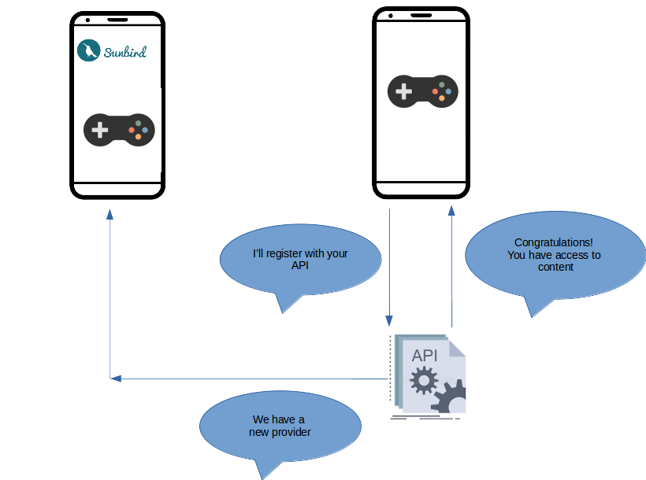
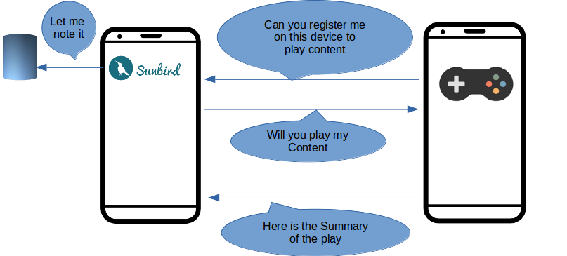
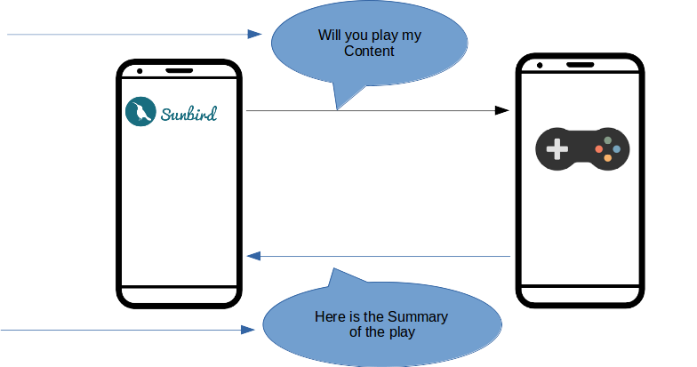
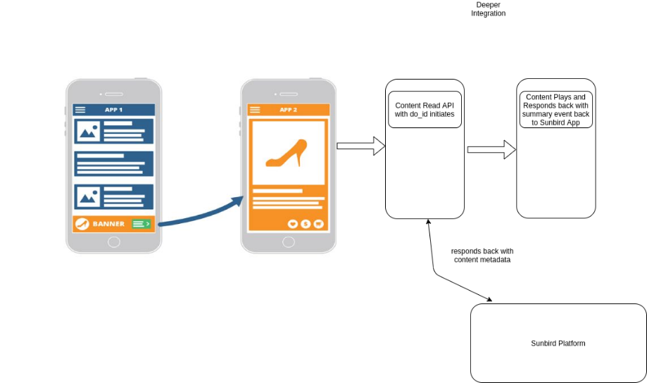
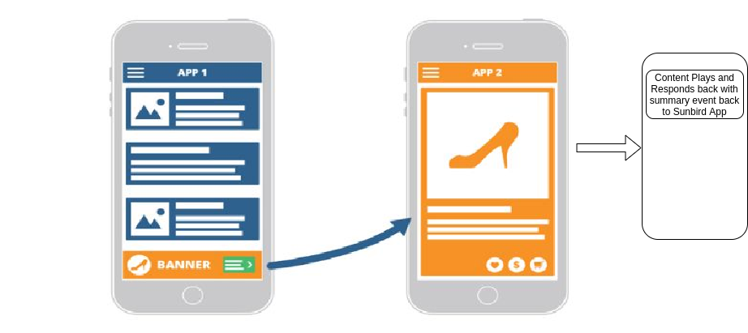

### Intent
Need to create an interface for enabling Access to Content on Sunbird across different apps like Read Along,Games etc.


Note: Assumption of this specification is based on the apps being able to support these intents as part of their implementation.

Documentation is categorised into multiple sections:


* WorkFlow


* Vendor Registration of Apps to Sunbird


    * Global Vendor Registration API


    * Local Vendor Registration by Deep Linking


    
* Technical Specification for third party apps


    * Param Data Supported


    * Summary Event Spec


    * API Documentation


    * Intent Handling


    
* Approaches


## Work Flow

### Registration of External Apps
Global Registration


```js
{
  identifier: "",
  name: "",
  logo: "",
  appName: "",
  packageId: "",
  target: {
    mimeType : [],
    contentType : [],
    .... // All content attributes
  },
  appDetails: {
    organization: ""
  }
}
```


Local Registration By Deep Link (Only Restricted to that particular device)

Registering by Deep link inside Sunbird

 **sunbird://register?name: "Google Corporation", logo: "https://<domain-url>", appName: "Google Bolo", packageId: "com.google.bolo",target:”{}”,appDetails:”{}”** 







### Sunbird Third Party App Interaction

```js
{
  referrerPackageId : "com.google.bolo",
  referenceID : "App generated Code",
  mimeType : "",
  vendorCode : "",
  contentUrl : "",
  profileContext: "{handle:'',avatar:''}"
}
```


```json
{
  "edata": {
    "type": "", 
    "mode": "", 
    "starttime": Long, 
    "endtime": Long, 
    "timespent": Double, 
    "pageviews": Long, 
    "interactions": Long, 
    "envsummary": [{ 
        "env": String, 
        "timespent": Double, 
        "visits": Long 
    }],
    "eventssummary": [{ 
        "id": String, 
        "count": Long 
    }],
    "pagesummary": [{ 
        "id": String, 
        "type": String, 
        "env": String, 
        "timespent": Double, 
        "visits": Long 
        }]
    }
  }
```



## Vendor registration of Apps to Sunbird 

* Global Vendor Registration API


Each Vendor can be registered as part of Global Configuration for Sunbird to have app links being enabled.


```js
{
  identifier: "",
  name: "",
  logo: "",
  appName: "",
  packageId: "",
  target: {
    mimeType : [],
    contentType : [],
    .... // All content attributes
  },
  appDetails: {
    organization: "",
    id: "",
    version: ""
  },
  vendorCode: "" // Internally assigned
}
```
Vendor CRUD API (or) Form Configuration Supported.


* Local Vendor Registration by Deep Linking

    Enabling of Deep link in Sunbird for local registration restricted to device.

    Device hears for deep links to register vendor apps locally (Restricted to particular device).

Steps


    * Vendor app needs to call a deep link of Sunbird app.


    * Sunbird App as part of handling deep link will try to persist vendor information locally on app’s data.


    * Any subsequent invocation of intent from Sunbird will show  globally registered apps for Sunbird along with locally registered apps in devices.


    

deeplink Url : 

 **sunbird://register?name: "", logo: "", appName: "", packageId: "",target:”{}”,appDetails:”{}”** 


|  **Parameter**  |  **DataType**  |  **Description**  | 
|  --- |  --- |  --- | 
| name ( **M** ) | String | Name of the vendor | 
| logo ( **M** ) | String | App logo Url | 
| appName ( **M** ) | String | App Name | 
| packageId ( **M** ) | String | PackageID of the app | 
| target ( **M** ) | String | Targeted content query | 
| appDetails ( **O** ) | String | App details | 
| extra ( **O** ) | String | Misceallaneous Information to be sent | 


## Approaches
Approach 1 : (Deeper Integration)
### Approach 1 : (Deeper Integration)


Intent provides basic information such as content do_id, telemetry context information.


Targeted Application need to fetch the data from platform. Understand the Content Metadata and play the content.

Targeted Application need to respond back with Summary Data


|  **Params**  |  **Description**  | 
|  --- |  --- | 
| resourceID | Content ID of the resource | 
| context | Context of the play - like did, sid, uid etc | 

 **Pros** 

It can enable bazaar apps to index the content in their own environment.

It could open up the Sunbird APIs for most of the bazaar players.

 **Cons** 

Data to be sent might be huge

Spec is rigid. If the spec changes there can be inconsistency between various version of both apps

Approach 2 : (Lighter Integration)
### Approach 2 : (Lighter Integration)
Intent provides basic information such as content do_id,  context information & artifactUrl and mimeType.

Bazaar Apps can launch the artifactUrl directly based on mimeType.


|  **Params**  |  **Description**  | 
|  --- |  --- | 
| resourceID | Content ID of the resource | 
| context | Context of the play - like did, sid, uid etc | 
| mimeType | Mime type of the content | 
| artifactUrl | The URL to download the content | 



 **Pros** 

Least Effort in integrating the Intent for bazaar apps.

Need to develop a secure mechanism to serve only sun bird specific resources.


 **Cons** 

Data to be sent might be huge

Spec is rigid. If the spec changes there can be inconsistency between various version of both apps

Approach 3 : (A Hybrid approach between 1 & 2)Intent provides the basic information such as content URL, mimeType & user/session context.


|  **Params**  |  **Description**  | 
|  --- |  --- | 
| resourceID | Content ID of the resource | 
| context | Context of the play - like did, sid, uid etc | 
| mimeType | Mime type of the content | 
| contentUrl | The public Sunbird content url or a dial url ([https://<domain>/content/v1/read/do_xxxx](https://diksha.gov.in/content/v1/read/do_xxxx) => https://<[domain](https://diksha.gov.in/content/v1/read/do_xxxx)>/dial/XC40VV) | 

 **Pros** 


1. The spec doesn’t need to change if more content metadata needs to be sent


1. The integration apps need to understand our content model and can also index the content in their apps


 **Context Information** 

Following are the contextual params passed to the reader app


1. Device ID


1. User ID


1. Session ID


1. Collection ID


1. Batch ID


1. Reference ID

    


## Technical Specification for Third Party Apps
Params Data Supported

|  **Params**  |  **Description**  |  **Data type**  | 
|  --- |  --- |  --- | 
| referrerPackageId | package details of referrer app | String | 
| referenceID | Reference ID to be sent back to sunbird app | String | 
| mimeType | Content MimeType | String | 
| vendorCode | Vendor ID to validate the referrer | String | 
| contentUrl | Url of the Content | String | 
| profileContext | Name and Avatar | String | 

Summary EVENT Spec[https://github.com/sunbird-specs/Telemetry/blob/main/v3_event_details.md/#summary](https://github.com/sunbird-specs/Telemetry/blob/main/v3_event_details.md/#summary)


```js
{
  "edata": {
    "type": "", // Required. Type of summary. Free text. "session", "app", "tool" etc
    "mode": "", // Optional.
    "starttime": Long, // Required. Epoch Timestamp of app start. Retrieved from first event.
    "endtime": Long, // Required. Epoch Timestamp of app end. Retrieved from last event.
    "timespent": Double, // Required. Total time spent by visitor on app in seconds excluding idle time.
    "pageviews": Long, // Required. Total page views per session(count of CP_IMPRESSION)
    "interactions": Long, // Required. Count of interact events
    "envsummary": [{ // Optional
        "env": String, // High level env within the app (content, domain, resources, community)
        "timespent": Double, // Time spent per env
        "visits": Long // count of times the environment has been visited
    }],
    "eventssummary": [{ // Optional
        "id": String, // event id such as CE_START, CE_END, CP_INTERACT etc.
        "count": Long // Count of events.
    }],
    "pagesummary": [{ // Optional
        "id": String, // Page id
        "type": String, // type of page - view/edit
        "env": String, // env of page
        "timespent": Double, // Time taken per page
        "visits": Long // Number of times each page was visited
    }]
  }
}
```
All the reader apps need to send summary data back to Sunbird app via intent data.

API InformationThe third party apps should do a HTTP GET call on the contentUrl parameter sent via the intent data


```
GET intentdata.contentUrl

Headers {
  X-App-ID: <ID of the App>,
  X-App-Version: <Version of the App>,
  X-Device-ID: <Device Id>
}
```
Response Data Structure


```js
{
  "id":"api.content.read",
  "ver":"v1",
  "ts":"2021-02-10 04:27:14:674+0000",
  "params":{
    "resmsgid":null,
    "msgid":"90e184d1-c52c-106b-c410-6a168900ef05",
    "err":null,
    "status":"success",
    "errmsg":null
  },
  "responseCode":"OK",
  "result": {
    "content": ContentModel
  }
}
```
For More Details on the content model refer Sunbird Documentation

[[Object Types|Object-Types]]

Intent Handling
### Intent Handling

* Need to implement an activity which is capable of calling API and read the content metadata to launch the content in their respective apps. Following is the API request,response structure to be adhered to.


* Need to create an intent filter in Android Manifest as follows :


* 
```
<activity
    android:name="com.example.ExampleActivity"
    android:label="@string/title_example" >
    <intent-filter android:label="@string/play_view_web_example">
        <action android:name="android.intent.action.VIEW" />
        <category android:name="android.intent.category.DEFAULT" />
        <category android:name="android.intent.category.BROWSABLE" />
        <!-- Accepts URIs that begin with "http://sunbird.staginged.in/play” -->
        <data android:scheme="https"
              android:host="sunbird.staginged.in"
              android:pathPrefix="/play" />
    </intent-filter>
    <intent-filter android:label="@string/play_view_app_example">
        <action android:name="android.intent.action.VIEW" />
        <category android:name="android.intent.category.DEFAULT" />
        <category android:name="android.intent.category.BROWSABLE" />
        <!-- Accepts URIs that begin with "example://play” -->
        <data android:scheme="example"
              android:host="play" />
    </intent-filter>
</activity>
```


    Implement Activity as follows


* 


```
@Override
public void onCreate(Bundle savedInstanceState) {
    super.onCreate(savedInstanceState);
    setContentView(R.layout.main);

    Intent intent = getIntent();
    String action = intent.getAction();
    Uri data = intent.getData();
    <!-- Trigger the Business Logic of App -->
}
```


*****

[[category.storage-team]] 
[[category.confluence]] 
