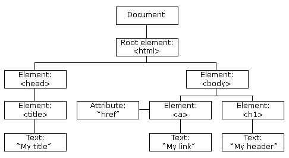
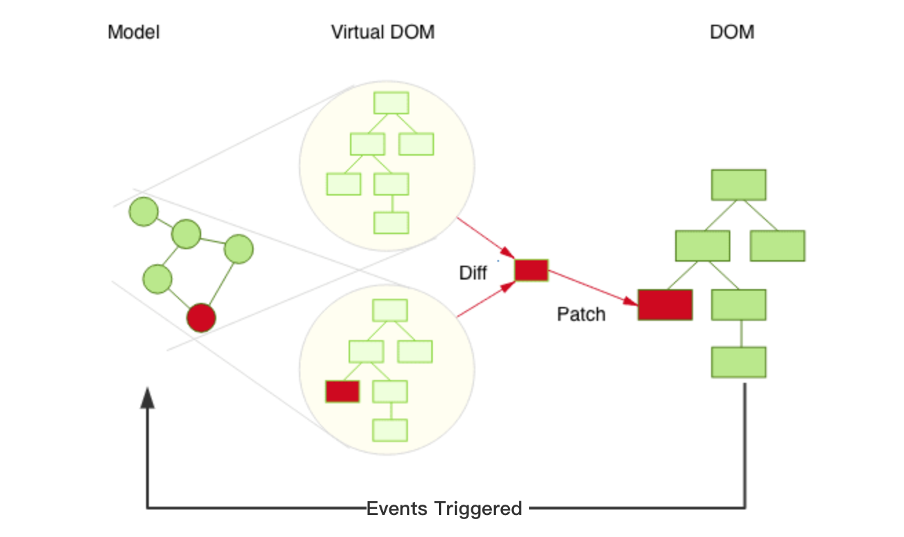

|  **Plugin**  |  **Shadow Dom/Virtual DOM**  | 
|  --- |  --- | 
|  |  | 
| Purist Language called Javascript | Opinionated Framework like Angular Libraries like Vue,React | 
| Exercise | Exercise | 
| Data and State Management a) Caching Capabilities b) Lay-outing Capabilities c) State Management d) Component Communication e) Integration f) DOM Manipulation based on data |  | 
| Dependency on Plugin Data and Contracta) Data is assumed(at least initially) to be coming from external source like server b) Ability to manage Data which is backward Compatible becomes expensive on server side. c)  Lay-outing Capabilities will start to get confined. Saying UI looks same across clients. d) Dynamic Layout Capabilities within plugin can make code becoming almost unmanageable. e)Watch out for following trends:        1) UI cannot be modified as per resolution        2) Too much of Logic infested to calculate Layouts. (Calculation Of Layouts)        3) Too many DOM manipulations.         4) Reaches a  point of almost impossible to maintain        5) Getting Logic right becomes an art more than tech. (Spagetti Code)         6) Huge amount of memory leaks.         7) Any Potential change in a plugin within a plugin would mandate the entire           plugin to get re-tested | a) Assumptions on Layouts gets precooked inside the  application b) Any further changes to these assumptions mean an extra effort of work to get it done. c) Strict Type Checked any potential variation in data can emerge as breakage in software. | 
| Ideal for Projects of small scale and limited scope | Ideal for projects @ scale (Not Consumption Scale Please!) | 
| We can end up writing our own Framework if we constantly maintain the code with all standards. Its an opportunity to solve the problems of front-end development in our unique way | We are just a users of framework to satisfy business needs. | 

*****

[[category.storage-team]] 
[[category.confluence]] 
