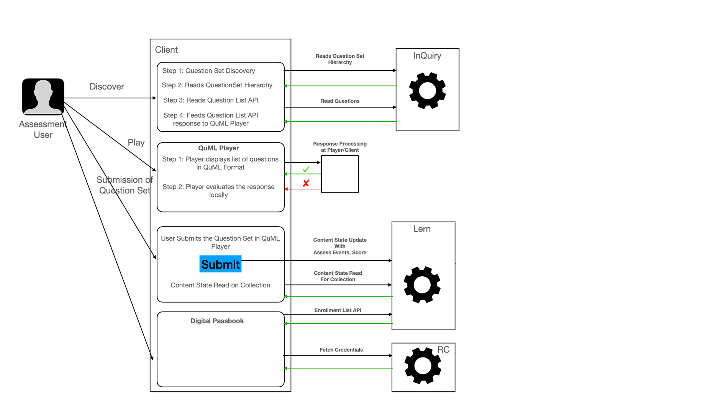
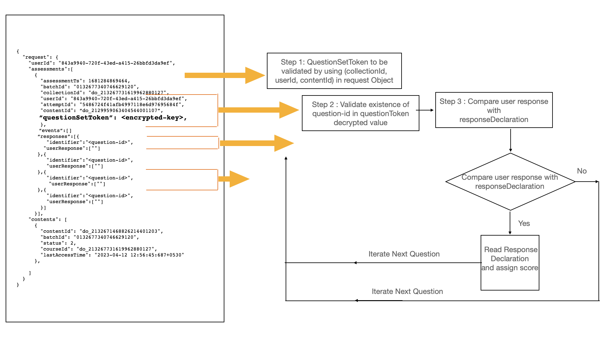

### Definition
For OGHR, Platform needs to enable user to undertake exams. Question set evaluation is currently on the client side and this implies that the correct answer is available to the client. We need to introduce the capability to process the user responses, evaluate and compute scores on the server side so that the correct answer does not have to be sent to the client side. 


### Background
In the present system, Question Set consist of following :

 **Assessment Use** r : Active seeker of Assessment in the platform. 

 **QuML Playe** r : QuML Player has capability to play the questions in QuML format. It also has capability to evaluate and compute score. Response Validation, Score Computing is completely handled in player as of now. Once User Submits the overall response, client validated scores and response are sent to the backend as ASSESS events using  **Content State Update**  API.

 **Question Editor**  : Question Set Editor enables the sourcing of question and questionSet in the system.

 **Flink Jobs**  : Flink Jobs aggregates the content state using Collection Activity Aggregator, Collection Assessment Aggregator, Cert Pre-processor, Cert Generator jobs.

 **Question Types** 

 **Objective Types** : 

a) MCQ (Multiple Choice Questions)

b) MSQ (Multiple Select Questions)

c) MTF (Match The Following)

d) FTB (Fill in The Blanks)

 **Subjective Types** 

a) VSA - (Very Short Answer) 

b) SA - (Short Answer)

c) LA - (Long Answer)


 **Building Blocks**  : 


|  **Building Blocks**  |  **API**  |  **Flink Jobs**  | 
|  --- |  --- |  --- | 
| Sunbird InQuiry | Question Set Hierarchy API |  | 
| Question List Read API |  | 
|  | QuestionSet Create API |  | 
|  | Question Create API |  | 
| Sunbird Lern | Content State Read | Collection Activity Aggregate | 
| Content State Update | Collection Assessment Aggregate | 
| Enrollment List API | Cert Pre Processer | 
|  | Cert Generator | 
| Sunbird RC | Cert Registry Download API |  | 


### Solution of Problem :

* Allow the assessment evaluation to be done on server for question sets that are chosen to be server evaluable.


* Answers to the question needs to be excluded from the Question Read API/ Question List API for server side assessment evaluation questions.


### Current Workflow



### Solution Proposed


.png)


###  **Technical Design Details** :
 **Creation side Enhancements** : Introduce “eval“ : {“mode“  : “client/server“}  attribute at question and questionSet Object Metadata level

A new attribute in QuestionSet to be introduced to mark it for server side evaluation. The editor need to allow setting this flag on a questionSet/questions. The creation APIs would be updated to support this attribute. Any question that is marked as “eval” : { “mode“ : “server“ } can only be part of a questionSet that is also marked as “eval” : { “mode“ : “server“ } . Also a question set that is marked “eval” : { “mode“ : “server“ }  should only contain questions with “eval” : { “mode“ : “server“ }.

(“evaluate at  **server** “).


```json
//Question Set Object
"questionSet": {
  “eval” : { “mode“ : “server“ } //#true for Server Side Valuation Default:#false for client side validation
}
//Question Object
"question" : {
  “eval” : { “mode“ : “server“ }
}
```


 **Consumption side Enhancements** There are two modes of accessing questionSet post this proposed change:

a) evaluable-mode : default  ( In case eval attribute does not exist or mode = client)

In this mode, theplayer uses the new GET questionSetHierarchy to fetch the hierarchy, existing question list API to fetch question body and the existing content state update API to submit the ASSESS events. Calculation of assess score remains at client side. 

b) evaluable-mode : server


Content Compatibility needs to be set to higher value so that discovery on older clients dont happen for this questionSet

We are proposing that, in this mode, the player uses the new POST questionSetHierarchy to fetch the hierarchy, the existing question list API and the existing Content State Update API without passing “score” & “pass”. Content State Update will fetch “score“ & “pass“ using new Inquiry Assessment API which introduced as part of this feature. 


1.  **QuestionSet Hierarchy API (new POST API)** 


The current questionsetHierarchy API is a get call and does not take in arguments. Introduce a new POST method for QuestionSet Hierarchy API that can take in request body. This API will have payload as follows 


```json
{
    "request": {
        "questionset": {
            "contentID": "",
            "collectionID": "",
            "userID": "",
            "attemptID": ""
        }
    }
}
```


This API would handle shuffling of options , selection of a subset of questions and randomisation (currently done by player) as indicated by the metadata in the questionSet.The API will also return a “ **QuestionSetToken** “ which is a signed token contains user-id, content-id, collection-id,attempt-id+selected_questionid_list received , eval mode as part of hierarchy payload.This token will further be passed to Content State Update & to new submitAssessment API from Content State Update.“ **QuestionSetToken** “ will be validated by submitAssessment API call. 


```json
"questionSet": {
  "timeLimits": "{\"maxTime\":\"3600\"}",
  "questionSetToken": "", //#Question Set token to be generated at hierarchy read API with combination of "Question Set ID + userID"
  “eval” : { “mode“ : “server“ } //#true for Server Side Valuation Default:#false for client side validation
}
```


 **QuestionSetToken**  : This key is almost equivalent of jwt token created as follows:

{

  "data": "       {

                            "contentID":"do_11381896937577676811",

                            "evalMode":"server",

                            "collectionID":"do_11381130283086643213",

                           "userID":"user-id",

                            "questionList":"< **do-id-1** >,< **do-id-2** >,….< **do-id-n** >",

                           "attemptID":"attempt-id"

                         }

}

 **2. Updates to QuestionList API** 

Question Read API : Any Question Associated with eval-mode-server  behaviour to trim off response declaration from Question Set and other answer displayed reference parameters in the response. 


```
"serverEvaluable": true,
"responseDeclaration": {
          "response1": {
            "maxScore": 1,
            "cardinality": "single",
            "type": "integer",
            -- To be Trimmed off ----
            "correctResponse": {
              "value": "0",
              "outcomes": {
                "SCORE": 1
              }
            },
            -- To be Trimmed off --
           
          }
        },
```


noteThere are multiple attributes which persists correct answer in QuML

a) responseDeclaration: (Shown above)

b) answer

c) editorState

There are multiple attributes which persists correct answer in QuML

a) responseDeclaration: (Shown above)

b) answer

c) editorState


 **3. Assessment API to evaluate user responses & calculate score** .

QuestionResponseValidateAPI (Sync API Behaviour):QuestionSetToken generated in Hierarchy is sent as part of this request. This token will help validate that the responses are submitted for the questions that were given out to this user and also verify the time of submission. 

API accepts the request payload similar to content state update API.


```
{
  "request": {
    "userId": "843a9940-720f-43ed-a415-26bbfd3da9ef",
    "questionSetToken": "",
    "assessments":[
      {
        "assessmentTs": 1681284869464,
        "batchId": "0132677340746629120",
        "collectionId": "do_213267731619962880127",
        "userId": "843a9940-720f-43ed-a415-26bbfd3da9ef",
        "attemptId": "5486724f41afb4997118e6d97695684f",
        "contentId": "do_2129959063404544001107"
        },
        "events":[],
      }],
    "contents": [
      {
        "contentId": "do_2132671468826214401203",
        "batchId": "0132677340746629120",
        "status": 2,
        "courseId": "do_213267731619962880127",
        "lastAccessTime": "2023-04-12 12:56:45:687+0530"
      },
      
    ]
  }
}
```


The Above payload mimics ContentStateUpdate API to mimic responses as above.

Reference Call for Content State Update
```
curl 'https://staging.sunbirded.org/content/course/v1/content/state/update' \
  -X 'PATCH' \
  -H 'Accept: application/json' \
  -H 'Accept-Language: en-GB,en-US;q=0.9,en;q=0.8' \
  -H 'Connection: keep-alive' \
  -H 'Content-Type: application/json' \
  -H 'Cookie: connect.sid=s%3Ahiv7abkP2ptQEspxLosgzBh_WeQAMcyt.Xx9l7ib6kHeMr131BvH4SHBzcXlcenr6BwIMAe1%2FVzo' \
  -H 'Origin: https://staging.sunbirded.org' \
  -H 'Referer: https://staging.sunbirded.org/learn/course/play/do_213267732169023488128?batchId=0132677340746629120&courseId=do_213267731619962880127&courseName=April%20course%203.9&selectedContent=do_2129959063404544001107' \
  -H 'Sec-Fetch-Dest: empty' \
  -H 'Sec-Fetch-Mode: cors' \
  -H 'Sec-Fetch-Site: same-origin' \
  -H 'User-Agent: Mozilla/5.0 (Macintosh; Intel Mac OS X 10_15_7) AppleWebKit/537.36 (KHTML, like Gecko) Chrome/112.0.0.0 Safari/537.36' \
  -H 'X-App-Id: staging.sunbird.portal' \
  -H 'X-App-Version: 5.2.0' \
  -H 'X-Channel-Id: 0126796199493140480' \
  -H 'X-Device-ID: dfab80b18d8ce5d4df8159ba05dde951' \
  -H 'X-Org-code: 0126796199493140480' \
  -H 'X-Request-ID: 0d460871-be9d-adf1-f7ab-aac64d1eaff7' \
  -H 'X-Session-ID: hiv7abkP2ptQEspxLosgzBh_WeQAMcyt' \
  -H 'X-Source: web' \
  -H 'X-User-ID: 843a9940-720f-43ed-a415-26bbfd3da9ef' \
  -H 'X-msgid: 0d460871-be9d-adf1-f7ab-aac64d1eaff7' \
  -H 'sec-ch-ua: "Chromium";v="112", "Google Chrome";v="112", "Not:A-Brand";v="99"' \
  -H 'sec-ch-ua-mobile: ?0' \
  -H 'sec-ch-ua-platform: "macOS"' \
  -H 'ts: 2023-04-12T13:05:05+05:30' \
  --data-raw '{"request":{"userId":"843a9940-720f-43ed-a415-26bbfd3da9ef","contents":[{"contentId":"do_2129959063404544001107","batchId":"0132677340746629120","status":2,"courseId":"do_213267731619962880127","lastAccessTime":"2023-04-12 13:05:05:524+0530"}],"assessments":[{"assessmentTs":1681284869464,"batchId":"0132677340746629120","courseId":"do_213267731619962880127","userId":"843a9940-720f-43ed-a415-26bbfd3da9ef","attemptId":"5486724f41afb4997118e6d97695684f","contentId":"do_2129959063404544001107","events":[{"eid":"ASSESS","ets":1681284888762,"ver":"3.1","mid":"ASSESS:67cf520cf4d9a29473844c19c3c3813d","actor":{"id":"843a9940-720f-43ed-a415-26bbfd3da9ef","type":"User"},"context":{"channel":"0126796199493140480","pdata":{"id":"staging.sunbird.portal","ver":"5.2.0","pid":"sunbird-portal.contentplayer"},"env":"contentplayer","sid":"hiv7abkP2ptQEspxLosgzBh_WeQAMcyt","did":"dfab80b18d8ce5d4df8159ba05dde951","cdata":[{"id":"do_213267732169023488128","type":"course"},{"type":"batch","id":"0132677340746629120"},{"id":"af588b6a747b6b3d28bea6d947dfbc49","type":"ContentSession"},{"id":"1a20fb335ff8dada7802d4473fe1a55e","type":"PlaySession"}],"rollup":{"l1":"0126796199493140480"}},"object":{"id":"do_2129959063404544001107","type":"Content","ver":"2","rollup":{"l1":"do_213267732169023488128","l2":"do_2129959063404544001107"}},"tags":["0126796199493140480"],"edata":{"item":{"id":"do_21299582901864857613016","maxscore":1,"type":"ftb","exlength":0,"params":[{"1":"{\"text\":\"\"}"},{"2":"{\"text\":\"\"}"},{"3":"{\"text\":\"\"}"},{"eval":"order"}],"uri":"","title":"Registration","mmc":[],"mc":[],"desc":""},"index":1,"pass":"No","score":0,"resvalues":[{"1":"{\"text\":\"Sharath\"}"},{"2":"{\"text\":\"10\"}"},{"3":"{\"text\":\"CSE\"}"}],"duration":16}},{"eid":"ASSESS","ets":1681284892463,"ver":"3.1","mid":"ASSESS:e57069e81c8e561915b20de23969e7ab","actor":{"id":"843a9940-720f-43ed-a415-26bbfd3da9ef","type":"User"},"context":{"channel":"0126796199493140480","pdata":{"id":"staging.sunbird.portal","ver":"5.2.0","pid":"sunbird-portal.contentplayer"},"env":"contentplayer","sid":"hiv7abkP2ptQEspxLosgzBh_WeQAMcyt","did":"dfab80b18d8ce5d4df8159ba05dde951","cdata":[{"id":"do_213267732169023488128","type":"course"},{"type":"batch","id":"0132677340746629120"},{"id":"af588b6a747b6b3d28bea6d947dfbc49","type":"ContentSession"},{"id":"1a20fb335ff8dada7802d4473fe1a55e","type":"PlaySession"}],"rollup":{"l1":"0126796199493140480"}},"object":{"id":"do_2129959063404544001107","type":"Content","ver":"2","rollup":{"l1":"do_213267732169023488128","l2":"do_2129959063404544001107"}},"tags":["0126796199493140480"],"edata":{"item":{"id":"do_21299582796158566413015","maxscore":1,"type":"ftb","exlength":0,"params":[{"1":"{\"text\":\"\"}"},{"eval":"order"}],"uri":"","title":"Edit test UT","mmc":[],"mc":[],"desc":""},"index":2,"pass":"No","score":0,"resvalues":[{"1":"{\"text\":\"1\"}"}],"duration":4}}]}]}}' \
  --compressed

```


Question Set Response Processing flow



Future Reference : Questions List Validation using back-end persistence Current design validity check of assigned Questions from QuestionSet collection proposes assigned list of questionIds  to be added in the JWT during hierarchy call & validate same during New Inquiry Assessment API. Storing same in Redis & Cassandra is an option which currently not considered.


* Scalable server side response processing for Question Sets.


* Response Processing can happen in two ways:


    * Entire Question Set Response Processing (Current solution scope)


    * Question by Question Response Processing


    


*****

[[category.storage-team]] 
[[category.confluence]] 
