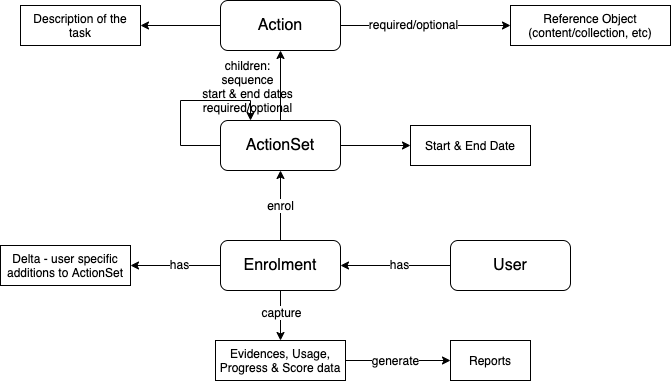

## Action
Action is a reference to an activity (in or outside the platform) that a user has to do.

* The activity could be consuming an entity like a course or quiz in the platform or could be a task that user does outside the platform. The task details are stored in “description” attribute of the “Action” object.

* User can submit evidences for progress (and/or completion) of the actions.

* Action can have reference to an object in the platform (like a course or a quiz) and the reference can be marked as required or optional.

## ActionSet
ActionSet is a collection of one or more actions (or action sets) with an associated set of rules that determine which of the actions a user sees, and in what order.

* ActionSets can contain other action sets recursively.

* ActionSets are always trackable, i.e the usage & progress of the user consuming the action set are always tracked by the platform.

* ActionSets can have start & end dates during which users can enrol and consume the ActionSet. ActionSet can also set sequence, start & end dates for child action sets and actions within the set.

* ActionSets allow enrolled users to add additional Actions specific to them. This is driven by an attribute (“allowExtension“) that can be set by the action set creator.

* User’s enrolment, usage, progress and score information is captured as part of the consumption. Reports are generated using this information and can be made available to different users based on role & scope assigned to them.

## Discovery and Targeting
Action & ActionSet objects have the following attributes for discovery and targeting purposes:

Organisation & Target FrameworksSimilar to other objects, Action & ActionSets can be tagged with organisation and target frameworks.

Target AudienceTarget audience attribute will be available for Actions & ActionSets also. The value can be one or more of “Student”, “Teacher”, “Admin” and “Other\*” (TBD - Other or Parent or both).

Target Personas (or Sub-Personas)Action and ActionSet objects can be targeted to one or more personas like “Head Master“, “DEO”, etc. Persona values will be different for each organisation and may also be linked to target audience values. 

Target Entity (or Location)Action & ActionSet objects can also be targeted to specific entities like a state, district, block, cluster or a school in an organisation. Each organisation have their own hierarchy of entities (locations and schools) and orgs can target their Action/ActionSet objects to one or more entities within the org.

Is there an association between target persona and target audience or any other attribute values (like target entity)?

Should we create a framework with these attributes as categories and use this framework as a target framework for the Action or ActionSet?

## Visibility & Access Path
Visibility and access to Action and ActionSet objects can be controlled by these attributes:

Visibility

|  **Visibility**  |  **Access**  |  **Curation**  | 
| Accessible by all users. Anyone can discover and consume these objects. | These objects must be curated, i.e. a user with appropriate “Reviewer” role should review and publish these objects. | 
| Accessible only to a limited set of users. By default, accessible only to users belonging to the same organisation to which the object belongs to. The access can be customised by defining a custom access path for the object. | These objects must be curated, i.e. a user with appropriate “Reviewer” role should review and publish these objects. | 
| Similar to “protected” - accessible only to a limited set of users defined by the “access path” attribute. | These objects can be published without curation, i.e. the creator of the object can publish the object with “private” visibility. | 
| Accessible only from within the parent object, i.e access to the users is based on the visibility of the parent object.  | These objects are published as part of publishing the parent. If the parent object is curated, then these objects are implicitly curated. | 
|  --- |  --- |  --- | 
|  --- | 
|  --- | 
|  --- | 
|  --- | 
| Accessible by all users. Anyone can discover and consume these objects. | These objects must be curated, i.e. a user with appropriate “Reviewer” role should review and publish these objects. | 
| Accessible only to a limited set of users. By default, accessible only to users belonging to the same organisation to which the object belongs to. The access can be customised by defining a custom access path for the object. | These objects must be curated, i.e. a user with appropriate “Reviewer” role should review and publish these objects. | 
| Similar to “protected” - accessible only to a limited set of users defined by the “access path” attribute. | These objects can be published without curation, i.e. the creator of the object can publish the object with “private” visibility. | 
| Accessible only from within the parent object, i.e access to the users is based on the visibility of the parent object.  | These objects are published as part of publishing the parent. If the parent object is curated, then these objects are implicitly curated. | 

AccessPathThis attribute is applicable for objects with “protected” or “private” visibility only. This attribute can be used to restrict the access based on or more of the following criteria: organisation, role, group, user id, and location.

noteAccessPath attribute of an Action or ActionSet can be overwritten when it is added to another ActionSet.

I.e. An Action can be marked as accessible for an organisation, but when it is added to an ActionSet, it can be marked as accessible only for users with a “Creator” role when accessed from within the parent ActionSet.

AccessPath attribute of an Action or ActionSet can be overwritten when it is added to another ActionSet.

I.e. An Action can be marked as accessible for an organisation, but when it is added to an ActionSet, it can be marked as accessible only for users with a “Creator” role when accessed from within the parent ActionSet.

## For Self Use
Users can consume ActionSets at their own pace and without being part of the batch that is being run by an organisation. All other behaviour remains the same except the schedule and access to the reports. The reports of ActionSets consumed for self-use could be made available only to the organisation for which the user has declared to share his/her data.

Not all action sets can be consumed for self-use. Action set creator can enable/disable the self-use of an ActionSet by setting the value of “enableSelfUse“ attribute to true/false.

## Enrolment Form
Certain Actions and/or ActionSets have enrolment forms which needs to filled in the user who is consuming them. These enrolments forms can be used for collecting additional information of the user (like roll number in a class, address, contact details, etc) or information about the entity for the Action/ActionSet is being consumed for (like the school which is being surveyed). The enrolment data will be stored in the platform and will be made available as part of the reports.

## Multiple Enrolments
Action Sets allow users to enrol multiple times for the same ActionSet at one time. This is by default allowed if self-use is enabled for the action set. For action sets where schedule is being managed by an organisation, organisation can choose to allow multiple enrolments or not.

## Sample Use Cases

### Improvement Project
Scenario: An improvement project for school head masters in a specific district where the head masters have to do a certain activity in their respective schools and submit the evidence. All the schools should finish the project within a fixed period.

* ActionSet contains one Action describing the activity to be done. ActionSet is marked with “protected” visibility, targeted for “Head Master” persona and access path is set to the specific district. Enrolment form is enabled for the ActionSet to capture the details of the school in which the activity is being done. Start and end dates are set for the ActionSet and “self-use” is disabled.

* Category name of the ActionSet is set as “Improvement Project”.

* This ActionSet is visible only for users belonging to the specified district. Users belonging to that district can enrol to this improvement project within the specified dates and submit evidences for completion of the activity.

* Org Admin and users with “REPORT_VIEWER” role & appropriate scope will be able to view the reports of this project.

### Program
Scenario: A state is running a program containing 4 courses and a quiz for all teachers in the state. The duration of the program is 5 weeks where 1 course is available for each of the first 4 weeks and the quiz is available in the 5th week.

* ActionSet contains 5 actions - 4 actions for the 4 courses and 1 action for the quiz. Start and end date of each course “action” and quiz “action” within the program “ActionSet” are set as per the schedule. Duration of the ActionSet (i.e time between start & end dates of the action set) will be 5 weeks or more. 

* End date for enrolments will also be set for the ActionSet object to disallow any new enrolments after the 1st week.

* ActionSet is marked with “public” visibility, targeted for “teacher” audience & a “state” location, and “self-use” is disabled.

* Category name of the ActionSet is set as “Program”.

* ActionSet is visible for all users but is shown as recommended for teachers belonging to targeted state. Users can enrol to the program before the enrolment end date and consume the ActionSet.

* Org Admin and users with “REPORT_VIEWER” role & appropriate scope will be able to view the reports of the program.

### Homework
Scenario: A class teacher creates group for all students in the class and assigns home work to be done by students during a vacation.

* ActionSet contains actions that the students need to do as homework. New actions are also added while action set is in progress.

* ActionSet visibility is set as “private” and access path is set to the “group id”. “self-use” is disabled and “allowExtension” is set to true for the action set.

* Category name of the ActionSet is set as “Home work”. And ActionSet is added as an activity to the group.

* All users in the group will see the ActionSet in their group’s list of activity. Group members can enrol and consume the ActionSet. Enrolled users can add additional actions only for them for doing additional activities as homework.

* Group admins will be view the reports of this action set.

### LearningJourney
Scenario: A NGO creates a learning journey, comprising of multiple courses and assessments, that helps teachers improve their class management capabilities. This is mainly for teachers who are motivated to learn and improve their skills.

* ActionSet is created with multiple actions referring to different courses and assessments. There are no start and end dates set for the action set (a recommended schedule for the child actions is provided) and “self-use” is enabled.

* Category name of the ActionSet is set as “Learning Journey”.

* All users can discover this action set and enrol for self-use. Users can consume this action set at their own pace and may choose to follow or not follow the recommended schedule.

* LearningJourney creators can see aggregate reports of the consumption.

## Appendix
Capabilities like “delta” (adding user specific additional actions or action sets), self-use, target personas, target entities, visibility & access path can be generalised and enabled for collections also.

*****

[[category.storage-team]] 
[[category.confluence]] 
