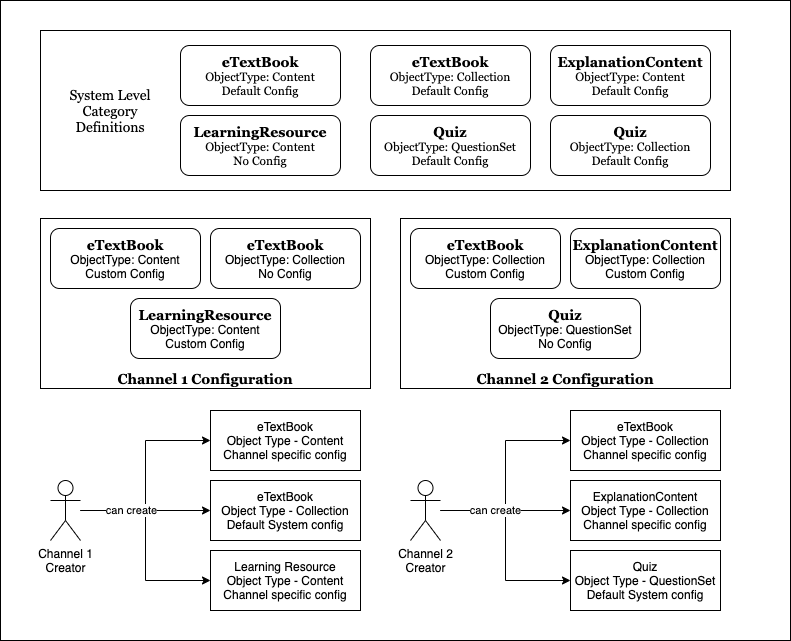

## Category Object Definition

* Name - Name of the category

* Description - Description of the category

* Object Type - Content, Collection, Question, QuestionSet

* ObjectMetadata - any of the [user provided metadata attributes](https://project-sunbird.atlassian.net/wiki/spaces/CO/pages/1572536374/Object+Types#Attributes-provided-by-User%3A) can be configured for the category.

    * name: name of the attribute, e.g: trackable, mimeType

    * defaultValue: default value to be set, e.g.: trackable = true

    * enum: list of allowed values for the attribute when creating objects for this category, e.g: mimeType: \[pdf, mp4]

    * modifiable: true/false, if the default value specified for the attribute in the category definition can be modified by the creator

    
* Organisation Framework Types

* Target Framework Types

* Display Categories - list of other categories that can be added as display categories for objects of this category 

A category will have one definition for object type.

### Channel Configuration
Each channel can configure the list of primary categories enabled for creators belonging to the channel. 

Channel can also override the category definition.

## Working Notes

* Categories should be configurable

    * Default & Fixed Behaviours: “Course” category will always have “trackable = yes” (i.e. fixed behaviour) and will have “Visibility = Public” by default (creator can modify it)

    * One category can be defined for Multiple object types: “TV Show“ category can be either a Content or a Collection object. 

    * Primary Category to Display Categories mapping

    
* Override Category Configuration by Channel

    * Platform level will have a master list of categories and their default definitions

    * A Channel can configure the following:

    * Applicable primary categories for the channel creators

    * Override definitions (optionally) for the selected categories

    

    
* Hierarchy Structure for collection categories

    * E.g.: “Textbook” category - {unit: “Chapter”, children: {unit: “Sub-Chapter”, objectTypes: \[], categories: \[]}}

    

Category Objects:

* TV Show - for object type Content

* TV Show - for object type Collection

* TV Show - for object type Collection & for channel “xyz“

* Course - for object type Collection & for channel “xyz“

Category Object:

* name

* description

* objectType

* channel

* displayCategories

* objectMetadata: 

    * name: trackable, hierarchyStructure, …

    * defaultValue

    * enum

    * modifiable: true/false

    

Category APIs:

* validate the objectMetadata definitions for category - should be subset of object schema

* cache on publish

* updates to category need not modify already created objects

Behaviour:

* “Primary Category” is required in create API

* Primary Category in not modifiable

* Schema validation (in both create & update): 

    * used to happen against object schema. 

    * Object schema should be overlaid with category schema (specific for the channel)

    * Overlaying should not happen at runtime… Cache all versions of the schema - per object, per category, per channel, etc…

    

Backward Compatibility:

* Content types mapping with category & other attributes

Data Migration of existing objects:

* Bulk or on-demand?

*****

[[category.storage-team]] 
[[category.confluence]] 
