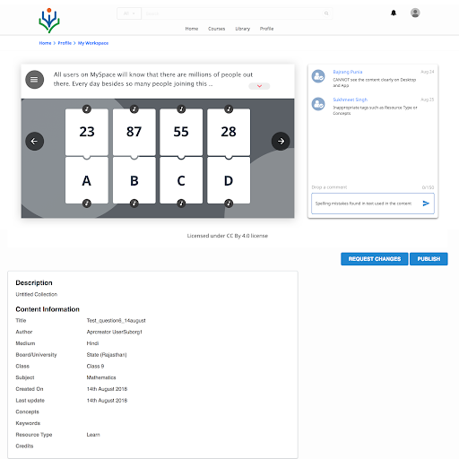
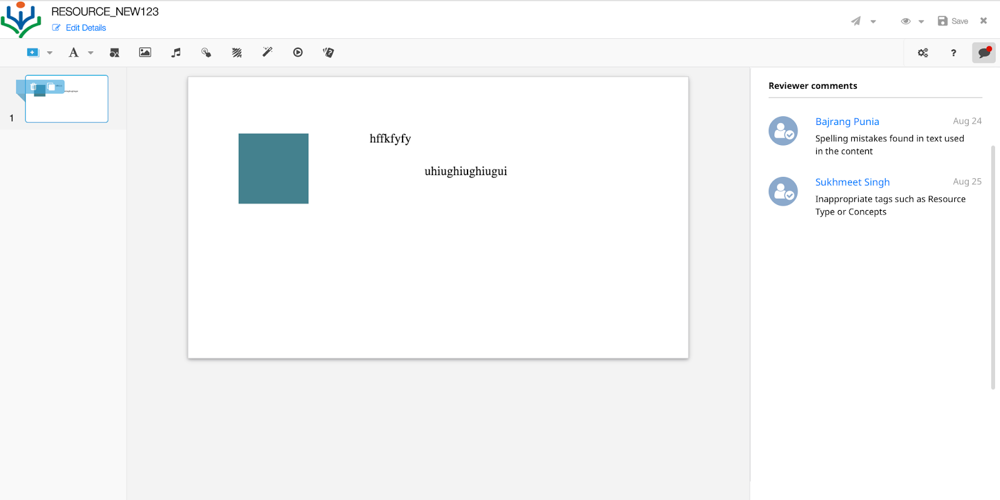

# Background:
Currently, Sunbird supports adding review comments by a content reviewer while rejecting a content. Comments can only be given at the content level.

# Problem statement:
Ability to provide review comments to a content at the page level.

# Proposed Solution:
To provide the ability to give review comment at page level we need to provide a new set of API to do CRUD operation. We need store and organize this comments in DB. Portal and Content framework should provide UI.

## Backend changes:
Create two module using the Ext framework.

1. Thread module
1. Content review module

DataBase:  **Cassandra: ** We can use Cassandra to store and retrieve data as the read/write is relatively manageable. As this operation are not search heavy.

Pros: 

1. Write faster
1. We have Cassandra set up in the content/portal. 

Table structure:           **1. Content review module** 

| Name | Definition | Example | 
|  --- |  --- |  --- | 
| threadId | unique identifier - string(Primary Key) | hash(contentId + version + context) | 
| contentId | content identifier - string | do_23hd453 | 
| version | content version - string | 5 | 
| context | data to store extra details - object |  {"type": "ecml", "stageId": "1"} | 
| userId | sunbird user id - string | ejdugjjd649nvhf | 
| userName | sunbird firstname + lastname | Sourav Dey | 
| userImage | sunbird profile image | [https://dev.open-sunbird.org/assets/images/sunbird_logo.png](https://dev.open-sunbird.org/assets/images/sunbird_logo.png) | 

 **         2. Thread module** 

| Name | Definition | Example | 
|  --- |  --- |  --- | 
| commentId | unique Identifier - string (Primary Key) | uuid | 
| threadId | identifier | hash(contentId + version + context) | 
| message | posted comments - string | This is test | 
| createdOn | comments date - current timestamp | 2018-10-03 13:33:35:868+0000 | 

Rest API's to be exposed:

| Name | Description | Type | 
|  --- |  --- |  --- | 
| createThread | API to create a thread | POST | 
| extractThreadList | API to get thread list | POST | 

 **Request body for creating a thread :** 

{

"request": {

"contextDetails": {

"contentId": "do_123",

"version": "2",

"contentType": "ecml",

"stageId":"1"

},

"message": "This is test",

"userId": "734re537281hdbkifm9",

"userName": "Ram",

"userAvatar": "[http://www.free-icons-download.net/images/male-user-logo-icon-65890.png](http://www.free-icons-download.net/images/male-user-logo-icon-65890.png)"

}

}

 **Request body for extracting a thread :** 

{

"request": {

"contextDetails": {

"contentId": "do_123",

"contentVer": "2",

"contentType": "ecml",

"stageId":"1"

}

}

}

If s **tageId**  is passed, then comments related to that stageId will be passed. If stageId is not present, all comments related that content will be returned.

Communication: 

We need to communicate between portal and content player to get current stageId.

1.  **EkstepRendererAPI.getCurrentStageId()** : We can use EkstepRendererAPI.getCurrentStageId() method to get current stage ID.

### UI changes:
UI changes are required in both portal and content editor.

UI changes in Portal: 

UI changes in the content editor:

## Limitation: 
Reviewer name and logo will be displayed same as when the reviewer commented. If the reviewer updates the name or logo it will not reflect in the old comments.

*****

[[category.storage-team]] 
[[category.confluence]] 
