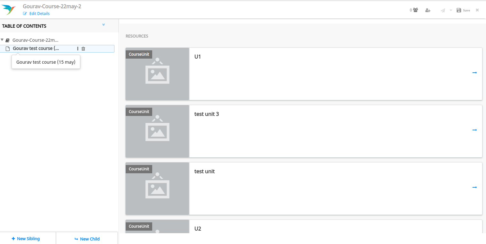

## Background 
As a content creator, when creating a course I should be able to add another course 


## Solution:- 

### Enabled root node with add child node & add a resource option  
 _Config:-_ 


```
"nodeDisplayCriteria": {
		"contentType": [ "Course", "CourseUnit",
			"Collection"
		]
	}, 
```
.png)
* By clicking on the root node(three dots) - Add “New Child“ and “Add Resource“ will show


* By selecting on the root node meta form should not show for the root node


### Resource Browser

* By clicking on the add resource “Latest course“ section will show along with the other resource sections


* After adding the “Course” in the root node the courseUnit/resource/collection of that course will show in the preview section



* The new child and new sibling on the selection of any published course/resource/collection will be disabled. 


### Resource browser filter

* As per the “Resource-framework“ config, the resource filter form will show


* This resource filter form will depend on the subtype (Textbook, Course, Collection).


* If the board is available for this “resource-framework“ the board filter will show


* By default, the board dropdown will be selected as per the context config


* The contentType “Course“ will be shown in the “ContenType“ dropdown.


```
window.context = {
  "user": {
    ...
  },
  "framework": "TPD",
  "resource_framework": "NCFCOPY",
  "env": "course",
  "board": [
    "CBSE"
  ]
}
```


*****

[[category.storage-team]] 
[[category.confluence]] 
