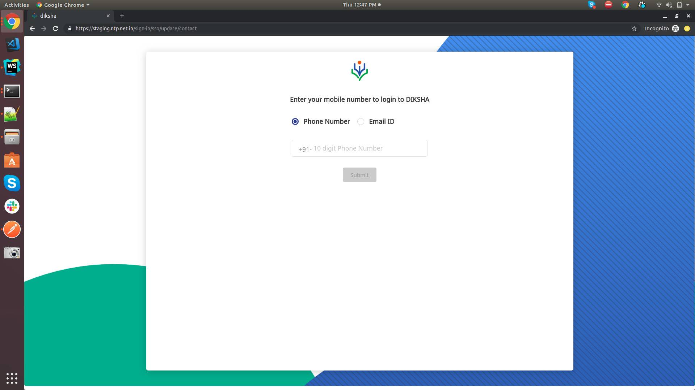

 **Overview:** Currently, Any user initiating a first time SSO login using an identifier that already exists in the custodian org - causes an auto migration of the account from custodian to the state tenant it can cause erroneous migration to avoid it user's acknowledgment is required.

If the user is found to match an account in the custodian org when the user tries to login via SSO for the first time, the user should be prompted about the existence of the duplicate account and asked whether the account belongs to them.

If the user stakes claim to the account, they have to prove ownership of the existing account (in custodian) by providing the password to the account. If a valid password is provided, the account in the custodian org is migrated to the state tenant. The SSO details sent by the state will apply to the new account for the user.

If the user refutes ownership of the existing account, they are provided with a new account on the state tenant as per the standard SSO workflow. The identifier is assigned to the new account in the state tenant. The old account in custodian that existed is stripped of the identifier and made inactive.

 **Problem statement:** Account auto-merge workflow should be handled in the portal front end and portal backend. An auto migration of the account from custodian to the state tenant it can cause erroneous migration to avoid its user's acknowledgment is required.

 **Approach :** 

.jpg)

                                          

 **Step 1: ** While SSO user is prompted to update email/Phone if not present already.

 **Step 2:** An OTP is generated and the user is allowed to enter received OTP.

 **Step 3:**  For new users, if email id is already found in dupe check show user a confirmation popup to initiate account migrate. If the user denies merging deactivate the nonstate user account and create a new account.If the user allows merging goto step 4

 **Step 4** : User is allowed to enter the password if the password is correct to initiate migration of account else allow the user to reenter the password.

 **Step 5:** Users re-enter the password. If the password is correct initiate account migration else create a new account for the user.

# Conclusions after design discussion

1. Send state token along with email/Phone number encrypted in redirectUri while opening keycloack page.
1. Mobile team should append client_id='andriod'.
1. Before calling migrate API portal should perform the following checks

    - Decrypt the encrypted data to get state token, user email 

    - Check if state token is valid using echo API

    - Check if state token is not expired.

    - Verify the access token

    - Check if email Id from encrypted data and the access token is same.
1. Only after all checks in step 3 are passed migrate API can be called. 
1. Once migration is done user will be notified via email from backend.
1. Mobile related changes - 

    User will be logged as a nonstate user after the user enters password or Gmail.

    Mobile needs to detect by reading the query parameter if auto-merge is in progress or not.

    If auto-merge is in progress mobile will call to portal sending encrypted data and access token to migrate the user.

    

    

    

## Open questions for the mobile team? 

1. Once the non-state user is migrated to state user how the data in the mobile client will can updated details 

### Draw.io flow chart link to edit - 

# UI Screens
Verify user via email or phone

user enters OTP

.jpg)

Click on the below-mentioned link for further flow.

[https://projects.invisionapp.com/share/2YT9CGQNASD#/screens/376879374](https://projects.invisionapp.com/share/2YT9CGQNASD#/screens/376879374)

*****

[[category.storage-team]] 
[[category.confluence]] 
