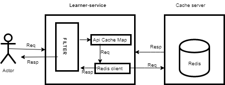

 **Overview :** 

 **                  ** Cache is an important aspect of an application to improve the api response time. For any heavily used system we need to have a mechanism to cache some of the data , which is not going to change very frequently. 

  As of now Sunbird won't have any  Caching mechanism on server side. So we are trying to bring caching implementation in Sunbird.  This Document will describe following sections.

  1.  Different ways to do caching

  2. What are the things need to be cache?

  3. what should be ttl?

  4. Cache implementation Design

# Different Caching implementation
 ** a.**    **In memory cache**   **:** 

        **Pros**  : 

           1. Data lookup is faster because it's store  in same server in memory.

           2. No serialisation / deserialisation overhead

        **Cons**  :  

            1.  in case of multiple instance data inconsistency will occurs.

            2.  Server memory usages will be high

            3. Scaling will be problem due to in memory cache. 

 ** b.**  **Distributed Cache : ** 

 ** **      **Pros**  :     

            1. Easy to scale

            2. No data  inconsistency

      **Cons**  :

           1. Single point of failure

            2. some latency for data read.  

# What need to be cache:
 We need to cache following api responses 

             1. get roles

             2. get MediaTypes (Social media link)

             3. get Org Type

             4.  page Assemble

              5. Org Creation report

              6. Org Consumption report

              7. User creation report

              8. User consumption report

              9. Course consumption report

              10. Skills list

              We can add some other user specific api for caching.

    \* TTL can be define based on data changes policy. if Data is going to change once in a while then ttl can be more.

    

# Implementation design with Redis: 

#    

 **WorkFlow: ** 

 **               ** Every request will be received by learner service filter, then filter will verify uri inside Api cache Map. This map will contains all those uri that need to be cached.

                **Case 1:**  Uri found inside map then with help of redis client it will make call to redis server.

                        **Case 1.1 :**   If data found in cache then it will be served from here it self.

                         **case 1.2 :  ** If data not found then response will be served from server and same will be saved in cache as well.

               **  Case 2 :  ** Uri not found inside map then normal flow will work.

Notes: 

  1 .Some of the master data will be loaded during server startup.

            Example : Role read, Page section cache,  OrgType , MediType, Skill Lists.

  2.  Update will happen on Cache data as well .       

public interface DataCache {

  public boolean saveData(String identifier, String value,long ttl);

 public String readData (String identifier);

 public boolean  update (String identifier, String value,long ttl);

public  boolean dataFlush();

 }

public Class RedisDataCacheImpl implements DataCache   {

}

# Different caching framework.
 1. Redis   2. EhCache  3. MemCache  4. HazelCast

  **Redis : **   Redis Read and write performance is more than EhCache , MemCache and HazelCast.

 **     Pros : ** 

 **                  ** 1. Supported multiple data type storage

                  2. Replication (Master salve) or (Master master) possible

                  3.  Data Consistency and durability

                  4. In-memeory support too

                  5.  Support for pub sub model.

      **Cons : ** 

               1.  Single threaded.

        

Apart from that server can set Cache-control , Etag  header to do the cache from caller side as well. 

# Approach to generate the key:
 There are different approach to generate keys.

   1. Store key as normal String 

            Example:  

                   GET  /v1/user/read/{userId}?keys=missingFields,profileCompleteness

                      **Key can be  :** 

                              a.  "/v1/user/read/{userId}"  

                              b.  "/v1/user/read/{userId}?keys=missingFields,profileCompleteness"

                              c :  {"/v1/user/read/{userId}" :{"keys=missingFields,profileCompleteness":""} }

                              d : Do the hash of complete key

                  POST/PUT/PATCH   /data/page/assember

                                     "request":{

                                                     "source":"web",

                                                      "name":"Explore_test",

                                                   "filters":{

                                                             }

                                                     }

                   ** Key can be : ** 

                                     HashOf  (URI+RequestBody):

Note: 

   1. Need to think about data privacy. 

   2. Key generation need to be explore more.

                           

                    

                            

*****

[[category.storage-team]] 
[[category.confluence]] 
