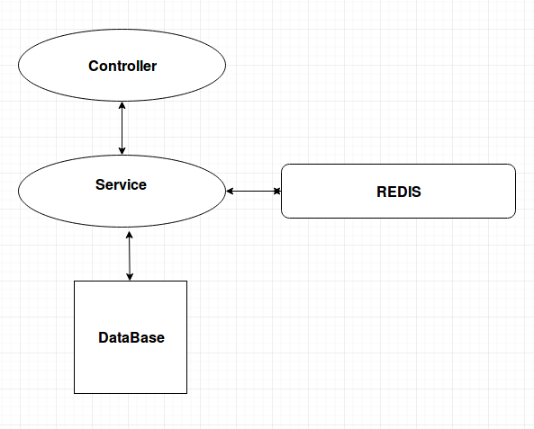

 **Overview** Use of caching for sending Response for the API which are most used and have least frequency of  update of underlying data.

 **Benefits :** 
1. It will reduce the load on database and also improve response time.
1. Will able to keep up all the supported API alive in case of database failure.

 **Disadvantage :** 
1. Some time may return old data if a concurrent read write operation happen in a time span of Redis update time , Redis update time means time taken by Redis to update data into the cache after a successful update API call. It will very rarely possible.

 **Following is List of API's which will supporting Redis Caching.** Respective keys are also mentioned for a read with a particular id.

| API ENDPOINT | KEY  | 
|  --- |  --- | 
| /v1/user/read/:uid | userId | 
| /v2/user/read/:uid | userId | 
| /v1/user/getuser | userId | 
| /v1/role/read |  | 
| /v1/user/course/list/:uid  | userId | 
| /v1/org/read | orgId | 
| /v1/page/read/: pageId | pageId | 
| /v1/page/section/list | pageId | 
| /v1/page/section/read/:sectionId | sectionId | 
| /v1/course/batch/read/:batchId | batchId | 
| /v2/dashboard/progress/course:batchId | batchId | 
| /v1/system/settings/get/:field |  | 
| /v1/note/read/:noteId | noteId | 
| /v1/issuer/list |                               | 
| /v1/user/skill/read-userId | userId | 

 **How Redis will be used :** Redis is an in-memory data structure project implementing a distributed, in-memory key-value database with optional durability. It will be used to keep API response of the most frequently used and least frequently updated API.

Redis supports primary key, indexing and composite key implementation which will be very beneficial in our use case.

Keys have the TTL functionality. We will set the key expiry time to average time for data being refreshed. Expiry time can be set to different for each key.

For example : Key combination for user read API . userId and singled valued hash for each group (u for User , o  for Org )

Following will the scenario:

1. Service will get data from Redis and returns the response to controller.
1. Service will not get data from Redis, now Service will get data from Database , returns it and update Redis cache for the future  :  **considering valid data scenario** .
1. Service will not get data from Redis, Now it will try to get it from Database . But For a invalid data it returns the error response.  No Redis cache update. :  **considering invalid data scenario** .

 **How Key should be created for storing different API responses :** We have unique key for some of API and some don't have keys. So we have to create a hybrid key which will help us to get response from a single key for any API from response.

We can generate a unique code for each API which will be cached, By appending this unique code in front of the unique key for that API will create  unique key for Redis. For scenarios like API not having keys we can only use the API unique code.

In case of filtration of data or response we have to handle it externally out of Redis.

Ex: For API URL : "/v1/user/read" code can be "v1-u-r" and unique key that is user id in this case can be "64036797-9704-45db-8e6f-22a04e0c9642"  so our Redis unique key for storing response can be of type "v1-u-r.64036797-9704-45db-8e6f-22a04e0c9642"

from above example it is clear that all the keys going to Redis will be unique.

*****

[[category.storage-team]] 
[[category.confluence]] 
