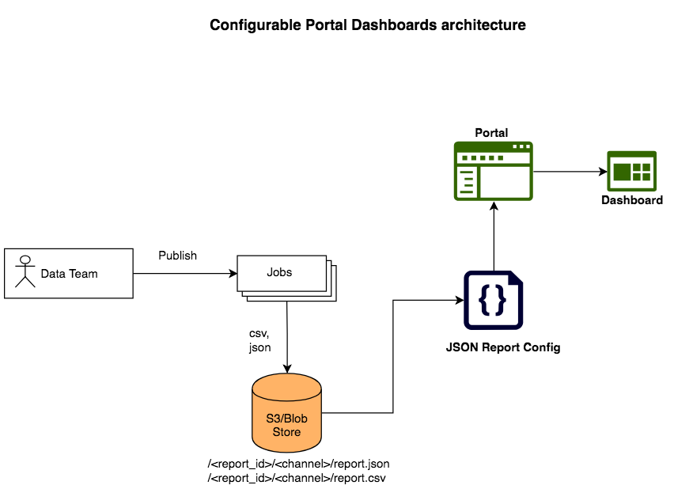

 **Introduction** This wiki details out the architecture of the configurable reports for portal dashboard and also serves as an implementation guide to configure and set up a report.

 **Overview** Currently, the data team generates the data for the weekly reports in Diksha and the reports are being sent out as an html file. The configurable reports feature helps embedding these reports into the portal. This provides the capability to add a new report or modify an existing report configuration without any downtime to the Diksha systems. The power of the feature lies in the configuration of the reports that defines how the report will be visualised from the portal.

 **Reporting Architecture** 


The data team runs scheduled jobs to generate various daily and weekly reports such as total active devices over time, total number of sessions over time etc. The generated reports will be in csv format. If necessary, the csv reports can be converted to json formats using open source tools. The report data are then uploaded to a cloud storage and isolated by the channel to which the report belongs to. Channel is analogous to isolation of the report data for each State separately. Each report will have an unique identifier and also a report configuration. The path or location on cloud storage will be prefixed with the report identifier and also the channel identifier. The reports are rendered on the portal using the report configuration which also specifies the location of the data for the report.

 **Implementation Guide** Report Configuration SpecificationThe portal dashboard reports can only be accessed by the organisation admin users. The report configuration will be in JSON format and the schema for the report configuration is listed out below.  A separate report configuration needs to be created for each of the organisation slug for which the report dashboards are being created. The multi-tenancy is achieved using the organisation slug which will be part of the  **dataSource** url specified in the configuration. Both charts and tables can be configured for visualisation. The data for the table visualisation can be either provided using the columns and values fields in the configuration with the actual data or using expressions for columnExpr and valuesExpr fields in the configuration. The charts field in the configuration takes an array of chart configuration which allows multiple charts to be configured for the same data.


```js
JSON Schema
[{
    id: String, // Required. Report ID.
    label: String, // Required. Report Label (will be shown up as menu)
    title: String, // Optional. Report title. Defaults to report label
    description: String, // Optional. Report description. HTML text can be included as description
    dataSource: String, // Required. Location of the data source to show the report. Can be an expression. For ex: /<report_id>/{{slug}}/report.json
    charts: [{ // Optional
 		datasets: [{
			data: Array[Number], // Required if `dataExpr` is not provided. Array of Number. Data points to show in the chart
			dataExpr: String, // Required if `data` is not provided. Expression pointing to the data in dataSource. For ex: {{data.noOfDownloads}}
			label: String // Required. Label to display on the chart
		}],
		labels: Array[String], // Required if `labelsExpr` is not provided. Labels to show on the x-axis
		labelsExpr: String, // Required if `labels` is not provided. Expression pointing to the data in dataSource. For ex: {{data.Date}}
		chartType: String, // Optional. Defaults to line. Available types - line, bar, radar, pie, polarArea & doughnut
		colors: [""], // Optional. Color to show for each dataset. Defaults to ["#024F9D"].
		options: { // Optional. options for display. Full set of options look at https://valor-software.com/ng2-charts/
			responsive: Boolean, // Defaults to true
			...
		}, 
		legend: Boolean // Optional. Whether to show the legend below/above the chart. Defaults to true and position to top.
    }],
    table: { // Optional
        "columns": Array[String], // Required if `columnsExpr` is not provided. Columns to show.
        "values": Array[Array[String]] , // Required if `valuesExpr` is not provided. Column data.
        "columnsExpr": String, // Required if `columns` is not provided. Expression pointing to the data in dataSource. For ex: {{keys}}
        "valuesExpr": String // Required if `values` is not provided. Expression pointing to the data in dataSource. For ex: {{tableData}}
    },
    downloadUrl: String // Location to download the data as CSV
}]] ]></ac:plain-text-body></ac:structured-macro><p class="auto-cursor-target" style="margin-left: 30.0px;"><br />A sample configuration for a report with the required attributes is shown below.</p><ac:structured-macro ac:name="code" ac:schema-version="1" ac:macro-id="c1c00c60-9a51-48a7-85aa-63ca857d1edc"><ac:parameter ac:name="language">js</ac:parameter><ac:parameter ac:name="title">Sample report schema</ac:parameter><ac:plain-text-body><![CDATA[{
    id: "usage",
    label: "Sunbird Usage Report",
    title: "Sunbird Usage Report",
    description: "The report provides a quick summary of the number of downloads for a content and number of successful dialscans for a dialcode.
    dataSource: "/usage/$slug/report.json",
    charts: [
        {
        	datasets: [{
        		dataExpr: "data.Number_of_downloads",
        		label: "# of downloads"
        	}],
        	labelsExpr: "data.Date",
            chartType: "line"
        },
        {
        	datasets: [{
        		dataExpr: "data.Number_of_succesful_scans",
        		label: "# of successful scans"
        	}],
        	labelsExpr: "data.Date",
            chartType: "bar"
        }
    ],
    table: {
        "columnsExpr": "key",
        "valuesExpr": "tableData"
    },
    downloadUrl: "<report_id>/$slug/report.csv"
}


```


Report data format specification:The report data needs to be in JSON format. However, the current implementation supports CSV format as well by providing an implicit conversion of the CSV data into JSON using open source tools. The  **downloadUrl ** in the report schema configuration will specify the location of the CSV file on cloud storage or disk. The CSV file should contain a header row indicating the fields that can be used for both the chart and table visualisation.  A sample report data JSON file is shown below. The keys section is an array of fields that will be displayed in a table or a chart. The tableDate section contains the data that need to be displayed in the visualisation layer.


```js
{
  "keys": [
    "Date",
    "Number_of_downloads"
  ],
  "data": {
    "Date": [
      "2018-12-01", "2018-12-02", "2018-12-03", "2018-12-04", "2018-12-05", "2018-12-06", "2018-12-07"
    ],
    "Number_of_downloads": [
      "1850", "2218", "2312", "1265", "2113", "8726", "1763"
  },
  "tableData": [
    [ "2018-12-01", "1850" ],
    [ "2018-12-02", "2218" ],
    [ "2018-12-03", "2312" ],
    [ "2018-12-04", "1265" ],
    [ "2018-12-05", "2113" ],
    [ "2018-12-06", "8726" ],
    [ "2018-12-07", "1763" ]
  ]
}
```


Naming convention for cloud storage upload directory


* Azure blob storage is the default cloud storage supported by the Sunbird portal. The container name can configured using an environment variable  **sunbird_azure_report_container_name** in Sunbird portal and the default value for the container name is  **reports** . The container needs to be a private container and is created as part of the reports setup.
* The report configuration schema for each organisation slug (multi-tenancy) will be under the specific channel id for the organisation. For e.g. reports/sunbird/config.json will be a report configuration for the sunbird organisation and reports/sunbird/reports.csv and reports/sunbird/reports.json will be the respective data files in CSV and JSON formats.  
* Both the dataSource and downloadUrl fields in the report configuration will have relative paths to the report configuration and the report data.


*****

[[category.storage-team]] 
[[category.confluence]] 
