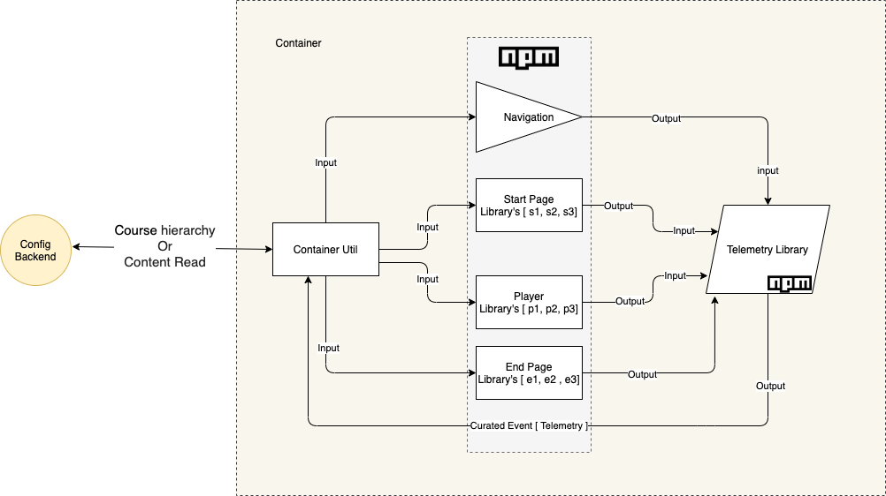

  * [Introduction](#introduction)
  * [Design Approach - 1](#design-approach---1)
    * [List of Libraries ](#list-of-libraries-)
  * [Controls ](#controls-)
  * [Events (TBD)](#events-(tbd))
  * [Distribution and composability](#distribution-and-composability)
  * [Open Questions](#open-questions)
* [Design Approach - 2](#design-approach---2)
  * [NPM ? [ navigation , startPage, Player’s, Endpage ]: ](#npm-?-[-navigation-,-startpage,-player’s,-endpage-]:-)
  * [Telemetry Library : ](#telemetry-library-:-)
  * [Some important aspects and behaviour of this design : ](#some-important-aspects-and-behaviour-of-this-design-:-)

## Introduction
This documents list the design approach which we are taking to rewrite the content player such that

 **For users:**  Faster load times, great user experience and leaves less memory footprint on the browser.

 **For Developers:**   parallel development, decoupled and can be concentrated on a specific player

 **For Product owners:**  Easy to experiment with new functionalities and UI


## Design Approach - 1
Here we want to build one player(Library) for each  type of content which is independently built and deployable and can be integrated with other clients like web, mobile, and desktop


### List of Libraries 
 **Players**  : 

Each player is a library that can be injected in any application or can be independent and expects certain input to initialize will emit actions/interactions during the course of playing content.


* PDF       


* Video     


* EPUB       


*  H5P        


* QuML    


* HTML    


* Collection Player(combination of all the players)


 **config:** 


```json
{

  controls: {
    showStartPage: <boolean>,
    showEndPage: <boolean>,
    showNavigation: <boolean>
    Menu: <boolean>
  }
}
```


Each Player type will have there own standard config below is the config for PDF player


```
{
 path: <String>,
 controls: {
    showStartPage: <boolean>,
    showEndPage: <boolean>,
    showNavigation: <boolean>
    Menu: <boolean>
  }
}
```


 **Collection Player:** 

This is the collection of all the players which will take the input as standard collection object handles the to render the TOC view and player view will be extension point where based on the content type we will have the mapping to the player.


##  **Controls**  :  
Each player interactions ie. StartPage, Endpage, Menu, Navigation, etc is also a library that will get injected based on the input config to the player.

Here we will have the extension points which player should define to 


## Events (TBD)
 **START** 


```
{
  "eid": <uuid>,
  "ets": <timestamp>,
  "ver": <event-version>,
  "type": "START",
  "data": "<object>" (TBD)
}
```
 **END** 


```
{
  "eid": <uuid>,
  "ets": <timestamp>,
  "ver": <event-version>,
  "type": "END",
  "data": "<object>" (TBD)
}
```
 **EVENT** 


```json
{
"eid": <uuid>,
"ets": <timestamp>,
"ver": <event-version>,
"type": <event-type> // play, pause, scroll, touch, heartbeat
"data" : <object>
}
```


Event library emits the above events and container should convert them to telemetry events when in standalone mode?


## Distribution and composability
The primary distribution will be npm as the angular library 

{

 **Player**  :

 dependencies  {

Events Library

Controls Library

}

}


## Open Questions

1. are we going to emit existing telemetry events for backward compatibility when integrated with the container?


# Design Approach - 2


In this approach we are trying to build each element (  ie. StartPage, EndPage, player  etc. ) as a library which plays a role in content player life cycle ,  **without any major changes on existing backend API’s**  . This will be built and packaged for Online and offline use.


 **Content Lifecycle flow of a player [ standalone and collection ]** 


Below is the description of each section of the diagram \[ Left to Right] 

 **Config Backend:** 
*  **Standalone player**  \[ Lifecycle of this player ends with playing one MIME type]

    


```json
{
  "startPage": [{}],
  "navigationConfig": {},
  "pdfPlayer": {},
  "endPage": [{}]
}
```
 **config-1** 


*  **Collection player**  \[ Lifecycle of this player depends on the MIME type it plays  ]

    


```json
{
  "startPage": [{}],
  "navigationConfig": {},
  "pdfPlayer": {},
  "videoPlayer": {},
  "epubPlayer": {},
  "endPage": [{}]
}
```


 **config-2** 

 **Container Util:** To maintain the current API structure this Util need to be placed . The job of util is to convert existing API \[ Course Hierarchy / content Read ] to a readable/ understandable  structure  by all the other libraries \[ will explain the libraries and its role below]. 


High level output structure of a Container Util after constructing the input from existing API :


```json
{
    "navigationConfig":{
      "isNavCtrl": true,
      "alignment": "middle"
    },
    "startPageConfig": [
      {
        "index": 1,
        "id": "startPageIdentifier"
    },
    {
        "index": 3,
        "id": "startPageIdentifier"
    }
    
    ],
    "pdfPlayerConfig":{
      "index": 2,
      "id": "pdfPlayer"
    },
    "videoPlayerConfig":{
      "index": 4,
      "id": "videoPlayer"
    },
    "endPageConfig":[ {
      "index": 5,
      "id": "endPageIdentifier"
    },
    {
      "index": 6,
      "id": "endPageIdentifier"
    }
    ]
}
```
 **config-3** 


 **What this structure tells and why i need this ?** 

This structure tells following two things. 

 **What to Render ?** 


* I need to load a navigation library \[navigationConfig  is the property which is telling  that ]


* I need to load a PDF player library \[pdfPlayerConfig  is the property which tells  that ]


* I need to load a video player library \[videoPlayerConfig is the property which tells  that ]


* I need to load a start page library \[startPageConfig is the property which tells  that ]


* I need to load a End page library \[endPageConfig is the property which tells  that ]


 **When to Render ?** 


*  **Index**  field tells  **navigation library**  when to load what .

               Above case(JSON) config tells the  **navigation library**  to load other library in this sequence 

    \[ startPage - > PDF → startPage → video → endpage → endpage ]. this sequence can have N number of combination.   


Note:  Object of the same library Array is having different configuration or different version of same library to show different information / UI  at different stage of rendering 


## NPM ? \[ navigation , startPage, Player’s, Endpage ]: 
Each and every component which is having it’s on lifecycle will be a library and can be use individually\[ individual content ] or with each other  \[ collection content ]

Each library will be a NPM module which has to inject in the container app at the time of build / deployment 

Library structure  is an industry  standard structure of an angular library which may / maynot be having a demo app within, to test it individually.  \[ We can also have a Boilerplate generator to generate a  sunbird standard library ]  

 **_@input_** :  Each library expect some basic input to instantiate 

 **_@output_** : Each library emit two types of events \[ Basic player Events and Telemetry related events \[ INTRECT , IMPRESSION, OTHERS ] ]

 **Standard library structure:** 


## Telemetry Library : 
This is a generic library which will convert each and every  libraries \[ ie. player’s , startpage , endpage etc.. ]  output events to existing telemetry library events and send it back to container for processing.  

 **_Q-1: Will it be intelligent enough to understand different types of event sent from different types of library_**  _OR._  _each library must be having an interface so that all the library will be able to send same structure for any event [ TBD ]_ 


## Some important aspects and behaviour of this design : 
 **Navigation pattern of content lifecycle:** 

There are two kind of navigation support by this approach


1. External Navigation


1. Internal Navigation


 **External Navigation**  : This is a NPM library which will navigate through other libraries.  

 **Internal Navigation**  : Each player library may or maynot be having a navigation to walk through the particular content ( ex. PDF needs a internal navigation but video doesn’t ) 

                                                  Visual difference on external and internal navigation 


 **How navigation control works ?** 


* External control navigation lib job is to navigate to next / previous library \[ based on the  **config-3**   ]


* Inside a player library,  External navigation will not be having any control.


* From the end of the player library ( whatever end means to a particular player ) it emit an event which  will tell external navigation to take control back and navigate further.


According to this design , Each player should be having its Internal navigation built in.  External navigation library will only support navigating between the different libraries. 


 **TBD** :   If we reach here 


* What is START and END event for a individual player lifecycle. if it is start and end page will it be part of each content. 


* What is START and END event for a collection player lifecycle. is it collection START / END or individual content START/END.   


*****

[[category.storage-team]] 
[[category.confluence]] 
