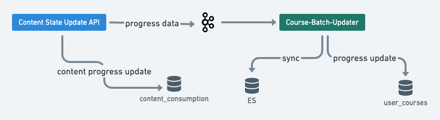

## Current Design:
Below are the key design problems:


1. Remove ES for user enrolment data and use only Cassandra table.


1. Computation of metrics at Course and CourseUnit Level.


1. Implementation logic to generate AUDIT events.


1. Reports generation only for batches created using TPD Courses.


## Proposed Design:
Below is the implementation design for the first three problems.

note **Important changes with this design** 


1.  **user_courses**  table replaced with  **user_enrolments** .


    1. No changes to the columns.


    1. primary key and clustering keys are updated.


    
1. Using  **Relation-Cache-Updater Flink**  Job to generate and save the required cache for metrics computation.


1. Replacing  **Course-Batch-Updater**  Samza Job with  **Course-Metrics-Aggregator**  Flink Job.


 **Important changes with this design** 


1.  **user_courses**  table replaced with  **user_enrolments** .


    1. No changes to the columns.


    1. primary key and clustering keys are updated.


    
1. Using  **Relation-Cache-Updater Flink**  Job to generate and save the required cache for metrics computation.


1. Replacing  **Course-Batch-Updater**  Samza Job with  **Course-Metrics-Aggregator**  Flink Job.


### Relation Cache Updater:
When publish-pipeline job complete processing a content publishing, it pushes an event to post-publish-processor topic.

We use “post-publish-processor” as input for this job and generate the below relation-cache  **which is complex to compute and use**  by many micro-services of the platform at runtime.


|  **Key**  |  **Value**  |  **Sample**  | 
|  --- |  --- |  --- | 
| <collectionId>:leafnodes | List<String> | courseunit1:leafnodes: \[“resource1”,”resource2”,] | 
| <rootCollectionId>:<resourceId>:ancestors | List<String> | democourse:resource1:ancestors: \[“courseunit1”, “democourse”] | 

We are considering the below Course Structure for defining the sample data:


```go
democourse
  - courseunit1
      - resource1
      - resource2
  - courseunit2
      - resource3
      - resource4
```

### Activity Aggregate Updater (Course Metrics Aggregator):
Below is the sample input event for this job to process and compute the metrics.


```json
{
  "eid": "BE_JOB_REQUEST",
  "ets": 1563788371969,
  "mid": "LMS.1563788371969.590c5fa0-0ce8-46ed-bf6c-681c0a1fdac8",
  ...
  "edata": {
    "contents": [
      {
        "contentId": "do_11260735471149056012299",
        "status": 2
      },
      {
        "contentId": "do_11260735471149056012300",
        "status": 1
      }
    ],
    "action": "batch-enrolment-update",
    "iteration": 1,
    "batchId": "0126083288437637121",
    "userId": "8454cb21-3ce9-4e30-85b5-fade097880d8",
    "courseId": "do_1127212344324751361295"
  }
}
```
Course Progress:For each event, it does the course progress computation and AUDIT event generation as below.


1. Fetch the user enrolment for given userId, batch-Id and course-Id. It contains “contentStatus”.


1. Merge “contentStatus” with the event data (contentId + status).


1. Get the leaf-nodes of the course from Redis or Content Read API.


1. Compute course progress as below and update user_enrolments table.


    1. unique-completed-contents-count/unique-leaf-nodes-count\*100


    

Course & CourseUnit Metrics:For each event, it does the course and courseunit level metrics computation and AUDIT event generation as below:


1. Fetch the user enrolment for given userId, batchId and courseId. It contains “contentStatus”.


1. Merge “contentStatus” with the event data (contentId + status).


1. Get Ancestors (all the parents of the content) for the Content for which status update is executing.


1. For each Ancestor, object compute the metrics as below and update user_activities_agg table.


    1. Get the leafNodes at this level = parentLeafNodes


    1. Filter “contentStatus” using parentLeafNodes with status as completed = completedAtThisParentLevel


    1. unique(completedAtThisParentLevel)/unique(parentLeafNodes)\*100


    1. AUDIT Events for CourseUnit:


    1. CourseUnit START - size(completedAtThisParentLevel) == 1


    1. CourseUnit COMPLETE - size(completedAtThisParentLevel) == size(parentLeafNodes).


    

    

AUDIT Events:

|  **Object**  |  **Action**  |  **When**  |  **Logic**  | 
|  --- |  --- |  --- |  --- | 
| Course | enrol | On first entry of the “content consumption” for the enrollment (userId, batchId and courseId). | When “contentStatus” - Map size is only one & it is part the unique leafNodes list. | 
| Course | complete | When the total leaf nodes of the Course and the total completed content identifiers matching (when all the leaf nodes of the Course consumed by the user). | When user_enrolment marked as completed. | 
| CourseUnit | start | On the first occurrence of the CourseUnit leaf nodes completed. | size(completedAtThisParentLevel) == 1 | 
| CourseUnit | complete | When all the leaf nodes of the CourseUnit completed. | size(completedAtThisParentLevel) == size(parentLeafNodes) | 
| Content | start | When the first entry for this content with status=1 (in progress) | For every event based on its status. | 
| Content | complete | When the first entry for this content with status=2 (completed) | For every event based on its status. | 

 **Note:**  For all the above scenarios we should generate event only once and for the first occurrence.


### Course Reports - Only for TPD:
With the current implementation, course reports are generated for all the on-going batches in our platform. 

With Schooling@Home use cases, users creating Course for ETB and other use cases. But, the current reports are not required for this feature. So, we should identify the baches created for TPD and generate reports only for them.

Below is the logic to identify the batches created for TPD


* For TPD we have dedicated framework(s). Using **Framework**  (Taxonomy) we can easily identify the Course which is created for TPD.


* So, for a given batch get the metadata of the Course and validate it is a TPD framework or not.


Have an interface method using which we can filter the baches created for TPD only.


1. Get all the on-going baches.


1. Fetch unique course identifiers from the above batches list.


1. Make content-search (or ES scroll) API to fetch framework property of all these courses.


1. Have a configuration (using JobConfig) for accepted frameworks list.


1. Filter the batches which belong to the configured frameworks.


    1. Below is the logic snippet.


```js
jobConfig.acceptedFrameworks.contains(batch.course.framework)
```


    


*****

[[category.storage-team]] 
[[category.confluence]] 
