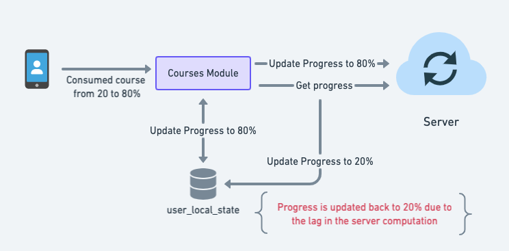
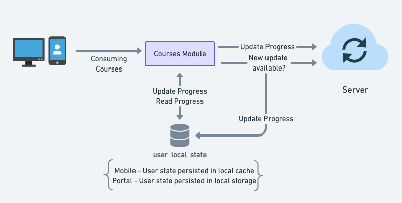

## Current Design
Following are the key problems with the current design:


1. Writing progress updates and completion percentage to ES is not able to scale to the required needs. ES is not build for massive writes similar to Cassandra.


1. Content state update API writes to two Kafka topics and does a read/write to Cassandra. Scaling the API requires to scale both Kafka and Cassandra which is not cost efficient


1. Course Reports/Assessment reports are not able scale beyond a point due to the join done on close to 7 tables and also due to writing the report output to ES


1. Max records returned from ES is 10k which breaks the “View Online” functionality for course admin when there are more than 10k users in the batch 


## Proposed Design
Proposing the following changes for the courses infra to scale vertically


1. Remove the writing of report to ES. This would mean to disable the view online of report functionality for the Course Admin.


1. Generate a de-normalized user table from all the tables, so that the report generation is just one join with the user_courses table


1. Update the user_courses and course_assessment tables to contain batch and course information


1. Remove the writing of course aggregate information to ES and update the enrolment list API to read from Cassandra. This would mean that we have to only scale Cassandra for the desired read/write throughput


## Group Progress Updates
With the introduction of groups for the e-schooling use case, there is necessity to be able to view the course progress for all users for all courses within a group. There are two ways to go about it:


1. Batch Mode - Where the group progress is updated on a schedule (every 24 hrs).


1. Query Mode - Where the group progress is queried dynamically when needed (and possibly cached with a ttl for performance)


Following are the pros & cons of both approaches:


### Batch Mode
Pros


1. Quicker to implement as it follows the existing reports design


1. Scales to any number of group progress requests as the API will be reading static files


Cons


1. Group progress is update once per day (or depending on the schedule)


1. If the group progress read is only requested once/twice per day and that too not for all groups - generating static files for all groups may not be required


### Query Mode
Pros


1. Can be produced real time (based on the defined ttl for cache)


1. Might be efficient as there may not be too many requests for group level progress updates


Cons


1. Need a cache (like Redis) to improve performance of the API.


1. Too little ttl and too many update requests would necessitate to scale the underlying DB which adds to the infra cost


Within the query mode - we have two possible sources where the data can be queried from:


1. Cassandra


    1. Pros


    1. Can support faster key based queries. For ex: a query on course_id and user_id


    1. Need to scale only one DB to scale the entire courses infra


    
    1. Cons


    1. Limited query capability. Performance is guaranteed only when queried via the partition key. 


    1. Filtering either by user properties or course properties needs to be done in memory of the API after fetching the data from db.


    1. Data joins to be done in memory. 


    

    
1. Druid


    1. Pros


    1. Faster and easier to scale.


    1. Supports joins from 0.18 version onwards


    1. Can query on any dimension


    
    1. Cons


    1. Append only DB. The Samza/Flink job needs to take care of idempotency


    1. Can query only by date field (as segments are created by date). Need to do custom data source design to be able to support the courses reporting needs which can become extremely complex


    

    


## Edge Caching

## Group Activity Aggregates

### APIs
note
### Get group aggregates

### Get group aggregates
POST - /data/group/agg **Request** 


```json
{
  "request": {
    "groupId": String, // Required.  
    "activities": ?[{ // Optional. List of activity ids
      "id": String, // Required. The activity id
      "type": String // Required. The activity type
    }],
    "fields": ?Array[String] // Optional. The list of fields to send in the response
  }
}
```
 **Response** 


```json
{
  "result": {
    "groupId": "",
    "activity": [{
      "id": "do_12312312",
      "type": "Course",
      ... // Other activity metadata like - course name, end date, status etc
      "agg": [{
      	"metric": String, // Metric ID
      	"value": Number, // Metrics Value
      	"lastUpdatedOn": Timestamp // When did the metric last update?
      }]
    }]
  }
}
```
note
### Get activity aggregates

### Get activity aggregates
POST - /data/group/activity/agg **Request** 


```json
{
  "request": {
    "groupId": String, // Required. The group id
    "activityId": String, // Required. The activity id within the group
    "activityType": String, // Required. The activity type within the group
    "fields": ?Array[String] // Optional. The list of fields to send in the response
  }
}
```
 **Response** 


```json
{
  "result": {
    "groupId": "",
    "activity": {
      "id": "do_12312312",
      "type": "Course",
      "metadata": {},
      "agg": [{
      	"metric": String, // Metric ID
      	"value": Number, // Metrics Value
      	"lastUpdatedOn": Timestamp // When did the metric last update?
      }]
      "members": [{
      	"id": String, // User ID
      	.... // User profile attributes required for display
      	"agg": [{
      	  "metric": String, // Metric ID. For ex: progress, completed, timespent etc
      	  "value": Number,
      	  "lastUpdatedOn": Timestamp
      	}]
      }]
    }
  }
}
```

### Schema
Assumptions:


* Group, activity and user tables exist and a mapping table exists for the group-activity-user relation


 **activity_user_agg** 


|  **Column**  |  **Type**  |  **Description**  | 
|  --- |  --- |  --- | 
| activity_type | String | Type of the activity - Course, CourseUnit, Quiz etc | 
| activity_id | String | Id of the activity - course_id, content_id etc | 
| user_id | String | User Id | 
| context_id | String | Context in which the activity happened. Combination of type:value. For ex: CourseBatch → cb:do_123121 | 
| agg | Map<String, Number> | Aggregate metrics for the user and activity combination | 
| agg_last_updated | Map<String, Timestamp> | When did the agg metrics last updated? | 

 **Partition Key**  - (activity_type, activity_id, group_id, user_id)

 **activity_agg** 

|  **Column**  |  **Type**  |  **Description**  | 
|  --- |  --- |  --- | 
| activity_type | String | Type of the activity - Course, CourseUnit, Quiz etc | 
| activity_id | String | Id of the activity - course_id, content_id etc | 
| context_id | String | Context in which the activity happened. Combination of type:value. For ex: CourseBatch → cb:do_123121 | 
| agg | Map<String, Number> | Aggregate metrics for the activity | 
| agg_last_updated | Map<String, Timestamp> | When did the aggregate metrics last updated? | 

 **Partition Key**  - (activity_type, activity_id, context_id)


### Course Metrics

1. completedCount


1. completionPercentage


1. enrolledCount


1. <TBD>


### Course User Metrics

### Open Questions

1. Do we need activity_agg table which is a next level aggregation on activity_user_agg table?


1. Will there be an activity happening only in group context? For ex: course can be taken up outside group but aggregated within group. But there can be a quiz conducted within group context across multiple groups.


*****

[[category.storage-team]] 
[[category.confluence]] 
