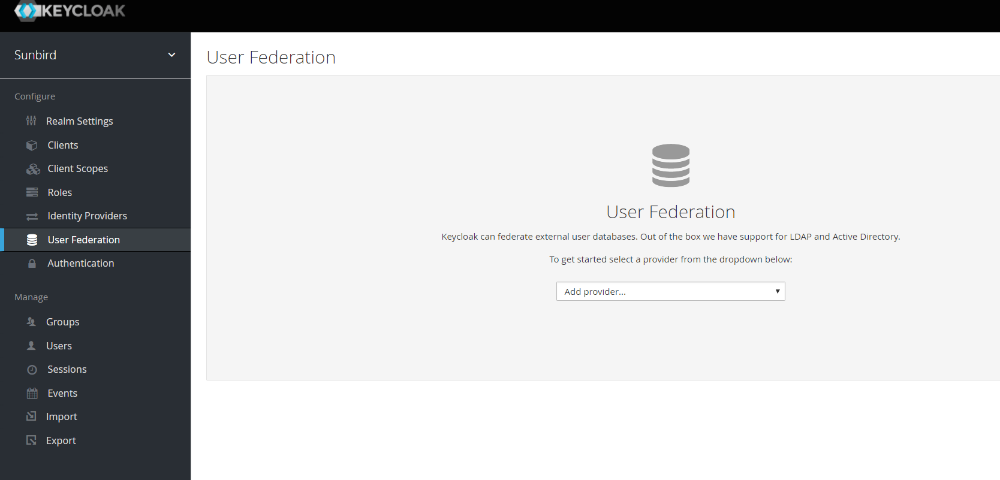

 **Jira Link :  ** [https://project-sunbird.atlassian.net/browse/SC-911](https://project-sunbird.atlassian.net/browse/SC-911)

 **Design Doc : ** [[Encrypting data stored within keycloak|Encrypting-data-stored-within-keycloak]]

 **Note:  Take back up of keycloak database.** 

 **Steps :** 


1. Checkout [https://github.com/project-sunbird/sunbird-auth](https://github.com/project-sunbird/sunbird-auth) code and  **switch to release-1.15 branch**  and make build.
1. Create providers folder inside keycloak
1. Copy built jar (i.e.keycloak-email-phone-autthenticator-1.0-SNAPSHOT.jar) to providers folder
1. Run the keycloak
1. Login to admin console and click User Federation tab on left panel of the screen. As shown in fig. 
1. Select cassandra-storage-provider from Add provider drop down on the screen , then you will be redirected to screen as shown 
1. Click save button , It will generate one provider id as shown                                                                                                               
1. Copy this provider id and save this as env variable ( in learner-service)  **sunbird_keycloak_user_federation_provider_id  , ** along with                                                                                                                                                 **sunbird_authorization** 

     **sunbird_cassandra_host** 

     **sunbird_encryption_key** 

     **sunbird_sso_username** 

     **sunbird_sso_password** 

     **sunbird_sso_url** 

     **sunbird_sso_realm** 

     **sunbird_sso_client_id** 

     **sunbird_cs_base_url** 
1. Run below SQL queries on Keycloak database  **after replacing**  values for placeholders {PROVIDER_ID} and {realm name} in below query templates. Value of placeholders {PROVIDER_ID} and {realm name} is based on environment variables  _sunbird_keycloak_user_federation_provider_id_  and  _sunbird_sso_realm_  respectively.

 **Query Templates**                 


```
insert into FEDERATED_USER(ID, STORAGE_PROVIDER_ID, REALM_ID)select concat('f:{PROVIDER_ID}:', USER_ENTITY.ID), '{PROVIDER_ID}', '{realm name}' from public.USER_ENTITY;

insert into FED_USER_CREDENTIAL(ID, DEVICE, HASH_ITERATIONS, SALT, TYPE, VALUE, CREATED_DATE, COUNTER, DIGITS, PERIOD, ALGORITHM, USER_ID,                  REALM_ID,STORAGE_PROVIDER_ID) select ID, DEVICE, HASH_ITERATIONS, SALT, TYPE, VALUE, CREATED_DATE, COUNTER, DIGITS, PERIOD, ALGORITHM, concat('f:{PROVIDER_ID}:',USER_ID), '{realm name}', '{PROVIDER_ID}' from CREDENTIAL;

insert into FED_USER_REQUIRED_ACTION(REQUIRED_ACTION, USER_ID, REALM_ID, STORAGE_PROVIDER_ID)
select REQUIRED_ACTION, concat('f:{PROVIDER_ID}:', USER_ID), '{realm name}', '{PROVIDER_ID}' from USER_REQUIRED_ACTION;
```
 **Example:** 

{PROVIDER_ID} = 5a8a3f2b-3409-42e0-9001-f913bc0fde31

{realm name} = sunbird


```
insert into FEDERATED_USER(ID, STORAGE_PROVIDER_ID, REALM_ID) select concat('f:5a8a3f2b-3409-42e0-9001-f913bc0fde31:', USER_ENTITY.ID), '5a8a3f2b-3409-42e0-9001-f913bc0fde31', 'sunbird' from public.USER_ENTITY;

insert into FED_USER_CREDENTIAL(ID, DEVICE, HASH_ITERATIONS, SALT, TYPE, VALUE, CREATED_DATE, COUNTER, DIGITS, PERIOD, ALGORITHM, USER_ID, REALM_ID,STORAGE_PROVIDER_ID) select ID, DEVICE, HASH_ITERATIONS, SALT, TYPE, VALUE, CREATED_DATE, COUNTER, DIGITS, PERIOD, ALGORITHM, concat('f:5a8a3f2b-3409-42e0-9001-f913bc0fde31:',USER_ID), 'sunbird', '5a8a3f2b-3409-42e0-9001-f913bc0fde31' from CREDENTIAL;

insert into FED_USER_REQUIRED_ACTION(REQUIRED_ACTION, USER_ID, REALM_ID, STORAGE_PROVIDER_ID) select REQUIRED_ACTION, concat('f:5a8a3f2b-3409-42e0-9001-f913bc0fde31:', USER_ID), 'sunbird', '5a8a3f2b-3409-42e0-9001-f913bc0fde31' from USER_REQUIRED_ACTION;
```


       10.  Run the ETL to delete the user from keycloak. (To be run only in case of Sunbird upgrade)


*****

[[category.storage-team]] 
[[category.confluence]] 
