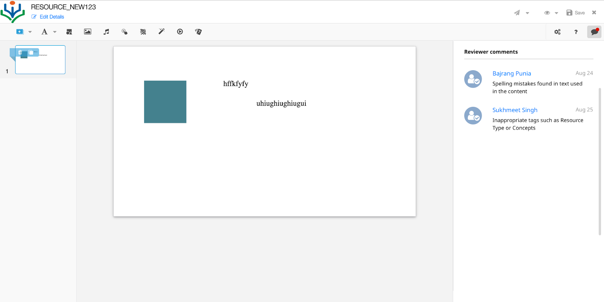

BackgroundThe page wise reviewer comments for a resource content should be displayed in the content editor.

Key design problemsShow the reviewer's comments, name, reviewer's profile icon and date for each stage.



Solution 1:
1.  **Read all the  Comment of the content** 


* The plugin to display the comments related to each stage id.
* Do API Call to get all the comments associated with the Content Id.


```
{

"request": {

"contextDetails": {

"contentId": "do_123",

"version": "2",

"contentType": "ecml",

"stageId":""

}

}

}
```

* For the current Stage id, display the comments, if available.
* If there are no comments, then comments tab can show the message 'No reviewer comments'.
* On click of the stage, filter the results by stageid in comments result and show in the relevant comments.


 **API url** :

/review/comment/v1/read/comment

 **As per the response of the comments, all comment is available in array, ** 


```
{

"id": "api.review.comment",

"params": {

"resmsgid": "ac022850-df33-4cf6-a78a-870809c0c5be",

"msgid": "8aa60e8a-95e4-4e44-aa89-d621107dc2b9",

"status": "successful"

},

"responseCode": "OK",

"result": {

"comments": \[

{

"postId": "bf05fbf6-d500-4950-ba42-93d96c4ab412",

"threadId": "6d4e06a0-d5bf-11e8-b74f-8b7f5a2679c5",

"body": "comment for ver 1 stage 2",

"createdOn": "2018-10-22T05:57:58.413Z",

"userId": "NCF",

"tag": "do_123_1_ecml",

"userInfo": {

"logo": "[https://dev.open-sunbird.org/assets/images/sunbird_logo.png](https://dev.open-sunbird.org/assets/images/sunbird_logo.png)",

"name": "ram"

},

"stageId": "1"

},

{

"postId": "2090348f-94b7-462f-814a-8ce5ca01b3bd",

"threadId": "4f580b00-d5bf-11e8-b74f-8b7f5a2679c5",

"body": "comment for ver 1 stage 2",

"createdOn": "2018-10-22T05:57:08.211Z",

"userId": "NCF",

"tag": "do_123_1_ecml",

"userInfo": {

"logo": "[https://dev.open-sunbird.org/assets/images/sunbird_logo.png](https://dev.open-sunbird.org/assets/images/sunbird_logo.png)",

"name": "ram"

},

"stageId": "2"

},

{

"postId": "60d45c78-e63f-441c-8546-5e0c62cc5cfc",

"threadId": "6d4e06a0-d5bf-11e8-b74f-8b7f5a2679c5",

"body": "comment for ver 1 stage 1",

"createdOn": "2018-10-22T05:58:07.598Z",

"userId": "NCF",

"tag": "do_123_1_ecml",

"userInfo": {

"logo": "[https://dev.open-sunbird.org/assets/images/sunbird_logo.png](https://dev.open-sunbird.org/assets/images/sunbird_logo.png)",

"name": "ram"

},

"stageId": "1"

}

]

},

"ts": "2018-10-22T06:00:39.012Z",

"ver": "1.0"

}
```


 **2. Delete the Comment by StageId** 

 **Api url: ** 

   /review/comment/v1/delete/comment

Request of the Delete of the comment by stageId is 


```
{

"request":{

"contextDetails":{

"contentId":"do_112623007469944832113",

"contentVer":"0",

"contentType":"application/vnd.ekstep.ecml-archive",

"stageId":"xyz"

}

}

}
```
The comments of the stageId: 'xyz' will be deleted.

 **Pros** 

On configuring the plugin, the comments are displayed.

 **Cons** 

Reviewer name and logo will be displayed same as when the reviewer commented. If the reviewer updates the name or logo it will not reflect in the old comments.

Solution 2
* To display the comments of a stage, for 'stage: select' event, do the API call for each stage id, 


```
{

"request": {

"contextDetails": {

"contentId": "do_123",

"version": "2",

"contentType": "ecml",

"stageId":"1"

}

}

}
```
 **Cons** 

The number of API calls will be more in case of more slides.


\*\*\*Solution 1 is accepted for development, which will have single api call to get all the comments for the content.

*****

[[category.storage-team]] 
[[category.confluence]] 
