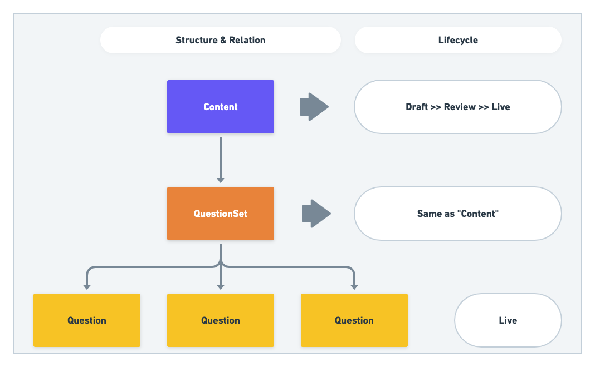
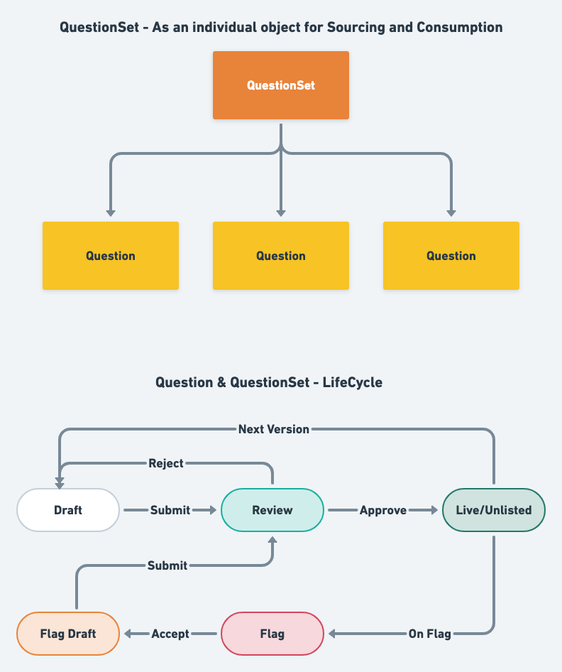
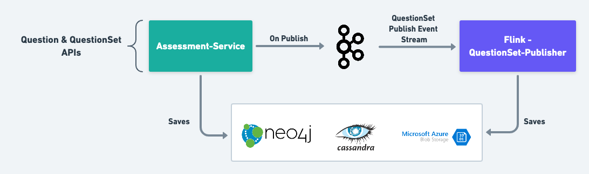
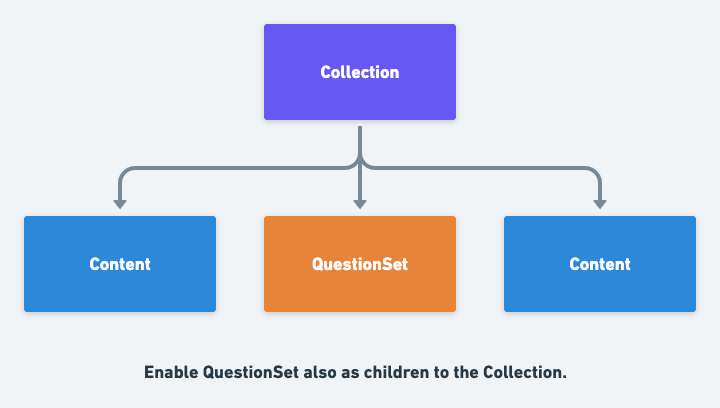

 **Introduction:** The sunbird platform enabled the content creators to create questions and select multiple questions and create an assessment content using them. But, there is no lifecycle management and review workflow for question object to enable crowed sourcing and generate a curated question bank for creators to create assessments and question papers.

This wiki explains the current design of the Question and QuestionSet objects and the enhancements to enable more functionality and features in sunbird platform.

 **Background & Problem statement:** In sunbird platform, the Content object embed the QuestionSet and QuestionSet is a group of Questions. 


1.  **QuestionSet:** 


    1. It is always within a Content. It is not discoverable and available directly to the end users.


    1. The lifecycle of the QuestionSet goes with the Content in which it is embedded. It is not an independently consumable object.


    1. No public/high-level APIs to handle the hierarchy and lifecycle.


    1. Questions are always immediate children to it. There is no nested hierarchy.


    
1.  **Question:** 


    1. No APIs to manage lifecycle.


    1. Once created it is Live.


    

 **Key Design Problems:** 
1. Question - Define lifecycle with its status and enable APIs.


1. QuestionSet - Define lifecycle with its status and enable APIs.


1. Visibility for Question and QuestionSet.


1. QuestionSet - As an independently consumable object.


 **Design:** The Content and Collection objects in sunbird platform already has the capabilities whatever we want to enable for Question and QuestionSet. The architecture and design also working at scale. So, it is the easy and better way to re-use the existing design for Question and QuestionSet too.


* Based on Content and Collection,


    * Define the Lifecycle


    * Define the behaviour of visibility.


    


### Content and Collection Vs Question and QuestionSet
We will define behaviour of the Question and QuestionSet as below.


* Question is compared with Content. But, Question is not a object to directly use.


* QuestionSet is compared with Collection.




|  |  **Content & Collection**  |  **Question & QuestionSet**  | 
|  --- |  --- |  --- | 
| APIs | Create, Update, Review, Publish, Review Reject, Flag, Flat-Accept, Flag-Reject, Retire | Enable all these APIs based on the generic KP schema definition and validation. | 
| Visibility | <ul><li>Content - Default

</li><li>Collection - Default, Parent

</li></ul> | <ul><li>Question - Default

</li><li>QuestionSet - Default, Parent

</li></ul> | 
| Offline Usage | For both the platform generates ECAR for offline Consumption. | <ul><li>Question - No ECAR

</li><li>QuestionSet - Generate ECAR on publish

</li></ul> | 

Below micro-services handles the Question and QuestionSet Objects.


*  **Assessment-Service**  - Enables the APIs for Question and QuestionSet.


*  **QuestionSet-Publisher**  Flink job will publish the QuestionSet and generate the ECAR file.


* The data and metadata of the objects stored in  **Neo4J, Cassandra and Cloud-Storage**  similar to Content and Collection.





### QuestionSet - As an independently consumable object
In Sunbird Platform only Content and Collection objects are directly accessible and consumable by the end users. We will make the below changes for QuestionSet also to use it same as Content or Collection. 


* Enable APIs to manage the lifecycle of QuestionSet.


    * Create, Update, Update Hierarchy, Review and Publish.


    
* Generate ECAR file on publishing QuestionSet for offline consumption.


QuestionSet - ECAR Structure:question-set.ecar
* manifest.json


* hierarchy.json


* /assets/public/content/do_21313827169439744014463/artifact/g1c0saq5.jpg


* …


* /assets/public/content/image-asset-1/artifact/icon.png


* /assets/public/content/image-asset-2/artifact/poster.png


* /assets/public/content/audio-asset-1/artifact/introduction.mp3


* /assets/public/content/video-asset-1/artifact/introduction.mp4


manifest.json
```js
{
  "id": "sunbird.questionset.archive",
  "ver": "1.0",
  "ts": "2020-11-25T10:45:59ZZ",
  "params": {
    "resmsgid": "a986dafb-f1ba-4dfa-938b-74a913c712b6"
  },
  "archive": {
    "count": 6,
    "ttl": 24,
    "items": [
      {
        "name": "Sample Question Set - 1",
        "description": "Test question set with 5 MCQ questions",
        "mimeType": "application/vnd.sunbird.quml",
        "subject": [
          "CBSE Training"
        ],
        "channel": "01241974041332940818",
        "organisation": [
          "CBSE"
        ],
        "objectType": "QuestionSet",
        "gradeLevel": [
          "Class 12",
          "Class 10"
        ],
        "appIcon": "https://ntpproductionall.blob.core.windows.net/ntp-content-production/content/do_3130299686648299521293/artifact/unnamed.thumb.png",
        "primaryCategory": "PracticeQuestionSet",
        "contentEncoding": "gzip",
        "contentType": "TextBook",
        "identifier": "do_31302996-question-set-1",
        "lastUpdatedBy": "b88d2335-6688-40a3-ac43-41aa5152d7b7",
        "audience": [
          "Student"
        ],
        "lastPublishedBy": "1a488c8d-06cd-40bf-ba97-f547c3382750",
        "license": "CC BY 4.0",
        "lastPublishedOn": "2020-07-07T11:46:44.581+0000",
        "status": "Live",
        "code": "org.sunbird.3FFj0O",
        "medium": [
          "English"
        ],
        "posterImage": "https://ntpproductionall.blob.core.windows.net/ntp-content-production/content/do_3130299721064775681336/artifact/unnamed.png",
        "createdOn": "2020-05-27T09:39:06.783+0000",
        "contentDisposition": "inline",
        "lastUpdatedOn": "2020-07-07T11:46:44.379+0000",
        "SYS_INTERNAL_LAST_UPDATED_ON": "2020-07-07T11:46:45.263+0000",
        "dialcodeRequired": "No",
        "createdFor": [
          "01241974041332940818"
        ],
        "creator": "Partner Book Creator",
        "pkgVersion": 1,
        "versionKey": "1594122404379",
        "framework": "ekstep_ncert_k-12",
        "lastSubmittedOn": "2020-07-07T10:16:38.620+0000",
        "createdBy": "b88d2335-6688-40a3-ac43-41aa5152d7b7",
        "compatibilityLevel": 4,
        "board": "CBSE",
        "licenseDetails": {
          "name": "CC BY 4.0",
          "url": "https://creativecommons.org/licenses/by/4.0/legalcode",
          "description": "For details see below:"
        },
        "visibility": "default",
        "setType": "materialised",
        "navigationMode": "non-linear",
        "allowSkip": true,
        "requiresSubmit": false,
        "shuffle": true,
        "showFeedback": true,
        "showSolutions": true,
        "quMLVersion": 1.5,
        "showTimer": true,
        "outcomeProcessing": {
          "template": "AVG_OF_SCORES",
          "ignoreNullValues": false
        },
        "totalQuestions": 5,
        "maxQuestions": 3,
        "maxScore": 3
      },
      {
        "name": "Pre number concepts | Chapter Assessment | English | Grade 1",
        "index": 1,
        "identifier": "do_31302996866482995212931",
        "parent": "do_31302996-question-set-1",
        "code": "c0f07244-0115-41a7-9963-934ddf2bc680",
        "body": "<div class='question-body'><div class='question-title'><p><br><span style=\"font-size:13px;\"><span style=\"color:rgb(119,119,119);background-color:rgb(255,255,255);\">What is common to all these objects?</span></span></p><figure class=\"image\"></figure></div><div data-choice-interaction='response1' class='mcq-horizontal'></div></div>",
        "responseDeclaration": {
          "response1": {
            "cardinality": "single",
            "type": "integer",
            "correct_response": {
              "value": 2
            }
          }
        },
        "weightage": 1,
        "maxScore": 1,
        "interactions": {
          "response1": {
            "type": "choice",
            "options": [
              {
                "body": "<p><span style=\"color:#000000;\">All are of the same size</span></p>",
                "value": 0
              },
              {
                "body": "<p><span style=\"color:#000000;\">All are round shaped</span></p>",
                "value": 1
              },
              {
                "body": "<p><span style=\"color:#000000;\">We can play with all of them</span></p>",
                "value": 2
              },
              {
                "body": "<p><span style=\"color:#000000;\">All are outdoor games</span></p>",
                "value": 3
              }
            ]
          }
        },
        "media": [
          {
            "id": "do_21313827167517081614460",
            "type": "image",
            "src": "/assets/public/content/do_21313827167517081614460/artifact/g1c0saq1.jpg",
            "baseUrl": "https://programs.diksha.gov.in"
          }
        ],
        "solutions": [
          {
            "id": "2439b49e-80a6-44a2-9569-f0937c2faacc",
            "type": "html",
            "value": "<p><span style=\"color:#000000;\">They all are not of same size, so option 1 is not correct.<br>All three balls are round but the bat and chess are not round in shape. So option 2 is incorrect.<br>As per option 3, yes we can play with all of them.<br>Chess is an indoor game so option 4 is incorrect.<br><br>So, option 3 is more appropriate.</span></p>"
          }
        ]
      },
      {
        "name": "Pre number concepts | Chapter Assessment | English | Grade 1",
        "identifier": "do_31302996866482995212932",
        "parent": "do_31302996-question-set-1",
        "index": 2,
        "code": "77a86bec-c64b-4c4b-9af7-d5e9f8754dc0",
        "body": "<div class='question-body'><div class='question-title'><p><br><span style=\"font-size:13px;\"><span style=\"color:rgb(119,119,119);background-color:rgb(255,255,255);\">Which is the odd one out, and why?</span></span></p><figure class=\"image\"></figure></div><div data-choice-interaction='response1' class='mcq-horizontal'></div></div>",
        "responseDeclaration": {
          "response1": {
            "cardinality": "single",
            "type": "integer",
            "correct_response": {
              "value": 3
            }
          }
        },
        "weightage": 1,
        "maxScore": 1,
        "interactions": {
          "response1": {
            "type": "choice",
            "options": [
              {
                "body": "<p><span style=\"color:#000000;\">d is the odd one out - because of the colour</span></p>",
                "value": 0
              },
              {
                "body": "<p><span style=\"color:#000000;\">d is the odd one out - because of the shape</span></p>",
                "value": 1
              },
              {
                "body": "<p><span style=\"color:#000000;\">c is the odd one out - because of the size</span></p>",
                "value": 2
              },
              {
                "body": "<p><span style=\"color:#000000;\">d is the odd one out - because of the colour and shape</span></p>",
                "value": 3
              }
            ]
          }
        },
        "media": [
          {
            "id": "do_21313827168253542414461",
            "type": "image",
            "src": "/assets/public/content/do_21313827168253542414461/artifact/g1c0saq2.jpg",
            "baseUrl": "https://programs.diksha.gov.in"
          }
        ],
        "solutions": [
          {
            "id": "ff908eac-d07c-45c9-b424-9c2af384b03c",
            "type": "html",
            "value": "<p><span style=\"color:#000000;\"> 'd' is different in both colour and shape.</span></p>"
          }
        ]
      },
      {
        "name": "Pre number concepts | Chapter Assessment | English | Grade 1",
        "identifier": "do_31302996866482995212933",
        "parent": "do_31302996-question-set-1",
        "index": 3,
        "code": "4c969632-0c26-4cb0-9bd3-8a9390e6f8ce",
        "body": "<div class='question-body'><div class='question-title'><p><br><span style=\"font-size:13px;\"><span style=\"color:rgb(119,119,119);background-color:rgb(255,255,255);\">Which is the odd one out, and why?</span></span></p><figure class=\"image\"></figure></div><div data-choice-interaction='response1' class='mcq-vertical'></div></div>",
        "responseDeclaration": {
          "response1": {
            "cardinality": "single",
            "type": "integer",
            "correct_response": {
              "value": 0
            }
          }
        },
        "weightage": 1,
        "maxScore": 1,
        "interactions": {
          "response1": {
            "type": "choice",
            "options": [
              {
                "body": "<p><span style=\"color:#000000;\">Object a -<br>Because it is living and the others<br>are non-living</span></p>",
                "value": 0
              },
              {
                "body": "<p><span style=\"color:#000000;\">They are all different from each other</span></p>",
                "value": 1
              },
              {
                "body": "<p><span style=\"color:#000000;\">Object b -<br>Because it is a musical instrument but others are not</span></p>",
                "value": 2
              },
              {
                "body": "<p><span style=\"color:#000000;\">Object c -<br>Because it can tell us time but others can't</span></p>",
                "value": 3
              }
            ]
          }
        },
        "media": [
          {
            "id": "do_21313827205372313614520",
            "type": "image",
            "src": "/assets/public/content/do_21313827205372313614520/artifact/g1c0saq3.jpg",
            "baseUrl": "https://programs.diksha.gov.in"
          }
        ],
        "solutions": [
          {
            "id": "21b5cca6-0645-4edc-b22e-53b25e8b3c95",
            "type": "html",
            "value": "<p><span style=\"color:#000000;\">Option 1 is correct because the monkey is a living thing but the other 2 are not.<br><br>The other options are wrong because the remaining 2 objects do not have anything in common after separating that object.</span></p>"
          }
        ]
      },
      {
        "name": "Pre number concepts | Chapter Assessment | English | Grade 1",
        "identifier": "do_31302996866482995212934",
        "parent": "do_31302996-question-set-1",
        "index": 4,
        "code": "8c300d47-8851-4cce-985d-b2a48e93741b",
        "body": "<div class='question-body'><div class='question-title'><p><br><span style=\"font-size:13px;\"><span style=\"color:rgb(119,119,119);background-color:rgb(255,255,255);\">Arrange the given objects in the order of their increasing size from smaller to bigger object.</span></span></p><figure class=\"image\"></figure></div><div data-choice-interaction='response1' class='mcq-vertical'></div></div>",
        "responseDeclaration": {
          "response1": {
            "cardinality": "single",
            "type": "integer",
            "correct_response": {
              "value": 0
            }
          }
        },
        "weightage": 1,
        "maxScore": 1,
        "interactions": {
          "response1": {
            "type": "choice",
            "options": [
              {
                "body": "<p><span style=\"color:#000000;\">4, 1, 3, 2</span></p>",
                "value": 0
              },
              {
                "body": "<p><span style=\"color:#000000;\">1, 2, 3, 4</span></p>",
                "value": 1
              },
              {
                "body": "<p><span style=\"color:#000000;\">4, 3, 2, 1</span></p>",
                "value": 2
              },
              {
                "body": "<p><span style=\"color:#000000;\">2, 3, 1, 4</span></p>",
                "value": 3
              }
            ]
          }
        },
        "media": [
          {
            "id": "do_21313827168903987214462",
            "type": "image",
            "src": "/assets/public/content/do_21313827168903987214462/artifact/g1c0saq4.jpg",
            "baseUrl": "https://programs.diksha.gov.in"
          }
        ],
        "solutions": [
          {
            "id": "6e7976ca-cf78-48d9-b4c4-6bc842375b9b",
            "type": "html",
            "value": "<p><span style=\"color:#000000;\">Order given in option 1 is placing all cups in an order from smaller to bigger cup in size.</span></p>"
          }
        ]
      },
      {
        "name": "Pre number concepts | Chapter Assessment | English | Grade 1",
        "identifier": "do_31302996866482995212935",
        "parent": "do_31302996-question-set-1",
        "index": 5,
        "code": "7cd27111-0c87-4e55-8015-bdf51f2d3c64",
        "body": "<div class='question-body'><div class='question-title'><p><br><span style=\"font-size:13px;\"><span style=\"color:rgb(119,119,119);background-color:rgb(255,255,255);\">Identify the order of lengths in which the pencils have been placed.</span></span></p><figure class=\"image\"></figure></div><div data-choice-interaction='response1' class='mcq-horizontal'></div></div>",
        "responseDeclaration": {
          "response1": {
            "cardinality": "single",
            "type": "integer",
            "correct_response": {
              "value": 1
            }
          }
        },
        "weightage": 1,
        "maxScore": 1,
        "interactions": {
          "response1": {
            "type": "choice",
            "options": [
              {
                "body": "<p><span style=\"color:#000000;\">Increasing order</span></p>",
                "value": 0
              },
              {
                "body": "<p><span style=\"color:#000000;\">Neither increasing, nor decreasing</span></p>",
                "value": 1
              },
              {
                "body": "<p><span style=\"color:#000000;\">Decreasing Order</span></p>",
                "value": 2
              },
              {
                "body": "<p><span style=\"color:#000000;\">First increasing and later decreasing</span></p>",
                "value": 3
              }
            ]
          }
        },
        "media": [
          {
            "id": "do_21313827169439744014463",
            "type": "image",
            "src": "/assets/public/content/do_21313827169439744014463/artifact/g1c0saq5.jpg",
            "baseUrl": "https://programs.diksha.gov.in"
          }
        ],
        "solutions": [
          {
            "id": "c4932a1a-38e7-4ce3-91be-a438c265f9fb",
            "type": "html",
            "value": "<p><span style=\"color:#000000;\">Option 2 is more appropriate because objects are not kept in a proper order of their lengths.</span></p>"
          }
        ]
      }
    ]
  }
}
```
hierarchy.json
```js
{
  "id": "sunbird.questionset.hierarchy",
  "ver": "1.0",
  "ts": "2020-11-25T10:45:59ZZ",
  "params": {
    "resmsgid": "aa2d626a-9692-478c-9b92-f3a7705b98df"
  },
  "questionset": {
    "name": "Sample Question Set - 1",
    "description": "Test question set with 5 MCQ questions",
    "mimeType": "application/vnd.sunbird.quml",
    "subject": [
      "CBSE Training"
    ],
    "channel": "01241974041332940818",
    "organisation": [
      "CBSE"
    ],
    "objectType": "QuestionSet",
    "gradeLevel": [
      "Class 12",
      "Class 10"
    ],
    "appIcon": "https://ntpproductionall.blob.core.windows.net/ntp-content-production/content/do_3130299686648299521293/artifact/unnamed.thumb.png",
    "primaryCategory": "PracticeQuestionSet",
    "contentEncoding": "gzip",
    "contentType": "TextBook",
    "identifier": "do_31302996-question-set-1",
    "lastUpdatedBy": "b88d2335-6688-40a3-ac43-41aa5152d7b7",
    "audience": [
      "Student"
    ],
    "lastPublishedBy": "1a488c8d-06cd-40bf-ba97-f547c3382750",
    "license": "CC BY 4.0",
    "lastPublishedOn": "2020-07-07T11:46:44.581+0000",
    "status": "Live",
    "code": "org.sunbird.3FFj0O",
    "medium": [
      "English"
    ],
    "posterImage": "https://ntpproductionall.blob.core.windows.net/ntp-content-production/content/do_3130299721064775681336/artifact/unnamed.png",
    "createdOn": "2020-05-27T09:39:06.783+0000",
    "contentDisposition": "inline",
    "lastUpdatedOn": "2020-07-07T11:46:44.379+0000",
    "SYS_INTERNAL_LAST_UPDATED_ON": "2020-07-07T11:46:45.263+0000",
    "dialcodeRequired": "No",
    "createdFor": [
      "01241974041332940818"
    ],
    "creator": "Partner Book Creator",
    "pkgVersion": 1,
    "versionKey": "1594122404379",
    "framework": "ekstep_ncert_k-12",
    "lastSubmittedOn": "2020-07-07T10:16:38.620+0000",
    "createdBy": "b88d2335-6688-40a3-ac43-41aa5152d7b7",
    "compatibilityLevel": 4,
    "board": "CBSE",
    "licenseDetails": {
      "name": "CC BY 4.0",
      "url": "https://creativecommons.org/licenses/by/4.0/legalcode",
      "description": "For details see below:"
    },
    "visibility": "default",
    "setType": "materialised",
    "navigationMode": "non-linear",
    "allowSkip": true,
    "requiresSubmit": false,
    "shuffle": true,
    "showFeedback": true,
    "showSolutions": true,
    "quMLVersion": 1.5,
    "showTimer": true,
    "outcomeProcessing": {
      "template": "AVG_OF_SCORES",
      "ignoreNullValues": false
    },
    "totalQuestions": 5,
    "maxQuestions": 3,
    "maxScore": 3,
    "children": [
      {
        "name": "Pre number concepts | Chapter Assessment | English | Grade 1",
        "index": 1,
        "identifier": "do_31302996866482995212931",
        "code": "c0f07244-0115-41a7-9963-934ddf2bc680",
        "body": "<div class='question-body'><div class='question-title'><p><br><span style=\"font-size:13px;\"><span style=\"color:rgb(119,119,119);background-color:rgb(255,255,255);\">What is common to all these objects?</span></span></p><figure class=\"image\"></figure></div><div data-choice-interaction='response1' class='mcq-horizontal'></div></div>",
        "responseDeclaration": {
          "response1": {
            "cardinality": "single",
            "type": "integer",
            "correct_response": {
              "value": 2
            }
          }
        },
        "weightage": 1,
        "maxScore": 1,
        "interactions": {
          "response1": {
            "type": "choice",
            "options": [
              {
                "body": "<p><span style=\"color:#000000;\">All are of the same size</span></p>",
                "value": 0
              },
              {
                "body": "<p><span style=\"color:#000000;\">All are round shaped</span></p>",
                "value": 1
              },
              {
                "body": "<p><span style=\"color:#000000;\">We can play with all of them</span></p>",
                "value": 2
              },
              {
                "body": "<p><span style=\"color:#000000;\">All are outdoor games</span></p>",
                "value": 3
              }
            ]
          }
        },
        "media": [
          {
            "id": "do_21313827167517081614460",
            "type": "image",
            "src": "/assets/public/content/do_21313827167517081614460/artifact/g1c0saq1.jpg",
            "baseUrl": "https://programs.diksha.gov.in"
          }
        ],
        "solutions": [
          {
            "id": "2439b49e-80a6-44a2-9569-f0937c2faacc",
            "type": "html",
            "value": "<p><span style=\"color:#000000;\">They all are not of same size, so option 1 is not correct.<br>All three balls are round but the bat and chess are not round in shape. So option 2 is incorrect.<br>As per option 3, yes we can play with all of them.<br>Chess is an indoor game so option 4 is incorrect.<br><br>So, option 3 is more appropriate.</span></p>"
          }
        ]
      },
      {
        "name": "Pre number concepts | Chapter Assessment | English | Grade 1",
        "identifier": "do_31302996866482995212932",
        "index": 2,
        "code": "77a86bec-c64b-4c4b-9af7-d5e9f8754dc0",
        "body": "<div class='question-body'><div class='question-title'><p><br><span style=\"font-size:13px;\"><span style=\"color:rgb(119,119,119);background-color:rgb(255,255,255);\">Which is the odd one out, and why?</span></span></p><figure class=\"image\"></figure></div><div data-choice-interaction='response1' class='mcq-horizontal'></div></div>",
        "responseDeclaration": {
          "response1": {
            "cardinality": "single",
            "type": "integer",
            "correct_response": {
              "value": 3
            }
          }
        },
        "weightage": 1,
        "maxScore": 1,
        "interactions": {
          "response1": {
            "type": "choice",
            "options": [
              {
                "body": "<p><span style=\"color:#000000;\">d is the odd one out - because of the colour</span></p>",
                "value": 0
              },
              {
                "body": "<p><span style=\"color:#000000;\">d is the odd one out - because of the shape</span></p>",
                "value": 1
              },
              {
                "body": "<p><span style=\"color:#000000;\">c is the odd one out - because of the size</span></p>",
                "value": 2
              },
              {
                "body": "<p><span style=\"color:#000000;\">d is the odd one out - because of the colour and shape</span></p>",
                "value": 3
              }
            ]
          }
        },
        "media": [
          {
            "id": "do_21313827168253542414461",
            "type": "image",
            "src": "/assets/public/content/do_21313827168253542414461/artifact/g1c0saq2.jpg",
            "baseUrl": "https://programs.diksha.gov.in"
          }
        ],
        "solutions": [
          {
            "id": "ff908eac-d07c-45c9-b424-9c2af384b03c",
            "type": "html",
            "value": "<p><span style=\"color:#000000;\"> 'd' is different in both colour and shape.</span></p>"
          }
        ]
      },
      {
        "name": "Pre number concepts | Chapter Assessment | English | Grade 1",
        "identifier": "do_31302996866482995212933",
        "index": 3,
        "code": "4c969632-0c26-4cb0-9bd3-8a9390e6f8ce",
        "body": "<div class='question-body'><div class='question-title'><p><br><span style=\"font-size:13px;\"><span style=\"color:rgb(119,119,119);background-color:rgb(255,255,255);\">Which is the odd one out, and why?</span></span></p><figure class=\"image\"></figure></div><div data-choice-interaction='response1' class='mcq-vertical'></div></div>",
        "responseDeclaration": {
          "response1": {
            "cardinality": "single",
            "type": "integer",
            "correct_response": {
              "value": 0
            }
          }
        },
        "weightage": 1,
        "maxScore": 1,
        "interactions": {
          "response1": {
            "type": "choice",
            "options": [
              {
                "body": "<p><span style=\"color:#000000;\">Object a -<br>Because it is living and the others<br>are non-living</span></p>",
                "value": 0
              },
              {
                "body": "<p><span style=\"color:#000000;\">They are all different from each other</span></p>",
                "value": 1
              },
              {
                "body": "<p><span style=\"color:#000000;\">Object b -<br>Because it is a musical instrument but others are not</span></p>",
                "value": 2
              },
              {
                "body": "<p><span style=\"color:#000000;\">Object c -<br>Because it can tell us time but others can't</span></p>",
                "value": 3
              }
            ]
          }
        },
        "media": [
          {
            "id": "do_21313827205372313614520",
            "type": "image",
            "src": "/assets/public/content/do_21313827205372313614520/artifact/g1c0saq3.jpg",
            "baseUrl": "https://programs.diksha.gov.in"
          }
        ],
        "solutions": [
          {
            "id": "21b5cca6-0645-4edc-b22e-53b25e8b3c95",
            "type": "html",
            "value": "<p><span style=\"color:#000000;\">Option 1 is correct because the monkey is a living thing but the other 2 are not.<br><br>The other options are wrong because the remaining 2 objects do not have anything in common after separating that object.</span></p>"
          }
        ]
      },
      {
        "name": "Pre number concepts | Chapter Assessment | English | Grade 1",
        "identifier": "do_31302996866482995212934",
        "index": 4,
        "code": "8c300d47-8851-4cce-985d-b2a48e93741b",
        "body": "<div class='question-body'><div class='question-title'><p><br><span style=\"font-size:13px;\"><span style=\"color:rgb(119,119,119);background-color:rgb(255,255,255);\">Arrange the given objects in the order of their increasing size from smaller to bigger object.</span></span></p><figure class=\"image\"></figure></div><div data-choice-interaction='response1' class='mcq-vertical'></div></div>",
        "responseDeclaration": {
          "response1": {
            "cardinality": "single",
            "type": "integer",
            "correct_response": {
              "value": 0
            }
          }
        },
        "weightage": 1,
        "maxScore": 1,
        "interactions": {
          "response1": {
            "type": "choice",
            "options": [
              {
                "body": "<p><span style=\"color:#000000;\">4, 1, 3, 2</span></p>",
                "value": 0
              },
              {
                "body": "<p><span style=\"color:#000000;\">1, 2, 3, 4</span></p>",
                "value": 1
              },
              {
                "body": "<p><span style=\"color:#000000;\">4, 3, 2, 1</span></p>",
                "value": 2
              },
              {
                "body": "<p><span style=\"color:#000000;\">2, 3, 1, 4</span></p>",
                "value": 3
              }
            ]
          }
        },
        "media": [
          {
            "id": "do_21313827168903987214462",
            "type": "image",
            "src": "/assets/public/content/do_21313827168903987214462/artifact/g1c0saq4.jpg",
            "baseUrl": "https://programs.diksha.gov.in"
          }
        ],
        "solutions": [
          {
            "id": "6e7976ca-cf78-48d9-b4c4-6bc842375b9b",
            "type": "html",
            "value": "<p><span style=\"color:#000000;\">Order given in option 1 is placing all cups in an order from smaller to bigger cup in size.</span></p>"
          }
        ]
      },
      {
        "name": "Pre number concepts | Chapter Assessment | English | Grade 1",
        "identifier": "do_31302996866482995212935",
        "index": 5,
        "code": "7cd27111-0c87-4e55-8015-bdf51f2d3c64",
        "body": "<div class='question-body'><div class='question-title'><p><br><span style=\"font-size:13px;\"><span style=\"color:rgb(119,119,119);background-color:rgb(255,255,255);\">Identify the order of lengths in which the pencils have been placed.</span></span></p><figure class=\"image\"></figure></div><div data-choice-interaction='response1' class='mcq-horizontal'></div></div>",
        "responseDeclaration": {
          "response1": {
            "cardinality": "single",
            "type": "integer",
            "correct_response": {
              "value": 1
            }
          }
        },
        "weightage": 1,
        "maxScore": 1,
        "interactions": {
          "response1": {
            "type": "choice",
            "options": [
              {
                "body": "<p><span style=\"color:#000000;\">Increasing order</span></p>",
                "value": 0
              },
              {
                "body": "<p><span style=\"color:#000000;\">Neither increasing, nor decreasing</span></p>",
                "value": 1
              },
              {
                "body": "<p><span style=\"color:#000000;\">Decreasing Order</span></p>",
                "value": 2
              },
              {
                "body": "<p><span style=\"color:#000000;\">First increasing and later decreasing</span></p>",
                "value": 3
              }
            ]
          }
        },
        "media": [
          {
            "id": "do_21313827169439744014463",
            "type": "image",
            "src": "/assets/public/content/do_21313827169439744014463/artifact/g1c0saq5.jpg",
            "baseUrl": "https://programs.diksha.gov.in"
          }
        ],
        "solutions": [
          {
            "id": "c4932a1a-38e7-4ce3-91be-a438c265f9fb",
            "type": "html",
            "value": "<p><span style=\"color:#000000;\">Option 2 is more appropriate because objects are not kept in a proper order of their lengths.</span></p>"
          }
        ]
      }
    ]
  }
}
```

### QuestionSet - as children to Collection
We are enabling QuestionSet as individually consumable object in sunbird platform. So, allowing them to add as children to the Collection object will support features like, Assignment in between Course/TextBook, QuestionPaper end of the Course etc,.



noteWith this design and implementation, we are enabling most of the capabilities and behaviour to Question and QuestionSet object which are already exists for Content and Collection.

Below capabilities we will enable together (for all object by generalising) once we achieve this.


* Visibility: Parent for Content and Question.


* Collection and QuestionSet with Visibility: Parent as reusable objects in the platform.


* QuestionSet - is always materialised.  **Dynamic**  QuestionSet capability is not enabled now.


With this design and implementation, we are enabling most of the capabilities and behaviour to Question and QuestionSet object which are already exists for Content and Collection.

Below capabilities we will enable together (for all object by generalising) once we achieve this.


* Visibility: Parent for Content and Question.


* Collection and QuestionSet with Visibility: Parent as reusable objects in the platform.


* QuestionSet - is always materialised.  **Dynamic**  QuestionSet capability is not enabled now.


 **API Spec:** <TODO>

 **Conclusion:** <TODO>

 **Questions:** 
1. Separate Mime Type For QuestionSet?


    1. QuestionSet contains only Questions but, Collection contains Content and QuestionSet.


    1. Structure is same but, the publishing process require its own logic to handle.


    1. QuestionSet should generate printable version (PDF) based on configuration.


    1. Now we are handling only materialised QuestionSet. When we enable Dynamic QuestionSet (based on search query) it requires separate handling.


    


*****

[[category.storage-team]] 
[[category.confluence]] 
