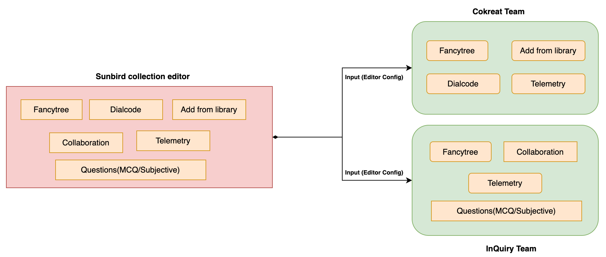
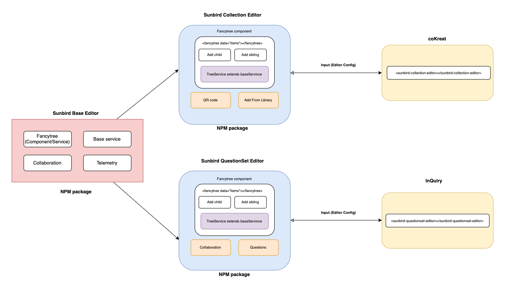
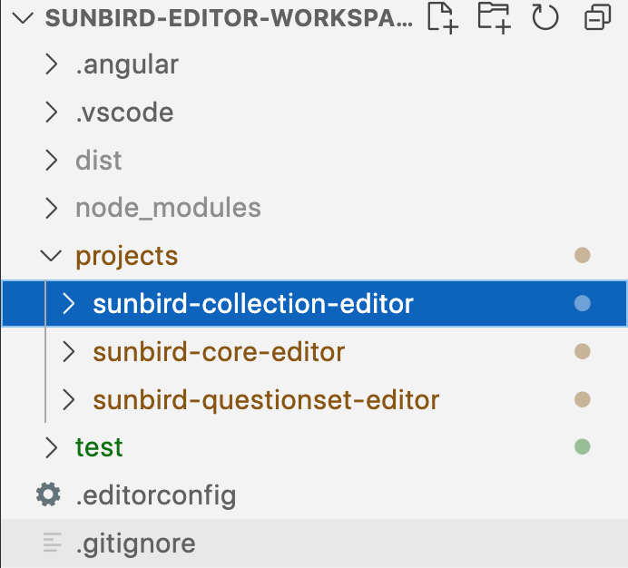
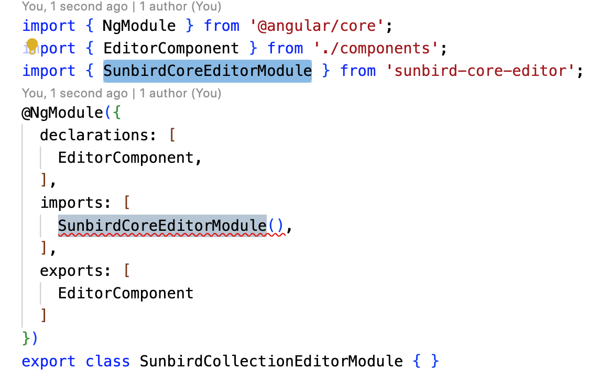
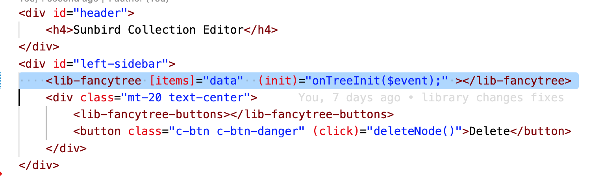
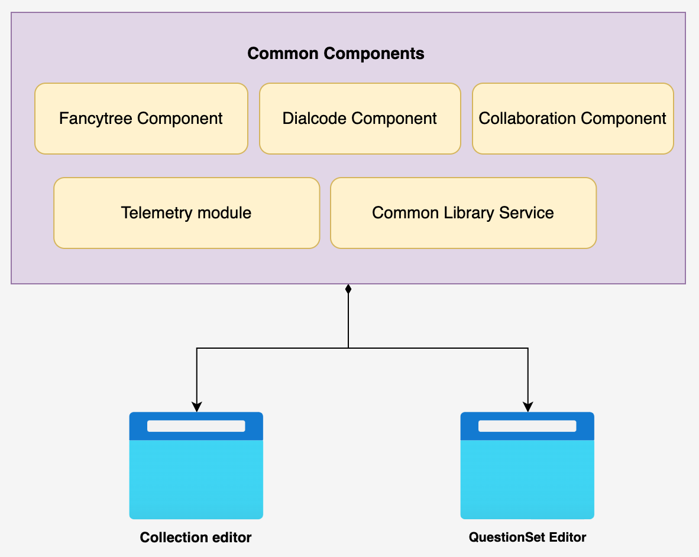
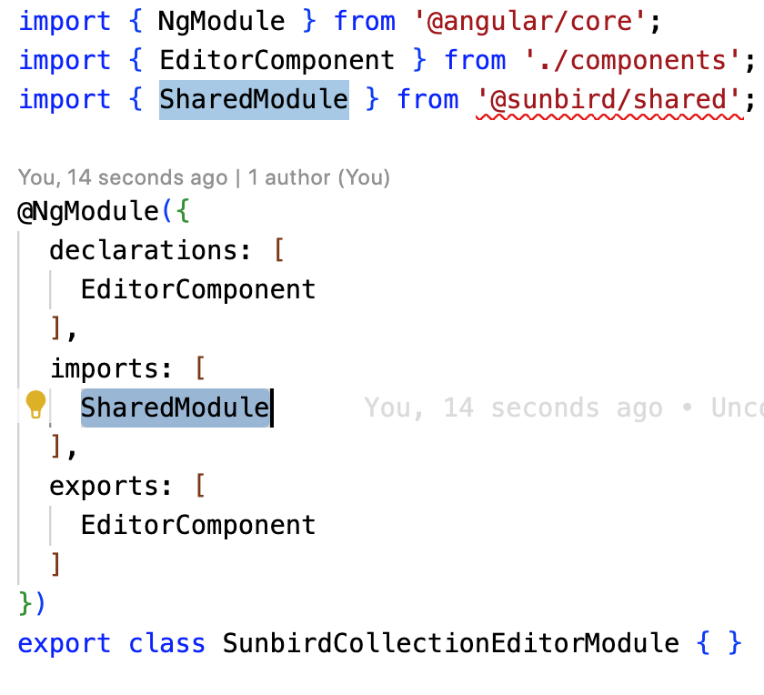
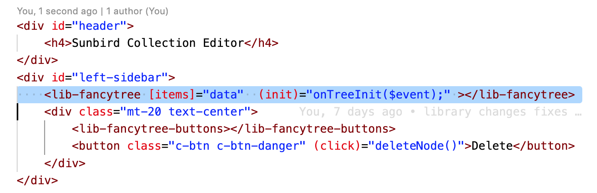

 **Introduction** This document describes the key design problem statement and design for the separation of the question set and collection editor.

Jira LINK: [SB-28699 System JIRA](https:///browse/SB-28699)

 **Background** Currently, both collection & questionSet editors are using a single code base. All the BB’s(Knolwg & InQuiry) should work on the same code and follow the same release cycle and github branching strategy(This is very overhead for both teams). Both collection and question-set  editors are packaged together. This codebase is currently under Knowlg BB. This design was implemented when both editors were built and maintained by a single team - sourcing circle. Now, the question set editor is part of inQuiry BB. 

 **Problem Statement** How knowlg and inQuiry BB’s can own collection and question set editors independently ?

 **Key design problems** 

* How to build features specific to building blocks ?

* How can i get complete ownership of editor instead of depending on other BB’s?

    * Should able to release independently. (Release process)

    * Can have own contribution guidelines 

    * Adopter/contributor can take specific editors.

    
* How common code/feature can be shared between editors?

 **Solution 1: Extending the core editor** 
* In this solution, We have to design and implement a base editor. Which can be extend by the both question set and collection editor.

* The base editor will contain the common components such as the hierarchy tree, header, and base service

* The base editor is also responsible for defining the contract used by itself and the editors to communicate.

* Any editors can pick only the components which required from the base editor.

* Here’s the diagram architecture of the base editor.

 **Pros:** 

1. Independently deployable and release process (CI/CD pipelines)

1. Third-party library dependency can be handled independently(Specific to repositories)

1. Features specific to the editor can be implemented in the respective GitHub repo.

1. Easier adoption  and contribution

1. Reduce the build size/ better performance 

 **Cons:** 

1. Effort intensive

1. Ownership of the base editor for contribution

 **Github Link:** [https://github.com/vaibhavbhuva/sunbird-editor-workspace](https://github.com/vaibhavbhuva/sunbird-editor-workspace)

Here’s sample screenshot:

 **Solution 2: Dynamic loading of the components/fetaures** 
* [Dynamic loading of the angular components ](https://project-sunbird.atlassian.net/wiki/spaces/SBDES/pages/edit-v2/3074359303?draftShareId=ade74e0d-38b2-453f-a4fa-3ba528bcca9f)

 **Solution 3: Using shared modules in the single project** 
* In this approach, We will create shared modules which allow us to organise the common code. 

* We will put commonly used services and components into the shared module and then import just that module wherever you need it in other parts of the same project.

    For example Hierarchy tree, base service,  etc…

 **Pros** :
* Efficiency **:**  Reuse markups across components, Future changes are simple

* Consistency **:**  Updating reusable components get affected everywhere it is used

* Very easy to implement

* Development effort and testing are less compared to approach 1

 **Cons** :
* Any issue with the shared module might affect all applications using it.

* Not Independently release process like approach 1.

 **Example screenshot:** 

*****

[[category.storage-team]] 
[[category.confluence]] 
