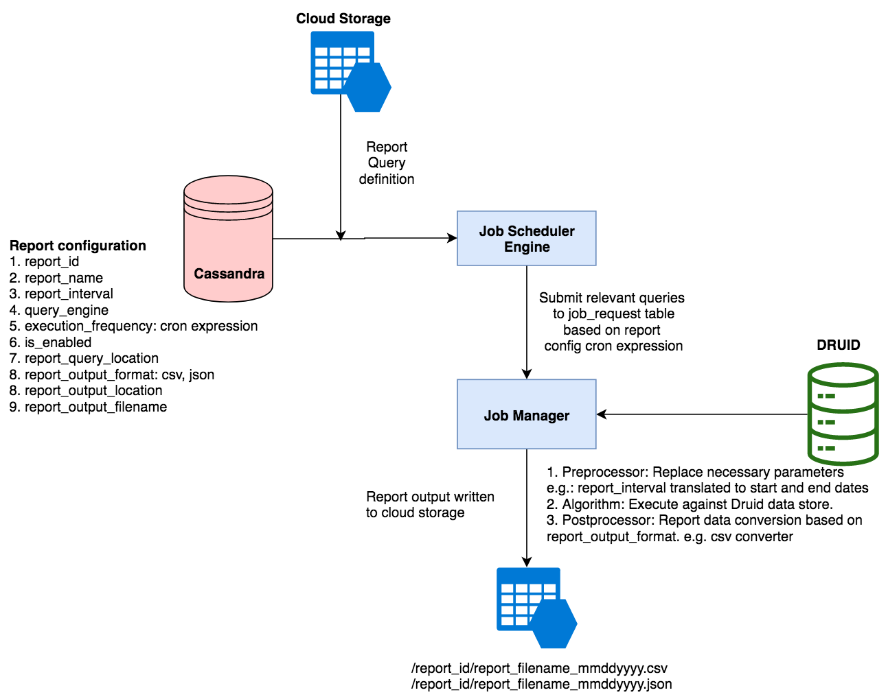

## Introduction:
This document describes the design to generate the data for the portal dashboards from Druid OLAP data store and export the report data to cloud storage. This mainly consists of following modules


1.  **Configure Report API**  - This API will be used to submit a request for configuration of a new report.
1.  **Job Scheduler Engine**  - This Scheduler will submit the reports for execution based on execution frequency.
1.  **Disable Report API**  - This API will mark an existing report as disabled and will be excluded from the list of reports to be executed.
1.  **Report Data Generator**  - The report data generator will be a spark job which will generate report data file by executing the query configured in the report configuration against the druid data store. The report data file will then be exported to cloud storage to complete the report execution.





## Configure Report API:
Input parameters

| Parameter | Mandatory | Description | Comments | 
|  --- |  --- |  --- |  --- | 
| report_name | Yes | Name of the report |  | 
| query_engine | Yes | Data Source | DRUID, CASSANDRA, ELASTICSEARCH | 
| execution_frequency | Yes | Report generation frequency | DAILY, WEEKLY, MONTHLY | 
| report_interval | Yes | Date range for queries | 
1. YESTERDAY
1. LAST_7_DAYS,
1. LAST_WEEK,
1. LAST_30_DAYS,
1. LAST_MONTH,
1. LAST_QUARTER,
1. LAST_3_MONTHS,
1. LAST_6_MONTHS
1. LAST_YEAR

 | 
| query | Yes | Query to be executed |  | 
| output_format | Yes | Output format of the report | json, csv | 
| output_file_pattern | No | Report output filename pattern | report_id and end_date from the interval are used by default{report_id}-{end_date}.{output_format}Other Supported Placeholders are:
1. report_name
1. timestamp

 | 
| output_field_names | Yes | Output field names used in report output |  | 
| group_by_fields | No | Fields by which reports are grouped by | channel_id, device_id | 


*  **Request Object** 


```
 {
  "id":"sunbird.analytics.report.submit",
  "ver":"1.0",
  "ts":"2019-03-07T12:40:40+05:30",
  "params":{
     "msgid":"4406df37-cd54-4d8a-ab8d-3939e0223580",
     "client_key":"analytics-team"
  },
  "request":{
     "channel_id":"in.ekstep",
     "report_name":"avg_collection_downloads",
     "query_engine": "druid",
     "execution_frequency": "DAILY",
     "report_interval":"LAST_7_DAYS",
     "output_format": "json",
     "output_field_names": ["Average Collection Downloads"],
     "query_json":{
        "queryType":"groupBy",
        "dataSource":"telemetry-events",
        "granularity":"day",
        "dimensions":[
           "eid"
        ],
        "aggregations":[
           { "type":"count", "name":"context_did", fieldName":"context_did" }
        ],
        "filter":{
           "type":"and",
           "fields":[
              { "type":"selector", "name":"eid", fieldName":"IMPRESSION" },
              { "type":"selector", "name":"edata_type", fieldName":"detail" },
              { "type":"selector", "name":"edata_pageid", fieldName":"collection-detail" },
              { "type":"selector", "name":"context_pdata_id", fieldName":"prod.diksha.app" }
           ]
        },
        "postAggregations":[
           {
              "type":"arithmetic",
              "name":"avg__edata_value",
              "fn":"/",
              "fields":[
                 { "type":"fieldAccess", "name":"total_edata_value", "fieldName":"total_edata_value" },
                 { "type":"fieldAccess", "name":"rows", "fieldName":"rows" }
              ]
           }
        ],
        "intervals":[
           "2019-02-20T00:00:00.000/2019-01-27T23:59:59.000"
        ]
     }
  }
 }
 
```


*  **Output:** 

The individual report configurations can be saved to a Cassandra table. The druid query JSON will be saved to Azure blob storage and the following will be the fields in the report configuration table.


```
   # Schema of table
   TABLE platform_db.reports_configuration (
     report_id text, // hash of report_name and report_interval
     report_config text, // Entire JSON from request
     status text,
     report_output_location text,
     report_last_generated timestamp,
     PRIMARY KEY (report_id) );
   )

```


## Job Scheduler Engine:


.png)


*  **Input:**      - A list of reports in  **reports_configuration**  Cassandra table with the cron_expression which falls within the current day of execution and with status as ENABLED.
*  **Algorithm:**  **              ** 

                - Data availability check has following 2 criteria:

                        1. Kafka indexing lag: check for 0 lag in druid ingestion.

                        2. Druid segments count: Segments should have been created for previous day.

                - Reports based on telemetry-events will be submitted for execution upon satisfying both the criteria.

                - Reports based on summary-events will be submitted for execution upon satisfying only 2nd criteria or check for files in azure. 

                - If  **report_last_generated**  is not equals to previous day for a report, submits the same report for all the pending dates.


*  **Output:** 

- The list of reports are submitted for execution into the  **platform_db.job_request**  Cassandra table with the status= **SUBMITTED ** and job_name= **druid-reports-<report-id>** .


## Disable Report API:

*  **Input:** 

- report-id


*  **Output:** 

- The report will be  **DISABLED**  in the  **platform_db.reports_configuration**  Cassandra table


## Report Data Generator Data Product:

*  **Input:** 

- Set of Requests -  **i.e**  All records in  **platform_db.job_request**  where status= **SUBMITTED**  and job_name starts with  **druid-reports** 


*  **Output:** 

-  Report data file will be saved in Azure with specified format

-  **platform_db.job_request**  table will be updated with job status and output file details will be updated in  **platform_db.reports_configuration** 


*  **Output location and file format in Azure:** 


Once a request has been submitted and processing complete, the report data file with the name of the file being the report id suffixed with report_interval end-date saved under :


```
   /druid-reports/report_id-yyyy-mm-dd.csv
   /druid-reports/report_id-yyyy-mm-dd.json
```

## Regenerate Report API:

*  **Input:** 

- report-list

- replay-interval


*  **Algorithm:** 

- Loops through replay interval, find  **report_output_filename**  with each date and resubmits to job_request table for execution.

- Backup and delete older report data files from azure.

- report-list can be empty in case of regenerating all enabled reports.


*  **Output:** 

- The list of reports are submitted for execution into the  **platform_db.job_request**  Cassandra table with the status= **SUBMITTED ** and job_name= **druid-reports-<report-id>** .


*****

[[category.storage-team]] 
[[category.confluence]] 
