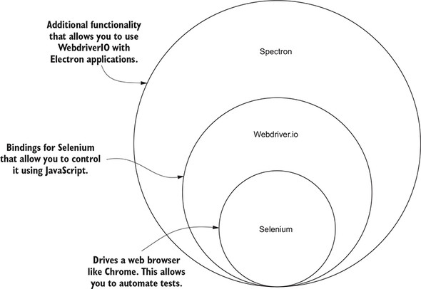

##  **Introduction** : 
Desktop App testing should be automated by writing integration tests. The benefits of this are the following:


* Faster Feedback


* Accelerated Results


* Testing Efficiency Improvement


* Higher Overall Test Coverage


* Reusability of Automated Tests


* Earlier Detection of Defects


* Thoroughness in Testing


 **Testing framework:** We choose [Spectron](https://github.com/electron-userland/spectron/blob/master/README.md) to automate the test cases since this is created by the electron team and our app is based on the electron. Spectron is nothing but wraps WebdriverIO which shown below picture

Mocha will be the test runner used and chai will be the assertion library which used in the official documentation and  popular libraries for testing BDD or TDD. 





 **Pattern used:**  **Page Object Model and Page Factory -** Page object is a design pattern that can be implemented as selenium best practices. The functionality classes (PageObjects) in this design represent a logical relationship between the pages of the application.


* The Page Object pattern represents the screens of your web app as a series of objects and encapsulates the features represented by a page.


* It allows us to model the UI in our tests.


* A page object is an object-oriented class that serves as an interface to a page of your AUT.


Some of the advantages of page object pattern as listed below,


* Reduces the duplication of code


*  Makes tests more readable and robust


* Improves the maintainability of tests, particularly when there is frequent change in the AUT. (Useful in Agile methodology based projects)


 **Folder Structure:** 


```
<app_base_dir>
    /test
      /data
        /content_1.ecar
        /config.json // This file contains data to be passed to the test cases
      /pages
        /Page.ts  // This is base page for factory implementation
        /OnboadingPage.ts
        /ContentDownloadPage.ts
        /ContentImportPage.ts
        /ContentDeletePage.ts
        /ContentPlayPage.ts
        /TelemetryPage.ts
     /specs
         /OnboadingPage.test.ts
         /ContentDownloadPage.test.ts
         /ContentImportPage.test.ts
         /ContentDeletePage.test.ts
         /ContentPlayPage.test.ts
         /TelemetryPage.test.ts
     test.spec.ts
     utils.ts // which container methods to start and stop the app
```


Since we need to execute the tests in a certain order we will export the test files and import them in test.spec.ts in a specific order so that they will execute in that order.


*****

[[category.storage-team]] 
[[category.confluence]] 
