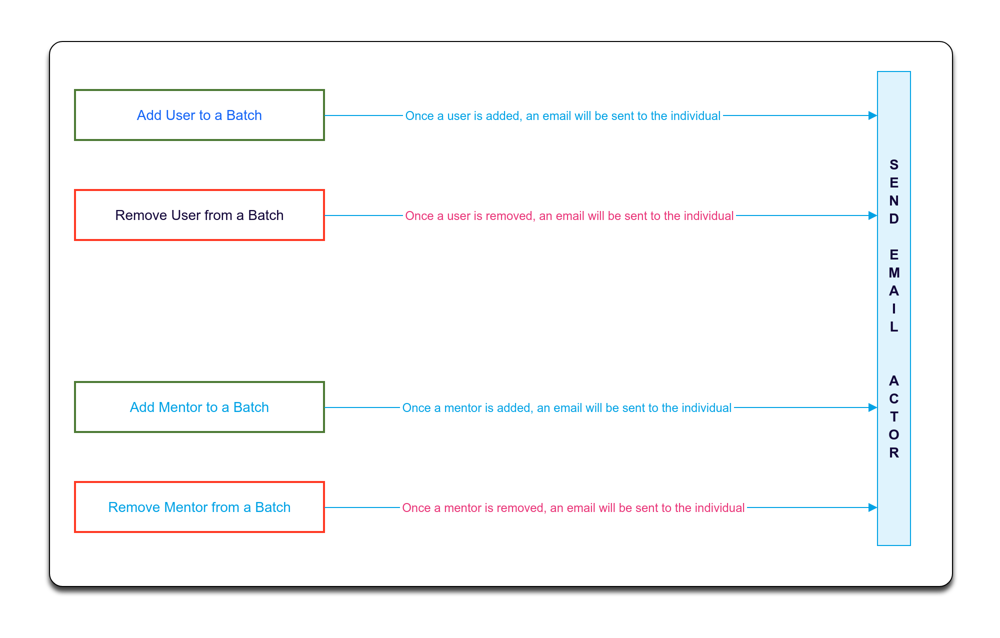

 **Proposed Solution for Release-1.11.0** 

The proposed solution for Email notification for the batch process is described in the following diagram

In the LMS service, we are creating the batch and adding mentors and users to the batch. in the same service, we have the Send Email actor also.

the proposed solution will call the send email once the mentor, a user is added to the batch and also when mentor, User is removed from the batch.

*****

[[category.storage-team]] 
[[category.confluence]] 
