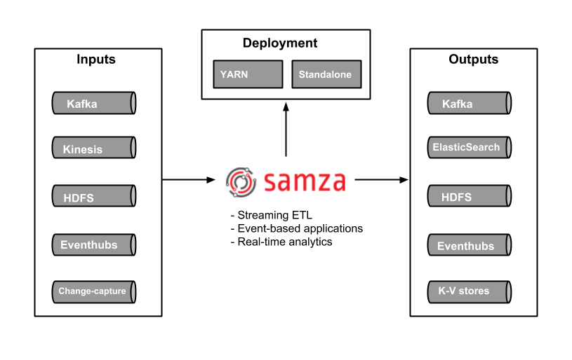
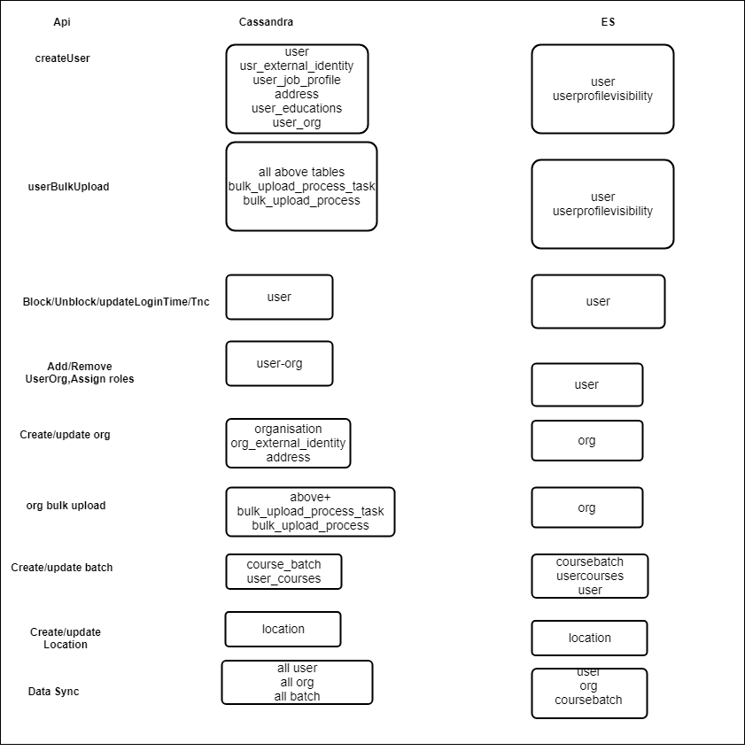
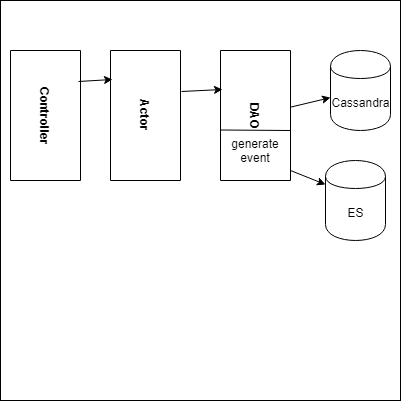

# Problem statement :
Current system is not event driven. And all background jobs are handled by one or more actors , it can have following problems:  


1.  Each background job is calling different actor and doing predefined set of actions. (So it's tightly coupled)
1.  System state can become inconsistent if asynchronous call fails due to system failure.
1.  For each job we are passing different set of data (no predefined event structure)
1.  Difficult to generate the audit logs


##    Design for handling event based system :
  


[[Data Persistence while processing events using kafka/ queues.|Data-Persistence-while-processing-events-using-kafka--queues.]].


## Event handling : 
             Event can be divided into two buckets.

              a) Transactional event  b) informational event

            \*      Transactional event : Any event directly related to database.

           \*    Informational event : Any event as a command . Example: Run a scheduler job on ad-hoc basis or when any location is updated, update all associated org locations as well.

             Event can be generated from two different layer. 

                1. Either on each API call (rest call) 

                2. On each DB operations

  \* Using DB approach, we can't handle all events, DB approach can handle Transactional  event only, for other event handling we need to use option 1.


## Event Producer:

###     **Solution for implementing event handling with API**  :
                        Event producer will be an interface with different implementation, this interface will have a method publishEvent . 

        **EventGeneratorUtil**  : This  class will be responsible for generating event structure and pass to event producer. For each api call it will always generate one event and that event will be push to message queue, then consumer will decide what data need to be store under which storage.


* Message broker will be initialized based on - settings available. If Kafka settings are available, that will be preferred Message broker, else In-Memory message broker will get initialized.
* Asynchronous requests will be queued - by fetching the MessageBroker instance and then publishing the event to specific "topic"


```java
public interface MessageBroker {

public String publishEvent (Message message) ;
}

1. can be AkkaMessageBroker:

public class InMemoryMessageBroker implements MessageBroker  {
  public  String publishEvent  (Message message) {
   //publishes to in memory queue - which could be activeMQ/Redis/Akka - whichever is finally chosen

}
}

2. can be kafka producer: 

public class KafkaMessageBroker implements MessageBroker  {
  public  String publishEvent (Message message) {
      // Publishes to kafka message queue.
     
}
}

-- Utility class to generate event:

public class EventGeneratorUtil {
  public  static String generateEvent(org.sunbird.common.request.Request, String targetObject,String operation) {
// Based on Request and targetObject it will generate event
return "";
}
}


public class Message {

  String event;
  String topic;
  String type;// transnational or  informational 

}


```


#Pros and cons for using api based handling


| Pros | Cons | 
|  --- |  --- | 
| Event generation is independent of DB  |  Extra call required if we need old value as well | 
| Can be handle for any kind of event |  | 


###      Solution for handling event using trigger:

###                  Use Cassandra trigger to generate an event. Cassandra trigger code will handle CRUD operations on Table and then our custom code will generate proper event structure. Once event structure is generated it will either write to file or Message Queue for further process.

###             

```js
CREATE TRIGGER TriggerName
  ON TableName
  USING 'fully qualified trigger classname'


```


| Pros | Cons | 
|  --- |  --- | 
| Easy to access DB changes   | Code will be tightly coupled with DB layer, as we need to put trigger jar inside DB | 
|  | Need to take care during DB version migration | 
|  | Need to take care during DB changes (Example : changes from one Database to another) | 
|  | Trigger API is semi-private and subject to change | 
|  | on DATASTAX it's mention create trigger is Deprecated. | 


Note: The implementation of triggers includes the capability to register a trigger on a table using the familiar CREATE TRIGGER syntax. The Trigger API is semi-private and subject to change.


### Handling generated event:
 Generated event can be directly pushed to Messaging Queue or can be written to file system and then from file system it can be pushed to Messaging queue. Both have their own pros and cons.

 **Pros and Cons for Directly pushing data to Messaging queue** 


| Pros | Cons | 
|  --- |  --- | 
| No extra processing or component required | If due to some reason Messaging queue is down then that event will be lost , unless or until we have some storage and retry mechanism | 
|  |  | 

 **Pros and Cons for writing event into file system ** 

| Pros | Cons | 
|  --- |  --- | 
| Even if Message broker is down , we can re-try and push it later. | Extra processing and component  required | 
|  | Need to have logstash for processing file event and push to Messaging queue | 
|  | There is file access problem inside docker | 


### Event Consumer:
              Our event consumer can be simple Java consumer based on Message broker or can be any plugin (Samza). 

Pros and Cons for using Samza consumer:


| Pros | Cons | 
|  --- |  --- | 
| good to real time data processing and data can be taken from multiple source | Need to add two more component.
1. Samza
1. YARN                                                                

 | 
|  | Samza will work with couple of message source | 




### Event structure:


```js
Event Structure:
{
  "identifier": "23456677888",
  "ets": 1548833319693,
  "requestId": null,
  "audit": false,
  "event": {
    "properties": {
      "courseId": {
        "ov": null,
        "nv": "do_12334445555"
      },
      "identifier": {
        "ov": null,
        "nv": "23456677888"
      },
      "batchId": {
        "ov": null,
        "nv": "id of the batch"
      },
      "batchStartDate": {
        "ov": null,
        "nv": "Course batch start date"
      },
      "status": {
        "ov": null,
        "nv": 0
      }
    }
  },
  "channel": "in.ekstep",
  "index": true, 
  "operationType": "CREATE",
  "eventType":"transactional or informational"
  "userId": "ANONYMOUS",
  "createdOn": "2019-01-30T12:58:39.693+0530",
  "objectType": "Batch"
}

Example:
{
  "identifier": "0126966862324285440",
  "ets": 1548833319693,
  "requestId": null,
  "audit": false,
  "event": {
    "properties": {
      "courseId": {
        "ov": null,
        "nv": "do_11261968952683724818"
      },
      "identifier": {
        "ov": null,
        "nv": "0126966862324285440"
      },
      "batchId": {
        "ov": null,
        "nv": "0126966862324285440"
      },
      "startDate": {
        "ov": null,
        "nv": "2018-11-12"
      },
	  "endDate": {
        "ov": null,
        "nv": "2018-12-20"
      },
	  "enrollmentType": {
        "ov": null,
        "nv": "invite-only"
      },
	  "name": {
        "ov": null,
        "nv": "Test Batch"
      },
	  "mentors": {
        "ov": null,
        "nv": ["user1","user2"]
      },
	  "participants": {
        "ov": null,
        "nv": {
		       "user1": true,
			   "user2" : true
		      }
      },
	  "createdFor": {
        "ov": null,
        "nv": ["ORG_001","09112000012222"]
      },
	  "countdecrementdate": {
        "ov": null,
        "nv": ""
      },
	  "countdecrementstatus": {
        "ov": null,
        "nv": false
      },
	  "hashtagId" : {
	     "ov": null,
        "nv": "0126966862324285440" 
	   } ,
	   "courseAdditionalInfo" : {
	     "ov": null,
        "nv": {
		     "courseName":"",
			 "leafNodeCount":1
		} 
	   } ,
      "status": {
        "ov": null,
        "nv": 0
      }
    }
  },
  "channel": "ORG_001",
  "index": true, 
  "operationType": "CREATE",
  "eventType":"transactional or informational"
  "userId": "ANONYMOUS",
  "createdOn": "2019-01-30T12:58:39.693+0530",
  "objectType": "batch"
}


```

## Current Relation for Api , Cassandra and ES update:



```java
      API:            ES                                   Tables cassandra 
#. create user->user,userprofilevisibility->(user,usr_external_identity,user_job_profile,address,user_educations,user_org)
#. update user->user,userprofilevisibility->(user,usr_external_identity,user_job_profile,address,user_educations,user_org)
#. block user->user -> (user)
#. userBulkUpload->user->user,userprofilevisibility->(bulk_upload_process_task,bulk_upload_process, all tables from create user)
#. unblock user-> user->(user)
#. updateLoginTime-> user->(user)
#. accept tnc-> user-> (user)
#. addUserToOrg-> user-> (user-org)
#. removeUserFromOrg -> user->(user-org)
#. AssignRoles -> user-> (user-org)
#. CreateOrg-> org -> (organisation,org_external_identity,address) 
#. org bulk upload  -> org -> (bulk_upload_process_task,bulk_upload_process,organisation,org_external_identity)
#. update org -> org -> (organisation,org_external_identity,address) 
#. update org status -> org -> (organisation)
#. create user notes -> usernotes -> (user_notes)
#. update user notes -> usernotes -> (user_notes)
#. delete user notes -> usernotes -> (user_notes)
#. create batch -> batch,usercourses,user -> (course_batch,user_courses)
#. update batch -> batch,usercourses,user -> (course_batch,user_courses)
#. add user to batch -> batch,usercourses,user -> (course_batch,user_courses)
#. remove user to batch -> batch,usercourses,user -> (course_batch,user_courses)
#. enroll batch -> batch,usercourses,user ->    (course_batch,user_courses) 
#. unenroll batch -> batch,usercourses,user ->  (course_batch,user_courses)
#. update content status -> content,user ->     (course_batch,user_courses)
#. location bulk upload -> location ->  (bulk_upload_process_task,bulk_upload_process,location)  
#. location create -> location ->   (location)
#. location update -> location ->   (location)
#. data sync api  -> user, org, batch,usercourses -> (complete user, org or batch or user courses)
#. Create issuer                 
#. Delete issuer
#. Create badge class
#. Delete badge class
#. Create badge assertion
#. Delete badge assertions
#. link badge to content   - > badgeassociations - > (content_badge_association)
#. unLink badge to content -> badgeassociations -> (content_badge_association)
#. Add user skills ->         user              -> (user_skills,skills)
#. endorse user skill
#. Object create 
#. Object update 
#. Object delete
#. System settings
#. Generate OTP
```

## Event Queue:
Event Producer will submit an event to Message queue .Event consumer will read the message and do the operation.


```java
public interface EventConsumer {

public void consumeEvent (String event) ;
}

1. can be AkkaActorProducer:

public class AkkaActorConsumerImpl implements EventConsumer   {
  public  void consumeEvent (String event) {
   //Based on event object type it will store data either in one or more index.
}
}
2. another can be Kafka consumer
```


## Event generation options :
Option 1: 

 Event generation from data access layer.



Create user example:


```js
1- Create user request body

{
 "request" : {
    "firstName":"manzarul",
    "lastName":"haque",
    "email" : "manzarul07@gmail.com",
    "emailVerified" : true,
     "phone" : "9898888888",
     "phoneVerified": true,
     "channel" : "channelVal",
     "orgExternalId" : "external id of org"
     "externalIds" : [
              {
               "id": "pan card number",
               "provider" : "government",
               "idType": "Pancard"
              }
            ],
     "address": [
              {
               "city":"",
               "state": "",
               "country" : "",
               "zipCode": "",
               "addressLine1" : "",
               "addType" : ""
              }
           ] ,
       "jobProfile" : [
                "jobName": "string",
                "role": "string",
                "joiningDate": "string",
                "endDate": "string",
                "orgId": "string",
                "orgName": "string",
                "address" : {
                   // address object of your job profile
                   
                  }  
               ] , 
      "education" : [{
               "degree": "string",
               "yearOfPassing": 0,
               "courseName": "string",
               "boardOrUniversity": "string",
               "percentage": 0,
               "grade": "string",
               "address" : {

            }

              } ]
}
}

2. Update user request body : 

 {
 "request" : {
    "userId" : "id of user"
    "firstName":"Updated first name",
    "email" : "updated email",
    "emailVerified" : true,
     "externalIds" : [
              {
               "id": "pan card number",
               "provider" : "government",
               "idType": "Pancard"
              }
            ],
     "address": [
              {
               // existing address  
               "city":"",
               "state": "",
               "country" : "",
               "zipCode": "",
               "addressLine1" : "",
               "addType" : "",
               "id" :"addressId"
              },
             {
              // Newly added address
               "city":"",
               "state": "",
               "country" : "",
               "zipCode": "",
               "addressLine1" : "",
               "addType" : "",
              }
           ] 
}
}


```


if event is generated from DAO layer , in above api call we will have following insert call.

  1. insert into user

  2. insert into usr-external-id (it can be multiple ids)

  3. insert into address (can be more than one call)

  4. insert into job profile and before that it will do insert into address

  5. insert into education and before that it will do address insert

  6. insert into user_org table.

 When user insert happen it will generate event and insert user into ES .

 Complexity will increase when insert into job profile , because job profile is separate table and when we do insert into job profile , before that we have to do address insert and it will generate an insert event.

 .  Incase of user data need to store into two index , (user and profilevisibility)  

 .  Some of the user attribute need to be as follow (email value will be put inside encEmail and phone value will be inside encPhone and email , phone will have mask value


## Operational Events:


  Event based system can be used for generating Operational events . This event can be generated from api internally and user will also have capability to generate event on demand.

List of Operational events:

1. Badge assertion to text book or user

2. Badge assertion once course batch is completed and that course is associated with some badge

3. Location update then all associated user , org location need to be updated

4. Scheduler job on-demand run

5. Object Syn can be moved from in-memory to event based

6. notification (sending different emails)


Event structure for operational event:


Event Structure: For badge assertion 

{

"identifier": "23456677888",

"ets": 1548833319693,

"requestId": null,

"event": {

"Id": "do_12334445555" ,

"objectId": "userId or textbookid" ,

"objectType": "user or text book or batch",

},

"operationType": "badgeAssertion",

"eventType":"operational"

"userId": "ANONYMOUS"

}

Event structure for location update:

{

"identifier": "23456677888",

"ets": 1548833319693,

"requestId": null,

"event": {

"objectId": "locationId" ,

"objectType": "location",

},

"operationType": "locationUpdate",

"eventType":"operational"

"userId": "ANONYMOUS"

}

Event structure for scheduler job on-demand

{

"identifier": "23456677888",

"ets": 1548833319693,

"requestId": null,

"event": {

"objectId": "jobId" ,

"objectType": "schedulerJob",

},

"operationType": "invoke",

"eventType":"operational"

"userId": "ANONYMOUS"

}


Event consumer can have different helper class to do data indexed.

Event consumer will have mapping file to know where data need to be stored based on event object type and operations.


| Object Type | Operation | indexed | 
|  --- |  --- |  --- | 
| user | create | user, profilevisibility | 
| user | update | user,profilevisibility | 
| user | block | user | 
| batch | create | coursebatch,usercourses,user | 


###  

### Another Option is we can generate multiple event , and push to Kafka.
For Event Queue we can use following options:

 1. Kafka

 2. rabbitmq 

3. Redis

4. java Queue(lmax disruptor)


### Error Handling:
 Any error occurs during this process ,it will be push to error topic from there consumer will retry the process.If still error occurs then that will be store some where in system as error storage , so that after some point of time error can be analysis by some one and take corrective action to avoid that kind of error in future.


NOTES:  For some of the document es is having list of objects (example: organisations) in that case during update we have to always pass complete list.


### Complexity for handling event using api call:

1.    Either event generator need to generate multiple event based on event type and submit to message broker . In this approach our producer(message broker) or consumer logic will be independent of message.
1.   Once multiple event generated by event generator , event consumer will read it and indexed it.
1.   Event generator will generate only one event and complete mapping logic will be shifted to event consumer. event consumer will see object type, operation and then it will decide what are the indices need to be updated. in that case it will split event based on different index storage.


### Complexity for handing event using trigger:

1.   Some time for one api call multiple cassandra table updated , but in ES only one or max two index updated (example of user creation), In that case we need to handle event sequence and concurrency during es update.
1.  In trigger will get to know old and new value , but some time we need to replace complete list itself. (example : new user add to organisations , so inside es we need to update complete list)
1. Data Sync event : this will just read data from cassandra and update to es based on object type.


### Event Generation at Cassandra DAC layer :
We can generate the events whenever there is any insert or update happen in the Cassandra. We will trigger an event containing information tableName, data, operationType

Complexities


1. Multiple events will be generated for one request.
1. We will be needing multiple consumer to handle cases, when we need to get the special data that we are storing separately in Cassandra.
1. We need to put multiple mapping
1. For updating Collection type of object we need to first fetch the data and then we need to check the type of object and if it is a type of collection then we need to get the previous state and then only we can add the data and update it.
1. For course batch if we have 250 participants, it will generate 250 events and then it has to update ES 250 times.

Error Conditions


1. Nested event will create problems. ex: while updating address in user_job_profile,  an event will be generated for address update but parent document will be not present as update job profile will be done after adding address.


```
{
  "identifier": "23456677888",
  "ets": 1548833319693,
  "audit": false,
  "event": {
		"properties": {
                "channel": "channel_01",
                "description": "channel1",
                "id": "",
                "communityId": null,
                "isApproved": null,
                "slug": "channel_01",
                "identifier": "",
                "thumbnail": null,
                "orgName": "mantra",                
                "isRootOrg": true,
                "rootOrgId": "rootOrgId",
                "contactDetail": [],
                "createdDate": "",
                "createdBy": "",
                "parentOrgId": null,
                "hashTagId": "0125716257142538240",
                "noOfMembers": null,
                "status": 1
            },
            "organisationId": "0125716257142538240",
            "phoneVerified": true,
            "roles": [
                "PUBLIC"
            ]
        }
  },
  "operationType": "CREATE",
  "eventType": "transactional or informational",
  "userId": "ANONYMOUS",
  "createdOn": "2019-01-30T12:58:39.693+0530",
  "objectType": "USER"
}
```
 **Event generation at ACTOR layer :** 

Event should be generated when a actor operation process is completed as we have to generate only a single message for esUpdate.

Message generated should be sent to Kafka directly or can be sent to Kafka using Log-stash .

Message will be read by consumer which decide what to do with message on the basis of a mapping system.

Mapping will help us to determine the corresponding operation to be done for a actor operation already performed.


###  **NOTE : ** The event message structures suggested above have attributes like old value and new value , And we don't required that structure as we will be not having the old values, instead we can make it more simple so event generation utility can have a very simple logic. we can keep all the required data in a field which we can name "properties".

Following can be the message structure :

 **EXAMPLE** 

```
{
message : {
	"id" : "",

	"actorMessage" : "CREATE_USER"(actor message which is processed),

	"properties" :{ contains data from already processed message or only the data which is significant for processing the event message ex: userId, batchId, (depends on what type of actor operation is done, and what data is already present so we don't need to fetch it again) },
	"channel": "in.ekstep",

	"index": true,

	"eventType":"transnational or informational",

	"userId": "ANONYMOUS",(requestedBY)

	"createdOn": "2019-01-30T12:58:39.693+0530",

	"objectType": "user"
		}

}
```
Sample request and event message for create org actor operation.


```
--------------Request--------------
{
  "id":"unique API ID",
  "ts":"2013/10/15 16:16:39",
  "params": { },
    "request":{
        "orgName":"NOTIFIER",
        "description":"channel-create-org",
        "isRootOrg":true,
        "channel": "channel_01",
        "preferredLanguage":"English",
        "provider":"pro_001",
        "externalId":"ext_001"
    }
       
}

--------------Event_message--------------
{ 
	message : 
		{ 	"id" : "123456789", 
			"actorMessage" : "CREATE_ORG",
			"properties" :{
 						"channel": "channel_01",
						"description": "channel-create-org",
						"id": "0125716257142538240",
						"slug": "channel_01",
						"identifier": "0125716257142538240", 
						"thumbnail": null,
						"orgName": "NOTIFIER",
						"isRootOrg": true,
						"rootOrgId": "0125716257142538240", 
						"contactDetail": [],
						"createdDate": "2019-01-30T12:58:39.693+0530",
						"createdBy": "",
						"parentOrgId": null, 
						"hashTagId": "0125716257142538240",
						"noOfMembers": null,
						"provider":"pro_001",
						"externalId":"ext_001"
						"status": 1
						}
			 "channel": "in.ekstep",
			 "index": true, 
			 "eventType":"transnational", 
			 "userId": "NULL",
			 "createdOn": "2019-01-30T12:58:39.693+0530",
			 "objectType": "organisation" 
		}
 }
```
Sample request and  event message for create user actor operation.


```
--------------Request--------------
{
 "params": { },
    "request":{                 
      "firstName": "mayank",
      "password": "password",
      "email": "testmailmayank@gmail.com",
      "userName":"iostream04",
      "emailVerified":true
    
    }
}  
-------------Event-message--------------
{
	message :
		{	"id" : "123456789",
			"actorMessage" : "CREATE_USER",
			"properties" :{ "userId":"2q3d-4w5e6-6g7f-7w8w-8v8b" },
			"channel": "in.ekstep",
			"index": true,
			"eventType":"transnational",
			"userId": "2q3d-4w5e6-6g7f-7w8w-8v8b",
			"createdOn": "2019-01-30T12:58:39.693+0530",
			"objectType": "user"
		}
}
```


 **Mapping example**  :


```
CREATE_USER : UPDATE_USER_INFO_ELASTIC (only userId will be required in the data)
UPDATE_USER : UPDATE_USER_INFO_ELASTIC (only userId will be required in the data/ we can use the data which is only being updated)
CREATE_ORG : INSERT_ORG_INFO_ELASTIC : (Map<String,Object> which contains all the data should be updated on elastic search , this data is already present, NO DB calls )
UPDATE_ORG : UPDATE_ORG_INFO_ELASTIC (Map<String,Object> which contains all the data should be updated on elastic search , this data is already present NO DB calls)
ADD_MEMBER_ORG : UPDATE_USER_ORG_ES (Map<String,Object> already have the required data, NO DB calls).
ENROLL_COURSE : INSERT_USR_COURSES_INFO_ELASTIC (Map<String,Object> already have the required data, NO DB calls ).
```


We also have some exceptions where we are not using background calls to update data on elastic search :

ex: In course_batch operations. we are updating  in for ground calls, we are making more calls when we are enrolling participants to a batch. We have to make it follow the event based system as it is able to process a large number of data but not able to give assurance of processing because of timeouts.


 **Benefits :** 


1. Very little code changes.
1. Uncertainty of es update will be decreased or will be removed.
1. No load will increase on any of the database servers. further it can be reduce by improving the process.
1. Decrease in cassandra read calls can be made with some further analysis.
1. No complex message structure, As message structure used above other than "event generation at actor layer" approach will need message creation utility. Which will create a complex structure and  while processing it , we have to change it to a target map for updating it to elastic search after consuming it.
1. We have all the data available for Actor operation after processing requests. (excluding user)


 **Complexities:** 
1. We will be using already available code for user update operation on elastic search , As this available code makes some cassandra calls  to get data for user.  (can be resolved by rewriting it in a better way)

 **Measure can be taken to prevent data lose while the service shutdowns:** Reason for service shutdown or restart:


1. Deployment process.
1. Health check service restarts it.

We can use a database raw entry to preserve request data before processing it and removing it after the request is processed successfully and event is generated.

In case of any failure before event generation we can revert back the insert operations using request data, So requestor will be able to reuse the data in next API call and successfully process it.

This can only be use full in case of actor task where we are using insert operations as we can not give guarantee for update operations.

As it will be very complex to revert back any update operation but in case of insert operation we have to remove it only from respective table.


*****

[[category.storage-team]] 
[[category.confluence]] 
