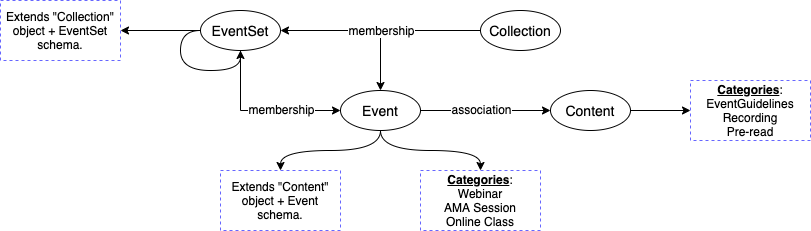
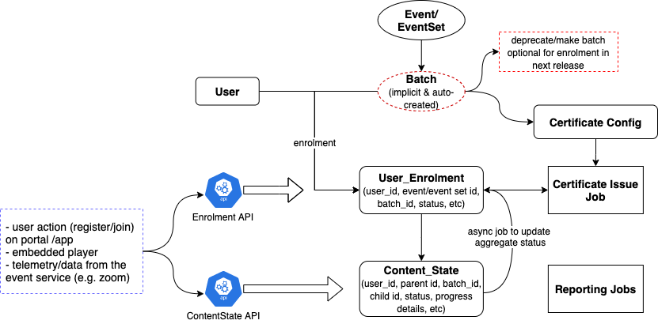

This document covers the design and modifications needed to support events related use cases in Sunbird.


## Below use cases have been considered when creating the spec

* A single event listed (eg: a ask me anything session)


* A collection of events (eg: a multi-day conference with one event each for the specific sessions)


* Recurring events (eg: a 4 month course being taught on Mondays & Fridays)


* A collection with an event within (eg: a content collection with training material, leading up to a live session)


## Event Model


Attributes _EVENTS_ 
```
"name", //mandatory
"code",
"status", // [live, retired], mandatory
"startDate", //mandatory
"endDate", //mandatory
"startTime", //mandatory
"endTime", //mandatory
"registrationStartDate", //mandatory
"registrationEndDate",
"eventType", //[online, offline, online_and_offline] //mandatory
"onlineProvider", //e.g. zoom
"onlineProviderData", //e.g. {meetingId:<>, meetingLink:<>, recordedMediaInfo: ..},
"venue", //location object
"visibility",
"audience",
"posterImage", //main image to show on the UI
"appIcon", //small image to show for listing
"description",
"createdFor",
"source",
"owner",
"collaborators",
"participationMethod", //[by invitation link, by registration, by scope {<org>, <group>}, open] **phase 2**
"language",
"ageGroup",
"keywords",
"dialcodes"
```
 _Event Relations_ 
```
eventSet hasSequenceMember event
collection hasSequenceMember event
event associatedTo content or collection //link to all the content shared as part of event
```
 _EVENTSET_ EventSet will be a collection of Event objects. Below are the additional attributes that EventSet will have apart from Event, barring a few which will be stored at event level (startTime, endTime). 


```
 "schedule", 
      "type": //[recurring, non-recurring], 
      "value" :
  //recurring template -> 
      {
        repeatEvery:<N>, repeatEveryType:<days|weeks|months|years>, 
        //if weeks selected:
        repeatOnDays:[<day of week1>,..], //e.g. every Monday and Friday
        //if month selected:
        repeatOnWeek:<N>, repeatOnWeekday:<day of the week>, //e.g. Every Second Thursday of the month
        startTime: <startTime>,
        endTime: <endTime>
        //child events would be named with the <event set name>-<sequence>
      }
  //non-recurring template
      [{date:<date>,startTime:<startTime>,endTime:<endTime>,name:<name>,description:<description>}]] ]></ac:plain-text-body></ac:structured-macro><p>Note currently only non-recurring is supported.</p><h4><em>EventSet Relations</em></h4><ac:structured-macro ac:name="code" ac:schema-version="1" ac:macro-id="6ea6048f-491a-42fc-b47e-d999583a654a"><ac:plain-text-body><![CDATA[eventSet hasSequenceMember event
collection hasSequenceMember eventSet
```

## APIs
 _EVENT_ 
* Create Event (kp=>/event/v4/create) - Creates an event in Graph with status Live. The event can thereafter be enrolled.


* Update Event (kp=>/event/v4/update/:identifier) - Updates an event in Graph. 


* Read Event (kp=>/event/v4/read/:identifier) - Reads an event from Graph. 


* Discard Event ( **cs** =>/v1/event/discard/:identifier) - Checks if the event has enrollments, if not, deletes the event in Graph by using private KP API. 


* Retire Event (kp=>/event/v4/retire/:identifier) - Marks the status as Retired. 


* Search Events (kp=>/v3/search) - Search for event or event set in Graph.


* Enroll Event ( **cs** =>/v1/event/enroll) - Allows a user to enroll to an event. Maintains information in sunbird_courses.user_enrolments. 


* Unenroll Event ( **cs** =>/v1/event/unenroll) - Allows a user to unenroll an event. Marks active=false in sunbird_courses.user_enrolments.


* Get User Enrolled Events ( **cs** => /v1/user/event/list/:uid) - Gets enrolled events for a user from sunbird_courses.user_enrolments.


* Get Participants for Event ( **cs** => /v1/event/participants/list) - Gets registered participant list for an event. Gets userids from sunbird_courses.user_enrolments based on batchId (see below note on batchId for events.)


* Update user event status ( **cs** => /v1/user/event/state/update) - Updates user progress for an event into sunbird_courses.user_content_consumption.


* Read user event status ( **cs** =>/v1/user/event/state/read) - Gets user progress for an event from sunbird_courses.user_content_consumption.


* Link Content to Event (work in progress)


* Get Event Attendees (work in progress)


 _EVENT SET_ 
* Create Event Set (kp=> /eventset/v4/create) - Creates Event Set as well as child Event objects in Graph and links them.


* Update Event Set ( **cs** => /v1/eventset/update) - Checks if the child events has any enrollments, if not, updates the event set in Graph by using private KP API. This deletes the older child events and recreates new ones. It is currently assumed that all the child events have metadata same as parent. If in future, if child events are vastly dissimilar to each other, then we can fix this by doing a detailed comparison for each child and no longer delete and recreate everything.


* Get Event Set Hierarchy (kp=>/eventset/v4/hierarchy/:identifier) - Fetches the child Events of Event Set from graph.


* Read Event Set (kp=>/eventset/v4/read/:identifier) - Gets Event Set details from the graph.


* Discard Event Set ( **cs** =>/v1/eventset/discard/:identifier) - Checks if the child events has enrollments, if not, deletes the event set & child events in Graph by using private KP API. 


* Retire Event Set (kp=>/eventset/v4/retire/:identifier) - Marks the status of event set and child events as Retired. 


* Enroll Event Set ( **cs** =>/v1/eventset/enroll) - Enrolls user to all the child events under the event set.


* Unenroll Event Set ( **cs** =>/v1/eventset/enroll) - Unenrolls user to all the child events under the event set.


\*kp = knowledge platform

\*cs = course service


* For enrollment and event tracking, the course flow is reused (with some generalization), so courseId is used for denoting eventId. Difference is that  **batchId**  is generated and is equal to (fixedPrefix + “-” + courseId). The fixed prefix is defaulted to a value in event schema so it can be easily passed to API, plus it also distinguishes between various other event like entities coming into the system in future. There is no entry made in “course_batch” as the batch is simply implied.


### Updated Enrolment table design


Changes to be done:


* Auto-create a batch for every event set & event on publish (similar to how auto batch creation is done for some courses currently).


* Generalise user_enrolment table to work with any type of asset (not just collections).


* Generalise content_state to capture status of child events in an event set or a collection (similar to how status of child content in a collection in currently captured)


* Enhance enrolment and content-state APIs to work for all asset types (i.e. events and event sets).


* Generalise async status_aggregator job to work for all asset types (i.e. events and event sets).   


Iteration 2:


* Generalisation of certificate config and certificate issue


* Generalisation of reporting jobs


Iteration 3:


* Make batches optional for enrolment and tracking 


### Telemetry and tracking - Online Events
When an online event is launched, the browser will redirect to the respective event platform, so telemetry events cannot be produced, since Sunbird is not in control of those platforms. However most platforms offer APIs to request attendee data, or webhooks to receive participant data. 

For each user who enrolled to the event, we need to be able to store


* Did they join the event or not


* How much time did they join for 


Based on this the “attendance” will be marked. 


The current user enrollment table does not have these, so a revised design of the enrollment table is necessary. 


### 

Venues & Configuration for online events
Offline events can be mapped to venues. For online events, we can use the various providers as venues. Each instance of the provider config will be a venue. This allows doing checks to ensure there is only one event at a time happening at a venue. 


### 

Online Events Interface 
The online events will be implemented using an interface that allows integrating multiple providers like Zoom, Gotomeeting, Google Meet, Jitsi etc. Proposed interface methods


* createEvent()


* addParticipant()


* getParticipantJoinLink()


* getHostJoinLink()


* getRecording()


* getAttendance()


### 

UI Components - Consumption
Each component will be configured via the form API. All decisions in the UI should be configured. This will give flexibility to the implementation to show / hide things. 

 **List of Events** 

<sb-event-list listconfig="\[listConfig]"></sb-event-list>

<sb-event-calendar listconfig="\[listConfig]"></sb-event-calendar>

<sb-event-grid listconfig="\[listConfig]"></sb-event-grid>

 **Event Details** 

Event Details (with variations for upcoming, ongoing & complete stages, list of related content eg: recordings)

<sb-event-details identifier="\[identifier]"></sb-event-details>

 **List of Attendees** 

For Event manager, screen to view attendees and download attendance data

<sb-event-attendees identifier="\[identifier]"></sb-event-attendees>


### UI Components - Creation
For creation, the new hierarchy editor will be used. A plugin will be created for adding support to create events within this editor. 


### List of Services

* getEventList(listConfig)


* getEvent(identifier)


* getParticipation()


* getAttendeeJoinLink()


* getHostJoinLink()


* getEventFormConfig()


* createEvent()


* updateEvent()


* deleteEvent()


* getEventAttendees()


### Additional Roles Needed
Event Creator


* Can create / edit / publish events


* Can view and download the attendee list for a event


## Other API Endpoints (Work In Progress)

* Get attendees CSV export


* Get join link


*****

[[category.storage-team]] 
[[category.confluence]] 
