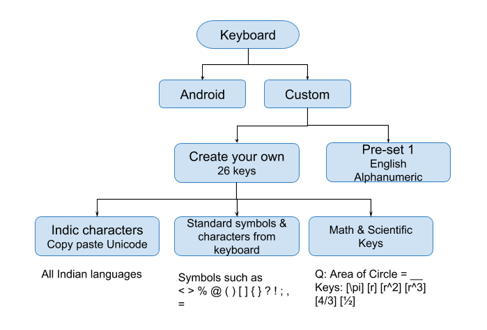
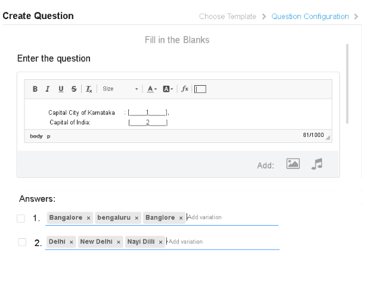
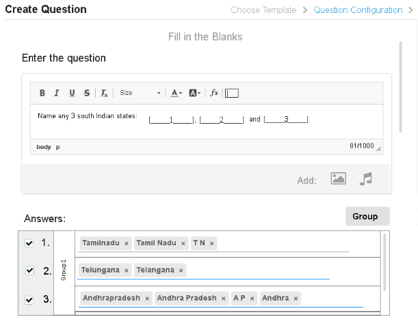
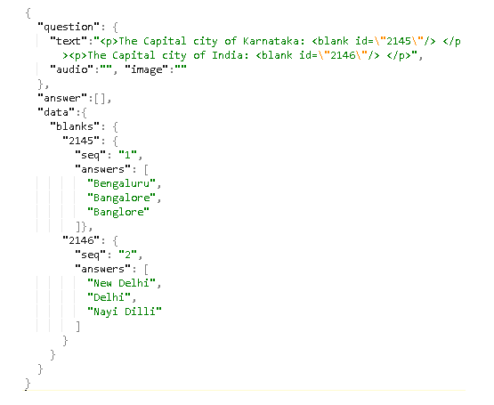
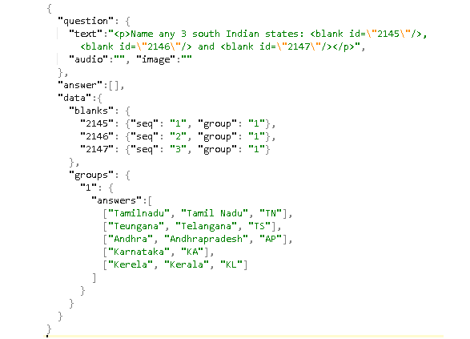
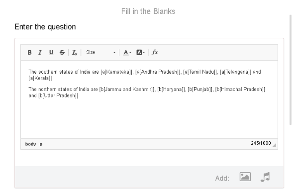

 **Grouping of Blanks** 

JIRA Issue[https://project-sunbird.atlassian.net/browse/SB-8987](https://project-sunbird.atlassian.net/browse/SB-8987)

source document: [https://docs.google.com/document/d/1KSM125In96unii6c-8sKzBEpli8quufp1UJywX4J4bo/edit](https://docs.google.com/document/d/1KSM125In96unii6c-8sKzBEpli8quufp1UJywX4J4bo/edit)

Bug resolution:
* Provide ability to configure ordered & unordered
* Provide variations (optionally)
* No other additional required for bug resolution BUT what if we were to solve for other scenarios as well.

Scope - FTB Que & AnsFill in the blank - Question & Answer 

Phase - Next upSingle blankSupport multiple responses or variations for a blank in the question.


Example

Question: Children need to learn about ___ at least once in their lifetime.

Answers: Empathy, Technology, Freedome.


Question: Chennai is capital of ____ 

Answers: Tamil Nadu, TamilNadu, TN.

Multiple blanksA question containing multiple blanks with one of the following possibilities.

IndependentAll blanks behave independently.


Example

Question: Complete the sequence 21, 22, __, __, 25, __, 27

Answers: 

Blank 1 = 23,

Blank 2 = 24,

Blank 3 = 26

One groupAll blanks can accept answers from a group of values


Example

Question: __ and __ are 2 states in Southern India

Answers: ANY of but no repeats allowed

Value 1: Tamil Nadu, TamilNadu, TN

Value 2: Andhra Pradesh, Andhra, AndhraPradesh

Value 3: Karnataka,

Value 4: Kerala, …


Question: __ and __ are two prime numbers below 30

Answer: ANY of 1,3,5,7,11,13,17,19,23,29 BUT no repeats allowed. Cannot be 23 & 23.

Phase - SomedayMultiple groupsMultiple blanks can accept answers from a group of values. There can be multiple such groups.


Example:

Question: __ & __ are two rulers from Mughal era and __ & __ are two of their famous architectural contribution to India.

Answers:

Group 1 (blank 1 & 2):

Value 1: Akbar

Value 2: Humayun

Value 3: Babar

Value 4: Shahjahan, Shah Jahan, 

Group 2 (blank 3 & 4)

Value 1: Taj Mahal, TajMahal,

Value 2: Qutub Minar

Value 3: Chaar Minar

Value 4: Laal Kila, Lal Killa, 

Linked responses with 2 or more blanksIf Karnataka then Kannada, and so on..


Scope - KeyboardResponse mechanism for players

AvailableAndroid keyboard

Custom keyboard - standard Alpha Num

Custom 26 key keyboard - Indic fonts, standard keyboard keys

Phase - SomedayLaTeX support


Design ApproachApproach 1: UI update to bring new creation experienceThis approach suggests significant UI updates to


* Make the overall editing experience better than before
* Accommodate requirements as stated in the JIRA issue and also any future needs that can come up for FTB.

Categories:
1. Independent Ungrouped blanks (1 answer)

This represents the current implementation of FTB using the square brackets with single correct answer per blank.


Example:

Complete the sequence: 21, 22, _a_, _b_, 25, 26, _c_.

Answer: a = 23, b = 24, c = 27


1. Independent Ungrouped blanks (answer with variations)

Example:

The capital city of Karnataka is ________a_________.

Answer: a = Bangalore | Bengaluru | Banglore


1. Grouped blanks (list of answers, unique)

Example:

Name any 2 states in south India:  ____a____ , ____b_____.

Answer: a = Any of \[Tamilnadu, Kerala, Andhra Pradesh, Karnataka, Telungana], b = Any of \[Tamilnadu, Kerala, Andhra Pradesh, Karnataka, Telungana] other than the value specified in (a).


In this case, if the student answers Tamilnadu in blank (a), then the answer should be one of the other states from the list. Both the blanks should not have the same answer.


1. Grouped blanks (list of answers with variations, unique)

Example:

Name any 2 states in south India:  ____a____ , ____b_____.

Answer: a = Any of \[Tamilnadu | TN | Tamil Nadu, Kerala, Andhra Pradesh | Andhra | Andrapradesh, Karnataka, Telungana | Telangana], b = Any of \[Tamilnadu | TN | Tamil Nadu, Kerala, Andhra Pradesh | Andhra | Andrapradesh, Karnataka, Telungana | Telangana] other than the value specified in (a).


In this case, the any of the answers from “Tamilnadu” or “TN” or “Tamil nadu” can be accepted as correct answer for the a blank. Similarly, “Telungana” or “Telangana” can be accepted as correct answer. As in case of (3), no two blanks can be have the same answer.


1. Related Grouped blanks (list of answer with related list of answer for other blank)

Example:

__a___ is a state in south India, and __b___ is the language spoken by the people of that state.

Answer: a = Any of \[Tamilnadu, Kerala, Andhra Pradesh, Karnataka, Telangana], b = Tamil (if a = Tamilnadu), Malayalam (if a = Kerala), Telugu (if a = Andhra pradesh or Telangana), Kannada (if a = Karnataka).


1. Related Grouped blanks (list of answer with variations with related list of answer and variations for other blank)

Example:

__a___ is a state in south India, and __b___ is the language spoken by the people of that state.

Answer: a = Any of [Tamilnadu | TN | Tamil nadu, Kerala, Andhra Pradesh | Andhra | AP, Karnataka, Telangana | Telungana], b = Tamil (if a = Tamilnadu\*), Malayalam (if a = Kerala\*), Telugu (if a = Andhra pradesh\* or Telangana\*), Kannada (if a = Karnataka\*).

\* => the answer or its variations.


Design for Category 1 & 2Editor Capabilities
1. CKEditor menu will have a toolbar icon to drop a blank on to the question area.
1. When the blank is inserted, the Answers area will get populated with a field to allow adding one or more answer variations for the blank.
1. Author can add multiple blanks

Design for Category 3 & 4

Editor Capabilities
1. In addition to the capabilities above, when more than one answer is selected (check on the checkbox), user will be able to group the blanks.
1. Now, the individual fields against the blanks will be hidden, instead a list of such fields will be made available for the user to add answers and the variations.
1. User should also be able to add more possible answers to the group. For example, Name any 2 prime numbers below 50.
1. The blanks will be evaluated as follows:


Design for Category 5 & 6Not supported for now.


Technical details:Question content from CKEditor:The question content is obtained from CKEditor will contain the HTML markup of the question text. For example,


<p>The Capital city of Karnataka: <blank id="2145"/> </p><p>The Capital city of India: <blank id="2146"/> </p>

Question ModelSolution 1The question model will contain the further details of the blanks.

Category 1 & 2

Category 3 & 4



Solution 2
```
{
  "question": {
    "text": "<p>Name any 3 south Indian states: <blank \"id\"=\"b0\"></blank>,<blank \"id\"=\"b1\"></blank> and <blank \"id\"=\"b2\"></blank></p> ",
    "audio":"",
    "image": ""
  },
  "answer": \[],
  "data": {
    "fields": {
      "b0": {
        "type": "blank",
        "seq": 1, 
        "answers": \["1"],
        "data": "",
        "group": true
      },
      "b1": {
        "type": "blank",
        "seq": 2, 
        "answers": \["1"], 
        "data": "",
        "group": true
      }
    },
    "groups": {
      "1": {
        "answers": \[
          \["Karnataka", "KA"],
          \["Andhrapradesh", "AP"],
          \["Tamilnadu", "TN"],
          \["Kerala", "KL"]
        ]
      }
    }
  }
}
```
Backward compatibility & versioningPlugin versioningFTP plugin with this new feature will be with version 1.1 (org.ekstep.questionUnit.ftb-1.1).

Player
1. Support for FTB questions with version 1.0 

When 1.0 version questions (with \[\[ & ]]  format is used) along with 1.1 version questions in a content (worksheet), then the new plugin must render the question properly. All functionalities that the plugin supported in 1.0 version must be supported in 1.1 in order to support 1.0 version of questions.

Editor
1. Questions created with 1.0 version of the plugin where the question text contains \[\[ & ]]  notation is edited with the 1.1 version of the plugin, then the square bracket notation will be automatically converted into the newer notation. An informational message (toast) will be displayed to the user that the question has been migrated to the new version.
1. When the user attempts to edit the question (existing question or new question) by inserting blank using the \[\[ & ]]  notation, it will be ignored. Optionally, a toast message informing the user that the older notation is no longer supported. We can also attempt to inline migrate the older notation blank to newer notation (to be tried). 

Migration considerationsQuick iterations & versions over next few cycles - 

Migration for old blanks \[\[ ]]  -> to new placeholder blank editing

No support for inline markdown

Ensure backward compatibility on player & editor side - migrate to latest always


* Old Que (using v1.0) -> materialised in content -> content published (ECAR) => new player should support old content -> plugin is bundled in content. \[Good!]
* Old Que -> now being bundled in new content -> content sent for review => new player will support because old / new? Plugin will be bundled in content \[Good!]
* Old Que -> edit question -> latest plugin -> Good!
* New Que -> Create Resource -> Old player or New player because plugin are bundled
* Content containing new & old questions both -> should play seamlessly.

Question - new / already created

Content - contains new + old question

Content Player (App) - new / old


Content already published - contains old plugin already

On edit of Question - migrate to latest

Questions already created - when being used in content being materialised now - migrate / bundle latest or keep old

Questions already materialised - On edit of Content - bundle latest plugin or keep old & new plugin both?

Any new content being published - contains both or only latest version of plugin?

Rendering on the PlayerWhen rendering the question on the player, consider the following:


* Each of the <blank> tags to be replaced with a <input> tag, with id same as the id of the <blank> tag.
* The size (length) of the <input> must be equal to the longest answer variation. In case of grouped blanks, the inputs must be equal to the longest answer variation in the group.
* Size should have four configurations: FTB Blank size = empty, min, max, overflow

Width of input box / blank = based on Indic character or Unicode rendering. राम = 2 and not 3

Ignore answer array. 

Fix min & max = 10 (20%) & 20 (60%). 

Expand from min to max based on user input at play time.

\[\[_|____]] 

\[\[_Thomas Alva_|]] 

_(Thomas) \[\[Alva__Edisson_|]] 

Evaluation (on the Player)The below points to be considered during evaluation


1. All user answers must be converted to lowercase and compared against each of the answer variations after converting them also to lowercase.
1. Consider removing white spaces from the user answer and the expected answer variations (trim and also remove embedded white spaces)

Performance consideration during evaluationIn case of grouped blanks, if there are N possible answers, and if there are M variations for each answer, and if there are P blanks, then evaluation logic will have to N x M x P string comparisons to determine if there is a match or not. For smaller set of blanks and answer variations, this should not cause much of an issue, but care must be taken to see if there are better alternatives to ensure that the evaluation logic performs optimally.

Evaluation configurations
1. Ignore space by default
1. Partial scoring by default

String evaluator Supported symbols - (standard symbols)

Unicode character - all language alphabets, numbers, 


Evaluation logic:


*  ANY - group
*  OR - variations


Unicode standards:


* [http://www.unicode.org/standard/standard.html](http://www.unicode.org/standard/standard.html) - Link to release notes
* [http://www.unicode.org/versions/Unicode11.0.0/](http://www.unicode.org/versions/Unicode11.0.0/) - latest version 11.0.0
* [http://www.unicode.org/versions/Unicode11.0.0/](http://www.unicode.org/versions/Unicode11.0.0/) - code table & list
* [https://en.wikipedia.org/wiki/List_of_Unicode_characters](https://en.wikipedia.org/wiki/List_of_Unicode_characters)


Mathematical expression evaluatorMathematical equivalence


* Is 10.5 = 10.50 = 10.5001?
* ½ = 3/6 = 1024/2048? (Depends on context on question)
* …


LaTeX evaluator Area of circle = __ (\pi\*r^2) [The child should be provided with a custom keyboard having keys such as \pi, r, r^2, r^3, 4/3, ½, etc]

TelemetryDevelopment Tasks


|  **No.**  |  **Title**  |  **Description / comments**  |  **Status**  | 
| 1 | CKEditor Plugin for inserting blank | The built in input plugin does not look good. A new plugin (a simple one) can help make it look good | Done | 
| 2 | Custom Directive to allow enter answer variations | To help reuse of the directive in multiple places (based on the tags input) or can use jsTag [http://eranhirs.github.io/jsTag/](http://eranhirs.github.io/jsTag/) | Done | 
| 3 | Editor UI updates for Cat 1 & 2 |  | Done | 
| 4 | Editor UI updates for Cat 3 & 4 | Depends on (3), and addition work of allowing grouping of blanks | Done | 
| 5 | Evaluation on player side |  | Done | 
| 6 | Migration of old question to new notation |  | Done | 


Approach 2 - Without significant UI changesIn this approach, we will try to arrive at a design which does not involve too much of UI refresh, but capture the necessary functionalities to achieve the requirement as stated in the JIRA issue.




1. Format: \[<id>\[Answer]]  instead of \[\[Answer]] . (\[\[Answer]]  format will also be supported for ungrouped blanks)
1. The <id> will allow to group blanks that belong to a group. 
1. The <id> will also help distinguish different groups in the same question. 
1. <id> could be any single character (a, b, c etc).
1. Can also allow multiple variations for an answer. For e.g., \[a\[Tamil nadu | TN | Tamilnadu], where the symbole “|”  (pipe) helps distinguish variations of the correct answer.
1. Additional Correct answers:


This approach will make the creation too difficult for teachers.


*****

[[category.storage-team]] 
[[category.confluence]] 
