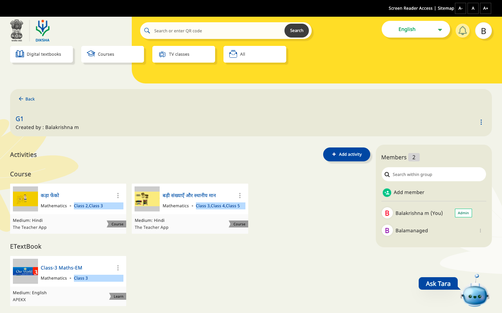

This document will help to understand how to add an activity in a group

 **Background** 


1. We can enable any activity type for  a group


1. We can configure form API for that


 **Form creation** 

This form will be used to populate the activity types that can be added for a group. If there is no form created we won’t be able to add any activity.

 **End Point:** 


```
POST: /data/v1/form/create 
```
 **Request Body** 


```
{
    "request": {
        "type": "group",
        "subType": "supported_activities",
        "action": "list",
        "data": {
            "templateName": "supported_activities",
            "action": "list",
            "fields": [
                {
                    "index": 0,
                    "activityType": "Explanation Content",
                    "objectType": "Content",
                    "isEnabled": true,
                    "sortBy": [
                        {
                            "name": "asc"
                        }
                    ],
                    "searchQuery": "{\"request\":{\"filters\":{\"primaryCategory\":[\"Explanation Content\"],\"status\":[\"Live\"],\"objectType\":[\"Content\"]},\"fields\":[\"name\",\"appIcon\",\"contentType\",\"identifier\",\"objectType\",\"createdBy\"]}}",
                    "title": "Explanation Content",
                    "translations": "{\"en\":\"Explanation Content\"}"
                },
                {
                    "index": 1,
                    "activityType": "Learning Resource",
                    "objectType": "Content",
                    "isEnabled": true,
                    "sortBy": [
                        {
                            "name": "asc"
                        }
                    ],
                    "searchQuery": "{\"request\":{\"filters\":{\"primaryCategory\":[\"Learning Resource\"],\"status\":[\"Live\"],\"objectType\":[\"Content\"]},\"fields\":[\"name\",\"appIcon\",\"contentType\",\"identifier\",\"objectType\",\"createdBy\"]}}",
                    "title": "Learning Resource",
                    "translations": "{\"en\":\"Learning Resource\"}"
                },
                {
                    "index": 2,
                    "activityType": "Course",
                    "objectType": "Content",
                    "isEnabled": true,
                    "sortBy": [
                        {
                            "name": "asc"
                        }
                    ],
                    "searchQuery": "{\"request\":{\"filters\":{\"primaryCategory\":[\"Course\"],\"batches.status\":1,\"batches.enrollmentType\":\"open\",\"objectType\":[\"Content\"],\"status\":[\"Live\"]},\"fields\":[\"name\",\"appIcon\",\"contentType\",\"identifier\",\"objectType\",\"createdBy\"]}}",
                    "title": "Course",
                    "translations": "{\"en\": \"Course\", \"as\": \"পাঠ্যক্ৰমসমুহ\", \"bn\": \"পাঠ্যধারাগুলি\", \"gu\":\"કોર્સ\", \"hi\":\"कोर्स\", \"kn\":\"ಕೋರ್ಸ್ ಗಳು\", \"mr\":\"कोर्सेस\", \"or\":\"ପାଠ୍ୟକ୍ରମଗୁଡ଼ିକ\", \"pa\":\"ਕੋਰਸਿਸ\", \"ta\":\"பாடநெறிகள்\", \"te\":\"కోర్సులు\", \"ur\":\"کورسز\"}"
                },
                {
                    "index": 3,
                    "activityType": "Practice Question Set",
                    "objectType": "Content",
                    "isEnabled": true,
                    "sortBy": [
                        {
                            "name": "asc"
                        }
                    ],
                    "searchQuery": "{\"request\":{\"filters\":{\"primaryCategory\":[\"Practice Question Set\"],\"status\":[\"Live\"],\"objectType\":[\"Content\"]},\"fields\":[\"name\",\"appIcon\",\"contentType\",\"identifier\",\"objectType\",\"createdBy\"]}}",
                    "title": "Practice Question Set",
                    "translations": "{\"en\":\"Practice Question Set\"}"
                }
            ]
        }
    }
}

```
Refer the below table to find more about the fields


|  **Field**  |  **type**  |  **description**  | 
|  --- |  --- |  --- | 
| index | number | For sorting in frontend | 
| activityType | string | Activity type which needs to be added to group | 
| objectType | string | Type of the object | 
| isEnabled | boolean | Indicates whether the activityType is to be displayed | 
| sortBy | Object | Used for any custom sort based on any property | 
| searchQuery | stringified object | query needs to be called with search API when a activity is selected | 
| title | string | Activity types title which is used to display in front end | 
| translations | stringified object | provide the translations to handle localisation | 

 **Fetching form data** 

 **Endpoint** 


```
data/v1/form/read
```
 **Request** 


```
{
    "request": {
        "type": "group",
        "subType": "supported_activities",
        "action": "list"
    }
}
```
 **Response** 


```
{
  "id": "api.form.read",
  "params": {
    "resmsgid": "ca4e73c4-ce1c-4208-a621-7ddfc6bde86e",
    "msgid": "47e955db-f3b1-4a4a-a1dc-242f6454d013",
    "status": "successful"
  },
  "responseCode": "OK",
  "result": {
    "form": {
      "type": "group",
      "subtype": "supported_activities",
      "action": "list",
      "component": "*",
      "framework": "*",
      "data": {
        "templateName": "supported_activities",
        "action": "list",
        "fields": [
          {
            "index": 0,
            "activityType": "Explanation Content",
            "objectType": "Content",
            "isEnabled": true,
            "sortBy": [
              {
                "name": "asc"
              }
            ],
            "searchQuery": "{\"request\":{\"filters\":{\"primaryCategory\":[\"Explanation Content\"],\"status\":[\"Live\"],\"objectType\":[\"Content\"]},\"fields\":[\"name\",\"appIcon\",\"contentType\",\"identifier\",\"objectType\",\"createdBy\"]}}",
            "title": "Explanation Content",
            "translations": "{\"en\":\"Explanation Content\"}"
          },
          {
            "index": 1,
            "activityType": "Learning Resource",
            "objectType": "Content",
            "isEnabled": true,
            "sortBy": [
              {
                "name": "asc"
              }
            ],
            "searchQuery": "{\"request\":{\"filters\":{\"primaryCategory\":[\"Learning Resource\"],\"status\":[\"Live\"],\"objectType\":[\"Content\"]},\"fields\":[\"name\",\"appIcon\",\"contentType\",\"identifier\",\"objectType\",\"createdBy\"]}}",
            "title": "Learning Resource",
            "translations": "{\"en\":\"Learning Resource\"}"
          },
          {
            "index": 2,
            "activityType": "Course",
            "objectType": "Content",
            "isEnabled": true,
            "sortBy": [
              {
                "name": "asc"
              }
            ],
            "searchQuery": "{\"request\":{\"filters\":{\"primaryCategory\":[\"Course\"],\"batches.status\":1,\"batches.enrollmentType\":\"open\",\"objectType\":[\"Content\"],\"status\":[\"Live\"]},\"fields\":[\"name\",\"appIcon\",\"contentType\",\"identifier\",\"objectType\",\"createdBy\"]}}",
            "title": "Course",
            "translations": "{\"en\": \"Course\", \"as\": \"পাঠ্যক্ৰমসমুহ\", \"bn\": \"পাঠ্যধারাগুলি\", \"gu\":\"કોર્સ\", \"hi\":\"कोर्स\", \"kn\":\"ಕೋರ್ಸ್ ಗಳು\", \"mr\":\"कोर्सेस\", \"or\":\"ପାଠ୍ୟକ୍ରମଗୁଡ଼ିକ\", \"pa\":\"ਕੋਰਸਿਸ\", \"ta\":\"பாடநெறிகள்\", \"te\":\"కోర్సులు\", \"ur\":\"کورسز\"}"
          }
        ]
      },
      "created_on": "2021-03-04T16:36:03.084Z",
      "last_modified_on": "2020-11-20T08:23:59.301Z",
      "rootOrgId": "*"
    }
  },
  "ts": "2021-03-09T04:09:33.853Z",
  "ver": "1.0"
}
```
 **Add activity request** 

The request for adding activity to a group

 **Endpoint** 


```
group/v1/update
```
 **Request** 


```
{
  "request": {
      "activities" : {
        "add": [
          {
            "id": "do_31298128908016844817", // do_id of content
            "type": "Course" // activity type
          }
        ]
      }
  }
}
```
 **Response** 


```
{
  "id": "api.group.update",
  "ver": "v1",
  "ts": "2021-03-09 04:15:52:992+0000",
  "params": null,
  "result": {
    "response": "success"
  },
  "responseCode": 200
}
```
 **Steps for adding activity for group** 


1. Open a group and click on add activity button


2. Select any activity type u want  to add

3. Select any activity you want to add and click on Add to group


*****

[[category.storage-team]] 
[[category.confluence]] 
