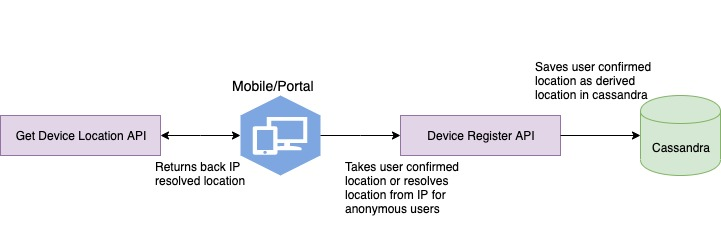

 **Introduction:** This documents describes the design for capturing Device and User location. This design requires following changes


*  **Get Device Profile API ** - To return back the IP resolved location for the device.
*  **Device Register API Enhancements ** - API to save User confirmed location to device_profile Cassandra table as derived location.
*  **Telemetry Location Updater Samza Job Changes ** - To stamp derived location in the telemetry.




 **Get Device Profile API:** This API returns back IP resolved location details from MaxMind DB.

 **Request Details:** End point: GET /v3/device/profile/<deviceId>

IP details is sent as X-FORWARDED-FOR in the header.

 **Response Details:** 


```
{
    "id": "analytics.device-profile",
    "ver": "1.0",
    "ts": "2019-07-30T18:54:10.627+00:00",
    "params": {
        "resmsgid": "e045d484-eedb-4fa9-a9d8-9c3e489e664f",
        "status": "successful",
        "client_key": null
    },
    "responseCode": "OK",
    "result": {
        "userDeclaredLocation": {
            "state": "Karnataka",
            "district": "Bengaluru"
        },
        "ipLocation": {
            "state": "Karnataka",
            "district": "Bengaluru"
        },
        "deviceProfile": {

        }
    }
}
```


 **Device Register API Enhancements:** 
* For signed in users - Saves location details as derived location in device_profile cassandra table.
* For anonymous users - Resolves the IP address from the x-forwarded-for header and writes to cassandra.

 **Request Details:** End point: POST /v3/device/register/<deviceId>

IP details is sent as X-FORWARDED-FOR in the header.

Object:


```
{
    "id": "dev.sunbird.portal",
    "ver": "1.15.0",
    "ts": "2019-04-23T19:23:02+05:30",
    "params": {
        "msgid": "4f92a44f-127f-0c82-b2ad-715faa558a8d"
    },
    "request": {
        "uaspec": {
            "agent": "Chrome",
            "ver": "72.0.3626.121",
            "system": "mac-os-x-14",
            "platform": "Mac",
            "raw": "Mozilla/5.0 (Macintosh; Intel Mac OS X 10_14_3) AppleWebKit/537.36 (KHTML, like Gecko) Chrome/72.0.3626.121 Safari/537.36"
        },
        "channel": "b00bc992ef25f1a9a8d63291e20efc8d",
        "fcmToken": "asda",
        "producer": "app12",
        "dspec": {"id": "oppo"},
        "ext": {
            "userid": "user1"
        },
        "userDeclaredLocation": {
            "state": "Karnataka",
            "district": "Bengaluru"
        }
    }
}
```


 **Response Details:** 


```
{
    "id": "analytics.device-register",
    "ver": "1.0",
    "ts": "2019-07-30T18:54:10.627+00:00",
    "params": {
        "resmsgid": "e045d484-eedb-4fa9-a9d8-9c3e489e664f",
        "status": "successful",
        "client_key": null
    },
    "responseCode": "OK",
    "result": {
        "message": "Device registered successfully",
        "actions": [
            {
                "type": "experiment",
                "data": {
                    "experimentName": "first-exp",
                    "key": "/page1/4",
                    "experimentId": "exp1",
                    "title": "experiment"
                }
            }
        ]
    }
}
```


 **Cassandra schema:** 


```
CREATE TABLE IF NOT EXISTS {{ cassandra.keyspace_prefix }}device_db.device_profile (
    device_id text,
    first_access timestamp,
    last_access timestamp,
    total_ts double,
    total_launches bigint,
    avg_ts double,
    device_spec Map<text,text>,
    updated_date timestamp,
    state text,
    state_code text,
    country text,
    country_code text,
    state_custom text,
    state_code_custom text,
    district_custom text,
    city text,
    uaspec Map<text,text>,
    fcm_token text, 
    producer_id text,
    user_declared_state text,
    user_declared_district text,
    PRIMARY KEY (device_id)
);
```


Queries:


1. Derived and device location details needs to be stored separately? and derived location should have only state and district or all other fields? - 
1. Current Device Register API writes device location to cassandra via kafka and which of the above API should have this logic?
1. User derived location has only state & district, telemetry stamping requires other details - state code, state custom details, city details, etc
1. Can derived location be the new columns in same device_profile cassandra table.?
1. Will derived location details in telemetry stamped as new fields or same current device location fields?


*****

[[category.storage-team]] 
[[category.confluence]] 
