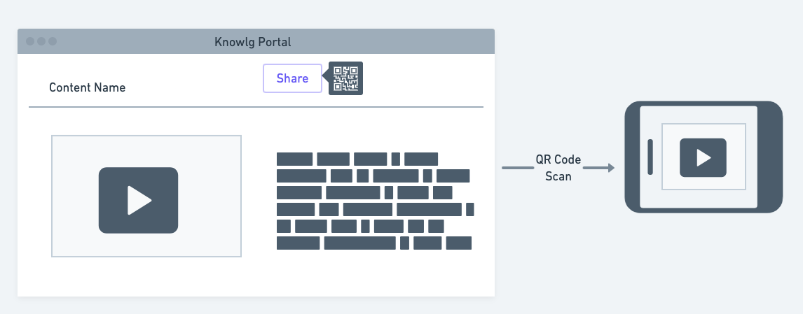
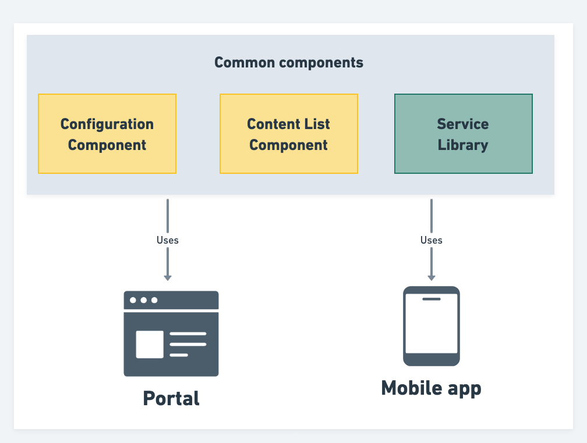

## Problem statement
The current Knowlg mobile app is capable of playing the static content added to the app as data and it doesn’t have the option to play the content created on the Knowlg website all the players integrated into the mobile app are also capable of enabling and disabling their feature dynamically but if we want to launch dynamic content created with specific configuration currently it is not possible.

## Design

### Approach 1:

* Knowlg portal will provide a share option for each content which generates a QR code with complete config, context, and metadata JSON as a string

* Knowlg app will have the QR code scanner which will upon scanning load the content with the same config in the mobile app

* Whenever there is a change in config the QR code will be updated to reflect that change

Pros:
* No need to build the configuration component in the mobile app

* No need to add a service layer to fetch the new content created on the platform

* It is simple to implement and use

Cons:
* Dependency on the portal to play newly created content

* For each config change update, we need to scan again to reflect in the mobile ap

### Approach 2:

* In this approach, we will build the common components and library as mentioned in the below diagram

* Common components and service libraries are used in both mobile apps and website

* The mobile app will have search and play content capability similar to the portal and it will also have a player configuration component to change the player behavior

Pros:
* There is no dependency between mobile and portal for the end user which means he can access content in the mobile app anywhere

* Both the portal and mobile app are in sync with the user experience 

* common code which can be shared with adaptors to build their own portal / mobile app/ desktop app

Cons:
* Build and maintenance of the common components and service library

* Development effort and testing are more compared to approach 1

## Conclusion

We will go with approach 2 where we will build the common components which can be used in both mobile app and portal and extend the same approach for collection player also with build the UI responsive for all standard device resolutions

*****

[[category.storage-team]] 
[[category.confluence]] 
