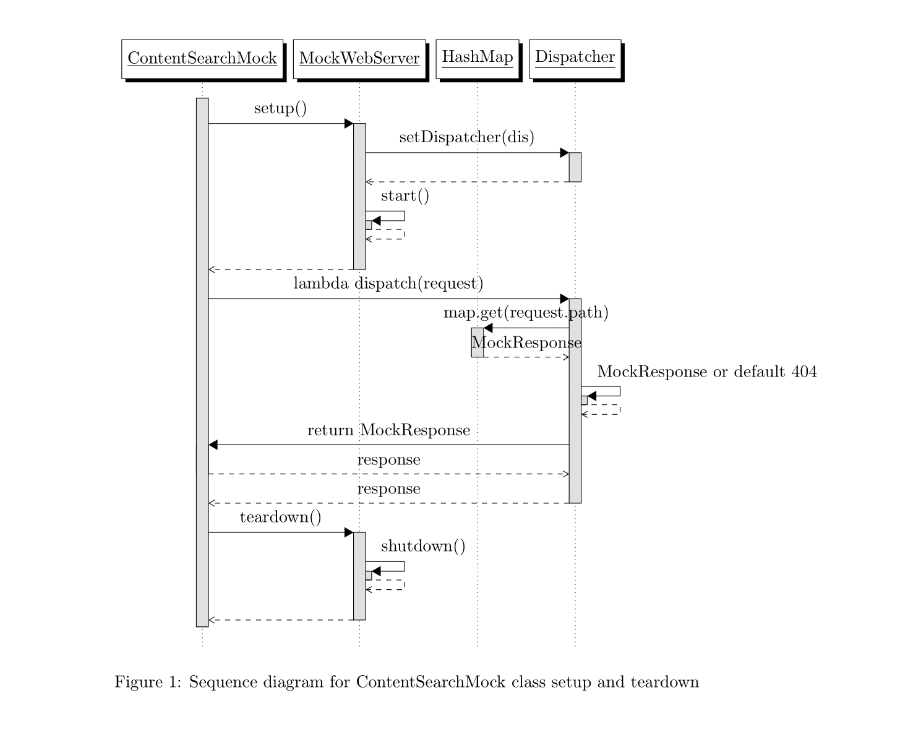
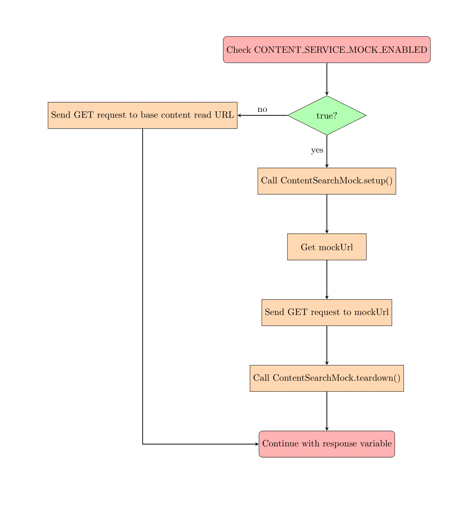

# Introduction
This wiki explains how the content mock API service is used to make the development environment seamless and easy to start working on, without relying on the content service APIs. 

[LR-556 System JIRA](https:///browse/LR-556)

# Background & Problem Statement
Right now, the LERN Batch Service connects directly to the content read API service to get information about courses before creating a batch. Then, after the batch is created, it uses the content search and content update API services to update the batch creation information. This creates a problem for users who want to develop seamlessly in their own environment because there's a risk the APIs won't be available when called. To reduce this complexity, we're using a solution that involves mocking the Content API service.

# Design
To achieve the mocking of the content API service, we propose the following solution:

 **Solution** :

The  **ContentSearchMock class**  provides a mock server for testing HTTP requests made to the content service API. The class uses the  **MockWebServer**  and  **MockResponse**  classes from the okhttp3 library to simulate the content service API.

The class has a static method  **setup()**  which sets up the mock server by creating a MockWebServer instance and setting up a Dispatcher to handle incoming requests. The Dispatcher maps the request paths to the corresponding MockResponse instances, which are stored in a HashMap.

The  **Dispatcher**  instance is created using a lambda expression that implements the dispatch() method, which receives the incoming request and returns the corresponding MockResponse.

The request path is extracted from the RecordedRequest object. The path is used to look up the corresponding MockResponse in the HashMap. If no MockResponse is found for the path, a default MockResponse with a 404 status code is returned.

Overall, the ContentSearchMock class provides a convenient way to test HTTP requests made to the content service API by simulating the API behaviour with mock responses.

 **Implementation Steps:** 

1. Check the value of the CONTENT_SERVICE_MOCK_ENABLED property in the configuration file using the ProjectUtil.getConfigValue() method.

1. If the property value is true, then: 

    a. Call the ContentSearchMock.setup() method to set up a mock server for testing HTTP requests made to the content service API. 

    b. Get the mock URL from the configuration file using the ProjectUtil.getConfigValue() method and store it in the mockUrl variable. 

    c. Send a GET request to the mock URL using the HttpUtil.sendGet/Post/PatchRequest() method with the specified headers and store the response in the response variable. 

    d. Call the ContentSearchMock.teardown() method to shut down the mock server.

1. If the property value is false, then: 

    a. Send a GET request to the base content read URL using the HttpUtil.sendGet/Post/PatchRequest() method with the specified headers and store the response in the response variable.

1. Continue with the rest of the code using the response variable.

*****

[[category.storage-team]] 
[[category.confluence]] 
