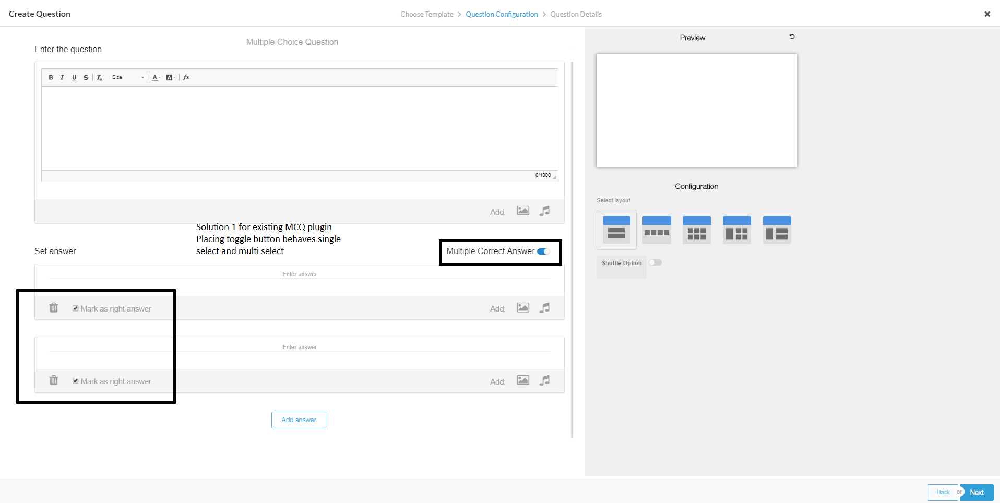

 **Overview:** This page explains the design of MMCQ. Currently, MCQ  supports single answer selection.

But MMCQ plugin to allow users more than one correct answers the multi-choice question to the stage.


 **Problem Statement:**  **Statement 1:** 

Since current MCQ implementation is grouped radio button to choose one as the correct answer. So user cant chooses more than one answer.


 **Statement 2: ** 

Partial score: 4 options with 2 of them correct answer, If the child select 2 correct and one wrong option. then what is result pass/fail.


 **Render side problem:** 

 1. How to identify  MMCQ or MCQ while evaluating the question. What is key data for holding ON and OFF status for MMCQ?


 **Key design problems:** 
1. Current UI support only single option select since it is grouped radio button.
1. Total/partial score: For MMCQ if the child selects all options then what is the result?


 **Solution 1: Using the toggle button enable multi-select for MMCQ** If MMCQ toggle is ON: Make choose the correct answer for options multi-select.


1. Allow selecting all / as many as the child wants to.
1. Give a score for all that is marked correct. Ignore incorrect response.




 **Proposed question data JSON:** 


```js
{
"question": {
"text": "Question Text Here",
"image": null,
"audio": null
},
"options": [{
"text": "Option - 1",
"image": null,
"audio": null,
"isCorrect": true
},
{
"text": "Option - 2",
"image": null,
"audio": null,
"isCorrect": true
},
{
"text": "Option - 3",
"image": null,
"audio": null,
"isCorrect": false
}
]
};
```


 **Renderer side solution 1:** From the question data mode: If one or more options isCorrect is true then consider it is MMCQ just changing the radio button to the checkbox. If only one option having isCorrect is true consider MCQ radio button chooses only one option.


*****

[[category.storage-team]] 
[[category.confluence]] 
