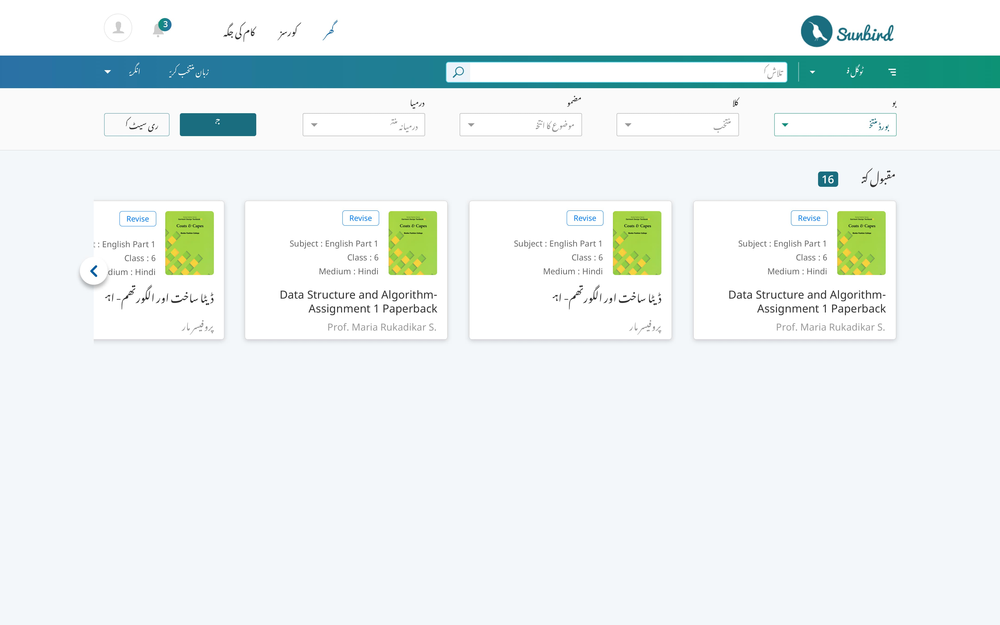

| GreenCompleted | 
|  | 
|  &  | 
| <ul><li>[SB-7368 System JIRA](https:///browse/SB-7368) </li><li>[SB-6159 System JIRA](https:///browse/SB-6159)</li><li>[SB-8498 System JIRA](https:///browse/SB-8498)</li></ul> | 
|  --- | 
|  --- | 
|  --- | 
|  --- | 
| GreenCompleted | 
|  | 
|  &  | 
| <ul><li>[SB-7368 System JIRA](https:///browse/SB-7368) </li><li>[SB-6159 System JIRA](https:///browse/SB-6159)</li><li>[SB-8498 System JIRA](https:///browse/SB-8498)</li></ul> | 

## Background
As more states/tenants are coming on-board, user interfaces needs to be translated as per the requirements.

## Basic Assumptions

* English is the default language and hence default direction is reading direction is left-to-right ( LTR ).
* Urdu is the only language (in Scope) which is right-to-left ( RTL ) in direction.
* A page may contain multiple languages content. Eg - A student may see English and any Indian language learning content as a part of their curriculum. 
* Each language has 2 technical attributes - Font-family and directionality.
* A term in one language could vary in length in any other language translation.
* Current scope only Indian languages, timezone, measurements and currency etc

## Terminology used

*  **Interface language -**  Users can opt to any language from the language switcher drop-down. This will change the languages of interface components like - header, site navigation, actions buttons, forms, action feedback messages, filters etc.
*  **Content language -** Content pieces such as lessons, stories etc are independent of the interface language. They only depend on the  **content they contain**  **.** 

## Expected Output

*  **Direction / Mirroring Interface or content elements** 
    * If the interface is RTL, everything will become RTL. Including contents which are in any other languages which are LTR in nature.
    * If the interface is LTR but any content piece is Urdu (Eg - Card) then that particular card will become RTL while the interface and other content element will stay in LTR.

    
*  **Fonts family** 
    * Noto Sans family for all languages.

    
*  **Font sizes**  
    * Noto Tamil will be 2 points smaller than the English font size.

    
*  **Link underline** 
    * Links in Urdu will have the line at the top

    

### Explanation with examples
 **English Interface** 
* Since the user has opted to English language, then the entire interface will be LTR and in English.
* If any of the content pieces are not English then that will be shown with that language-specific characteristics.
    *  **English content pieces**  - content pieces will be shown in LTR direction.
    *  **Tamil content pieces**  - content pieces will be shown in LTR direction with font size 2 points smaller than English font.
    *  **Urdu content pieces**  - content pieces will be shown in RTL direction.

    

 **Urdu Interface** 
* Since the user has opted to Urdu language, then the entire interface will be RTL and in Urdu.
* If any of the content pieces are not Urdu then that will be shown with that language-specific characteristic except directions.
    *  **English content pieces**  - content pieces will be shown in RTL direction (UX - from readability perspective).
    *  **Tamil content pieces**  - content pieces will be shown in RTL direction with font size 2 points smaller than English font.
    *  **Urdu content pieces**  - content pieces will be shown in RTL direction.

    

(Click on image to view it in full screen)

## Technicals

### Core concepts

* Adding attribute  _dir="rtl" or dir="rtl"_  provides information of directionality of the language and will help in applying directional CSS to the element. 

* Adding  _attribute lang="**"_  is useful for the browser, Search engines and Web accessibility tools ( Screen reader to adopt accent of that language ) to understand the language of the content. Also this will help in solving language specific design issues as these can be used as a CSS selector in special cases.
* From the performance perspective, all languages fonts should not be downloaded by default. A font file should be downloaded only if it is  **needed** .  

* All fonts to be applied at body tag and all other child element will inherit the fonts from their.

### Implementation Details
 **HTML Side changes** 
* Based on the user opted language for the interface, HTML tag must contain lang and dir attribute. If the user has not opted any language, English will be the default.  Eg -  _<html lang="en-GB" dir="ltr">. _ 

* Based on the content an element loads, the content element should have lang and dir attributes. Eg - If a card contains the Urdu content -  _<app-card lang="ur" dir="rtl">_ 
*  **Why adding language related attributes to the html tag and the component wrapper is important** 

    * [https://www.w3.org/International/questions/qa-lang-why](https://www.w3.org/International/questions/qa-lang-why)

    * [https://www.w3.org/International/questions/qa-css-lang](https://www.w3.org/International/questions/qa-css-lang)

    * [https://developer.paciellogroup.com/blog/2016/06/using-the-html-lang-attribute/](https://developer.paciellogroup.com/blog/2016/06/using-the-html-lang-attribute/)

    

CSS Side Changes
* All language and directional CSS will be served from the single CSS file. i.e. style.css. No Separation of CSS files based on directionality or Language. Performance related concerns / challenges can be handled in effective ways.
*  **Directional Challenges (Avoiding duplicate codes)** 
    * Some properties which break the inherited directionality of element should be avoided as much as possible such as -  **text-align, float, left and right properties etc** . Eg - an element with CSS property  _text-align: left_  will not change directionality to  _right_ on changing HTML  _dir="rtl"_  hence should be avoided.
    * Directionality breaking CSS properties should be replaced with the reusable classes. Eg -  _mr-20_  will add  _margin-right: 20px_  in ltr but in rtl it will add  _margin-left: 20px_ . Directional properties will be nested with the directional attribute so as to isolate them. Eg-  _[dir="ltr"] .mr-20{margin-right:20px;}_  and  _[dir="rtl"] .mr-20{margin-left:20px;}_ . Reference - 
    * [https://github.com/Sunbird-Ed/SunbirdEd-portal/blob/release-1.13/src/app/client/src/styles/reusables/paddings.scss](https://github.com/Sunbird-Ed/SunbirdEd-portal/blob/release-1.13/src/app/client/src/styles/reusables/paddings.scss)
    * [https://github.com/Sunbird-Ed/SunbirdEd-portal/blob/release-1.13/src/app/client/src/styles/reusables/margins.scss](https://github.com/Sunbird-Ed/SunbirdEd-portal/blob/release-1.13/src/app/client/src/styles/reusables/margins.scss)

    

    
*  **Multi-font Challenges (Avoid downloading font files if language not used on the page)** 
    * Language special CSS will be written with nesting to language attribute selector rather than assigning it to the body tag. Eg -  _[lang="ur"] {font-family: "Noto Nastaliq Urdu";}_ 
    * The correct way to assign fonts for multi-lingual. More details on - [https://ui-demo.github.io/fonts2.html](https://ui-demo.github.io/fonts2.html)

    

Near future challenges -[[Brainstroming font issues|Brainstroming-font-issues]]

Some Useful links -

* [https://ui-demo.github.io/](https://ui-demo.github.io/)
* [https://ui-demo.github.io/common/assamese.html](https://ui-demo.github.io/common/assamese.html)
* [https://www.w3.org/International/questions/qa-lang-why](https://www.w3.org/International/questions/qa-lang-why)

* [https://www.w3.org/International/questions/qa-css-lang](https://www.w3.org/International/questions/qa-css-lang)

* [https://developer.paciellogroup.com/blog/2016/06/using-the-html-lang-attribute/](https://developer.paciellogroup.com/blog/2016/06/using-the-html-lang-attribute/)

* [https://github.com/wooorm/franc](https://github.com/wooorm/franc)
* [https://w3c.github.io/i18n-tests/results/native-user-interfaces](https://w3c.github.io/i18n-tests/results/native-user-interfaces)
* [https://www.w3.org/International/questions/qa-html-dir](https://www.w3.org/International/questions/qa-html-dir#ie)
* [https://www.w3.org/TR/html4/struct/dirlang.html](https://www.w3.org/TR/html4/struct/dirlang.html)

*****

[[category.storage-team]] 
[[category.confluence]] 
